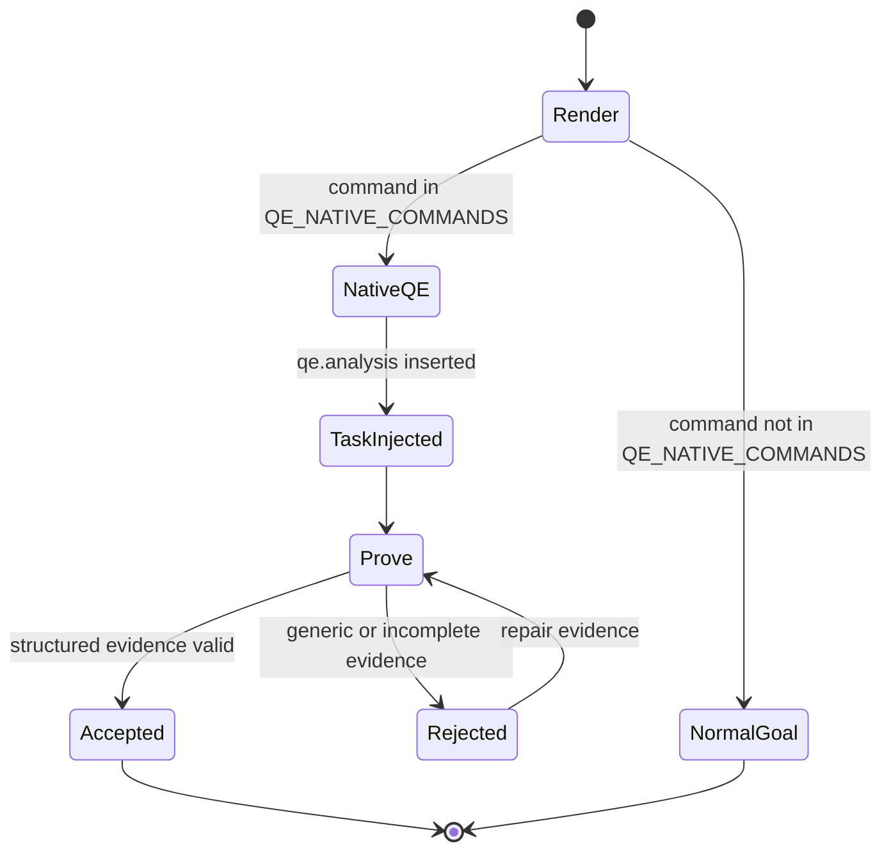
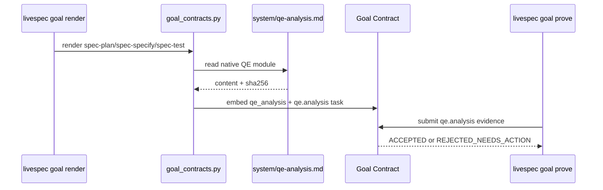
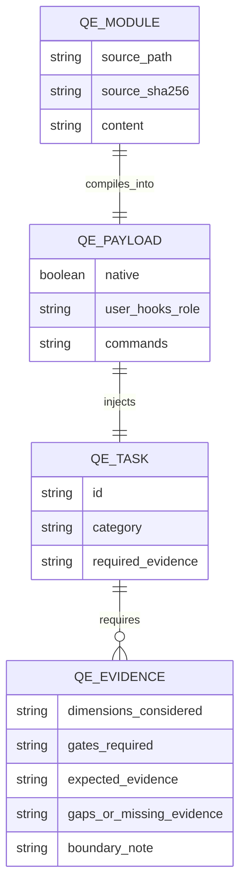

# Technical Plan: QE Analysis Native Module

> **Retroactive plan.** The implementation was completed before this feature folder was created. This plan maps FR-001 through FR-011, AC-001 through AC-012, and SC-001 through SC-005 to the current code, docs, and tests.

## Summary

Add a native Quality Engineering module under `system/qe-analysis.md`, compile it into command goal contracts for `spec-specify`, `spec-plan`, and `spec-test`, inject a `qe.analysis` proof task, validate structured evidence through `goal prove`, and document the command-specific QE mapping. This satisfies FR-001 through FR-011 and AC-001 through AC-012.

## Technical Context

| Aspect | Choice | Reason |
|---|---|---|
| Language | Python >=3.11 | Existing LiveSpec runtime |
| Runtime file | `validator/goal_contracts.py` | Existing goal compiler and proof validator |
| Native module | `system/qe-analysis.md` | System docs are the canonical LiveSpec runtime reference |
| Affected commands | `spec-specify`, `spec-plan`, `spec-test` | Commands that specify, plan, or verify quality evidence |
| User extensions | Existing hooks / Markdown integrations | Extension-only context, not primary QE behavior |
| Tests | `tests/test_goal_contracts.py` | Existing goal render/prove test suite |

No database, network call, server, or API contract is introduced. The ER diagram below documents the contract data shape only; it does not describe persisted storage.

## Constitution Check

| Principle | Verdict | Note |
|---|---|---|
| Layered Validation | PASS | QE proof is enforced at goal-contract level; tests verify render/prove behavior. |
| Provider-Agnostic LLM | PASS | Native QE context is deterministic Markdown; no provider dependency. |
| File-System as Source of Truth | PASS | `system/qe-analysis.md` is read from the LiveSpec checkout. |
| Fail Fast, Exit Clearly | PASS | Missing/generic QE evidence returns `REJECTED_NEEDS_ACTION`. |
| Minimal Surface, Maximum Composability | PASS | No new command; existing goal compiler injects task. |
| No Hosted Infrastructure | PASS | Local file and Python runtime only. |

## Goal Contract Lifecycle

```gherkin
Feature: Native QE goal contract lifecycle
  Scenario: Affected command renders native QE
    Given command is spec-specify, spec-plan, or spec-test
    When compile_command_goal runs
    Then it reads system/qe-analysis.md
    And it embeds qe_analysis in the payload
    And it injects qe.analysis before archive.run

  Scenario: QE evidence is proven structurally
    Given qe.analysis requires structured evidence
    When goal prove receives generic output
    Then it rejects the proof
    When goal prove receives dimensions, gates, expected evidence, gaps, and boundary note
    Then it accepts the proof
```







## Implementation Plan

1. **Native module (FR-001, AC-001):** create `system/qe-analysis.md` with dimensions, risk classification, risk-based tests, quality gates, evidence contract, anti-invention rules, boundaries, and per-command mapping.
2. **Goal payload (FR-002, AC-002, AC-003, AC-004, AC-009, AC-010, SC-001, SC-002):** add `QE_NATIVE_COMMANDS`, `QE_ANALYSIS_MODULE_PATH`, `_compile_qe_analysis_payload`, and payload embedding in `validator/goal_contracts.py`.
3. **Injected task (FR-003, FR-004, AC-005):** add `_qe_analysis_task` and insert it before command execution/archive tasks for affected commands.
4. **Proof validation (FR-005, FR-006, AC-006, AC-007, SC-003):** add `_validate_qe_analysis_evidence`, list/field validation helpers, and invalid substitutes for generic claims, global skill invocation, and user config reliance.
5. **Hook boundary (FR-007, AC-008, SC-004):** keep hooks resolved separately and mark native QE `user_hooks_role` as `extension_only`.
6. **Command docs (FR-008, FR-009, FR-010, FR-011, AC-011, AC-012):** update `spec-specify`, `spec-plan`, `spec-test` skills and expectations, `system/spec-system.md`, `system/integrations.md`, and `README.md`.
7. **Tests (SC-001 through SC-005):** add goal-contract tests for native rendering without user config, task injection, generic proof rejection, structured proof acceptance, and additive hooks.

## Requirement Mapping

| Requirement | Implementation | Test / Evidence |
|---|---|---|
| FR-001, AC-001 | `system/qe-analysis.md` | `test_spec_plan_goal_embeds_native_qe_without_user_config` |
| FR-002, AC-002, AC-003, AC-004 | `QE_NATIVE_COMMANDS`, `_compile_qe_analysis_payload` | `test_native_qe_analysis_task_is_injected_for_quality_commands` |
| FR-003, AC-005 | `_qe_analysis_task`, `_build_goal_tasks` | task-id assertions in `tests/test_goal_contracts.py` |
| FR-004, FR-005, AC-006, AC-007 | `_validate_qe_analysis_evidence` | generic rejection and structured acceptance tests |
| FR-006, AC-009, AC-010 | invalid substitutes for skill/config reliance | generic and content assertions |
| FR-007, AC-008 | `user_hooks_role=extension_only`, hook resolution remains separate | `test_native_qe_is_primary_and_user_hooks_are_additive` |
| FR-008, FR-009, FR-010, AC-011 | command skill and expectations updates | command docs contain native QE mapping |
| FR-011, AC-012 | README and system docs updates | docs diff and `livespec command-audit` |
| SC-001, SC-002, SC-003, SC-004, SC-005 | render/prove validation suite and clean-HOME runtime proof | pytest, ruff, targeted type check, validate, command-audit |

## Testing Strategy

- **Unit / contract:** `python3 -m pytest tests/test_goal_contracts.py -q`.
- **Static:** `ruff check`, `ruff format --check`, and targeted type checking for modified runtime/tests. `mypy .` is an optional repo-wide gate when third-party stubs are installed.
- **Spec tree:** `livespec validate .specs --format json`.
- **Command registry:** `livespec command-audit --json`.
- **Runtime acceptance:** `HOME=$(mktemp -d) livespec goal render spec-plan --flags "" --save`, then prove generic rejection and structured acceptance for `qe.analysis`.

## Risks & Considerations

- **Doc drift:** mitigated by updating command skills, expectations, system docs, integrations docs, README, and this feature folder.
- **False acceptance:** mitigated by rejecting prose summaries, success flags, global skill claims, and user config claims.
- **Overreach:** native QE records quality strategy and evidence expectations; review, audit, security, API review, and implementation remain separate boundaries.
