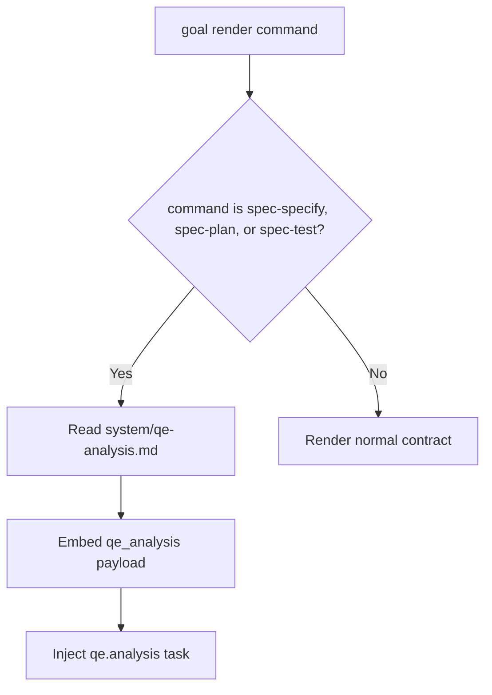
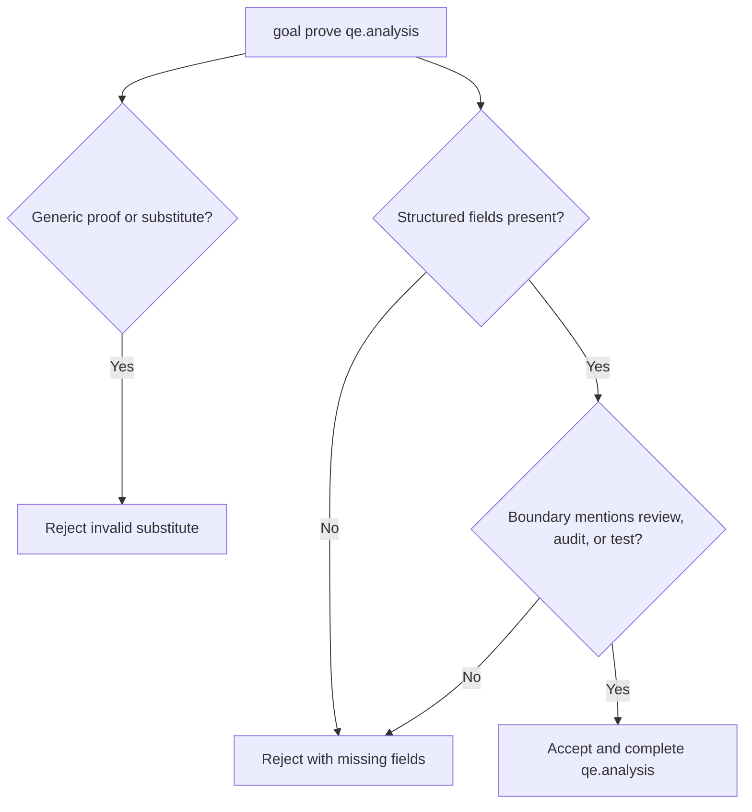
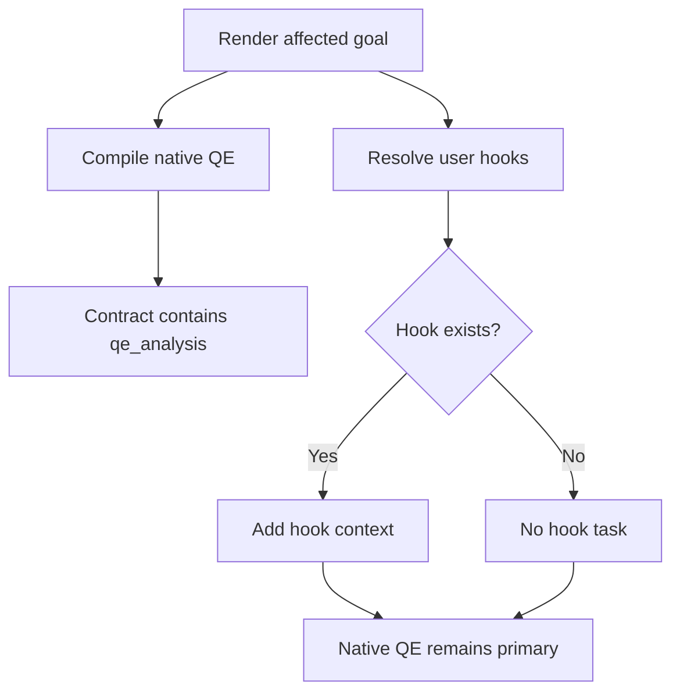
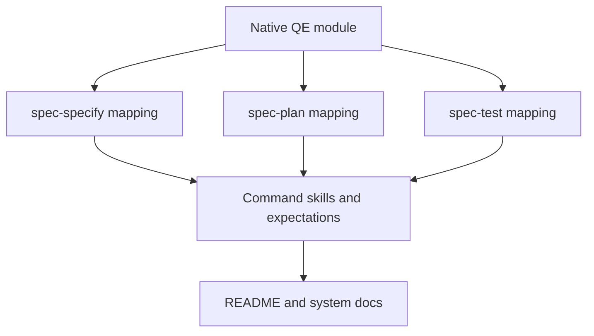

# Feature Spec: QE Analysis Native Module

- **Feature:** QE Analysis Native Module
- **Branch:** `feature/071-qe-analysis-native-module`
- **Date:** 2026-06-27
- **Status:** Implemented
- **Input:** Integrate QE Analysis as a native LiveSpec module, without depending on the global qe-analysis skill or the user config file previously used for QE guidance. LiveSpec must automatically apply Quality Engineering analysis for `spec-specify`, `spec-plan`, and `spec-test`.
- **Feature Number:** 071

---

## User Scenarios & Testing

### Story 1 - Native QE context is embedded in affected goal contracts `P1`

**As a** LiveSpec command runner, **I want** `goal render` for `spec-specify`, `spec-plan`, and `spec-test` to embed native QE Analysis, **so that** every affected command has the same quality strategy without external personal setup.

**Priority reason:** This is the primary behavior. QE must be built into LiveSpec, reproducible, and available in a clean environment.

**Independent test:** Run `livespec goal render spec-plan --flags "" --save` with a temporary `HOME` that has no user QE config and assert the contract contains `qe_analysis`, `system/qe-analysis.md`, and a `qe.analysis` task.

```gherkin
Feature: Native QE context in goal render
  Scenario: spec-plan embeds native QE without user config
    Given a LiveSpec checkout with system/qe-analysis.md
    And HOME has no LiveSpec QE config file
    When livespec goal render spec-plan --flags "" --save runs
    Then the generated contract contains native qe_analysis context
    And the context source_path is system/qe-analysis.md
    And no global QE skill invocation is required
    And no user config file is required

  Scenario: Only quality-sensitive commands receive native QE
    Given LiveSpec command goal rendering
    When a goal is rendered for spec-specify, spec-plan, or spec-test
    Then a qe.analysis task is injected
```



### Story 2 - QE proof is structured and rejects generic claims `P1`

**As a** goal verifier, **I want** `goal prove` to require structured QE evidence, **so that** a generic "quality checked" statement cannot satisfy the QE contract.

**Priority reason:** The user explicitly required anti-invention of evidence. The native module must prove which dimensions, gates, expected evidence, gaps, and boundaries were considered.

**Independent test:** Submit generic proof for `qe.analysis` and assert rejection; submit structured proof with dimensions, gates, expected evidence, gaps, and a review/audit/test boundary note and assert acceptance.

```gherkin
Feature: QE evidence contract
  Scenario: Generic QE proof is rejected
    Given a rendered goal containing qe.analysis
    When goal prove receives only a prose summary or success flag
    Then the proof is rejected
    And the missing evidence fields are reported
    And generic_quality_claim is listed as an invalid substitute

  Scenario: Structured QE proof is accepted
    Given a rendered goal containing qe.analysis
    When goal prove receives dimensions, gates, expected evidence, gaps, and boundary note
    Then the proof is accepted
    And qe.analysis is marked complete in the goal state
```



### Story 3 - User hooks remain additive extensions `P1`

**As a** LiveSpec user, **I want** personal hooks to extend native QE behavior without being required, **so that** teams can add local preferences without making native quality dependent on user state.

**Priority reason:** The requested boundary is explicit: hooks are additive complements only, never overrides and never the primary source.

**Independent test:** Render `spec-plan` with no user hook and assert native QE appears; render with a personal hook and assert both native QE and the hook context appear.

```gherkin
Feature: User hooks are additive
  Scenario: Native QE works without hooks
    Given no user QE hook exists
    When spec-plan goal render runs
    Then native qe_analysis is still embedded
    And qe.analysis is still injected

  Scenario: User QE hook extends native QE
    Given a user Markdown integration exists for plan
    When spec-plan goal render runs
    Then native qe_analysis remains primary
    And hook context is present as additional context
```



### Story 4 - Command docs expose per-command QE mapping `P2`

**As a** LiveSpec maintainer, **I want** command docs and expectations to describe how QE applies to specify, plan, and test, **so that** command authors and validators see the same contract.

**Priority reason:** Runtime behavior without command documentation would drift. The per-command mapping is part of the requested scope.

**Independent test:** Inspect the affected command skills and expectations and assert they mention native QE, `system/qe-analysis.md`, and the per-command proof boundary.

```gherkin
Feature: Command documentation for native QE
  Scenario: specify documents QE enrichment
    Given the spec-specify command docs
    When the QE section is read
    Then it says QE enriches risks, expected proof, non-functional expectations, and gaps

  Scenario: plan documents QE translation
    Given the spec-plan command docs
    When the QE section is read
    Then it says QE translates risks into gates, test levels, and proof artifacts

  Scenario: test documents QE verification
    Given the spec-test command docs
    When the QE section is read
    Then it says QE verifies AC and FR evidence sufficiency
```



## Acceptance Criteria

- **AC-001:** `system/qe-analysis.md` exists and contains native QE dimensions, risk classification, risk-based testing, quality gates, evidence contract, boundaries, anti-invention rules, and command mapping.
- **AC-002:** `livespec goal render spec-specify` embeds native QE context and injects `qe.analysis`.
- **AC-003:** `livespec goal render spec-plan` embeds native QE context and injects `qe.analysis` without any user config file.
- **AC-004:** `livespec goal render spec-test` embeds native QE context and injects `qe.analysis`.
- **AC-005:** `qe.analysis` requires dimensions considered, gates required, expected evidence, gaps or missing evidence, and a review/audit/test boundary note.
- **AC-006:** Generic QE proof is rejected by `goal prove`.
- **AC-007:** Structured QE proof is accepted by `goal prove`.
- **AC-008:** User hooks and Markdown integrations are additive and not required for native QE.
- **AC-009:** The runtime does not depend on the global qe-analysis skill.
- **AC-010:** The runtime does not depend on a user QE config file.
- **AC-011:** `spec-specify`, `spec-plan`, and `spec-test` command docs and expectations describe native QE behavior.
- **AC-012:** README and system docs describe native QE as built-in LiveSpec behavior.

## Functional Requirements

- **FR-001:** LiveSpec MUST ship a native QE Analysis module at `system/qe-analysis.md`.
- **FR-002:** Goal rendering MUST embed the native QE module for `spec-specify`, `spec-plan`, and `spec-test`.
- **FR-003:** Goal rendering MUST inject a `qe.analysis` task into affected command contracts before `archive.run`.
- **FR-004:** `qe.analysis` proof MUST require structured evidence fields for dimensions, gates, expected evidence, gaps, and boundary ownership.
- **FR-005:** `goal prove` MUST reject generic quality claims as substitutes for QE evidence.
- **FR-006:** `goal prove` MUST reject global skill invocation and user config presence as QE substitutes.
- **FR-007:** User hooks MUST remain extension-only and MUST NOT be required for native QE behavior.
- **FR-008:** `spec-specify` MUST use QE to enrich risks, expected proof, non-functional expectations, and gaps.
- **FR-009:** `spec-plan` MUST use QE to translate risks into gates, test levels, proof artifacts, and missing evidence.
- **FR-010:** `spec-test` MUST use QE to verify AC/FR evidence sufficiency and required gates.
- **FR-011:** System docs, integrations docs, README, command skills, and expectations MUST reflect the native QE contract.

## FR / AC Mapping

| AC | FR |
|---|---|
| AC-001 | FR-001 |
| AC-002 | FR-002, FR-003 |
| AC-003 | FR-002, FR-003, FR-006 |
| AC-004 | FR-002, FR-003 |
| AC-005 | FR-004 |
| AC-006 | FR-005 |
| AC-007 | FR-004 |
| AC-008 | FR-007 |
| AC-009 | FR-006 |
| AC-010 | FR-006 |
| AC-011 | FR-008, FR-009, FR-010, FR-011 |
| AC-012 | FR-011 |

## Key Entities

- **Native QE module:** `system/qe-analysis.md`, the built-in source of QE guidance.
- **QE payload:** the `qe_analysis` object embedded in rendered goal contracts.
- **QE task:** the injected `qe.analysis` goal task.
- **Structured QE evidence:** the JSON proof accepted by `goal prove`.
- **User hooks:** personal/team context resolved separately and treated as extension-only.

## Edge Cases

- A user hook exists but the native module is missing: render must fail because the native module is the source of truth.
- A generic proof includes `success_criteria_met=true`: proof must still be rejected.
- A proof lists dimensions and gates but no boundary note: proof must be rejected.
- A proof claims the global QE skill was invoked: proof must be rejected.
- A clean `HOME` has no user QE file: affected goals must still render with native QE.

## Success Criteria

- **SC-001:** Rendering `spec-plan` in an environment without user QE config produces a contract with native `qe_analysis` and `qe.analysis`.
- **SC-002:** All affected commands inject `qe.analysis` and unaffected commands do not require the native QE task.
- **SC-003:** Generic QE proof is rejected and structured QE proof is accepted.
- **SC-004:** User hooks remain additive when present and absent when not configured.
- **SC-005:** Project validation, command audit, static checks, and targeted goal-contract tests pass.
