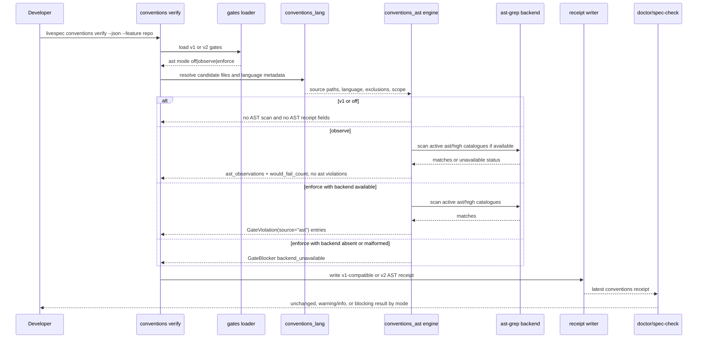
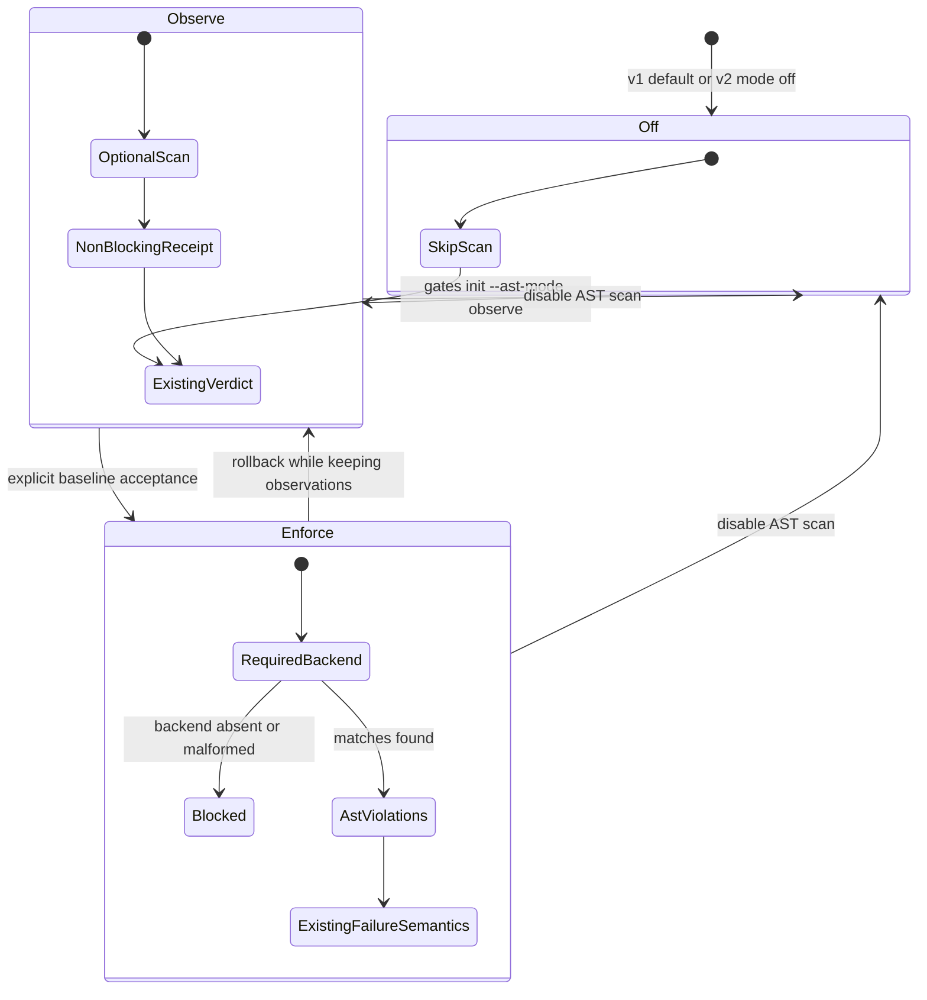
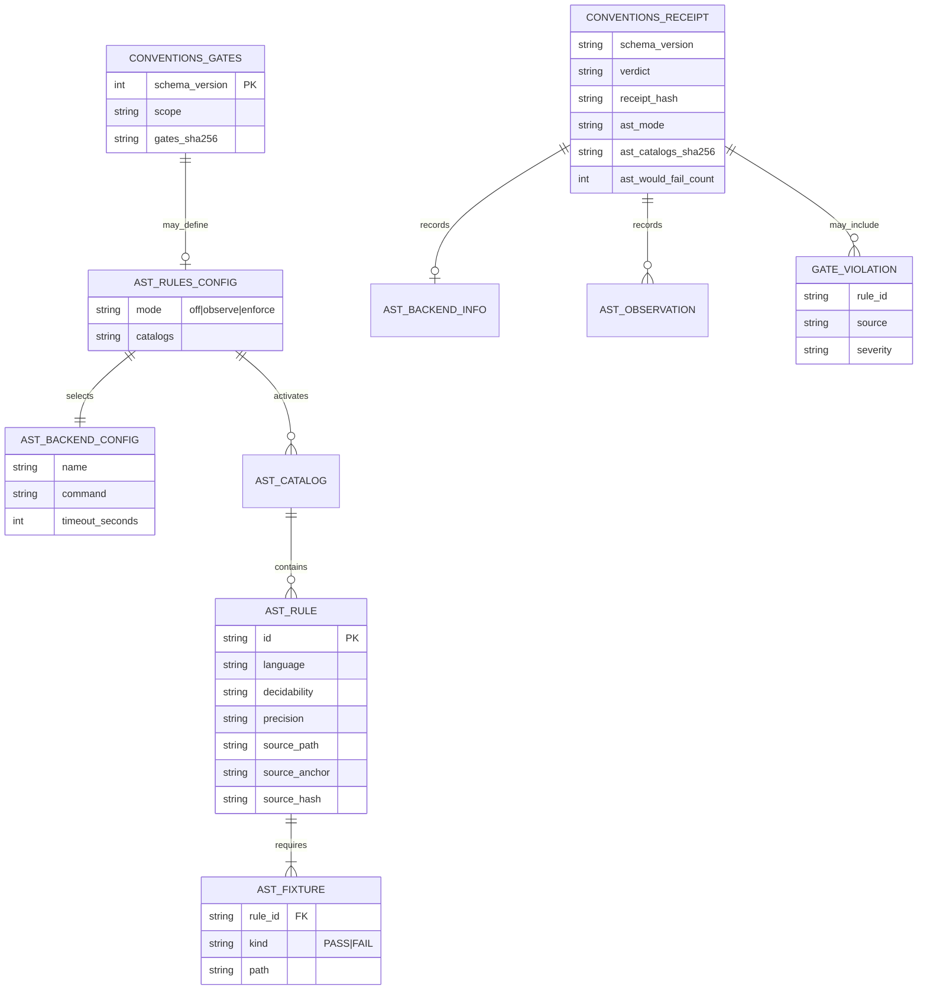

# Technical Plan: Conventions AST Rule Engine

## Summary

Add a separate `conventions_ast` engine that consumes existing `conventions_lang` file and language metadata, uses `ast-grep` only as a structural detector, records v2 receipt observations in `observe`, emits `GateViolation(source="ast")` only in `enforce`, and keeps v1 gates and receipts valid by default.

## Technical Context

| Aspect | Choice | Reason |
|---|---|---|
| Language | Python >=3.11 | Existing LiveSpec validator runtime from the stack profile. |
| CLI framework | Typer | Existing `livespec conventions` command surface. |
| Config format | YAML through PyYAML and Pydantic v2 | Existing gates parser and strict schema pattern. |
| Receipt format | JSON with canonical hash | Existing conventions receipt oracle and run artifact re-verification. |
| AST backend | `ast-grep` through `sg`, plus fake backend for tests | Detector backend only; CI must not require a real binary for mode semantics. |
| Existing language layer | Preserve [`validator/conventions_lang/`](../../../validator/conventions_lang/) | LiveSpec must not create a competing language adaptation system. |
| New AST layer | Add [`validator/conventions_ast/`](../../../validator/conventions_ast/) | Isolates AST rule models, backend adapters, catalogue validation, and justifications. |
| Receipt consumers | [`validator/doctor/scanner.py`](../../../validator/doctor/scanner.py), [`validator/goal_contracts.py`](../../../validator/goal_contracts.py), [`validator/run_receipts.py`](../../../validator/run_receipts.py) | Doctor, spec-check goal evidence, and archived receipts need mode-aware interpretation. |
| Tests | pytest, ruff, pyright | Existing project standards and the required feature proof stack. |

No database, hosted service, network dependency, or UI surface is introduced. The only external executable is optional until `ast_rules.mode: enforce`.

## Constitution Check

| Principle | Verdict | Note |
|---|---|---|
| Layered Validation | PASS | Gates and receipts stay deterministic; AST detection feeds the existing conventions gate layer rather than bypassing it. |
| Provider-Agnostic LLM | PASS | No LLM dependency is added; catalogue traceability points to `ai-ressources` source files. |
| File-System as Source of Truth | PASS | Gates, catalogues, fixtures, receipts, and run artifacts remain local files. |
| Fail Fast, Exit Clearly | PASS | Backend absence is non-blocking in `observe` and a controlled `BLOCKED` exit 2 in `enforce`. |
| Minimal Surface, Maximum Composability | PASS | Existing `livespec conventions gates init` and `verify` are extended with one explicit AST mode flag and optional JSON fields. |
| No Hosted Infrastructure | PASS | `ast-grep` runs locally; no service or telemetry is added. |

## Design Decisions

- LiveSpec is the authority for scope, exclusions, nearby justifications, anchors, receipts, and verdicts; `ast-grep` only detects code shapes.
- Keep [`validator/conventions_lang/`](../../../validator/conventions_lang/) as the language adaptation layer and add [`validator/conventions_ast/`](../../../validator/conventions_ast/) as a separate engine/backend layer.
- Extend `SourceKind` to `Literal["builtin", "linter", "system", "ast"]`; create `GateViolation(source="ast")` only from enforce-mode AST conversion.
- Gates remain compatible across `schema_version: 1` and `schema_version: 2`; `schema_version: 1` remains the default generated output.
- Generate v2 gates only when `livespec conventions gates init --ast-mode observe|enforce` is passed. v2 `mode: off` is accepted by the loader but is not the default init output.
- v1 receipts remain valid. v2 receipts add `ast_mode`, `ast_backend`, `ast_catalogs_sha256`, `ast_observations`, and `ast_would_fail_count`.
- Backend absence is recorded without blocking in `observe`; in `enforce`, it returns `BLOCKED` and CLI exit code 2.
- Doctor and spec-check receipt consumers treat v1/off as unchanged, `observe` as warning/info only, and `enforce` as blocking on absent, stale, `FAIL`, or `BLOCKED` receipts.
- The first active catalogue contains only `decidability: ast` and `precision: high` rules, each with PASS/FAIL fixtures and `ai-ressources/code-conventions` traceability.

## Gherkin Scenarios + Mermaid Sequence Diagrams

```gherkin
Feature: AST conventions verification flow
  Scenario: Observe mode records AST matches without changing verdict
    Given schema_version 2 gates set ast_rules.mode to observe
    And the AST backend reports high precision matches
    When livespec conventions verify --json runs
    Then the receipt contains ast_observations
    And ast_would_fail_count is greater than zero
    And no GateViolation with source ast is added
    And the global verdict and exit code match the non-AST result

  Scenario: Enforce mode converts AST matches into gate violations
    Given schema_version 2 gates set ast_rules.mode to enforce
    And the AST backend reports high precision matches
    When livespec conventions verify --json runs
    Then the result includes GateViolation entries with source ast
    And the receipt includes AST violations
    And the existing conventions failure semantics decide exit code

  Scenario: Backend absence is mode sensitive
    Given the sg binary is unavailable
    When conventions verify runs in observe mode
    Then backend absence is recorded as non-blocking metadata
    When conventions verify runs in enforce mode
    Then the result is BLOCKED
    And the command exits 2
```



## Gherkin Scenarios + Mermaid State Diagrams

```gherkin
Feature: AST rollout mode lifecycle
  Scenario: Project remains compatible by default
    Given a maintainer runs livespec conventions gates init with no AST flag
    When the gates file is generated
    Then schema_version is 1
    And AST mode is effectively off

  Scenario: Project baselines AST observations before enforcement
    Given v2 gates are initialized with --ast-mode observe
    When conventions verify runs repeatedly
    Then AST matches are visible in receipts without changing verdicts
    And the maintainer can accept or fix the baseline before enforce

  Scenario: Enforcement is explicit and reversible
    Given v2 gates are set to enforce
    When backend proof is absent or failing
    Then doctor and spec-check block
    When the maintainer rolls back to observe or off
    Then AST findings stop blocking immediately
```



## Mermaid ER Diagrams

The ER diagram documents file-backed contract shapes only. It does not introduce database tables.



## Implementation Plan

### Phase 1 - Contracts Single-Writer

**Files:**

- Modify [`validator/conventions_gate_types.py`](../../../validator/conventions_gate_types.py) to extend `SourceKind`, keep `GateViolation.to_dict()` stable, and add AST-only constructor tests.
- Modify [`validator/conventions_gates.py`](../../../validator/conventions_gates.py) to load v1/v2 gates without rewriting v1 during verification.
- Modify [`validator/conventions_receipt.py`](../../../validator/conventions_receipt.py) to verify v1 receipts and v2 AST receipt fields.
- Modify [`tests/test_conventions_gates_schema.py`](../../../tests/test_conventions_gates_schema.py), [`tests/test_conventions_receipt.py`](../../../tests/test_conventions_receipt.py), and [`tests/test_run_receipts.py`](../../../tests/test_run_receipts.py).

**Interfaces:**

- `AstMode = Literal["off", "observe", "enforce"]`.
- `ConventionsGatesV1` remains strict with `schema_version: Literal[1]`.
- `ConventionsGatesV2` adds optional `ast_rules: AstRulesConfig`.
- `load_conventions_gates(path: Path) -> ConventionsGatesV1 | ConventionsGatesV2`.
- `write_conventions_receipt(..., ast_payload: AstReceiptPayload | None = None) -> Path`.
- `verify_conventions_receipt(...) -> ConventionsReceipt` accepts receipt schema v1 and v2.

**FR covered:** FR-001.1 authority contract, FR-003.1 gates v1/v2, FR-005.1 AST mode type, FR-009.1 SourceKind, FR-011.1 v1 receipt compatibility, FR-012.1 v2 receipt fields, FR-013.1 hash inputs.

**Steps:**

1. Add the AST type surface and tests first, without scanning any files.
2. Add gates v2 schema with `ast_rules.mode`, backend config, catalog paths, and strict rejection of unknown modes.
3. Keep `generate_conventions_gates(project_root)` writing `schema_version: 1` with no `ast_rules`.
4. Add receipt v2 models and hash computation that includes gates hash, active catalogue hashes, active rule metadata, and normalized backend version while excluding only `receipt_hash`.
5. Add tests proving v1 gates and v1 receipts still load, verify, and hash exactly through the existing paths.

### Phase 2 - Backend and AST Engine

**Files:**

- Create [`validator/conventions_ast/__init__.py`](../../../validator/conventions_ast/__init__.py).
- Create [`validator/conventions_ast/models.py`](../../../validator/conventions_ast/models.py) for rules, matches, backend info, observations, and engine result types.
- Create [`validator/conventions_ast/engine.py`](../../../validator/conventions_ast/engine.py) for mode dispatch, scope/exclusion handling, observation conversion, and enforce conversion.
- Create [`validator/conventions_ast/backends/base.py`](../../../validator/conventions_ast/backends/base.py), [`validator/conventions_ast/backends/fake.py`](../../../validator/conventions_ast/backends/fake.py), and [`validator/conventions_ast/backends/ast_grep.py`](../../../validator/conventions_ast/backends/ast_grep.py).
- Implement nearby justification parsing in [`validator/conventions_ast/models.py`](../../../validator/conventions_ast/models.py), [`validator/conventions_ast/catalog.py`](../../../validator/conventions_ast/catalog.py), and [`validator/conventions_ast/engine.py`](../../../validator/conventions_ast/engine.py).
- Implement `sg` discovery, version normalization, timeout, and availability status inside [`validator/conventions_ast/backends/ast_grep.py`](../../../validator/conventions_ast/backends/ast_grep.py).
- Modify [`validator/conventions_gate.py`](../../../validator/conventions_gate.py) to call the AST engine after builtin/linter checks and before `_result_from()`.
- Add tests in [`tests/`](../../../tests/) for fake backend, `sg` wrapper normalization, backend errors, scope/exclusions, and justification behavior.

**Interfaces:**

- `AstBackend.scan(rule_set: AstRuleSet, files: Sequence[AstSourceFile]) -> AstBackendResult`.
- `run_ast_conventions(project_root, gates, source_files, feature_scope, backend=None) -> AstEngineResult`.
- `AstEngineResult.observations` is used in `observe`; `AstEngineResult.violations` is used only in `enforce`.
- `AstEngineResult.blockers` contains backend absence/malformed-output blockers only when `mode == "enforce"`.

**FR covered:** FR-001.2 authority in engine, FR-002.1 consume conventions_lang, FR-006.1 off skip, FR-007.1 observe observations, FR-008.1 enforce violations, FR-010.1 backend absence, FR-017.1 out-of-scope categories.

**Steps:**

1. Build a fake backend for deterministic CI tests before the real `sg` adapter.
2. Reuse `_source_files()` and `adapter_for_path()` output so `conventions_ast` consumes existing candidate paths and language metadata.
3. Implement `off` as a no-op with no AST receipt effect.
4. Implement `observe` so backend absence and backend matches never modify `GateResult.violations`, verdict, or exit code.
5. Implement `enforce` so backend absence/malformed JSON creates `GateBlocker` and exit 2, while matches become `GateViolation(source="ast")`.
6. Add timeout and version normalization around `sg`; no shell interpolation is needed because the backend command is a configured executable plus explicit args.

### Phase 3 - CLI and JSON Output

**Files:**

- Modify [`validator/cli_commands/conventions_cmd.py`](../../../validator/cli_commands/conventions_cmd.py) to add `--ast-mode observe|enforce` to `conventions gates init`.
- Modify [`validator/conventions_gates.py`](../../../validator/conventions_gates.py) to add a v2 generator path only when the CLI passes AST mode.
- Modify [`validator/cli_commands/conventions_cmd.py`](../../../validator/cli_commands/conventions_cmd.py) and [`validator/conventions_receipt.py`](../../../validator/conventions_receipt.py) so `livespec conventions verify --json` includes `ast_summary` only for v2 AST-enabled data.
- Extend existing CLI tests in [`tests/test_conventions_verify.py`](../../../tests/test_conventions_verify.py) and gates tests.

**Interfaces:**

- `generate_conventions_gates(project_root, force=False, ast_mode: Literal["observe", "enforce"] | None = None) -> Path`.
- JSON output omits `ast_summary` for v1 and v2 off.
- JSON output includes `ast_summary` for v2 observe/enforce, with backend status, active catalogue hash, observations count, and would-fail count.

**FR covered:** FR-004.1 v1 default init, FR-004.2 explicit v2 init, FR-007.2 observe JSON, FR-010.2 enforce exit 2, FR-018.1 ast_summary visibility.

**Steps:**

1. Add Typer option validation for `--ast-mode observe|enforce`; do not accept `--ast-mode off` in init.
2. Keep the old `conventions gates init` output and tests unchanged.
3. Add explicit v2 init tests for observe and enforce.
4. Add verify JSON tests proving v1 and off omit `ast_summary`, observe emits non-blocking summary, and enforce emits summary plus violations or blockers.

### Phase 4 - Doctor and Spec-Check Receipt Consumers

**Files:**

- Modify [`validator/doctor/scanner.py`](../../../validator/doctor/scanner.py) to read gates plus latest conventions receipt and add conventions findings.
- Modify [`validator/run_receipts.py`](../../../validator/run_receipts.py) if receipt re-verification needs to surface AST mode details.
- Modify [`validator/goal_contracts.py`](../../../validator/goal_contracts.py) so conventions receipt proof validation is mode-aware for spec-check and other gated commands.
- Update [`tests/test_doctor.py`](../../../tests/test_doctor.py), [`tests/test_goal_contracts.py`](../../../tests/test_goal_contracts.py), and [`tests/test_run_receipts.py`](../../../tests/test_run_receipts.py).
- Update [`.agent-sync/skills/spec-check/SKILL.md`](../../../.agent-sync/skills/spec-check/SKILL.md) and [`.agent-sync/skills/spec-check/expectations.md`](../../../.agent-sync/skills/spec-check/expectations.md) only if implementation changes the user-visible spec-check report contract. If those skill files are changed during implementation, run `$meta-skill-creator` before commit per project rule.

**Interfaces:**

- `evaluate_conventions_receipt_policy(project_root: Path, *, command: Literal["doctor", "spec-check"]) -> ConventionsReceiptPolicy`.
- Policy states: `unchanged` for v1/off, `observe_warning` for observe observations, `pass` for enforce PASS, `block` for enforce absent/stale/FAIL/BLOCKED.

**FR covered:** FR-011.2 consumer v1 compatibility, FR-014.1 doctor/spec-check policy, FR-018.2 consumer JSON compatibility.

**Steps:**

1. Add a shared receipt-policy helper so doctor and goal contracts do not duplicate mode branching.
2. Doctor emits no AST-specific finding for v1/off.
3. Doctor emits warning/info for observe receipts with `ast_would_fail_count > 0` or backend unavailable.
4. Doctor emits error/blocking findings when gates require enforce and receipt proof is absent, stale, `FAIL`, or `BLOCKED`.
5. Goal-contract proof validation keeps v1/off unchanged, accepts observe warnings as non-blocking evidence, and rejects enforce evidence unless the current receipt is fresh and PASS.

### Phase 5 - Catalogue v1

**Files:**

- Create [`validator/conventions_ast/catalog.py`](../../../validator/conventions_ast/catalog.py) for catalogue loading and validation.
- Create [`validator/conventions_ast/rule_catalog/ast_high.yaml`](../../../validator/conventions_ast/rule_catalog/ast_high.yaml) as the only active v1 catalogue.
- Optionally create inactive future catalogues under [`validator/conventions_ast/rule_catalog/`](../../../validator/conventions_ast/rule_catalog/) with explicit inactive metadata for `ast_medium`, `graph`, `semantic`, `external`, and `visual`.
- Create PASS and FAIL fixtures under [`tests/fixtures/conventions_ast/`](../../../tests/fixtures/conventions_ast/).
- Add catalogue tests under [`tests/`](../../../tests/).

**Catalogue contract:**

```yaml
id: ts.no_as_any
title: No as any
language: typescript
decidability: ast
precision: high
severity: error
enforcement: mode
source_path: ai-ressources/code-conventions/javascript.md
source_anchor: "#typescript-specifics"
source_hash: sha256:<64 lowercase hex chars>
backend: ast-grep
patterns:
  - kind: sg_yaml
    value: <ast-grep rule payload>
fixtures:
  pass: tests/fixtures/conventions_ast/ts/no_as_any/pass.ts
  fail: tests/fixtures/conventions_ast/ts/no_as_any/fail.ts
justification:
  required: true
  accepted_window: adjacent_comment_block
  rule_id_required: true
```

**FR covered:** FR-015.1 ast/high filter, FR-016.1 fixtures and traceability, FR-017.2 inactive future categories.

**Steps:**

1. Validate every active rule has `decidability: ast`, `precision: high`, PASS fixture, FAIL fixture, and `ai-ressources/code-conventions` traceability through path, anchor, and source hash.
2. Reject active rules with graph, semantic, external, visual, medium, or low precision.
3. Add a small reliable catalogue first; prioritize rules from the consensus list only when PASS/FAIL fixtures are deterministic.
4. Keep language-worker fan-out limited to catalogue and fixture files after phases 1 through 4 are green.

### Phase 6 - Activation and Release Gates

**Files:**

- Modify [`validator/conventions_gate.py`](../../../validator/conventions_gate.py), [`validator/conventions_receipt.py`](../../../validator/conventions_receipt.py), and tests only for final integration fixes.
- Update user-facing docs touched by implementation, then keep `.specs` artifacts aligned with final evidence.

**FR covered:** FR-003.2 compatibility proof, FR-004.3 explicit activation, FR-007.3 observe baseline, FR-008.2 enforce release, FR-014.2 final consumers.

**Steps:**

1. Run observe mode on the repo first and inspect `ast_observations` without changing verdicts.
2. Allow enforce only after a clean observe run or explicit baseline acceptance.
3. Keep `ast-grep` optional unless gates are explicitly in enforce mode.
4. Record exact skipped real-backend tests if `sg` is absent; fake backend tests remain mandatory.

## Requirement Mapping

| Requirement | Phase(s) | Verification |
|---|---|---|
| FR-001 | 1, 2 | Engine tests show detector matches do not decide verdict outside LiveSpec mode conversion. |
| FR-002 | 2 | Tests show AST engine consumes existing source files and language metadata from `conventions_lang`. |
| FR-003 | 1, 6 | v1/v2 gates load; v1 verify does not rewrite gates. |
| FR-004 | 3 | CLI tests prove v1 default and v2 only for explicit `--ast-mode observe|enforce`. |
| FR-005 | 1 | Pydantic schema accepts only off, observe, enforce. |
| FR-006 | 2 | Off-mode tests prove no backend call and no receipt/verdict effect. |
| FR-007 | 2, 3 | Observe tests prove observations and unchanged exit code. |
| FR-008 | 2, 3 | Enforce tests prove AST violations, FAIL, and BLOCKED behavior. |
| FR-009 | 1, 2 | Type and serialization tests prove `source="ast"` only comes from enforce conversion. |
| FR-010 | 2, 3 | Missing backend tests prove observe non-blocking and enforce exit 2. |
| FR-011 | 1, 4 | v1 receipt fixture tests and run receipt re-verification tests. |
| FR-012 | 1, 3 | v2 receipt fixture tests assert all AST fields. |
| FR-013 | 1 | Hash tests mutate gates, catalogue, active rule metadata, and backend version. |
| FR-014 | 4 | Doctor and goal-contract tests for v1/off, observe, and enforce. |
| FR-015 | 5 | Catalogue validation rejects non-ast and non-high active rules. |
| FR-016 | 5 | Catalogue validation rejects missing PASS/FAIL fixtures or traceability. |
| FR-017 | 5, 6 | Inactive future categories are not loaded into active v1 coverage. |
| FR-018 | 3 | JSON contract tests assert `ast_summary` only for v2 AST-enabled data. |

### Acceptance and Success Coverage

| Acceptance / Success ID | Phase(s) | Verification |
|---|---|---|
| AC-001, AC-002, AC-003, AC-004 | 1, 3 | Gates init/load tests cover v1 default, v2 explicit mode, and off behavior. |
| AC-005, AC-006, AC-007, AC-008 | 1, 2, 3 | Mode tests cover observe metadata, enforce violations, SourceKind ast, and backend absence. |
| AC-009, AC-010, AC-011 | 1, 3 | Receipt v1/v2 tests cover compatibility, AST fields, and hash inputs. |
| AC-012, AC-013, AC-014 | 2, 4 | Doctor/spec-check policy and engine tests prove LiveSpec authority and layer separation. |
| AC-015, AC-016, AC-017 | 3, 5 | Catalogue and JSON tests cover ast/high filtering, fixtures, traceability, and v2-only ast_summary. |
| SC-001, SC-002, SC-003 | 1, 2, 3 | Compatibility, init, and mode tests prove v1 unchanged plus off/observe/enforce behavior. |
| SC-004, SC-005, SC-006 | 2, 3, 4 | Backend absence, receipt v2 fields, and doctor/spec-check policy tests prove blocking boundaries. |
| SC-007, SC-008, SC-009 | 5, 6 | Catalogue validation and final proof commands cover active rule quality and validation stack. |

## Testing Strategy

| Test Type | What | File / Target | Command | FR/AC |
|---|---|---|---|---|
| Unit | SourceKind, gates v1/v2, receipt v1/v2 | [`tests/test_conventions_gates_schema.py`](../../../tests/test_conventions_gates_schema.py), [`tests/test_conventions_receipt.py`](../../../tests/test_conventions_receipt.py) | `pytest tests/test_conventions_gates_schema.py tests/test_conventions_receipt.py -q` | FR-003, FR-009, FR-011, FR-012 |
| Unit | AST engine modes and fake backend | `tests/test_conventions_ast_engine.py` | `pytest tests/test_conventions_ast_engine.py -q` | FR-001, FR-002, FR-006, FR-007, FR-008, FR-010 |
| Unit | Catalogue schema, fixtures, traceability | `tests/test_conventions_ast_catalog.py` | `pytest tests/test_conventions_ast_catalog.py -q` | FR-015, FR-016, FR-017 |
| CLI integration | gates init and verify JSON contracts | [`tests/test_conventions_verify.py`](../../../tests/test_conventions_verify.py) | `pytest tests/test_conventions_verify.py -q` | FR-004, FR-018 |
| Consumer integration | doctor/spec-check receipt policy | [`tests/test_doctor.py`](../../../tests/test_doctor.py), [`tests/test_goal_contracts.py`](../../../tests/test_goal_contracts.py), [`tests/test_run_receipts.py`](../../../tests/test_run_receipts.py) | `pytest tests/test_doctor.py tests/test_goal_contracts.py tests/test_run_receipts.py -q` | FR-011, FR-014 |
| Static | Python lint and type soundness | [`validator/`](../../../validator/), [`tests/`](../../../tests/) | `ruff check validator tests` and `pyright` | SC-009 |
| Full regression | All tests | repository root | `pytest -q` | All |
| Conventions proof | Repo-level receipt generation | repository root | `livespec conventions verify --json --feature repo` | SC-001 through SC-006 |
| Plan validation | Plan structure | [`plan.md`](plan.md) | `livespec validate .specs/features/072-conventions-ast-rule-engine/plan.md` | Plan artifact |

## Proof Obligations

- `pytest -q` passes.
- `ruff check validator tests` passes.
- `pyright` passes.
- `livespec conventions verify --json --feature repo` produces a valid receipt or an honest pre-existing conventions result, with AST behavior matching the active mode.
- v1 gates and receipts remain valid without migration.
- v2 observe writes AST metadata and does not alter verdict or exit code.
- v2 enforce converts AST matches to `GateViolation(source="ast")`.
- Backend absence is observe non-blocking and enforce `BLOCKED` exit 2.
- Doctor and spec-check block only when enforce proof is absent, stale, `FAIL`, or `BLOCKED`.
- Every active v1 AST rule has PASS/FAIL fixtures and `ai-ressources/code-conventions` traceability.

## Risks & Considerations

- **Compatibility drift:** v1 gates and receipts are the highest-risk surface. Mitigate with fixture tests before AST backend work.
- **False positives:** v1 catalogue is limited to `decidability: ast` and `precision: high`; graph, semantic, external, visual, and medium-confidence checks stay inactive.
- **Hash churn:** normalize backend version and include source hashes rather than line numbers alone.
- **Backend availability:** real `sg` tests may skip with a named reason, but fake backend tests are mandatory and enforce mode must block if a configured backend is absent.
- **Performance:** use backend timeout and receipt metadata; large-repo caching and parallel backend scans are out of scope.
- **Concurrent implementation risk:** phases 1 through 4 are single-writer over shared contracts; catalogue and fixture work can fan out only after those interfaces are stable.
- **Spec-check coupling:** if implementation changes skill files, follow the global skill workflow and run `$meta-skill-creator` before commit.
