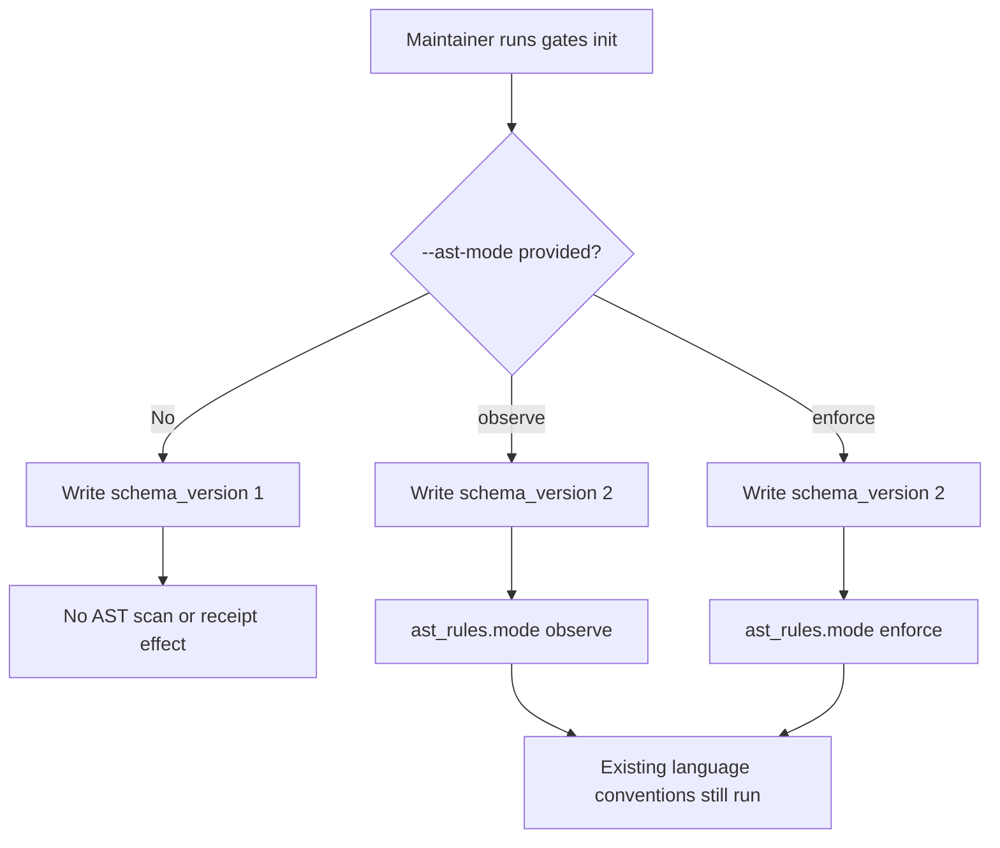
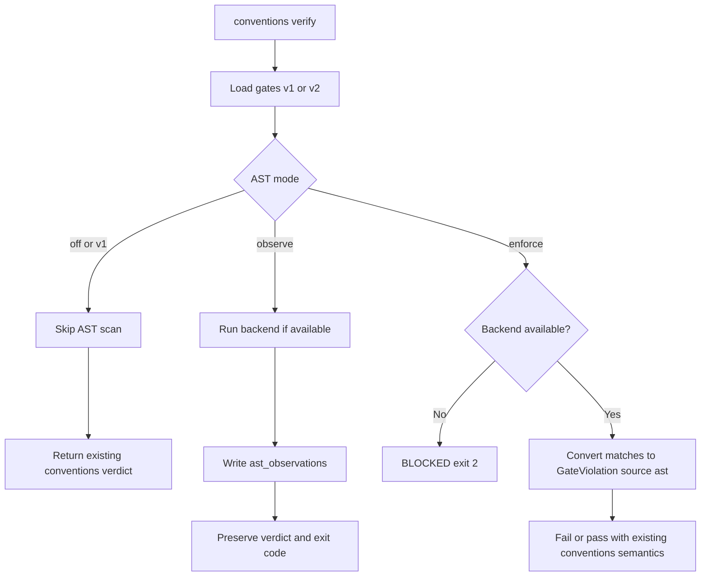
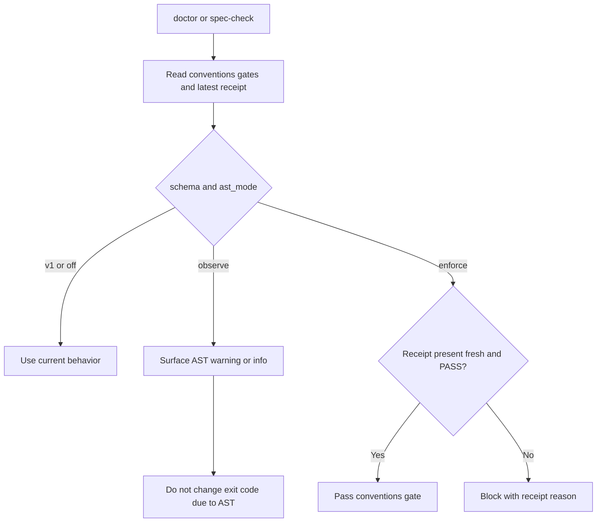
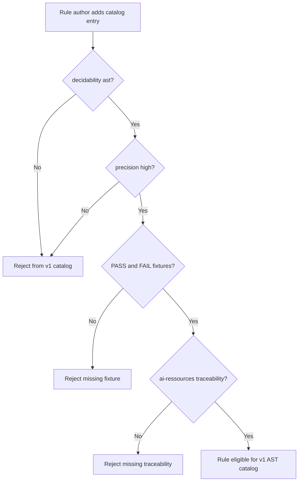

# Feature Spec: Conventions AST Rule Engine

- **Feature:** Conventions AST Rule Engine
- **Branch:** `feature/072-conventions-ast-rule-engine`
- **Date:** 2026-06-29
- **Status:** Implemented
- **Input:** Conventions AST rule engine with off/observe/enforce rollout modes. External plan: `/Users/julienm/.orchestrate/tmp/livespec-plan-cmux-ast-validation/debate/final-plan.md`. Parent goal hash: `5c609f35ecfee390bc5911c42f01d23f3721e794362ff98f1452cee2f77e92c8`.
- **Feature Number:** 072

> Superseded by 073: AC-001, AC-002, SC-001, and SC-002 are replaced by
> `.specs/features/073-conventions-multilang-catalog/spec.md`, which makes
> AST `enforce` the default and keeps `off`/`observe` as opt-in modes.

---

## User Scenarios & Testing

### Story 1 - Maintainer initializes AST rollout without changing existing projects `P1`

**As a** LiveSpec maintainer, **I want** AST convention rules to be opt-in through explicit rollout modes, **so that** existing v1 projects and receipts keep their current behavior until a maintainer asks for AST support.

**Priority reason:** Zero surprise blocking is the adoption requirement. Existing `schema_version: 1` gates and receipts must remain valid and must not start scanning AST by default.

**Independent test:** Run gates initialization with no AST flag and with `--ast-mode observe`; assert the default file is v1 and the explicit file is v2 with `ast_rules.mode=observe`.

```gherkin
Feature: AST rollout initialization
  Scenario: Default gates initialization remains v1
    Given a LiveSpec project without AST rollout enabled
    When livespec conventions gates init runs without --ast-mode
    Then .specs/conventions-gates.yaml is written with schema_version 1
    And no ast_rules section is written
    And later conventions verification behaves as it did before AST support

  Scenario: Explicit observe mode creates v2 gates
    Given a LiveSpec project with conventions gates available
    When livespec conventions gates init --ast-mode observe runs
    Then .specs/conventions-gates.yaml is written with schema_version 2
    And ast_rules.mode is observe
    And ast_rules.backend.name is ast-grep
    And the existing conventions_lang resolution layer remains active

  Scenario: Explicit enforce mode creates v2 gates
    Given a LiveSpec project with conventions gates available
    When livespec conventions gates init --ast-mode enforce runs
    Then .specs/conventions-gates.yaml is written with schema_version 2
    And ast_rules.mode is enforce
    And AST violations may affect the conventions verdict
```



### Story 2 - Verifier records AST findings according to rollout mode `P1`

**As a** developer running `livespec conventions verify`, **I want** AST matches to be ignored, observed, or enforced according to a single explicit mode, **so that** I can baseline conventions safely before making AST rules blocking.

**Priority reason:** The mode contract is the core behavior. `off`, `observe`, and `enforce` must be deterministic, testable, and reflected in receipts and exit codes.

**Independent test:** Run conventions verification against fixtures with the same AST match under `off`, `observe`, and `enforce`; assert only `enforce` creates `GateViolation(source="ast")` and changes the verdict.

```gherkin
Feature: AST mode behavior
  Scenario: off mode has no scan and no effect
    Given conventions gates v2 set ast_rules.mode to off
    When livespec conventions verify --json runs
    Then no AST backend scan is attempted
    And no ast_observations are written
    And no GateViolation with source ast is created
    And the verdict and exit code match the non-AST conventions result

  Scenario: observe mode records matches without blocking
    Given conventions gates v2 set ast_rules.mode to observe
    And the AST backend finds a high precision rule match
    When livespec conventions verify --json runs
    Then the receipt contains ast_observations for the match
    And ast_would_fail_count is greater than zero
    And no GateViolation with source ast is created
    And the global verdict and exit code are unchanged by AST matches

  Scenario: enforce mode converts matches into violations
    Given conventions gates v2 set ast_rules.mode to enforce
    And the AST backend finds a high precision rule match
    When livespec conventions verify --json runs
    Then the result contains GateViolation entries with source ast
    And the conventions receipt includes those AST violations
    And the command exits with the existing failure code for convention violations

  Scenario: backend absence is mode-sensitive
    Given ast-grep is not available as sg
    When conventions verify runs in observe mode
    Then backend absence is recorded as non-blocking backend status
    And the command does not fail because of AST
    When conventions verify runs in enforce mode
    Then the result is BLOCKED
    And the command exits 2
```



### Story 3 - Doctor and spec-check consume conventions receipts consistently `P1`

**As a** LiveSpec user, **I want** `doctor` and `spec-check` to interpret AST conventions receipts consistently with rollout mode, **so that** project health checks warn during observation and block only when enforcement is explicitly enabled.

**Priority reason:** Receipts are the durable proof surface consumed by project gates. `doctor` and `spec-check` must not assume AST checks exist, and they must not silently ignore enforced failures.

**Independent test:** Create v1, v2 observe, and v2 enforce receipt fixtures and run doctor/spec-check consumers against PASS, FAIL, BLOCKED, missing, and stale receipt states.

```gherkin
Feature: Receipt consumers honor AST rollout mode
  Scenario: v1 and off receipts keep existing behavior
    Given a schema_version 1 conventions receipt or v2 receipt with ast_mode off
    When doctor or spec-check evaluates conventions health
    Then no AST-specific block is emitted
    And the existing non-AST conventions behavior is preserved

  Scenario: observe receipts warn without blocking
    Given a schema_version 2 conventions receipt with ast_mode observe
    And the receipt has ast_would_fail_count greater than zero
    When doctor or spec-check evaluates conventions health
    Then it reports warning or info about AST observations
    And it does not fail the command because of those AST observations

  Scenario: enforce receipts block when proof is absent or not passing
    Given conventions gates require ast_mode enforce
    When the conventions receipt is absent, stale, FAIL, or BLOCKED
    Then doctor and spec-check report a blocking conventions issue
    And they identify the receipt state that caused the block
```



### Story 4 - Rule authors add traceable high-precision AST rules `P2`

**As a** LiveSpec rule author, **I want** the first AST catalogue to accept only high-precision AST-decidable rules with fixtures and source traceability, **so that** observation data is useful and enforcement can be trusted.

**Priority reason:** The first catalogue must avoid false confidence. Graph, semantic, external, and visual checks are intentionally out of scope for this feature.

**Independent test:** Add one valid rule and one invalid rule to the catalogue; assert the valid rule requires PASS/FAIL fixtures and `ai-ressources` traceability, while invalid decidability or missing fixtures fails catalogue validation.

```gherkin
Feature: Traceable AST rule catalogue
  Scenario: Valid high precision AST rule is accepted
    Given an AST rule with decidability ast
    And precision high
    And PASS and FAIL fixtures
    And source_path, source_anchor, and source_hash pointing to ai-ressources
    When the AST rule catalogue is validated
    Then the rule is accepted for the v1 AST catalogue

  Scenario: Non-AST or lower precision rule is rejected from v1
    Given a candidate rule with decidability graph, semantic, external, or visual
    Or a candidate rule with precision medium or low
    When the v1 AST catalogue is validated
    Then the rule is rejected from the active v1 catalogue
    And the rejection explains that only ast and high are in scope

  Scenario: Missing fixture or traceability blocks the rule
    Given a candidate AST rule without both PASS and FAIL fixtures
    Or without ai-ressources source traceability
    When the AST rule catalogue is validated
    Then the rule is rejected
    And no conventions receipt can use that rule as active v1 AST coverage
```



## Acceptance Criteria

- **AC-001:** Given no AST rollout flag is provided, when `livespec conventions gates init` runs, then it emits `schema_version: 1` and does not add `ast_rules`.
- **AC-002:** Given either schema v1 or schema v2 gates, when gates are loaded for `verify`, then v1 projects continue without migration or rewrite.
- **AC-003:** Given schema v2 gates, when `ast_rules.mode` is parsed, then only `off`, `observe`, and `enforce` are accepted.
- **AC-004:** Given AST mode `off`, when conventions verification runs, then no AST scan, AST receipt effect, AST violation, verdict change, or exit-code change occurs.
- **AC-005:** Given AST mode `observe`, when AST rules are scanned, then `ast_observations[]`, `ast_backend`, `ast_catalogs_sha256`, and `ast_would_fail_count` may be written without changing the global verdict or exit code.
- **AC-006:** Given AST mode `enforce`, when AST rule matches are found, then they become `GateViolation(source="ast")` entries and can fail the conventions gate through existing semantics.
- **AC-007:** Given `SourceKind` includes `"ast"`, when AST violations are emitted, then every `GateViolation(source="ast")` comes only from enforce-mode AST conversion.
- **AC-008:** Given the AST backend is absent, when verification runs, then observe mode records non-blocking backend status while enforce mode returns `BLOCKED` and exits 2.
- **AC-009:** Given an existing v1 conventions receipt, when receipt verification runs, then the receipt remains valid under the existing compatibility contract.
- **AC-010:** Given a v2 AST receipt, when receipt verification runs, then `ast_mode`, `ast_backend`, `ast_catalogs_sha256`, `ast_observations`, `ast_would_fail_count`, and enforce-only AST violations are validated.
- **AC-011:** Given gates, active catalogue content, active rule metadata, or normalized backend version changes, when receipt hashes are computed, then the receipt hash changes.
- **AC-012:** Given `doctor` or `spec-check` consumes conventions receipts, when AST is v1/off, observe, or enforce, then current behavior is preserved for v1/off, warning/info is emitted for observe, and absent, stale, FAIL, or BLOCKED enforce proof blocks.
- **AC-013:** Given AST detector output exists, when scope, exclusions, nearby justifications, anchors, receipts, or verdicts are decided, then LiveSpec remains the authority and `ast-grep` stays a detection backend.
- **AC-014:** Given the existing `conventions_lang/` adaptation layer, when the AST engine is added, then `conventions_ast/` is a separate backend/rule layer and does not create a competing conventions system.
- **AC-015:** Given the first active AST catalogue is loaded, when active rules are validated, then only `decidability: ast` and `precision: high` rules are accepted.
- **AC-016:** Given an active first-catalogue AST rule, when catalogue validation runs, then PASS fixture, FAIL fixture, and `ai-ressources/code-conventions` source path, anchor, and source hash traceability are required.
- **AC-017:** Given `livespec conventions verify --json` emits output, when output is v1 or v2 AST-enabled, then `ast_summary` is omitted for v1 and exposed only for v2 AST-enabled receipts.

## Functional Requirements

- **FR-001:** LiveSpec MUST treat the spec and conventions receipt system as the authority for AST convention decisions; detector output alone MUST NOT decide pass/fail.
- **FR-002:** LiveSpec MUST preserve `conventions_lang/` and add a separate `conventions_ast/` layer that consumes candidate files and language metadata from existing convention resolution.
- **FR-003:** Gates parsing MUST support compatible v1/v2 schemas without rewriting v1 gates during verification.
- **FR-004:** Gates initialization MUST keep v1 as the default and generate v2 only when `--ast-mode observe|enforce` is explicitly requested.
- **FR-005:** The AST rollout mode MUST be represented as one explicit mode value: `off`, `observe`, or `enforce`.
- **FR-006:** `off` mode MUST skip AST backend execution and MUST NOT affect receipts, verdicts, or exit codes.
- **FR-007:** `observe` mode MUST write AST observations and backend/catalog metadata without adding `GateViolation(source="ast")` and without changing verdicts or exit codes.
- **FR-008:** `enforce` mode MUST convert AST matches into `GateViolation(source="ast")` and allow those violations to produce FAIL or BLOCKED outcomes through existing conventions semantics.
- **FR-009:** `SourceKind` MUST include `"ast"` and serializers, deserializers, and constructors MUST accept it only for AST-origin violations.
- **FR-010:** Backend absence MUST be non-blocking in observe mode and MUST produce `BLOCKED` with exit code 2 in enforce mode.
- **FR-011:** Receipt verification MUST accept existing v1 receipts and MUST validate v2 AST fields when present.
- **FR-012:** v2 receipts MUST include AST mode, backend status/version, AST catalogue hash, observations, would-fail count, and enforce-mode AST violations.
- **FR-013:** Receipt hashing MUST include gates, active AST catalogue content, active rule metadata, and normalized backend version while excluding only the receipt hash field itself.
- **FR-014:** `doctor` and `spec-check` MUST read conventions receipts explicitly and map v1/off, observe, and enforce to unchanged, warning/info, and blocking behavior respectively.
- **FR-015:** The first active AST catalogue MUST include only `decidability: ast` and `precision: high` rules.
- **FR-016:** Each active AST rule MUST include PASS/FAIL fixtures and `ai-ressources/code-conventions` traceability through `source_path`, `source_anchor`, and `source_hash`.
- **FR-017:** Graph, semantic, external, visual, large-repo performance optimization, incremental cache, and full multi-language catalogue coverage MUST remain out of scope for this feature.
- **FR-018:** `livespec conventions verify --json` MUST expose `ast_summary` only when v2 AST receipt data is active.

## FR / AC Mapping

| AC | FR |
|---|---|
| AC-001 | FR-003, FR-004, FR-005 |
| AC-002 | FR-003, FR-011 |
| AC-003 | FR-005 |
| AC-004 | FR-006 |
| AC-005 | FR-007, FR-012, FR-018 |
| AC-006 | FR-008, FR-009 |
| AC-007 | FR-008, FR-009 |
| AC-008 | FR-010 |
| AC-009 | FR-011 |
| AC-010 | FR-012 |
| AC-011 | FR-013 |
| AC-012 | FR-014 |
| AC-013 | FR-001 |
| AC-014 | FR-002 |
| AC-015 | FR-015, FR-017 |
| AC-016 | FR-016 |
| AC-017 | FR-018 |

## Key Entities

- **Conventions gates config:** `.specs/conventions-gates.yaml`, accepted as v1 or v2; v2 may include `ast_rules`.
- **AST rollout mode:** The explicit `off|observe|enforce` value that controls scan, receipt, verdict, and exit-code effects.
- **SourceKind:** The violation source discriminator extended with `"ast"`.
- **GateViolation:** The existing convention violation entity; `source="ast"` is valid only for enforce-mode AST matches.
- **AST observation:** Non-blocking receipt record for observe-mode AST matches and backend status.
- **AST backend:** The normalized detector adapter, initially `ast-grep` through the `sg` command or a fake backend in tests.
- **AST rule catalogue:** Traceable YAML catalogue of active high-precision AST rules and future inactive rule groups.
- **AST rule fixture:** PASS and FAIL examples required for every active v1 AST rule.
- **Conventions receipt:** Versioned, hash-backed proof consumed by `conventions verify`, `doctor`, `spec-check`, and goal gates.
- **conventions_lang layer:** Existing language/scope adaptation layer that remains the source for candidate file and language metadata.
- **conventions_ast layer:** New AST rule engine and backend layer that consumes existing convention resolution rather than replacing it.

## Quality Engineering Analysis

| Dimension | Risk | Expected evidence |
|---|---|---|
| Functional correctness | AST mode semantics can accidentally change verdicts in observe/off. | Mode-specific unit and integration tests for off, observe, enforce, backend absent, and AST matches. |
| Regression risk | Existing v1 gates and receipts can drift or fail after schema changes. | v1 gates loading tests, v1 receipt verification tests, and existing conventions verify regression fixtures. |
| API/contract compatibility | CLI output and receipt schema changes can break consumers. | JSON contract tests for `conventions verify --json`, receipt v1/v2 fixtures, and doctor/spec-check consumer tests. |
| Performance/scalability | AST scans can add latency or hang on large repositories. | Backend timeout tests, bounded wrapper behavior, and receipt metadata for backend duration/status. |
| Operability | Missing backend can produce confusing failures. | Explicit observe non-blocking status and enforce BLOCKED exit 2 tests with actionable messages. |

**Risk classification:** Criticality High, blast radius Shared, primary risk Contract, confidence Medium until v1/v2 receipt fixtures and doctor/spec-check consumer tests exist.

**Boundary note:** QE defines required evidence and gates for this feature. Code review must still inspect schema migration, file writes, backend process handling, path validation, and catalogue false-positive risk. Security review is only needed if backend command path overrides accept user-controlled executable paths.

## Non-Goals

- Do not replace `conventions_lang/` or existing builtin/linter/system convention checks.
- Do not make `ast-grep` the authority for LiveSpec conventions; it is only a backend that returns structural matches.
- Do not activate graph, semantic, external, or visual convention categories in the first AST catalogue.
- Do not require `ast-grep` for v1 or off-mode projects.
- Do not make observe mode fail, block, or change exit codes because of AST findings or backend absence.
- Do not rewrite v1 gates or v1 receipts during ordinary verification.
- Do not implement large-repo incremental caching, backend parallelization, or exhaustive multi-language coverage in this feature.

## Edge Cases

- A repository has v1 gates and an old v1 PASS receipt: verification and consumers must remain valid without AST fields.
- A v2 gates file sets `mode: off` and also lists catalogues: AST scan is skipped and the catalogue list has no verdict effect.
- The `sg` binary is missing in observe mode: the receipt records backend unavailable and remains non-blocking.
- The `sg` binary is missing in enforce mode: conventions verification returns `BLOCKED` and exits 2.
- AST backend returns malformed JSON: observe records backend error as non-blocking; enforce returns BLOCKED with a clear backend reason.
- An AST rule has `decidability: semantic` or `precision: medium`: it is rejected from the active first catalogue.
- An AST rule has no PASS fixture, no FAIL fixture, or missing `source_hash`: it cannot be active.
- A nearby justification exists but does not match the accepted rule-specific format: the match remains an observation in observe and a violation in enforce.
- The normalized `sg --version` changes: the v2 receipt hash changes predictably and stale receipt consumers report the mismatch.
- A `doctor` or `spec-check` run sees observe-mode AST observations: it reports warning/info and exits according to non-AST state.
- A `doctor` or `spec-check` run sees enforce mode with a stale receipt: it blocks even if the latest observed AST matches were only warnings.
- Multiple workers add catalogue rules while the schema files are changing: only catalogue/fixture files may be fanned out after the single-writer contracts are stable.

## Success Criteria

- **SC-001:** Existing v1 conventions gates and v1 receipts verify unchanged after the feature is implemented.
- **SC-002:** `livespec conventions gates init` writes v1 by default and writes v2 only for explicit `--ast-mode observe|enforce`.
- **SC-003:** Mode tests prove `off` has no scan/no effect, `observe` has observations/no verdict change, and `enforce` emits `GateViolation(source="ast")` and can fail.
- **SC-004:** Missing backend tests prove observe is non-blocking and enforce returns `BLOCKED` with exit code 2.
- **SC-005:** Receipt v2 fixtures include AST mode, backend info, catalogue hash, observations, would-fail count, and enforce-mode AST violations.
- **SC-006:** `doctor` and `spec-check` tests prove v1/off unchanged, observe warning/info only, and enforce blocks on absent, stale, FAIL, or BLOCKED receipts.
- **SC-007:** Active AST catalogue validation rejects any rule outside `decidability: ast` and `precision: high`.
- **SC-008:** Every active AST rule has PASS and FAIL fixtures plus `ai-ressources/code-conventions` traceability.
- **SC-009:** Validation stack for implementation includes targeted tests plus `pytest -q`, `ruff check validator tests`, and `pyright`.

<!-- finalize:spec-specify:2026-06-29:4d481d61 -->

<!-- finalize:spec-plan:2026-06-29:fdbed7ea -->

<!-- finalize:spec-implement:2026-06-29:7d37e57a -->

<!-- finalize:spec-feature:2026-06-29:3ef3e24f -->
