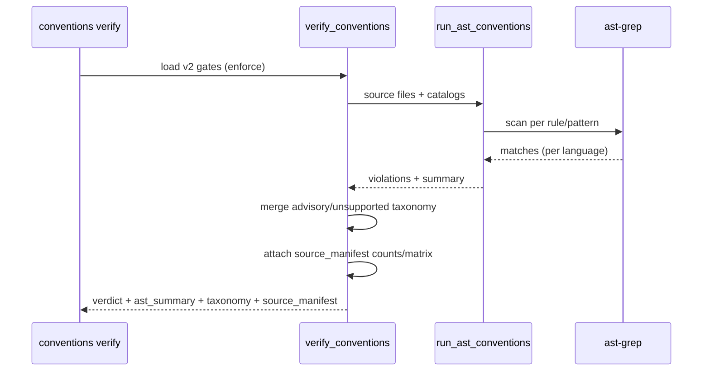
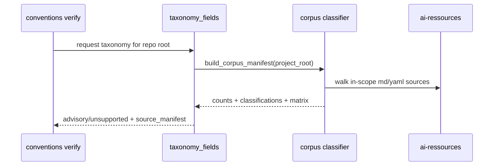

# Plan: Multilang Convention AST Catalog + Enforce-by-Default (073)

## Summary

Extend 072's AST layer with multilang infrastructure (suffixes + Rust/Kotlin adapters + multi-pattern backend), a sourced 7-rule catalog across TS/Rust/Swift/Kotlin, flip `gates init` to enforce-by-default with `off`/`observe` opt-in, serialize advisory/unsupported taxonomy, and emit an exhaustive AI-res/ARS source manifest with zero unclassified in-scope sources.

## Technical Context

- **Language:** Python 3.12+ (validator), backend `ast-grep` (`sg`).
- **Deps:** existing `conventions_ast`/`conventions_lang` layers; `ast-grep` 0.44.0 as a hard dependency of the default enforce path.
- **Storage:** `.specs/conventions-gates.yaml` (schema v2), receipts under `.specs/conventions/runs/<run-id>/receipt.json`.
- **Corpus source:** `.conventions/manifest.yaml` `ai_resources_path` (defaults to `~/projects/ai-ressources` when absent).
- **Testing:** pytest (unit + real-`sg` backend tests), ruff, pyright.
- **Project type:** CLI validator library.

## Constitution Check

- **Spec is authority:** AST/`sg` is a detection backend only; LiveSpec decides verdict, scope, justification, and receipts. ✅
- **Infra before rules:** suffixes/adapters land before any language rule to prevent false PASS on unscanned languages. ✅
- **No false PASS:** enforce requires a real backend; absent `sg` → BLOCKED; un-enforced domains are declared advisory/unsupported, and every AI-res/ARS source is classified or excluded with a reason. ✅
- **Compatibility:** v1 gates/receipts keep loading; only `init` default changes (072 superseded items amended via spec, not bypassed). ✅

## Gherkin + Sequence Diagram (verify under enforce)

```gherkin
Feature: Multilang verify under enforce
  Scenario: Per-language violation and taxonomy serialization
    Given v2 enforce gates and ast-grep available
    When verify runs over rs/kt/swift/ts sources
    Then each language emits a GateViolation(source="ast")
    And the receipt carries advisory_rules and unsupported_rules

  Scenario: Backend absent
    Given v2 enforce gates and ast-grep absent
    When verify runs
    Then the result is BLOCKED with an actionable message
```



## Gherkin + Sequence Diagram (source manifest)

```gherkin
Feature: Exhaustive AI-res corpus manifest
  Scenario: Existing project emits zero unclassified sources
    Given `.conventions/manifest.yaml` points at AI-resources
    When conventions verify runs
    Then source_manifest reports every in-scope source classified
    And excluded sources carry reasons

  Scenario: New project emits the same manifest
    Given a newly created project has `.specs` and `.conventions`
    When gates init and verify run
    Then source_manifest is present with unclassified_count 0
```



## Implementation Plan (file-by-file)

1. `validator/conventions_feature_scope.py` — add `.rs/.kt/.kts` to `SOURCE_SUFFIXES` (single source).
2. `validator/conventions_lang/{rust_adapter,kotlin_adapter}.py` + `registry.py` — language adapters and registration.
3. `validator/conventions_ast/backends/ast_grep.py` — iterate all `rule.patterns`.
4. `validator/conventions_ast/rule_catalog/{ast_high,rust_high,swift_high,kotlin_high}.yaml` + fixtures — sourced rules, real hashes.
5. `validator/conventions_gates.py` — `DEFAULT_AST_CATALOGS`, `GatesInitMode`, default enforce flip.
6. `validator/cli_commands/conventions_cmd.py` — `--ast-mode` help + taxonomy top-level lift.
7. `validator/conventions_ast/taxonomy.py` — static advisory/unsupported classification.
8. `validator/conventions_receipt.py` — propagate taxonomy into the written receipt.
9. `validator/conventions_ast/corpus.py` — AI-res/ARS source discovery, exclusions, per-source language/domain/support classification, and matrix/count generation.
10. `validator/cli_commands/conventions_cmd.py` — lift `source_manifest` to verify JSON for v1 and v2 projects.

## Testing Strategy

- Unit: suffixes, adapters, multi-pattern backend, catalog load, default enforce/off/observe, taxonomy shape.
- Real backend: per-rule FAIL⇒match / PASS⇒0 with `sg` (skip explicitly if `sg` absent).
- Integration: `verify --json` taxonomy/source_manifest top-level + receipt round-trip (hash-checked), old-project and new-project fixtures.

## Risks & Considerations

- `sg` absence in CI → enforce blocks; mitigated by actionable message + `off`/`observe`.
- Over-claiming non-AST domains → mitigated by advisory/unsupported taxonomy, support reasons per source, and tests asserting they never block.
- 072 default-mode regression → amended via this spec (superseded items listed) with v1 compatibility regression tests.
- AI-res repo growth → new Markdown/YAML sources are counted by the manifest and fail evidence if unclassified.
