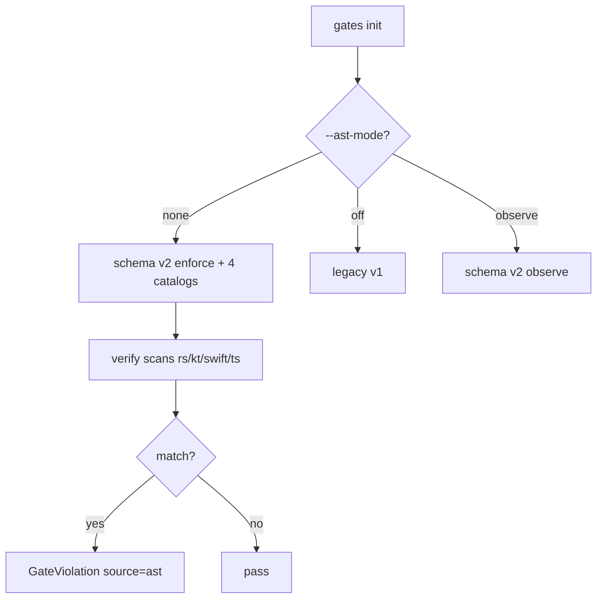
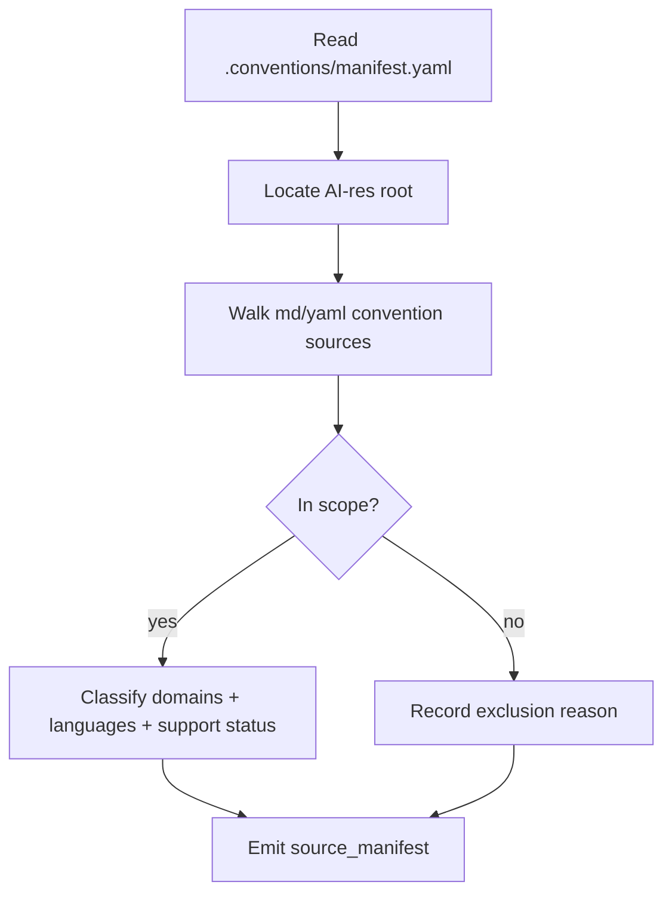
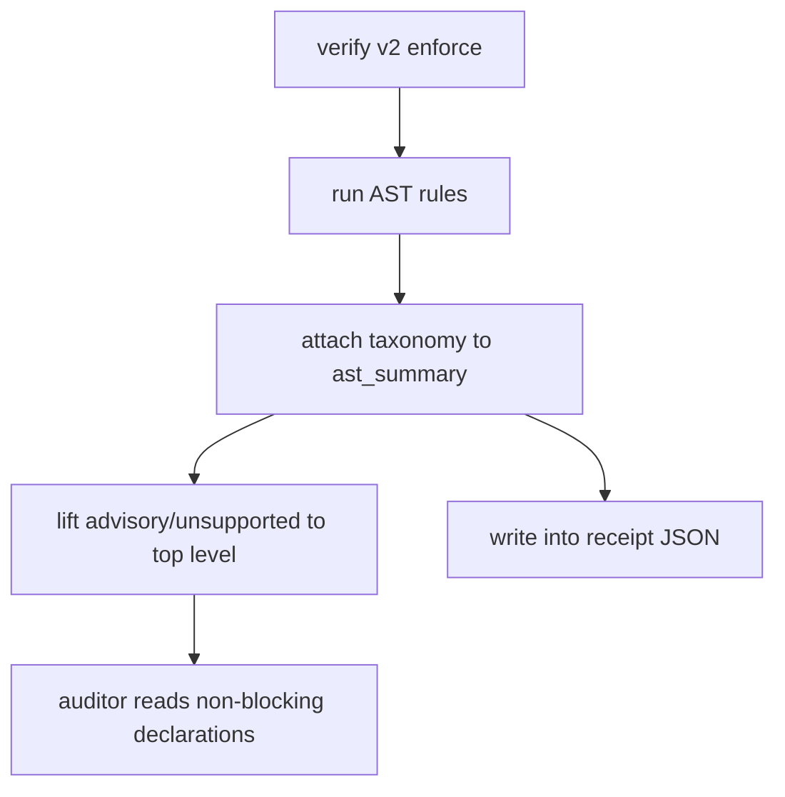

# Feature Spec: Multilang Convention AST Catalog + Enforce-by-Default

- **Feature:** Multilang Convention AST Catalog + Enforce-by-Default
- **Branch:** `feature/073-conventions-multilang-catalog`
- **Date:** 2026-06-29
- **Status:** Implemented
- **Input:** Extend the AST conventions engine (072) from one demo rule to a sourced multilang catalog (TS/JS, Rust, Kotlin, Swift), flip the rollout default to `enforce` with `observe`/`off` opt-in, and serialize both support-class taxonomy plus an exhaustive AI-res/ARS source manifest so the receipt cannot read as "fully covered". External plans: `/Users/julienm/.orchestrate/tmp/livespec-multilang-aires-conventions/plans/final-plan.md` and `/Users/julienm/.orchestrate/tmp/livespec-aires-full-coverage/context/full-plan.md`.
- **Feature Number:** 073
- **Supersedes:** 072 AC-001, AC-002, SC-001, SC-002 (the "v1 by default" invariant) — see `.specs/features/072-conventions-ast-rule-engine/spec.md`.

---

## User Scenarios & Testing

### Story 1 - Maintainer gets multilang enforcement on by default `P1`

**As a** LiveSpec maintainer, **I want** `gates init` to enable AST `enforce` across TS/JS, Rust, Swift, and Kotlin by default, **so that** real structural violations block without an opt-in step, while a documented `off`/`observe` escape hatch remains.

**Priority reason:** The user explicitly requires enforce-by-default; silent non-enforcement is the failure mode this feature removes.

**Independent test:** Run `gates init` with no flag; assert schema v2 with `ast_rules.mode=enforce` and the four multilang catalogs. Run `--ast-mode off`; assert legacy v1.

```gherkin
Feature: Enforce-by-default multilang rollout
  Scenario: Default init enables enforce across languages
    Given a project with constitution and stack files
    When livespec conventions gates init runs without --ast-mode
    Then .specs/conventions-gates.yaml has schema_version 2
    And ast_rules.mode is enforce
    And ast_rules.catalogs include rust_high, swift_high, and kotlin_high

  Scenario: Off opt-out restores legacy v1
    Given a project with constitution and stack files
    When livespec conventions gates init runs with --ast-mode off
    Then .specs/conventions-gates.yaml has schema_version 1
    And no ast_rules section is written

  Scenario: A real violation per language is detected under enforce
    Given a temp project with a bad .ts, .rs, .swift, and .kt file
    When livespec conventions verify --json runs with ast-grep available
    Then one GateViolation(source="ast") is produced per language
    And ast_backend.status is available
```



### Story 3 - Auditor proves every AI-res/ARS source is classified `P1`

**As a** release auditor, **I want** `verify --json` to include an exhaustive source manifest with counts and a language/domain matrix, **so that** old and new projects can prove zero in-scope AI-res/ARS source is unclassified.

**Priority reason:** The user explicitly requires every AI-res/ARS convention source to be taken into account, including SQL, Database, Payment, Design, Architecture, Legal, Copywriting, and Pricing.

**Independent test:** Run `livespec conventions verify --json`; assert `source_manifest.unclassified_count == 0`, all user-named domains are present, and detected languages include TypeScript/JavaScript, Python, Rust, Go, Swift, Kotlin, SQL, CSS, Delphi, and shell.

```gherkin
Feature: Exhaustive AI-res source manifest
  Scenario: Existing project emits a complete source manifest
    Given an existing project with `.conventions/manifest.yaml`
    When livespec conventions verify --json runs
    Then source_manifest reports unclassified_count 0
    And SQL, Database, Payment, Design, Architecture, Legal, Copywriting, and Pricing are present

  Scenario: New project emits the same manifest after gates init
    Given a new project with `.specs` and `.conventions`
    When conventions gates init and verify run
    Then source_manifest reports all in-scope sources classified
```



### Story 2 - Auditor sees what is NOT enforced `P1`

**As a** release auditor, **I want** the verify receipt to list `advisory_rules[]` and `unsupported_rules[]`, **so that** heuristic (SQL/design/payment) and prose (legal/copy/pricing) domains are declared and never silently presented as enforced.

**Priority reason:** A PASS that hides un-enforced domains is a false "fully covered" claim (C009).

**Independent test:** Run `verify --json` on a v2 enforce project; assert top-level `advisory_rules` and `unsupported_rules` are present, SQL is advisory, pricing is unsupported, and neither produces a blocking violation.

```gherkin
Feature: Support-class taxonomy in the receipt
  Scenario: Taxonomy is serialized at the verify top level
    Given a v2 enforce conventions project
    When livespec conventions verify --json runs
    Then advisory_rules and unsupported_rules are present at the document root
    And db.sql.no_select_star appears under advisory_rules
    And pricing appears under unsupported_rules

  Scenario: Taxonomy entries never block
    Given the advisory and unsupported taxonomy entries
    When conventions verification runs
    Then none of those entry ids appear as GateViolations
```



## Acceptance Criteria

- **AC-001:** Given no AST rollout flag, when `gates init` runs, then it emits `schema_version: 2` with `ast_rules.mode=enforce`. (Supersedes 072 AC-001.)
- **AC-002:** Given `--ast-mode off`, when `gates init` runs, then it emits legacy `schema_version: 1` with no `ast_rules`. (Supersedes 072 AC-002.)
- **AC-003:** Given `--ast-mode observe`, when `gates init` runs, then it emits schema v2 with `ast_rules.mode=observe`.
- **AC-004:** Given source files in Rust, Kotlin, or Swift, when conventions scope is resolved, then `.rs`, `.kt`, and `.kts` are collected and mapped to `rust`/`kotlin`/`swift` language adapters.
- **AC-005:** Given the active multilang catalog, when it is loaded, then exactly the seven high-precision, sourced, hash-valid `enforced_ast` rules load (ts.no_as_any, ts.no_commonjs_require, rust.no_unwrap, rust.no_expect, rust.no_panic, swift.no_try_force, kotlin.no_unchecked_cast).
- **AC-006:** Given a rule with multiple patterns, when the backend scans a file, then a match via any pattern is reported.
- **AC-007:** Given enforce mode with `ast-grep` available, when a bad file per language is verified, then one `GateViolation(source="ast")` is produced per language.
- **AC-008:** Given `verify --json` on a v2 enforce project, when output is produced, then `advisory_rules[]` and `unsupported_rules[]` are present at the top level and inside the written receipt.
- **AC-009:** Given the taxonomy entries, when conventions verification runs, then none become blocking violations (advisory/unsupported are declarations only).
- **AC-010:** Given pre-existing v1 gates or receipts, when they are loaded, then they remain valid (072 compatibility preserved).
- **AC-011:** Given `verify --json` in an existing project, when output is produced, then `source_manifest.total_source_count`, `classified_count`, `unclassified_count`, `excluded_count`, `language_domain_matrix`, and `domain_source_counts` are present, with `unclassified_count = 0`.
- **AC-012:** Given a new project after `conventions gates init`, when `verify --json` runs, then the same source manifest is emitted and includes SQL, Database, Payment, Design, Architecture, Legal, Copywriting, and Pricing.

## Functional Requirements

- **FR-001:** Conventions scope MUST collect `.rs`, `.kt`, `.kts` from a single source of truth and language adapters MUST map them to `rust`/`kotlin`.
- **FR-002:** The AST backend MUST evaluate every pattern declared by a rule, not only the first.
- **FR-003:** The active catalog MUST contain only `decidability: ast`, `precision: high` rules, each with PASS/FAIL fixtures and `ai-ressources/code-conventions` source path, anchor, and current source hash.
- **FR-004:** `gates init` MUST default to schema v2 `enforce`; `--ast-mode off` MUST write legacy v1; `--ast-mode observe|enforce` MUST select the v2 mode explicitly.
- **FR-005:** `enforce` with an absent backend MUST be `BLOCKED` with an actionable message (install ast-grep or use `--ast-mode observe/off`).
- **FR-006:** The verify receipt and `verify --json` MUST serialize `advisory_rules[]` and `unsupported_rules[]` classifying heuristic (SQL/design/payment/architecture) and prose/unsupported (legal/copy/pricing, kotlin `!!`, swift `!`) domains, none of which block.
- **FR-007:** Pre-existing schema v1 gates and v1 receipts MUST keep loading without rewrite.
- **FR-008:** `verify --json` MUST build a deterministic AI-res/ARS corpus manifest from `.conventions/manifest.yaml` and classify every in-scope Markdown/YAML convention source with language(s), domain(s), support status, and reason.
- **FR-009:** Source manifest output MUST report explicit exclusions and zero unclassified in-scope sources for both old v1-gates projects and new v2-gates projects.

## Requirement → AC Mapping

| AC | FR |
|---|---|
| AC-001 | FR-004 |
| AC-002 | FR-004 |
| AC-003 | FR-004 |
| AC-004 | FR-001 |
| AC-005 | FR-003 |
| AC-006 | FR-002 |
| AC-007 | FR-003, FR-005 |
| AC-008 | FR-006 |
| AC-009 | FR-006 |
| AC-010 | FR-007 |
| AC-011 | FR-008, FR-009 |
| AC-012 | FR-008, FR-009 |

## Key Entities

- **AST rule catalog** — per-language YAML (`ast_high`, `rust_high`, `swift_high`, `kotlin_high`) of sourced, hash-valid rules.
- **Support-class taxonomy** — static `advisory`/`unsupported` classification emitted in the receipt.
- **Source manifest** — exhaustive AI-res/ARS source inventory emitted by verify JSON and v2 receipts, with counts, explicit exclusions, and language/domain matrix.
- **Language adapter** — extension → language resolver feeding the backend's language gating.

## Edge Cases

- Backend `sg` absent under enforce → `BLOCKED`, not a silent pass.
- Unsupported domains (SQL string, pricing markdown) present in scope → declared in taxonomy, never AST violations.
- Source hash drift → catalog load error surfaced in the receipt.
- Historical AI-res convention design docs present under `docs/superpowers/` → classified as code/design/architecture/conventions sources, not dropped.

## Success Criteria

- **SC-001:** Default `gates init` yields schema v2 `enforce` (0 opt-in steps). (Supersedes 072 SC-001.)
- **SC-002:** Four languages each have ≥1 active, real-`sg`-proven `enforced_ast` rule. (Supersedes 072 SC-002.)
- **SC-003:** Every verify receipt on a v2 project lists non-empty `advisory_rules[]` and `unsupported_rules[]`.
- **SC-004:** Real AI-res root `/Users/julienm/projects/ai-ressources` reports 192 total in-scope sources, 192 classified, 0 unclassified, and 36 excluded source files with reasons.
