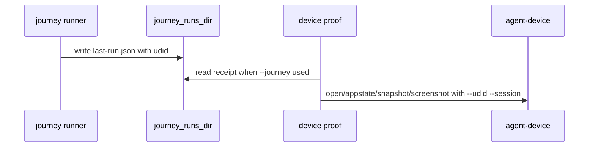

# Plan: Agent Device Proof Adapter (074)

## Summary

Add journey run records and a `livespec device proof` command that uses Agent Device only as a proof/replay layer bound to LiveSpec-selected UDIDs.

## Technical Context

- **Language:** Python 3.12+, Typer CLI.
- **Deps:** existing journey runner, `xcrun simctl`, `npx -y agent-device@0.18.3`.
- **Storage:** journey receipts under `journey_runs_dir()` and proof artifacts under `.specs/.device-proof/`.
- **Testing:** pytest with fake subprocess executors; no real simulator dependency.
- **Project type:** LiveSpec validator CLI.

## Constitution Check

- **Spec authority:** Agent Device is evidence only; specs, journeys, oracles, simulator selection, and boot remain LiveSpec-owned.
- **No hidden target drift:** All Agent Device calls bind `--udid` and `--session`; no `--device` path.
- **Reproducibility:** Package default is pinned; env override is explicit.
- **watchOS honesty:** watchOS is refused with XCTest/simctl guidance.

## Gherkin Scenarios + Mermaid Sequence Diagrams

```gherkin
Feature: Proof adapter execution
  Scenario: iOS proof completes
    Given a bundle is installed on a selected UDID
    When device proof runs
    Then listapps, open, appstate, snapshot, and screenshot checks pass

  Scenario: Mismatched foreground fails fast
    Given appstate reports another bundle
    When device proof runs
    Then screenshot is not attempted
```



## Implementation Plan

1. Create feature 074 spec artifacts and roadmap/changelog entries.
2. Extend `JourneyRunResult` with `JourneyExecutionRecord` plus receipt writing.
3. Expose run records in `livespec journey run --json` and human output.
4. Add `validator/cli_commands/device_cmd.py` and register it.
5. Add journey runner/CLI tests and device proof tests with fake subprocess boundaries.
6. Document `livespec device proof` usage and stable error codes.
7. Update `implementation.md`, `progress.md`, and changelogs.
8. Run local gates.

## Testing Strategy

- Unit tests for run record extraction, JSON output, receipt writing, and failure preservation.
- CLI tests for Agent Device argv binding, install gate, mismatch fail-fast, watchOS rejection, receipt consumption, empty screenshot, and JSON report.
- Full pytest suite excluding integration after targeted tests.

## Risks & Considerations

- Real Agent Device output formats may evolve; parsers accept the proven `Foreground app:`, `Bundle:`, and `App:` prefixes.
- Receipt write failures are warning-only by design, so tests focus on normal receipt path and not filesystem permission errors.
- watchOS support remains explicitly outside this adapter until Agent Device supports it.
