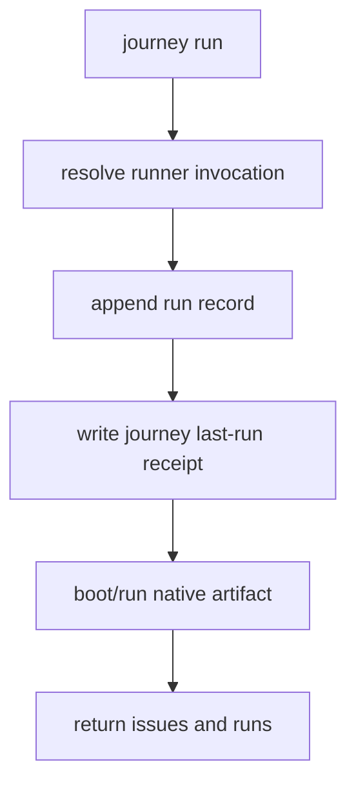
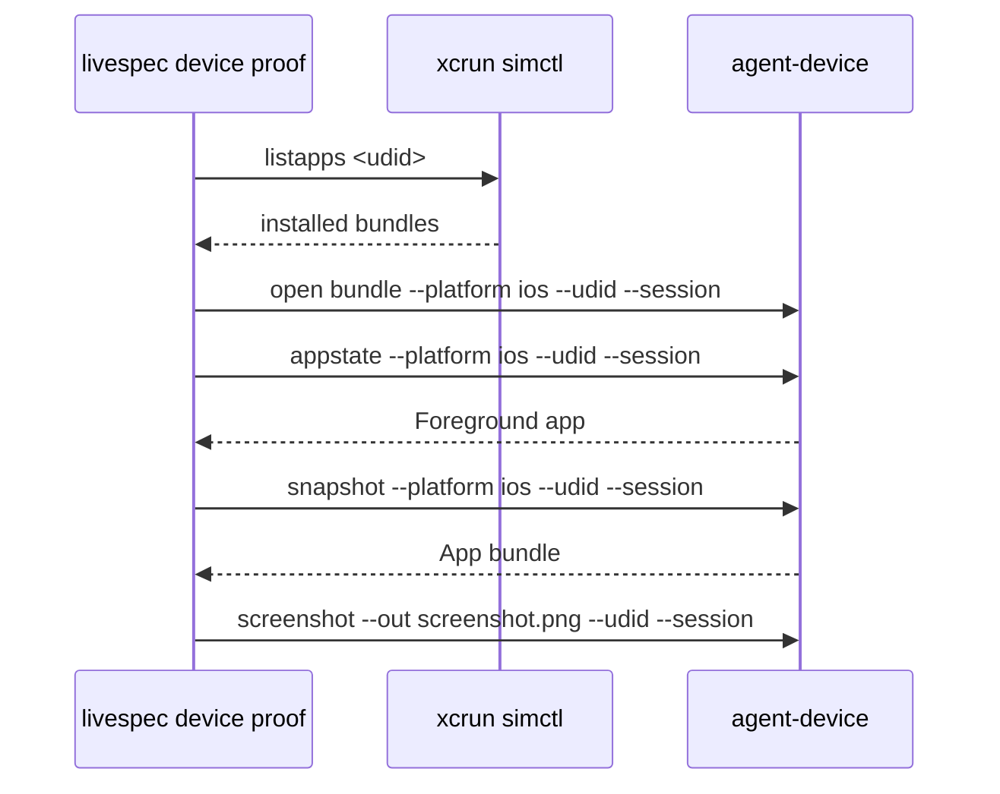
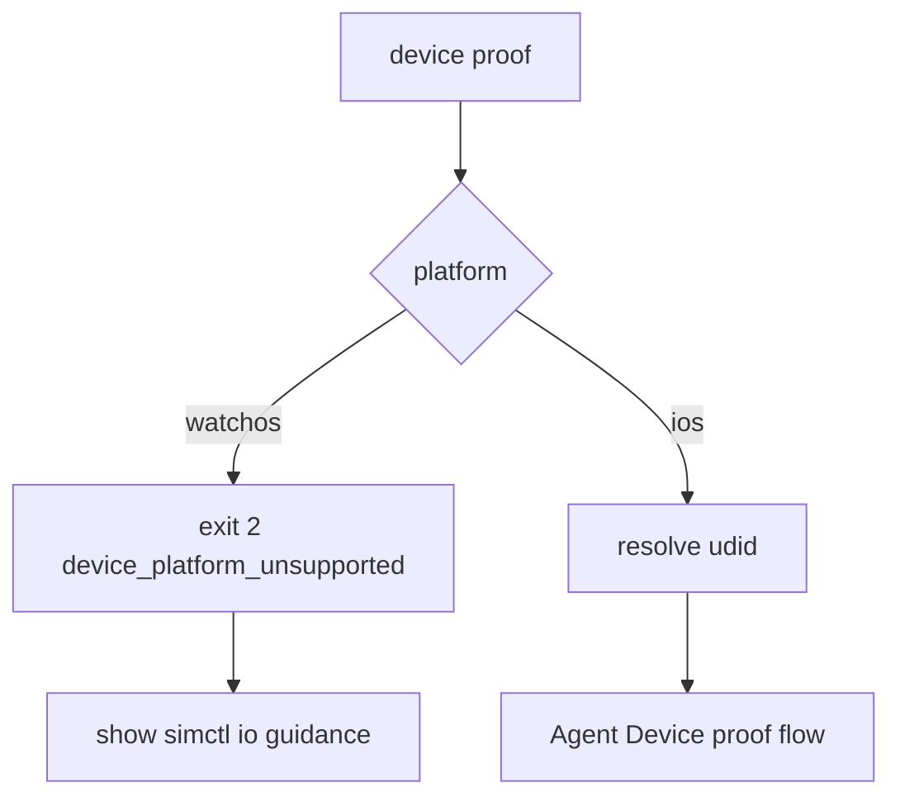

# Feature Spec: Agent Device Proof Adapter

- **Feature:** Agent Device Proof Adapter
- **Branch:** `feature/074-agent-device-proof-adapter`
- **Date:** 2026-07-04
- **Status:** Implemented
- **Input:** Integrate Agent Device as a LiveSpec proof/replay/assertion layer without replacing specs, journeys, or oracles.
- **Feature Number:** 074

## User Scenarios & Testing

### Story 1 - Journey runs expose selected device facts `P1`

**As a** LiveSpec validator, **I want** each executed journey attempt to record runner, command, destination, and UDID, **so that** later proof tools can replay against the exact selected target.

**Priority reason:** The UDID is a run fact, not a constant.

**Independent test:** Run an XCUITest journey with a fake destination and assert `runs[].udid` plus `.specs/journeys/<id>/runs/last-run.json`.

```gherkin
Feature: Journey run facts
  Scenario: XCUITest run records destination facts
    Given a compiled XCUITest journey
    When livespec journey run executes it
    Then the result contains a run record with destination and udid
    And the journey last-run receipt contains the same udid

  Scenario: Native runner failure still records the attempted destination
    Given a compiled XCUITest journey whose native process exits non-zero
    When livespec journey run executes it
    Then the result contains the blocking issue
    And the attempted destination record is still present
```



### Story 2 - Agent Device captures proof on LiveSpec-selected iOS target `P1`

**As a** release validator, **I want** `livespec device proof` to bind Agent Device calls to a known UDID and session, **so that** proof/replay evidence cannot drift to another booted simulator.

**Priority reason:** Prior validation proved `--udid <UDID>` works and `--device <UDID>` fails because it matches names.

**Independent test:** Fake the adapter executor and assert every Agent Device argv contains `--udid` and `--session` and never contains `--device`.

```gherkin
Feature: Agent Device proof binding
  Scenario: Happy path proof
    Given bundle com.example.app is installed on UDID IPHONE-17
    When livespec device proof runs for that UDID
    Then every Agent Device command uses --udid IPHONE-17
    And every Agent Device command uses --session livespec-proof
    And the final screenshot is non-empty

  Scenario: Settings foreground mismatch
    Given appstate reports com.apple.Preferences
    When livespec device proof checks foreground state
    Then it fails with device_foreground_mismatch
    And it does not run snapshot or screenshot
```



### Story 3 - watchOS remains outside Agent Device `P1`

**As a** maintainer, **I want** watchOS proof attempts to fail with explicit guidance, **so that** LiveSpec keeps watchOS under XCTest/simctl evidence instead of promising unsupported Agent Device behavior.

**Priority reason:** Agent Device 0.18.x does not provide watchOS support.

**Independent test:** Run `livespec device proof --platform watchos`; assert exit 2, `device_platform_unsupported`, and `xcrun simctl io <watch_udid> screenshot` guidance.

```gherkin
Feature: watchOS boundary
  Scenario: watchOS is rejected before Agent Device
    Given the requested platform is watchos
    When livespec device proof starts
    Then it exits with device_platform_unsupported
    And the output mentions xcrun simctl io <watch_udid> screenshot
    And no npx process is invoked

  Scenario: watchOS receipt is rejected
    Given a journey receipt has platform watchos
    When livespec device proof uses --journey
    Then it exits with the same unsupported platform code
```



## Acceptance Criteria

- **AC-001:** `run_journeys` records runner, command, destination, and UDID for each executed journey attempt.
- **AC-002:** `livespec journey run --json` includes a `runs[]` array with `destination` and `udid`.
- **AC-003:** Each attempted journey writes `.specs/journeys/<id>/runs/last-run.json`; write failure is warning-only.
- **AC-004:** `livespec device proof` binds every Agent Device call with `--udid` and `--session`, never `--device`.
- **AC-005:** `--journey <id>` resolves UDID from the journey last-run receipt and emits stable errors when absent or empty.
- **AC-006:** iOS proof checks `simctl listapps <udid>` before opening the bundle.
- **AC-007:** Foreground/app bundle mismatch fails fast with `device_foreground_mismatch`.
- **AC-008:** Final screenshot must exist and be non-empty.
- **AC-009:** `--platform watchos` is rejected with `simctl io` guidance and no Agent Device call.
- **AC-010:** The default package is `agent-device@0.18.3`, overrideable by `LIVESPEC_AGENT_DEVICE_PACKAGE`.

## Functional Requirements

- **FR-001:** `run_journeys` records by executed journey a record containing runner, command, destination, and UDID.
- **FR-002:** `livespec journey run --json` exposes `runs[]` with `destination` and `udid`.
- **FR-003:** A receipt `last-run.json` is written under `journey_runs_dir(<journey_id>)` for each attempted run; write failure is non-blocking.
- **FR-004:** `livespec device proof` binds each Agent Device call with `--udid` and `--session`; it never emits `--device`.
- **FR-005:** `--journey <id>` without `--udid` consumes the UDID from FR-003 or returns `device_receipt_missing` / `device_receipt_no_udid`.
- **FR-006:** iOS proof requires the bundle in `xcrun simctl listapps <udid>` before open, otherwise `device_bundle_not_installed`.
- **FR-007:** Foreground `appstate` and `snapshot` app bundle must match the target bundle; mismatch returns `device_foreground_mismatch`.
- **FR-008:** Final screenshot must exist and be non-empty, otherwise `device_screenshot_empty`.
- **FR-009:** `--platform watchos` returns exit 2 with `device_platform_unsupported` and `xcrun simctl io <watch_udid> screenshot` guidance.
- **FR-010:** Default package is pinned to `agent-device@0.18.3`, with `LIVESPEC_AGENT_DEVICE_PACKAGE` override.

## Key Entities

- **JourneyExecutionRecord:** Replay metadata for one attempted compiled journey artifact.
- **last-run receipt:** Latest replay metadata persisted under the journey run evidence directory.
- **Device proof check:** Named adapter step with pass/fail status and stable error code.

## Edge Cases

- Native runner exits non-zero after a destination is resolved.
- Receipt missing, malformed, or missing `udid`.
- Agent Device command exits non-zero or times out.
- `appstate` reports `Foreground app: com.apple.Preferences`.
- `snapshot` reports an `App:` value different from the requested bundle.
- Screenshot command succeeds but writes an empty PNG.

## Success Criteria

- **SC-001:** New journey runner and CLI tests pass without real simulators.
- **SC-002:** New `device proof` tests prove argv binding, fail-fast mismatch, watchOS rejection, receipt consumption, and JSON output.
- **SC-003:** No adapter code path emits `--device`.
