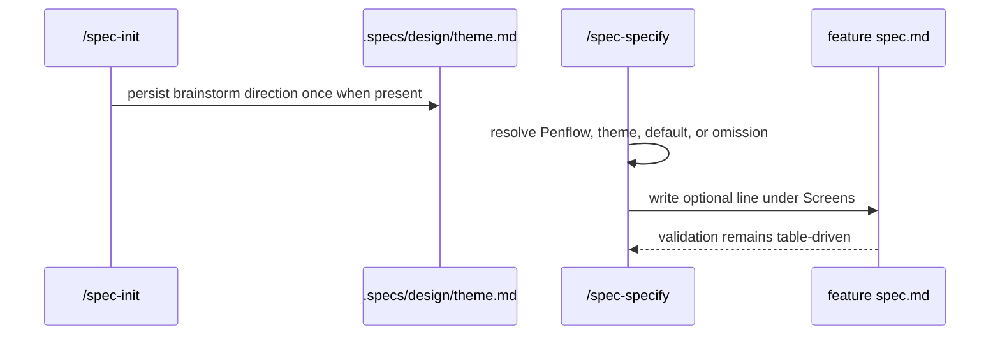

# Plan: Design Direction Carry (075)

## Summary

Carry a one-line `Design direction` through future UI specs as optional context only, without feeding LiveSpec validation or fidelity decisions.

## Technical Context

- **Language:** Markdown command contracts and Python pytest static contract tests.
- **Deps:** Existing LiveSpec command docs, spec template, UI runner Screens parser.
- **Storage:** No runtime storage change; `/spec-init` documents persistence into `.specs/design/theme.md` and user `~/.claude/livespec/design.md`.
- **Testing:** Static contract tests plus existing pytest, Ruff, Pyright, spec validation, and conventions gates.
- **Project type:** LiveSpec validator and command documentation repo.

## Constitution Check

- **Spec authority:** The spec records expected carry behavior before payload edits are considered complete.
- **Minimal surface:** No new command, flag, schema, migration, or VERSION bump.
- **File-system truth:** Direction sources are documented as filesystem artifacts with deterministic precedence.
- **No visual judgement drift:** `Design direction` is not used by `spec-check`, `spec-test`, fidelity checks, or gates.

## Gherkin Scenarios + Mermaid Sequence Diagrams

```gherkin
Feature: Design direction carry
  Scenario: Direction source exists
    Given a UI feature generation has a non-empty direction source
    When /spec-specify writes the Screens section
    Then it inserts the Design direction line before the table
    And validation commands ignore that line

  Scenario: Direction source is absent
    Given no Penflow, theme, or default direction exists
    When /spec-specify writes the Screens section
    Then it omits the Design direction line
```



## Implementation Plan

1. Create feature 075 spec artifacts, roadmap, README, and changelog entries after detecting the feature-number collision with 074.
2. Update `system/templates/spec-template.md` Screens guidance, placeholder line, and example.
3. Update `.agent-sync/skills/spec-specify/SKILL.md` Step 5.6 with sub-step 7.5 for carry precedence and non-validation boundaries.
4. Bump `.agent-sync/skills/spec-specify/expectations.md` `last_reviewed` to 2026-07-04.
5. Update `.agent-sync/skills/spec-init/SKILL.md` Step 3.5 wizard and Step 3.7 brainstorm direction extraction.
6. Bump `.agent-sync/skills/spec-init/expectations.md` `last_reviewed` to 2026-07-04.
7. Update `.specs/spec-system.md` design mockup guidance with the informative-only carry rule.
8. Add `tests/test_design_direction_carry.py` with six contract tests, including Screens parser tolerance.
9. Update `implementation.md`, `progress.md`, and feature changelog with evidence.
10. Run requested validation gates and record exact outcomes.

## Testing Strategy

- Targeted pytest: `python -m pytest tests/test_design_direction_carry.py -q`.
- Full regression: `python -m pytest -q`.
- Static quality: `ruff check .`, `ruff format --check .`, and `pyright`.
- Spec validation: `livespec validate .specs/features/075-design-direction-carry --format compact`.
- Conventions gate: `livespec conventions verify`.
- Git proof: `git status --short --branch`, confirming no `migrations/**` or `VERSION` changes.

## Risks & Considerations

- Optional content must never become a required `/spec-verify-output` signal; expectations only receive `last_reviewed` bumps.
- The template example must not leak as generated content; `/spec-specify` explicitly says to omit the line when no source exists.
- A pre-existing `VERSION` versus `migrations/22` mismatch remains out of scope because this feature does not touch migrations.
