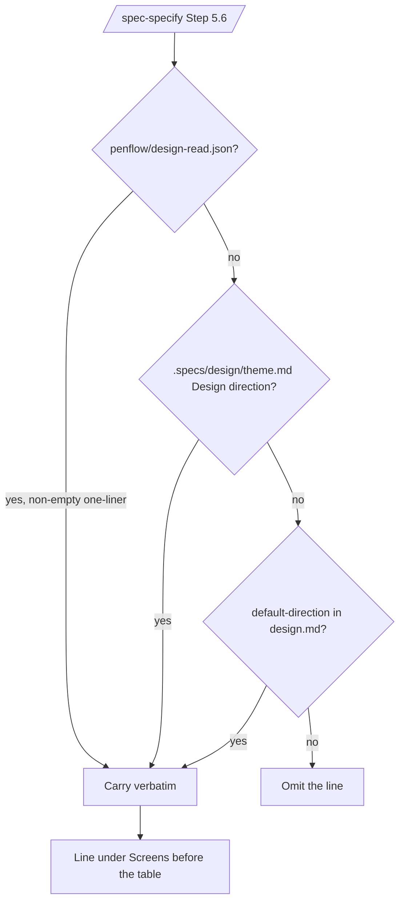
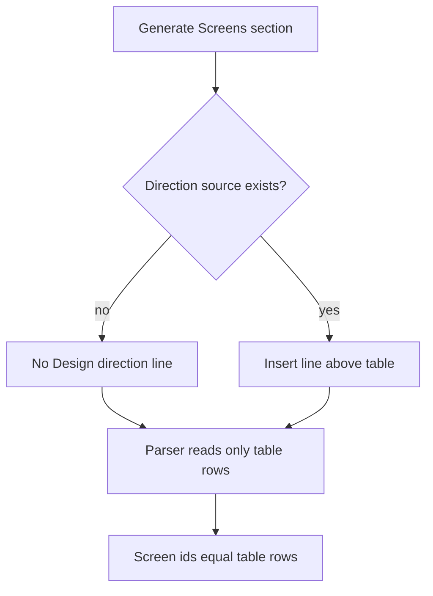
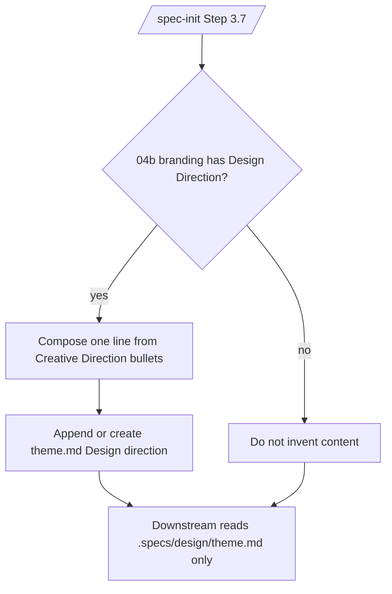

# Feature Spec: Design Direction Carry

- **Feature:** Design Direction Carry
- **Branch:** `orch/W-livespec-31b0`
- **Date:** 2026-07-04
- **Status:** Implemented
- **Input:** Carry an optional, informative-only Design direction line through generated specs from template, `/spec-specify`, and `/spec-init`, with no aesthetic judgement in LiveSpec.
- **Feature Number:** 075
- **Surfaces:** non-UI framework

## User Scenarios & Testing

### Story 1 - Generated specs carry a direction when a source exists `P1`

**As a** LiveSpec spec author, **I want** generated UI specs to carry the selected creative direction, **so that** implementation agents see the intended design read without LiveSpec judging it.

**Priority reason:** This is the primary carry path shared with Penflow.

**Independent test:** Static command documentation proves precedence and no validation use.

```gherkin
Feature: Design direction carry at spec generation
  Scenario: Penflow workspace direction wins
    Given a project with penflow/design-read.json containing a non-empty one-liner
    And .specs/design/theme.md also contains a Design direction section
    When /spec-specify generates a UI feature spec
    Then the spec Screens section contains the Penflow one-liner verbatim
    And no validation consumes that value

  Scenario: Theme direction used when no Penflow workspace
    Given a project without penflow/design-read.json
    And .specs/design/theme.md contains a Design direction section
    When /spec-specify generates a UI feature spec
    Then the spec Screens section carries the theme one-liner
```



### Story 2 - Missing sources degrade cleanly `P1`

**As a** LiveSpec maintainer, **I want** projects without a direction source to omit the line, **so that** generated specs never contain placeholders.

**Priority reason:** Existing projects must continue to generate clean specs.

**Independent test:** Static tests assert placeholder prohibition and the Screens parser ignores the carry line.

```gherkin
Feature: Clean degradation without any direction source
  Scenario: No source at all
    Given a project without penflow/design-read.json, theme direction, or default-direction
    When /spec-specify generates a UI feature spec
    Then the Screens section contains no Design direction line
    And no placeholder text is emitted

  Scenario: Screens discovery unaffected
    Given a generated spec whose Screens section carries a Design direction line
    When the UI runner discovers screens from the spec
    Then the discovered screen ids match the table rows exactly
```



### Story 3 - Users can set a default direction during init `P2`

**As a** project owner, **I want** `/spec-init` to capture an optional default design direction, **so that** later UI specs can carry a fallback direction when no project or Penflow source exists.

**Priority reason:** User-level defaults are useful but must stay optional.

**Independent test:** Static command documentation verifies `default-direction` and omission when skipped.

```gherkin
Feature: User-level default direction
  Scenario: Wizard captures an optional default
    Given /spec-init runs the design wizard
    When the user enters a one-line default direction
    Then ~/.claude/livespec/design.md frontmatter contains default-direction

  Scenario: Wizard skipped cleanly
    Given /spec-init runs the design wizard
    When the user presses Enter to skip the direction question
    Then the frontmatter does not contain a default-direction key
```

```mermaid
flowchart TD
    A[/spec-init design wizard/] --> B{User enters direction?}
    B -- yes --> C[Write default-direction frontmatter]
    B -- no --> D[Omit default-direction key]
    C --> E[/spec-specify last-resort source]
    D --> F[No fallback source]
```

### Story 4 - Brainstorm direction persists once during init `P2`

**As a** maintainer, **I want** `/spec-init` to persist brainstorm creative direction into `.specs/design/theme.md`, **so that** downstream commands read only LiveSpec-owned artifacts after import.

**Priority reason:** This preserves the post-import rule and avoids repeated `.brainstorm/` reads.

**Independent test:** Static command documentation verifies the extraction source, target section, and downstream exclusivity.

```gherkin
Feature: Brainstorm direction import
  Scenario: Creative direction section is present
    Given a brainstorm branding file contains a Design Direction section
    When /spec-init imports design metadata
    Then .specs/design/theme.md contains a single-line Design direction section

  Scenario: Creative direction section is absent
    Given no brainstorm Design Direction section exists
    When /spec-init imports design metadata
    Then no Design direction section is invented
```



## Acceptance Criteria

- **AC-001:** `system/templates/spec-template.md` documents and shows an optional `**Design direction:**` line in `## Screens`.
- **AC-002:** `/spec-specify` documents deterministic source precedence: `penflow/design-read.json`, `.specs/design/theme.md`, user `default-direction`, then omission.
- **AC-003:** `/spec-init` documents an optional `default-direction` wizard field and omits the key when skipped.
- **AC-004:** `/spec-init` documents one-time brainstorm `## Design Direction` extraction into `.specs/design/theme.md`.
- **AC-005:** No source path emits a placeholder `Design direction` line.
- **AC-006:** LiveSpec validation and judgement commands do not consume `Design direction` for pass/fail, fidelity, scoring, or gates.
- **AC-007:** The Screens parser ignores a non-table `**Design direction:**` line.

## Functional Requirements

- **FR-001:** The spec template carries optional `**Design direction:**` guidance in `## Screens`.
- **FR-002:** `/spec-specify` Step 5.6 defines the carry precedence and insertion point.
- **FR-003:** `/spec-init` Step 3.5 defines the optional `default-direction` wizard field.
- **FR-004:** `/spec-init` Step 3.7 defines brainstorm direction extraction into `.specs/design/theme.md`.
- **FR-005:** `.specs/spec-system.md` documents the line as informative-only design context.
- **FR-006:** Static tests cover template carry, command documentation, judgement-command isolation, spec-system documentation, and Screens parser tolerance.

## Key Entities

- **Design direction:** One-line creative direction carried as implementation context.
- **Direction source:** A Penflow design-read artifact, LiveSpec theme section, or user default.
- **Screens section:** The generated spec section that carries screen references and optional direction context.

## Edge Cases

- All direction sources are absent or empty.
- `penflow/design-read.json` and `.specs/design/theme.md` both exist with different values.
- Brainstorm branding has no `### Creative Direction` bullets.
- A direction line appears before the Screens table and must not be parsed as a screen.
- Validation command docs accidentally start mentioning Design direction.

## Success Criteria

- **SC-001:** `tests/test_design_direction_carry.py` passes.
- **SC-002:** Full pytest remains green.
- **SC-003:** `livespec validate .specs/features/075-design-direction-carry --format compact` passes.
- **SC-004:** `livespec conventions verify` passes or any pre-existing unrelated failure is reported explicitly.
