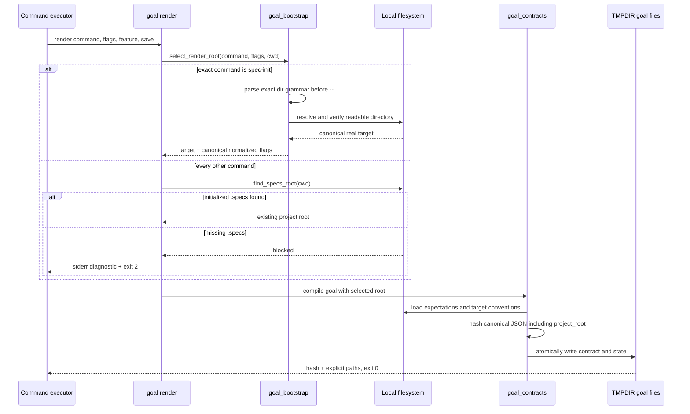
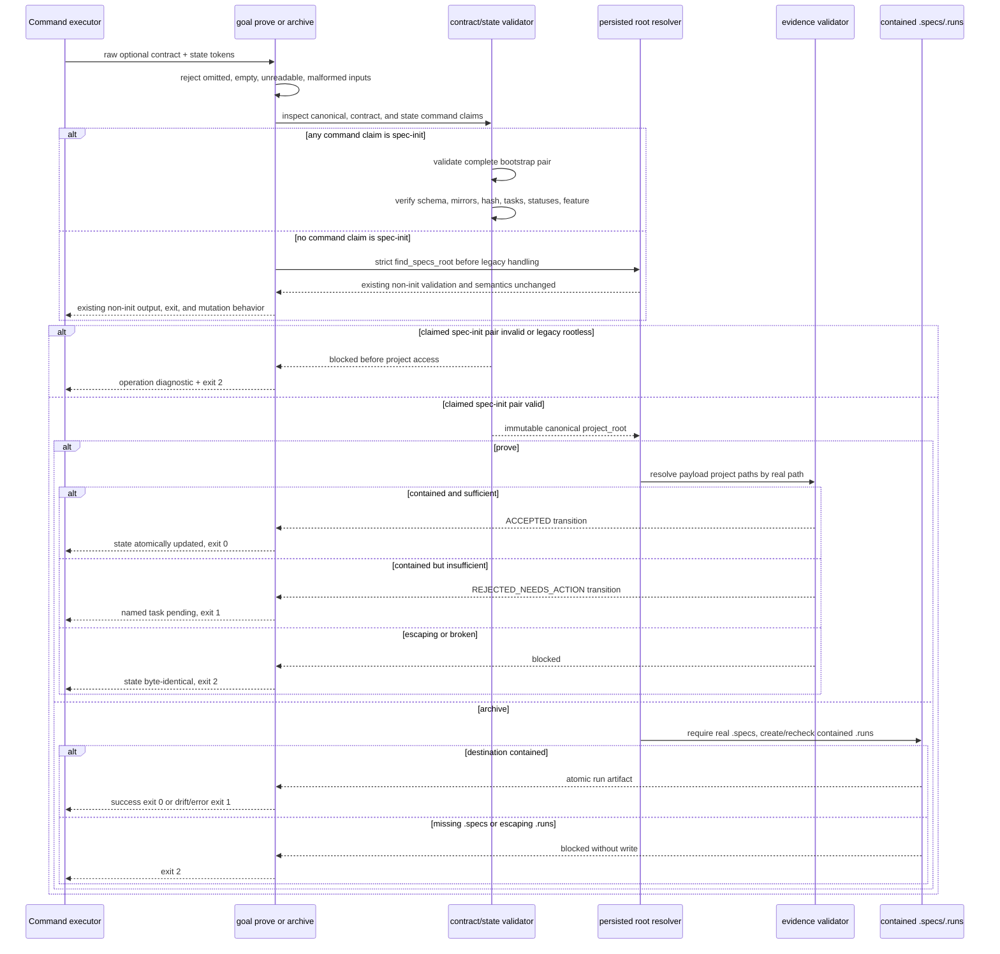
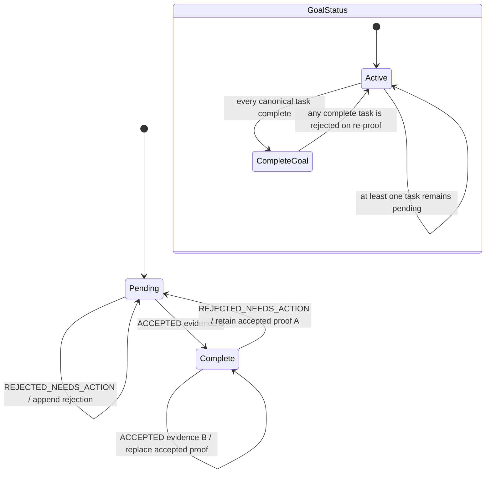

# Technical Plan: Spec Init Goal Bootstrap

## Summary

Add a command-aware bootstrap boundary for `spec-init`: render selects and hashes a canonical fresh-project root, prove and archive recover that immutable root from a fully validated contract/state pair, project evidence and run writes stay confined to it, and every other goal command continues through the existing strict `.specs` root lookup.

- **Approved spec review hash:** `638aa59b825437d2b1427896d7f6c6f3224434ecb84b1d98432737d24de5de76`

## Scope Classification

**L (large).** The feature has 12 FR and changes the shared render, prove, and archive control plane. The implementation remains locally scoped, but the compatibility and path-confinement matrix requires full sequence/state coverage, explicit quality gates, and broad regression proof.

## Technical Context

| Aspect | Choice | Reason |
|---|---|---|
| Language | Python >=3.11 | Existing LiveSpec runtime and project stack. |
| CLI framework | Typer | Existing `livespec goal render|prove|archive` surface. |
| Contract encoding | Canonical JSON + SHA-256 | Existing immutable goal identity; `project_root` joins the hashed canonical payload and top-level mirrors. |
| Mutable state | JSON state file under `$TMPDIR/livespec-goals` | Existing explicit control-plane contract; no implicit discovery. |
| Project state | Local filesystem | `.specs/` remains the sole durable project source of truth. |
| Path model | `pathlib.Path.resolve()` + containment checks | Canonicalizes `--dir`, rejects broken/escaping links, and binds proof/archive to render-time identity. |
| Tests | pytest + Typer `CliRunner` + subprocess smoke | Existing unit/integration conventions and exact CLI output/exit-code assertions. |
| Quality | Ruff + Pyright strict + LiveSpec validation | Existing project gates from the testing strategy. |

No database, hosted infrastructure, network service, UI surface, schema migration, or API endpoint is introduced.

## Constitution Check

| Principle | Verdict | Plan note |
|---|---|---|
| Layered Validation | PASS | Parse and pair validation happen before any project access; domain helpers are tested below the CLI boundary and CLI behavior is tested end-to-end. |
| Provider-Agnostic LLM Integration | PASS | Runtime behavior has no LLM dependency; the independent plan review uses the configured provider only as a planning gate. |
| File-System as Source of Truth | PASS | The selected canonical root, explicit contract/state files, and contained `.specs/.runs` artifacts are the only state inputs/outputs. |
| Fail Fast, Exit Clearly | PASS | Invalid grammar, missing roots, malformed pairs, and escapes stop before mutation with one operation-specific diagnostic and exit 2. |
| Minimal Surface, Maximum Composability | PASS | Existing goal subcommands and flags remain; the bootstrap exception is selected internally only for exact canonical command `spec-init`. |
| No Hosted Infrastructure | PASS | All resolution, validation, proof, and archival remain local. |
| Structural limits | PASS | Existing public façades remain compatible, while every new responsibility is extracted into a focused module; new files stay below 300 lines and new functions below 50 lines, and the touched CLI/archive façades do not grow past their current limits. |

## Design Decisions

- Introduce focused bootstrap modules: `goal_bootstrap.py` selects the render root, `goal_cli_inputs.py` owns raw optional CLI path/error formatting, `goal_pairing.py` validates bootstrap identity, `goal_evidence_paths.py` confines evidence, and `goal_archive_paths.py` confines the archive destination. Existing public modules remain compatibility façades and receive no new multi-purpose validation bodies.
- Keep `find_specs_root()` unchanged. Non-`spec-init` render, prove, and archive call the same strict resolver as before, including when their flags resemble `--dir`.
- Parse only exact `--dir`, `--dir=`, `-D`, and `-D=` tokens before a literal `--`; normalize one accepted value to `--dir=<canonical-real-root>`. Lookalikes and post-`--` tokens never authorize bootstrap.
- At the Typer boundary, accept raw `str | None` contract/state tokens so omission and the empty string reach the handler. Validate omission, empty input, non-file, unreadable file, and malformed JSON before project access; archive formatting receives `json_out` so blocked JSON remains one exact envelope.
- After parsing the explicit control-plane JSON, route any pair where `canonical.command`, the top-level contract mirror, or `state.command` claims `spec-init` through the complete bootstrap validator. Mixed claims therefore fail closed. If none claims `spec-init`, call strict `find_specs_root()` first and then preserve the existing non-init validation, proof/archive evidence classification, outputs, exits, and mutations byte-for-byte.
- For a claimed `spec-init` pair, validate JSON shape, canonical mirrors, canonical JSON hash, state identity, task immutables, feature consistency, and closed statuses before reading the persisted project root or any project artifact.
- Treat contract/state/evidence JSON/transcript files as explicit control-plane inputs. Only project artifact and receipt paths found inside parsed evidence are confined to the immutable root.
- Preserve proof transitions exactly: rejection can move a complete task back to pending while retaining its last accepted evidence; acceptance replaces accepted evidence and clears the last rejection; top-level state status is always derived from task statuses.
- Archive requires a real contained `.specs`; it may safely create only the missing `.specs/.runs` child, rechecks its real containment, writes atomically, and never mutates goal state.
- Legacy `spec-init` contracts without a trustworthy canonical root fail closed with rerender guidance. No compatibility fallback searches cwd or ancestors.

## Gherkin Scenarios + Mermaid Sequence Diagrams

### Render bootstrap root

```gherkin
Feature: Command-aware spec-init goal rendering
  Scenario: Fresh cwd is the bootstrap root
    Given a readable current directory without .specs
    And the canonical command is spec-init
    And no explicit directory flag is present
    When goal render compiles and saves the contract
    Then cwd is persisted as the canonical and mirrored project_root
    And project_root participates in canonical_json and goal_hash
    And no .specs path is created

  Scenario: Explicit target wins without borrowing caller conventions
    Given caller and target are distinct readable fresh directories
    And the flags contain one valid --dir target before any literal --
    When goal render compiles and saves the contract
    Then target is canonicalized and persisted once as --dir=<target>
    And conventions are loaded only from target
    And caller project files cannot affect the goal hash

  Scenario: Invalid directory grammar fails before writes
    Given the canonical command is spec-init
    And the explicit directory token is missing, conflicting, unreadable, not a directory, or unresolvable
    When goal render validates the bootstrap input
    Then it exits 2 with one stderr diagnostic beginning goal blocked:
    And stderr has no traceback and stdout is empty
    And no contract, state, target, or .specs path is created
```



### Prove and archive against the immutable root

```gherkin
Feature: Persisted-root proof and archive
  Scenario: Proof uses the render-time target after cwd changes
    Given an explicit valid spec-init contract and state pair
    And their canonical root differs from proof-time cwd
    When a named task is proved with inline or external-file evidence
    Then pair identity and statuses are validated before project access
    And project artifact paths are resolved only inside the immutable root
    And only the named task and derived state status may change

  Scenario: Archive safely writes under the initialized target
    Given a valid spec-init pair whose canonical root now contains a real .specs
    And .specs/.runs is absent or contained
    When goal archive evaluates success, drift, or error
    Then it safely creates or reuses the contained runs directory
    And atomically writes one matching run artifact there
    And it preserves the goal state bytes

  Scenario: Pairing or path escape fails closed
    Given a malformed, mismatched, legacy-rootless, status-invalid, or escaping spec-init input
    When goal prove or archive validates it
    Then it exits 2 before project access or mutation
    And text prove emits no stdout
    And archive JSON mode emits one blocked envelope matching stderr
```



## Gherkin Scenarios + Mermaid State Diagrams

```gherkin
Feature: Goal and task proof lifecycle
  Scenario: Acceptance completes one pending task
    Given a valid state with one named pending task
    When complete evidence B is accepted
    Then one accepted attempt is appended
    And accepted_evidence becomes B
    And last_rejection is cleared
    And global state is complete only if every task is complete

  Scenario: Rejection reopens a complete task without erasing its proof
    Given a valid complete task with accepted evidence A
    When incomplete but well-formed evidence B is rejected
    Then one rejected attempt is appended
    And the task becomes pending
    And accepted evidence A is retained
    And the global state becomes active

  Scenario: Invalid status is rejected before mutation
    Given state or task status is outside its closed set or contradicts task completion
    When prove or archive validates the pair
    Then the operation exits 2
    And state and project bytes remain unchanged
```



## ER Diagram Decision

No ER diagram applies. The feature introduces no database table or persistent entity schema; goal contracts, mutable states, external evidence files, and run artifacts retain file-backed JSON contracts. Their identity and mutation rules are covered by the sequence and state diagrams above.

## Implementation Plan

### Step 1 - Select and canonicalize the render root

**Files:**

- Create [`validator/goal_bootstrap.py`](../../../validator/goal_bootstrap.py) for exact bootstrap flag parsing, readable-directory validation, canonical real-root selection, and normalized `--dir=<root>` output.
- Modify [`validator/cli_commands/goal_cmd.py`](../../../validator/cli_commands/goal_cmd.py) so render branches on the normalized command before project lookup and uses strict `find_specs_root()` for every non-`spec-init` command.
- Modify [`validator/goal_contracts.py`](../../../validator/goal_contracts.py) only at its existing payload/serialization façade so canonical and top-level mirrors include `project_root` and hash the selected root; no bootstrap parser or validator body is added to this oversized legacy module.
- Create [`tests/test_goal_bootstrap_render.py`](../../../tests/test_goal_bootstrap_render.py) with table-driven render grammar, cwd/explicit-root, ancestor, symlink, convention-source, no-write, exact `goal blocked:` stderr, empty stdout, and exit-code cases.

**Interfaces:**

- `GoalRenderContext(project_root: Path, normalized_flags: tuple[str, ...])` is immutable.
- `select_goal_render_context(command: str, flags: str, cwd: Path) -> GoalRenderContext` recognizes only canonical `spec-init` as bootstrap-capable.
- `render_goal_contract_file()` mirrors `canonical.project_root` at top level.

**FR covered:** FR-001.1: exact bootstrap command gate, FR-002.1: parse directory grammar, FR-003.1: hash and mirror root, FR-007.1: fail before render writes, FR-009.1: load target conventions, FR-012.1: require trustworthy root binding.

**Verification:** Parameterized unit and CLI tests assert every accepted/ignored/rejected grammar row, exact `goal blocked:` exit-2 boundary, no traceback/stdout/write, root/hash identity, target-only conventions, and absence of `.specs` creation.

### Step 2 - Validate explicit contract/state identity before project access

**Files:**

- Create [`validator/goal_cli_inputs.py`](../../../validator/goal_cli_inputs.py) for raw `str | None` option normalization, distinguishing omitted, empty, non-file, unreadable, and malformed JSON inputs, plus operation-specific blocked rendering; its archive boundary accepts `json_out` and emits the exact single blocked envelope.
- Create [`validator/goal_pairing.py`](../../../validator/goal_pairing.py) for command-claim classification and the complete read-only bootstrap pairing/status gate: any `spec-init` claim in canonical, contract mirror, or state selects this validator and mixed claims fail closed.
- Modify [`validator/cli_commands/goal_cmd.py`](../../../validator/cli_commands/goal_cmd.py) so prove/archive options are raw optional tokens (`str | None`), delegate parsing/errors to `goal_cli_inputs`, then branch before bootstrap validation: claimed `spec-init` uses `goal_pairing`; no claim first uses strict `find_specs_root()` and the unchanged legacy non-init path. Extract existing CLI I/O helpers as needed so the façade remains at or below 300 lines.
- Create [`tests/test_goal_bootstrap_pairing.py`](../../../tests/test_goal_bootstrap_pairing.py) with one parameterized case per atomic AC-004 pairing/status defect for both prove and archive, including omitted/empty/non-file/unreadable/malformed raw inputs, mixed claims, no project access, and JSON blocked envelopes.

**Interfaces:**

- `ValidatedGoalPair` exposes immutable command, feature, project root, canonical tasks, and a deep-copied mutable state only after all pre-access checks pass.
- `validate_goal_pair(contract: Mapping[str, object], state: Mapping[str, object], *, operation: Literal["prove", "archive"], feature: str | None = None) -> ValidatedGoalPair` raises one domain error without filesystem access on identity/status failure.
- `read_goal_pair_inputs(contract_token: str | None, state_token: str | None, *, operation: Literal["prove", "archive"], json_out: bool = False) -> ParsedGoalInputs` preserves the raw omission/empty distinction before creating any `Path`.
- `claims_spec_init(contract: Mapping[str, object], state: Mapping[str, object]) -> bool` returns true when any of the three command identities claims `spec-init`; false routes to the existing strict initialized-root path.

**FR covered:** FR-003.2: validate mirrored root, FR-004.1: gate proof before access, FR-005.1: gate archive before access, FR-006.1: retain non-init root path, FR-010.1: enforce identity and status sets, FR-012.2: reject legacy rootless pairs.

**Verification:** Snapshot contract/state/project bytes around every invalid input; assert exit 2, operation-specific stderr, no traceback, required JSON envelope behavior, and zero project access/mutation. Separate compatibility tests assert a no-claim pair reaches strict `find_specs_root()` before unchanged legacy handling, while every single or mixed `spec-init` claim reaches the complete bootstrap gate.

### Step 3 - Confine proof evidence and preserve transition semantics

**Files:**

- Create [`validator/goal_evidence_paths.py`](../../../validator/goal_evidence_paths.py) for real-path confinement of bootstrap project artifact/receipt evidence, including paths parsed from external evidence JSON.
- Modify [`validator/goal_contracts.py`](../../../validator/goal_contracts.py) only at the existing `prove_goal_task()` façade so a validated bootstrap pair delegates project paths to `goal_evidence_paths`; non-init proof continues through its existing evidence classifier without change.
- Modify [`validator/cli_commands/goal_cmd.py`](../../../validator/cli_commands/goal_cmd.py) to keep explicit external evidence JSON readable outside the project while passing parsed project paths through immutable-root confinement.
- Create [`tests/test_goal_bootstrap_prove.py`](../../../tests/test_goal_bootstrap_prove.py) across inline/external evidence, cwd changes, pending/complete re-proof, other-task pending/complete, accepted-evidence retention/replacement, and every evidence escape class.

**FR covered:** FR-004.2: prove from persisted root, FR-006.2: preserve non-init proof behavior, FR-007.2: format proof blockers, FR-010.2: preserve exact proof transitions, FR-011.1: distinguish control-plane and project paths.

**Verification:** Assert the complete transition matrix, append-only attempts, named-task-only mutation, derived global status, caller-artifact rejection, and byte-identical state on blocked input.

### Step 4 - Confine archive writes and preserve outcomes

**Files:**

- Create [`validator/goal_archive_paths.py`](../../../validator/goal_archive_paths.py) to require a real contained `.specs`, create an absent `.runs` without following an external link, recheck its real containment, and expose only a contained destination.
- Modify [`validator/run_artifacts.py`](../../../validator/run_artifacts.py) only at the existing `archive_goal_run()` façade to delegate destination selection to `goal_archive_paths`; extract the pre-existing destination helper if needed so this façade returns to at most 300 lines.
- Modify [`validator/cli_commands/goal_cmd.py`](../../../validator/cli_commands/goal_cmd.py) so archive supplies the validated render-time root and preserves text/JSON output plus success/drift/error/blocked exit mapping.
- Create [`tests/test_goal_bootstrap_archive.py`](../../../tests/test_goal_bootstrap_archive.py) for archive before/after `.specs`, absent/existing/escaping `.runs`, cwd and symlink retargeting, external transcripts, feature mismatch, artifact identity, state immutability, and all outcomes.
- Modify [`validator/goal_archive_file.py`](../../../validator/goal_archive_file.py) to return `OwnedTemporary(descriptor, identity)` after writing and fsync; retain the owned descriptor so unlink/recreate cannot reuse its inode while ownership checks remain active. Close it exactly once in `finally` if writing or fsync fails before ownership transfer.
- Modify [`validator/goal_archive_fd.py`](../../../validator/goal_archive_fd.py) to keep that descriptor open through publication and any cleanup, passing its identity to existing ownership checks and closing it exactly once in `finally` on success and every failure. Preserve exclusive publication, cooperative locking, and the documented non-cooperating check-to-syscall boundary.
- Adapt only the causal temporary-writer wrappers in [`tests/test_goal_bootstrap_archive_races.py`](../../../tests/test_goal_bootstrap_archive_races.py) and [`tests/test_goal_bootstrap_archive_publication.py`](../../../tests/test_goal_bootstrap_archive_publication.py); preserve their replacement and publication assertions. Create [`tests/test_goal_archive_file.py`](../../../tests/test_goal_archive_file.py) for descriptor lifetime and single-close evidence on success, write/fsync failure, pre-publication identity failure, link failure, post-publication identity failure, and cleanup failure.

**FR covered:** FR-005.2: archive under persisted root, FR-006.3: preserve non-init archive behavior, FR-007.3: format archive blockers, FR-010.3: preserve outcomes and state bytes, FR-011.2: confine run destination.

**Verification:** Assert exactly one contained artifact on writable outcomes, no partial/temp residue, matching command/hash/feature/outcome, exit 0/1/2 semantics, and no `.specs` bootstrap side effect.

For FR-005 / AC-006 / AC-008, additionally assert that the descriptor is live during publication and cleanup, is closed exactly once afterward on every listed outcome, and that Linux unlink/recreate replacements remain neither published nor removed. An injected cleanup failure must retain the existing explicit blocked diagnostic while still closing the descriptor; do not conceal residual cleanup errors.

### Step 5 - Close the regression and compatibility matrix

**Files:**

- Complete the bounded feature-owned suites [`tests/test_goal_bootstrap_render.py`](../../../tests/test_goal_bootstrap_render.py), [`tests/test_goal_bootstrap_pairing.py`](../../../tests/test_goal_bootstrap_pairing.py), [`tests/test_goal_bootstrap_prove.py`](../../../tests/test_goal_bootstrap_prove.py), and [`tests/test_goal_bootstrap_archive.py`](../../../tests/test_goal_bootstrap_archive.py); create [`tests/test_goal_bootstrap_non_init.py`](../../../tests/test_goal_bootstrap_non_init.py) for strict render/prove/archive compatibility. Every new test file stays below 300 lines and each helper below 50 lines.
- Run unchanged regression suites in [`tests/test_goal_contracts.py`](../../../tests/test_goal_contracts.py), [`tests/test_goal_archive_cli.py`](../../../tests/test_goal_archive_cli.py), [`tests/test_run_artifact.py`](../../../tests/test_run_artifact.py), and [`tests/test_version_guard.py`](../../../tests/test_version_guard.py).
- Keep `.agent-sync/skills/*/expectations.md`, goal task schemas, run-artifact schema version, and non-`spec-init` evidence classification unchanged.

**FR covered:** FR-001.2: prove exact command isolation, FR-002.2: cover full grammar matrix, FR-003.3: prove deterministic root hashing, FR-004.3: cover proof pairing matrix, FR-005.3: cover archive outcomes, FR-006.4: prove strict regressions, FR-008.1: execute AC-008 matrix, FR-009.2: prove convention isolation, FR-010.4: cover transitions and identity, FR-011.3: cover every path class, FR-012.3: cover legacy failure.

**Verification:** Targeted bootstrap tests, all existing goal/run/version tests, Ruff, format, Pyright, and the no-LLM suite complete with zero failures or new warnings.

### Step 6 - Record traceability and completion evidence

**Files:**

- Create the feature implementation map, mapping FR-001 through FR-012 and AC-001 through AC-010 to source anchors and concrete tests.
- Record one feature progress checkpoint row per implementation step with exact commands and receipts.
- Update the feature changelog, project changelog and feature index only through the owning LiveSpec phase/finalizer.

**FR covered:** FR-008.2: record complete regression evidence, FR-012.4: document rerender recovery and legacy boundary.

**Verification:** `livespec validate`, `livespec conventions verify --json --feature 076-spec-init-goal-bootstrap`, finalizer apply/verify, and archived goal receipts prove the mapping and registry state.

## Success Criteria Traceability

| Success criterion | Existing implementation step | Existing test artifact and command | Existing blocking gate |
|---|---|---|---|
| SC-001 | Step 5 - Close the regression and compatibility matrix | Seven bootstrap modules via Feature unit/integration | GATE-QE-001 - Fresh bootstrap |
| SC-002 | Step 1 - Select and canonicalize the render root | `tests/test_goal_bootstrap_render.py` via Feature unit/integration | GATE-QE-001 - Fresh bootstrap |
| SC-003 | Step 1 - Select and canonicalize the render root | `tests/test_goal_bootstrap_render.py` via Feature unit/integration | GATE-QE-001 - Fresh bootstrap |
| SC-004 | Step 5 - Close the regression and compatibility matrix | `tests/test_goal_bootstrap_non_init.py` via Goal/runtime regression | GATE-QE-002 - Compatibility matrix |
| SC-005 | Step 5 - Close the regression and compatibility matrix | Four historical modules via Goal/runtime regression | GATE-QE-002 - Compatibility matrix |

## Resolved Test Commands

| Action | Command | Tool | Status |
|---|---|---|---|
| Feature unit/integration | `PYTHONDONTWRITEBYTECODE=1 python3 -m pytest -p no:cacheprovider -q tests/test_goal_bootstrap_render.py tests/test_goal_bootstrap_pairing.py tests/test_goal_bootstrap_prove.py tests/test_goal_bootstrap_archive.py tests/test_goal_bootstrap_archive_races.py tests/test_goal_bootstrap_archive_publication.py tests/test_goal_bootstrap_non_init.py` | pytest | Resolved; availability verified during Plan |
| Goal/runtime regression | `PYTHONDONTWRITEBYTECODE=1 python3 -m pytest -p no:cacheprovider -q tests/test_goal_contracts.py tests/test_goal_archive_cli.py tests/test_run_artifact.py tests/test_version_guard.py` | pytest | Resolved; availability verified during Plan |
| Unit suite, no LLM | `pytest tests/ --ignore=tests/integration -v --tb=short` | pytest | Resolved in project testing strategy |
| Type check | `pyright validator/` | Pyright strict | Resolved; availability verified during Plan |
| Lint | `ruff check validator/ tests/` | Ruff | Resolved; availability verified during Plan |
| Format check | `ruff format --check validator/ tests/` | Ruff | Resolved; availability verified during Plan |
| Structural spec check | `livespec validate .specs/features/076-spec-init-goal-bootstrap/plan.md --format compact` | LiveSpec validator | Resolved; executed during Plan |
| Visual tests | Not applicable | None | Non-UI CLI feature |
| E2E LLM pipeline | `pytest tests/integration/ -m level_3c -v --tb=short` | pytest + claude-agent-sdk | Resolved; downstream only, not required for local path logic |

## Testing Strategy

| Priority | Test type | What | File | Command | FR/AC |
|---|---|---|---|---|---|
| P0 | Unit + CLI integration | Accepted, ignored, duplicate, conflicting, missing, unreadable, non-directory, and unresolvable directory grammar; root/hash/convention isolation | `tests/test_goal_bootstrap_render.py` | Feature unit/integration command | FR-001, FR-002, FR-003, FR-007, FR-009 / AC-001, AC-002, AC-003 |
| P0 | Unit + CLI integration | Raw omitted/empty path boundary plus every atomic contract/state mirror, hash, task, feature, mixed-command claim, and status defect before project access | `tests/test_goal_bootstrap_pairing.py` | Feature unit/integration command | FR-004, FR-005, FR-010, FR-012 / AC-004, AC-010 |
| P0 | Unit + CLI integration | Pending and complete-task acceptance/rejection transitions, inline/external evidence, cwd independence, named-task-only mutation | `tests/test_goal_bootstrap_prove.py` | Feature unit/integration command | FR-004, FR-010 / AC-005, AC-008 |
| P0 | Unit + CLI integration | Archive before/after `.specs`, missing/contained/escaping `.runs`, success/drift/error/blocked, state immutability | `tests/test_goal_bootstrap_archive.py` | Feature unit/integration command | FR-005, FR-007, FR-010, FR-011 / AC-006, AC-007, AC-009 |
| P0 | Unit + race regression | Owned descriptor stays live through publication/cleanup and closes exactly once on success, write/fsync, pre-publication, link, post-publication, and cleanup failures; preserve Linux replacement assertions | Execute [descriptor lifecycle tests](../../../tests/test_goal_archive_file.py), [archive race tests](../../../tests/test_goal_bootstrap_archive_races.py), and [publication tests](../../../tests/test_goal_bootstrap_archive_publication.py) | Unit suite, no LLM command | FR-005 / AC-006, AC-008 |
| P0 | Regression | No-command-claim pairs route through strict `find_specs_root()`; non-`spec-init` render/prove/archive path classification, outputs, exits, and mutations stay unchanged | `tests/test_goal_bootstrap_non_init.py`, `tests/test_goal_contracts.py`, `tests/test_goal_archive_cli.py`, `tests/test_run_artifact.py` | Goal/runtime regression command | FR-001, FR-006, FR-008 / AC-007, AC-008, AC-009 |
| P1 | Regression | Migration/version guard still permits only its existing internal exception and blocks stale non-init goals | `tests/test_version_guard.py` | Goal/runtime regression command | FR-006, FR-008 / AC-008 |
| P1 | Static quality | Public types, path helpers, CLI boundaries, and tests satisfy Python conventions | Changed Python files | Ruff + format + Pyright commands | All FR / SC-005 |
| P1 | Structural | Plan, implementation map, progress, changelogs, registry, and finalize receipts remain valid | Feature/spec registry artifacts | LiveSpec validation/finalization commands | FR-008 / SC-001, SC-005 |

## Quality Engineering Evidence Contract

| Risk | Level | Blocking gate | Required proof artifact | Owner/boundary |
|---|---|---|---|---|
| First-run initialization remains circular | P0 | GATE-QE-001 Fresh bootstrap | Targeted pytest transcript plus fresh-directory CLI smoke proving render 0 and no `.specs` write | Implementation/test phases |
| Bootstrap exception weakens other commands | P0 | GATE-QE-002 Compatibility matrix | Parameterized strict non-init render/prove/archive results and unchanged goal/runtime regression transcript | Test phase; independent code review checks scope |
| Pair tampering redirects project access | P0 | GATE-QE-003 Evidence integrity | Atomic AC-004/AC-010 matrix with byte snapshots, exact outputs/exits, and zero-access sentinels | Tests; security review only if new parsing surface warrants vulnerability analysis |
| Evidence or `.runs` escapes selected root | P0 | GATE-QE-003 Evidence integrity | Absolute, `..`, broken-link, symlink-escape, external evidence, and `.runs` containment cases | Tests and code review |
| Shared runtime diff expands beyond `spec-init` | P0 | GATE-QE-004 Scope integrity | Scoped diff audit proving unchanged task/evidence/run schemas and no feature-052 edits | Independent review/audit |
| Large matrix creates hidden evidence gaps | P1 | Evidence completeness | AC/FR-to-test mapping in `implementation.md`, targeted/full transcripts, conventions and finalize receipts | `/spec-test` and final audit; QE does not execute them |
| Path checks add unbounded traversal | P2 | Bounded implementation rationale | Direct `Path.resolve()` calls only; no recursive filesystem scan in bootstrap helper | Code review; benchmark not required unless implementation diverges |

Known evidence gap: this Plan phase defines commands and artifacts but does not claim implementation or test success. Those proofs remain mandatory in downstream Implement and Test phases.

## Risks & Considerations

- **Highest risk - over-broad fallback:** Any cwd fallback outside exact canonical `spec-init` would weaken all goal commands. Centralize the branch and prove non-init strictness first and last.
- **Validation order:** Pair validation must precede project-root dereference. Otherwise malformed or attacker-controlled contract fields can trigger access before identity is established.
- **Normalization ambiguity:** Generic flag normalization currently treats many dash-prefixed tokens uniformly. Bootstrap directory parsing must preserve unrelated flag behavior while extracting only the exact grammar before literal `--`.
- **Symlink race boundary:** The plan canonicalizes the render-time target and rechecks evidence/run destination real paths. Detecting delete-and-recreate at the same canonical path remains explicitly out of scope.
- **State compatibility:** Rejection of a previously complete task intentionally reopens it while retaining accepted evidence A. Simplifying that behavior would be a breaking change.
- **Archive write safety:** `mkdir(parents=True)` must not bootstrap `.specs`; only a missing contained `.runs` may be created after `.specs` identity is verified.
- **Temporary ownership lifetime:** A saved device/inode tuple alone is insufficient after closing the descriptor: Linux can reuse an unlinked inode for a foreign replacement. Keep `OwnedTemporary(descriptor, identity)` alive through publication and cleanup, with one `finally` close on success and every failure, including cleanup failure; this does not extend the existing non-cooperating check-to-syscall guarantee.
- **Test volume:** Use parameterization and fixture builders to cover the large matrix without duplicated setup or vague aggregate assertions.

## Next Action

After Plan approval and the remaining pipeline gates, run `/spec-implement 076-spec-init-goal-bootstrap` through the parent `/spec-feature --resume` supervisor.
