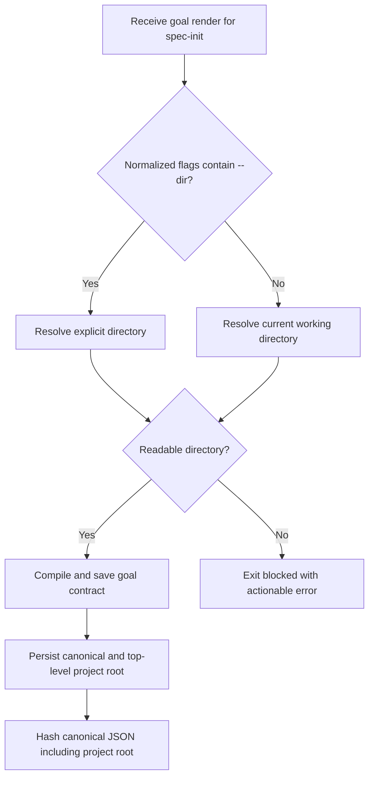
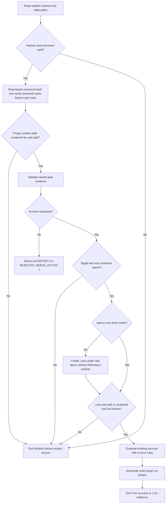
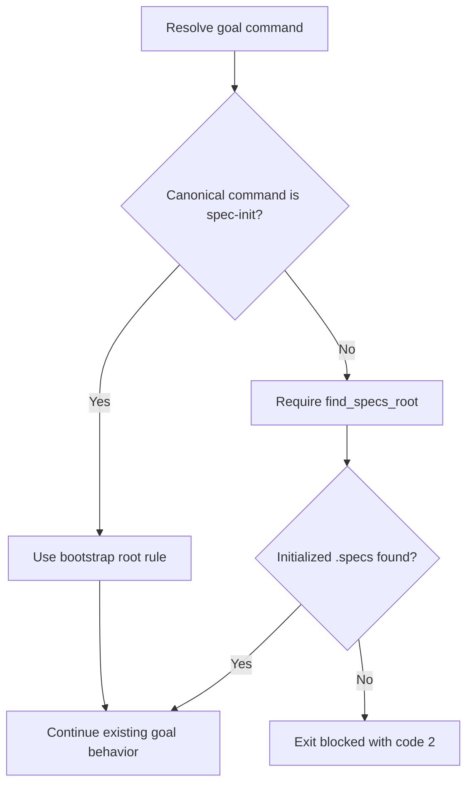

# Feature Spec: Spec Init Goal Bootstrap

- **Feature:** Spec Init Goal Bootstrap
- **Branch:** `main`
- **Date:** 2026-09-04
- **Status:** Implemented
- **Input:** Permit `spec-init` goal bootstrap before `.specs` exists: goal render, prove, and archive resolve the fresh project root from `--dir` when supplied, otherwise from the current working directory; every non-`spec-init` goal command remains strict about requiring an initialized `.specs` root. Add regression tests for fresh render/prove/archive, `--dir` precedence, and strict non-init behavior.
- **Feature Number:** 076
- **Surfaces:** non-UI CLI framework

## User Scenarios & Testing

### Story 1 - Render a `spec-init` goal in a fresh project `P1`

**As a** LiveSpec command executor, **I want** to render the `spec-init` goal before the target project contains `.specs`, **so that** initialization can honor its mandatory goal lock without requiring the result of initialization as a precondition.

**Priority reason:** The current circular prerequisite blocks every contract-compliant first initialization.

**Independent test:** From a temporary directory without `.specs`, render and save the `spec-init` goal, then assert exit code 0, readable contract/state files, and a project-local contract compiled from that directory.

```gherkin
Feature: Fresh project goal rendering
  Scenario: Current working directory bootstraps spec-init
    Given the current working directory is a readable project directory without .specs
    And no --dir flag is present in the spec-init active flags
    When livespec goal render spec-init --flags "--auto" --save runs
    Then the command exits with code 0
    And it prints readable contract and state file paths under the temporary goal directory
    And the contract persists the canonical current working directory as its project root

  Scenario: Explicit directory takes precedence over the caller directory
    Given the caller directory and the --dir target are different readable directories
    And neither directory contains .specs
    When livespec goal render spec-init --flags "--auto --dir /target/project" --save runs
    Then the command exits with code 0
    And the contract persists /target/project as its canonical project root
    And project conventions are not borrowed from the caller directory

  Scenario Outline: Accepted directory grammar selects one canonical root
    Given render starts in <caller>
    And <target_state>
    When livespec goal render spec-init receives <flags>
    Then the command exits with code 0
    And canonical.project_root and the top-level project_root equal <expected_root>
    And normalized_flags contains at most one canonical --dir=<expected_root> token
    And no .specs directory is created

    Examples:
      | caller | target_state | flags | expected_root |
      | /caller | /caller is a readable fresh directory | --flags "--auto" --save | /caller |
      | /caller | ./target is a readable fresh directory | --flags "--dir ./target" --save | /caller/target |
      | /caller | /target/project is a readable fresh directory | --flags "-D=/target/project" --save | /target/project |
      | /caller | /target/project is a readable fresh directory | --flags "--dir /target/project -D=/target/project" --save | /target/project |
      | /caller | /caller/child has an initialized ancestor but no local .specs | --flags "--dir child" --save | /caller/child |
      | /caller | /other is readable | --flags "prefix--dir /other" --save | /caller |
      | /caller | /other is readable | --flags "--directory /other" --save | /caller |
      | /caller | /other is readable | --flags "-- --dir /other" --save | /caller |

  Scenario Outline: Invalid explicit bootstrap target fails before writing
    Given the current working directory is readable and has no .specs directory
    When livespec goal render spec-init receives <flags>
    Then the command exits with code 2
    And stderr contains one goal blocked diagnostic with <reason>
    And no contract, state, target path, or .specs directory is created
    And stderr contains no Traceback

    Examples:
      | flags | reason |
      | --flags "--dir" --save | missing directory value |
      | --flags "-D=" --save | missing directory value |
      | --flags "--dir /one -D /two" --save | conflicting directory values |
      | --flags "--dir /missing/project" --save | target does not exist |
      | --flags "-D /target/file" --save | target is not a directory |
      | --flags "--dir /unreadable/project" --save | target is not readable |
      | --flags "--dir /looping/link" --save | target cannot be resolved |
```



### Story 2 - Prove and archive the bootstrap goal against the invocation-selected project `P1`

**As a** LiveSpec command executor, **I want** goal proof and archival to use the immutable render-time project root, **so that** relative evidence and the final run artifact cannot be redirected by a later working-directory change.

**Priority reason:** Rendering alone is insufficient because the enforced goal cannot complete unless proof and archival resolve the same target.

**Independent test:** Render a `spec-init` contract for a fresh target, change cwd, prove a task using target-relative evidence, create the target `.specs` tree, and verify success, drift, error, and blocked archive outcomes remain attached to the persisted render-time root.

```gherkin
Feature: Bootstrap goal proof and archival
  Scenario: Proof resolves relative evidence from explicit dir
    Given a saved spec-init goal contract whose normalized flags contain --dir for a fresh target
    And the caller directory is a different initialized LiveSpec project
    When livespec goal prove submits a valid project-relative artifact for a pending task
    Then proof validation resolves the artifact from the explicit target
    And the caller project's artifacts cannot satisfy the target task

  Scenario Outline: Proof preserves accepted and insufficient-evidence outcomes
    Given a paired spec-init contract and state with an incomplete named task
    And the canonical project root is readable
    When goal prove receives <evidence>
    Then stdout contains <result>
    And the command exits with code <exit_code>
    And only the named task may change state

    Examples:
      | evidence | result | exit_code |
      | all required evidence for the named task | ACCEPTED | 0 |
      | incomplete but well-formed task evidence | REJECTED_NEEDS_ACTION | 1 |

  Scenario Outline: Invalid contract and state pairing fails before project access
    Given a valid paired spec-init contract and state
    And exactly one <mutation> is applied
    When <operation> validates the explicit pair
    Then text-mode stdout is empty
    And goal archive --json instead writes exactly one JSON object with outcome blocked and the same reason to stdout
    And stderr contains one <blocked_prefix> diagnostic
    And the command exits with code 2
    And <no_mutation> remains true

    Examples:
      | operation | mutation | blocked_prefix | no_mutation |
      | goal prove | the contract argument is omitted | goal prove blocked: | the state file is byte-identical and no project path is accessed |
      | goal prove | the contract path is the empty string | goal prove blocked: | the state file is byte-identical and no project path is accessed |
      | goal prove | the contract file is unreadable | goal prove blocked: | the state file is byte-identical and no project path is accessed |
      | goal prove | the state argument is omitted | goal prove blocked: | the state file is byte-identical and no project path is accessed |
      | goal prove | the state path is the empty string | goal prove blocked: | the state file is byte-identical and no project path is accessed |
      | goal prove | the state file is unreadable | goal prove blocked: | the state file is byte-identical and no project path is accessed |
      | goal archive | the contract argument is omitted | goal archive blocked: | the state file and project tree are byte-identical |
      | goal archive | the contract path is the empty string | goal archive blocked: | the state file and project tree are byte-identical |
      | goal archive | the contract file is unreadable | goal archive blocked: | the state file and project tree are byte-identical |
      | goal archive | the state argument is omitted | goal archive blocked: | the state file and project tree are byte-identical |
      | goal archive | the state path is the empty string | goal archive blocked: | the state file and project tree are byte-identical |
      | goal archive | the state file is unreadable | goal archive blocked: | the state file and project tree are byte-identical |
      | goal prove | the contract JSON is malformed | goal prove blocked: | the state file is byte-identical and no project path is accessed |
      | goal prove | one required contract schema field is removed | goal prove blocked: | the state file is byte-identical and no project path is accessed |
      | goal prove | the state JSON is malformed | goal prove blocked: | the state file is byte-identical and no project path is accessed |
      | goal prove | one required state schema field is removed | goal prove blocked: | the state file is byte-identical and no project path is accessed |
      | goal archive | the contract JSON is malformed | goal archive blocked: | the state file and project tree are byte-identical |
      | goal archive | one required contract schema field is removed | goal archive blocked: | the state file and project tree are byte-identical |
      | goal archive | the state JSON is malformed | goal archive blocked: | the state file and project tree are byte-identical |
      | goal archive | one required state schema field is removed | goal archive blocked: | the state file and project tree are byte-identical |
      | goal prove | contract.schema_version differs from canonical.schema_version | goal prove blocked: | the state file is byte-identical and no project path is accessed |
      | goal prove | contract.command differs from canonical.command | goal prove blocked: | the state file is byte-identical and no project path is accessed |
      | goal prove | contract.feature differs from canonical.feature | goal prove blocked: | the state file is byte-identical and no project path is accessed |
      | goal prove | contract.project_root differs from canonical.project_root | goal prove blocked: | the state file is byte-identical and no project path is accessed |
      | goal prove | contract.normalized_flags differs from canonical.normalized_flags | goal prove blocked: | the state file is byte-identical and no project path is accessed |
      | goal prove | contract.tasks differs from canonical.tasks | goal prove blocked: | the state file is byte-identical and no project path is accessed |
      | goal archive | contract.schema_version differs from canonical.schema_version | goal archive blocked: | the state file and project tree are byte-identical |
      | goal archive | contract.command differs from canonical.command | goal archive blocked: | the state file and project tree are byte-identical |
      | goal archive | contract.feature differs from canonical.feature | goal archive blocked: | the state file and project tree are byte-identical |
      | goal archive | contract.project_root differs from canonical.project_root | goal archive blocked: | the state file and project tree are byte-identical |
      | goal archive | contract.normalized_flags differs from canonical.normalized_flags | goal archive blocked: | the state file and project tree are byte-identical |
      | goal archive | contract.tasks differs from canonical.tasks | goal archive blocked: | the state file and project tree are byte-identical |
      | goal prove | canonical_json is malformed JSON | goal prove blocked: | the state file is byte-identical and no project path is accessed |
      | goal prove | canonical_json parses to a value different from canonical | goal prove blocked: | the state file is byte-identical and no project path is accessed |
      | goal prove | sha256 of canonical_json differs from contract.goal_hash | goal prove blocked: | the state file is byte-identical and no project path is accessed |
      | goal prove | state.goal_hash differs from contract.goal_hash | goal prove blocked: | the state file is byte-identical and no project path is accessed |
      | goal archive | canonical_json is malformed JSON | goal archive blocked: | the state file and project tree are byte-identical |
      | goal archive | canonical_json parses to a value different from canonical | goal archive blocked: | the state file and project tree are byte-identical |
      | goal archive | sha256 of canonical_json differs from contract.goal_hash | goal archive blocked: | the state file and project tree are byte-identical |
      | goal archive | state.goal_hash differs from contract.goal_hash | goal archive blocked: | the state file and project tree are byte-identical |
      | goal prove | state.schema_version differs from contract.schema_version | goal prove blocked: | the state file is byte-identical and no project path is accessed |
      | goal prove | state.command differs from canonical.command | goal prove blocked: | the state file is byte-identical and no project path is accessed |
      | goal prove | the state task key set differs from canonical task ids | goal prove blocked: | the state file is byte-identical and no project path is accessed |
      | goal prove | one state task ordinal differs from its canonical task ordinal | goal prove blocked: | the state file is byte-identical and no project path is accessed |
      | goal prove | one state task description differs from its canonical task description | goal prove blocked: | the state file is byte-identical and no project path is accessed |
      | goal archive | state.schema_version differs from contract.schema_version | goal archive blocked: | the state file and project tree are byte-identical |
      | goal archive | state.command differs from canonical.command | goal archive blocked: | the state file and project tree are byte-identical |
      | goal archive | the state task key set differs from canonical task ids | goal archive blocked: | the state file and project tree are byte-identical |
      | goal archive | one state task ordinal differs from its canonical task ordinal | goal archive blocked: | the state file and project tree are byte-identical |
      | goal archive | one state task description differs from its canonical task description | goal archive blocked: | the state file and project tree are byte-identical |
      | goal archive | the explicit feature differs from canonical.feature | goal archive blocked: | the state file and project tree are byte-identical |
      | goal prove | canonical.project_root is removed from a legacy contract | goal prove blocked: | the state file is byte-identical and no project path is accessed |
      | goal archive | canonical.project_root is removed from a legacy contract | goal archive blocked: | the state file and project tree are byte-identical |

  Scenario: Archive JSON mode preserves its blocked envelope
    Given a valid paired spec-init contract and state
    And the contract goal hash is changed without updating canonical_json or state
    When goal archive validates the explicit pair with --json
    Then stdout contains exactly one JSON object with outcome blocked and a non-empty reason
    And stderr contains one goal archive blocked diagnostic with the same reason
    And the command exits with code 2
    And the state file and project tree are byte-identical

  Scenario Outline: Proof effects for a pending task are closed and deterministic
    Given a valid paired spec-init contract and state
    And the named task is pending with <accepted_before>
    And <other_tasks>
    When goal prove returns <proof_result> for the named task
    Then the named task has <task_after>
    And the top-level state has <state_after>
    And <audit_effect> is the only additional mutable effect

    Examples:
      | accepted_before | other_tasks | proof_result | task_after | state_after | audit_effect |
      | accepted_evidence null | at least one other task is pending | ACCEPTED | status complete | status active | one ACCEPTED attempt is appended, accepted_evidence is set to B, and last_rejection is cleared |
      | accepted_evidence null | every other task is complete | ACCEPTED | status complete | status complete | one ACCEPTED attempt is appended, accepted_evidence is set to B, and last_rejection is cleared |
      | accepted_evidence A retained after an earlier complete to rejected re-proof | every other task is complete | ACCEPTED | status complete | status complete | one ACCEPTED attempt is appended, accepted_evidence is replaced by B, and last_rejection is cleared |
      | accepted_evidence null | every other task is complete | REJECTED_NEEDS_ACTION | status pending | status active | one rejected attempt is appended, last_rejection is set, and accepted_evidence stays null |
      | accepted_evidence A retained after an earlier complete to rejected re-proof | every other task is complete | REJECTED_NEEDS_ACTION | status pending | status active | one rejected attempt is appended, last_rejection is set, and accepted_evidence A is retained |

  Scenario Outline: Re-proving a complete task preserves the existing proof contract
    Given a valid paired spec-init contract and state
    And the named task is complete with accepted evidence A
    And <other_tasks>
    When goal prove receives <evidence>
    Then stdout contains <result>
    And the command exits with code <exit_code>
    And the named task has <task_after>
    And the top-level state has <state_after>
    And <audit_effect> is the only additional mutable effect

    Examples:
      | other_tasks | evidence | result | exit_code | task_after | state_after | audit_effect |
      | every other task is complete | complete evidence B | ACCEPTED | 0 | status complete | status complete | one ACCEPTED attempt is appended, accepted_evidence is replaced by B, and last_rejection is cleared |
      | at least one other task is pending | complete evidence B | ACCEPTED | 0 | status complete | status active | one ACCEPTED attempt is appended, accepted_evidence is replaced by B, and last_rejection is cleared |
      | every other task is complete | incomplete but well-formed evidence B | REJECTED_NEEDS_ACTION | 1 | status pending | status active | one rejected attempt is appended, last_rejection is set, and accepted_evidence A is retained |
      | at least one other task is pending | incomplete but well-formed evidence B | REJECTED_NEEDS_ACTION | 1 | status pending | status active | one rejected attempt is appended, last_rejection is set, and accepted_evidence A is retained |

  Scenario Outline: Invalid state status is rejected without rewriting the state file
    Given a valid paired spec-init contract and state
    And exactly one <status_defect> is applied
    When <operation> validates the explicit pair
    Then text-mode stdout is empty
    And goal archive --json instead writes exactly one JSON object with outcome blocked and the same reason to stdout
    And stderr contains one <blocked_prefix> diagnostic
    And the command exits with code 2
    And the state file and project tree are byte-identical

    Examples:
      | operation | status_defect | blocked_prefix |
      | goal prove | state.status is neither active nor complete | goal prove blocked: |
      | goal prove | state.status is complete while a task is pending | goal prove blocked: |
      | goal prove | state.status is active while every task is complete | goal prove blocked: |
      | goal prove | one task status is neither pending nor complete | goal prove blocked: |
      | goal archive | state.status is neither active nor complete | goal archive blocked: |
      | goal archive | state.status is complete while a task is pending | goal archive blocked: |
      | goal archive | state.status is active while every task is complete | goal archive blocked: |
      | goal archive | one task status is neither pending nor complete | goal archive blocked: |

  Scenario: Archive stays attached to the fresh target
    Given a spec-init goal was rendered from a fresh target without an explicit --dir flag
    And spec-init has since created the target .specs directory
    And the caller changes to a different working directory
    When livespec goal archive runs with the saved contract and state
    Then the run artifact is created under the target .specs/.runs directory
    And no run artifact is created in another project

  Scenario: Archive safely creates a missing runs directory
    Given a valid paired spec-init contract and state with outcome success
    And the canonical target contains a real .specs directory
    And the target has no .specs/.runs entry
    When livespec goal archive runs after the caller changes working directory
    Then .specs/.runs is created without following an external symlink
    And its real path is verified inside project_root before the atomic write
    And the command writes one run artifact and exits with code 0

  Scenario Outline: Initialized target preserves existing archive outcomes
    Given a valid paired spec-init contract and state
    And the canonical target contains a real .specs directory
    And .specs/.runs is absent or resolves inside project_root
    And the evaluated run outcome is <outcome>
    When livespec goal archive runs with wrapped exit code <wrapped_exit>
    Then the command exits with code <archive_exit>
    And one run artifact is atomically written under the canonical target
    And the artifact records outcome <outcome>

    Examples:
      | outcome | wrapped_exit | archive_exit |
      | success | 0 | 0 |
      | drift | 0 | 1 |
      | error | 1 | 1 |

  Scenario: Archive before initialization stays blocked
    Given a valid paired spec-init contract and state
    And the canonical target has no .specs directory
    When livespec goal archive runs
    Then the command exits with code 2
    And stderr contains one goal archive blocked diagnostic
    And no .specs directory or run artifact is created

  Scenario Outline: Project artifact escape is rejected
    Given a valid paired spec-init contract and state
    And <input_class> uses <path_class>
    When <operation> resolves the path by real path
    Then the command exits with code 2
    And stderr contains one <blocked_prefix> diagnostic
    And no state task or run artifact is written

    Examples:
      | operation | input_class | path_class | blocked_prefix |
      | goal prove | task evidence artifact | an absolute path outside project_root | goal prove blocked: |
      | goal prove | task evidence artifact | a relative path containing .. that escapes project_root | goal prove blocked: |
      | goal prove | task evidence artifact | a symlink inside project_root whose target is outside project_root | goal prove blocked: |
      | goal prove | task evidence artifact | a broken evidence symlink | goal prove blocked: |
      | goal prove | task receipt artifact | a symlink inside project_root whose target is outside project_root | goal prove blocked: |
      | goal prove | project artifact path referenced by an external --evidence JSON file | an absolute path outside project_root | goal prove blocked: |
      | goal prove | project artifact path referenced by an external --evidence JSON file | a relative path containing .. that escapes project_root | goal prove blocked: |
      | goal prove | project artifact path referenced by an external --evidence JSON file | a symlink inside project_root whose target is outside project_root | goal prove blocked: |
      | goal prove | project artifact path referenced by an external --evidence JSON file | a broken evidence symlink | goal prove blocked: |
      | goal archive | run destination | an existing broken .specs/.runs symlink | goal archive blocked: |
      | goal archive | run destination | an existing .specs/.runs symlink whose target is outside project_root | goal archive blocked: |

  Scenario Outline: External control-plane inputs retain existing compatibility
    Given a valid paired spec-init contract and state rooted in /target/project
    And <input_class> is a readable regular file outside project_root
    When <operation> consumes that explicit control-plane input
    Then the file is accepted under its existing type readability and size rules
    And project evidence and the run destination remain confined to project_root

    Examples:
      | operation | input_class |
      | goal prove | contract file under the temporary goal directory |
      | goal prove | state file under the temporary goal directory |
      | goal prove | evidence JSON file passed through --evidence |
      | goal archive | contract file under the temporary goal directory |
      | goal archive | state file under the temporary goal directory |
      | goal archive | stdout transcript file under the temporary goal directory |
      | goal archive | stderr transcript file under the temporary goal directory |

  Scenario Outline: Render-time symlink target remains authoritative
    Given --dir names a symlink to a readable fresh target
    And render persists the symlink's canonical real target as project_root
    When the original symlink is later retargeted before <operation>
    Then <operation> continues using the persisted real target
    And the new symlink target is never accessed

    Examples:
      | operation |
      | goal prove |
      | goal archive |
```



### Story 3 - Preserve strict roots for every other command `P1`

**As a** LiveSpec maintainer, **I want** the bootstrap exception to apply only to `spec-init`, **so that** all established commands continue to reject accidental execution outside an initialized LiveSpec project.

**Priority reason:** A broad fallback to the current directory would weaken the global project-boundary guarantee and could validate or write against the wrong repository.

**Independent test:** Parameterize render, prove, and archive with a non-`spec-init` command from a directory without `.specs`; assert each exits blocked and creates no project artifact.

```gherkin
Feature: Strict non-init goal roots
  Scenario Outline: Non-init goal operations outside LiveSpec remain blocked
    Given the current working directory has no .specs directory
    And a valid saved non-spec-init pair exists when <operation> requires it
    When the <operation> goal operation runs for spec-plan
    Then the command exits with code 2
    And the error identifies the missing initialized .specs root
    And no contract, state mutation, project read, or run artifact occurs

    Examples:
      | operation |
      | render |
      | prove |
      | archive |

  Scenario Outline: Foreign bootstrap flags do not relax non-init operations
    Given a saved non-spec-init contract contains a --dir-shaped flag value
    And the current working directory has no .specs directory
    When <operation> resolves the project root
    Then the command remains blocked by the initialized .specs requirement
    And no artifact is read from or written to the uninitialized directory

    Examples:
      | operation |
      | goal prove |
      | goal archive |
```



## Acceptance Criteria

### AC-001

From a readable cwd without `.specs`, `livespec goal render spec-init --flags "--auto" --save` exits 0, prints `hash:<sha256> | contract-file:$TMPDIR/livespec-goals/goal-spec-init-<hash8>.contract.json | state-file:$TMPDIR/livespec-goals/goal-spec-init-<hash8>.state.json`, persists the canonical cwd as `project_root` in the immutable contract and its hash input, and does not create `.specs`.
### AC-002

For `spec-init`, the grammar table below selects one canonical explicit target instead of cwd; `canonical.conventions` is derived from target files only. Repeated identical values are accepted once and conflicting values are rejected.
### AC-003

A malformed, missing, nonexistent, unresolvable, or non-directory target exits 2 before contract/state creation, writes one stderr diagnostic beginning `goal blocked:` with the target or grammar reason and recovery, contains no `Traceback`, and creates no new path below caller, target, or `$TMPDIR/livespec-goals`.
### AC-004

Before project access, prove/archive require explicit readable JSON inputs and validate every atomic row in the pairing matrix: required schema/types; `canonical_json` parses exactly to `canonical`; `sha256(canonical_json) == contract.goal_hash == state.goal_hash`; each immutable contract mirror (`schema_version`, `command`, `feature`, `project_root`, `normalized_flags`, ordered `tasks`) equals its `canonical.*` value; `state.schema_version == contract.schema_version`; `state.command == canonical.command == "spec-init"`; state task keys plus immutable `ordinal` and `description` equal the canonical ordered tasks; and any explicit archive feature is absent or equals `canonical.feature`. `state.status` admits only `active` and `complete`; a task status admits only `pending` and `complete`; `active` is valid iff at least one task is pending, and `complete` is valid iff every task is complete. Any pairing or status failure, including a legacy rootless contract, exits 2, emits one operation-specific blocked diagnostic on stderr, exposes no traceback, accesses no project path, and preserves the state file and project tree byte-for-byte. Text mode emits no stdout; `goal archive --json` preserves the existing machine contract by emitting exactly one JSON object with `outcome: "blocked"` and the same non-empty reason on stdout.
### AC-005

With a valid `spec-init` pair, `livespec goal prove --contract <contract> --state <state> --task <id> --evidence <json-or-path>` accepts either inline evidence JSON or an explicit readable JSON file outside `project_root`, then resolves every project-artifact path inside the payload against the immutable real `project_root`. For a pending task, complete evidence B prints `ACCEPTED`, exits 0, appends one accepted attempt, changes only the named task to `complete`, sets or replaces its `accepted_evidence` with B, clears its `last_rejection`, and derives top-level `state.status` as `active` when another task remains pending or `complete` when every task is complete. Insufficient but well-formed evidence prints `REJECTED_NEEDS_ACTION`, exits 1, keeps the task `pending` and state `active`, appends one rejected attempt, sets `last_rejection`, and leaves `accepted_evidence` unchanged: it remains null if the task has never been accepted, or remains A if A was retained when an earlier rejected re-proof moved the task from `complete` to `pending`. Re-proving an already complete task preserves current proof semantics: complete evidence B prints `ACCEPTED`, exits 0, appends an accepted attempt, keeps the named task complete, replaces accepted evidence A with B, clears the last rejection, and derives global state as `active` when another task is pending or `complete` when all tasks are complete; incomplete evidence B prints `REJECTED_NEEDS_ACTION`, exits 1, appends a rejected attempt, changes the named task to `pending` and the derived state to `active`, retains accepted evidence A, and sets the last rejection. No other task changes. Malformed, mismatched, status-invalid, or escaping `spec-init` input prints one `goal prove blocked:` diagnostic, exits 2, and leaves state and project bytes unchanged.
### AC-006

With a valid pair and a real contained `<project_root>/.specs`, archive preserves existing outcome semantics: complete/success exits 0, drift or error exits 1, and each atomically writes `<project_root>/.specs/.runs/spec-init-<ISO-fs>-<hash8>.json` with matching command, hash, feature, and outcome; if `.runs` is absent it is created safely and its real path is checked for containment before writing; an existing broken or escaping `.runs` symlink blocks with exit 2 and no write. Other blocked input also exits 2 and writes nothing.
### AC-007

Archiving while the invocation-selected target lacks `.specs` exits 2, writes one `goal archive blocked:` diagnostic, and leaves target `.specs` and `.specs/.runs` absent. In a fixture with no initialized ancestor, parameterized non-`spec-init` render, prove, and archive cases retain strict `find_specs_root` behavior, exit 2 with `goal blocked: .specs/ directory not found from <cwd>`, and create/read no project artifact; `--dir`-shaped flags never relax this rule.
### AC-008

Tests cover with zero failures every Gherkin example row and this matrix: render `{cwd, relative/absolute --dir, relative/absolute -D, identical/conflicting duplicates, missing/empty/unreadable/non-directory/unresolvable targets, ignored lookalikes, tokens after --, initialized ancestor}`, prove `{persisted cwd root, persisted explicit root, inline evidence JSON, external evidence JSON file, pending accepted/rejected evidence with accepted_evidence null, pending accepted/rejected evidence with accepted_evidence A retained after complete to rejected, complete-task accepted/rejected re-proof while every other task is complete, complete-task accepted/rejected re-proof while another task is pending}` after cwd change, archive `{before .specs, after .specs before .runs, after .runs, blocked --json envelope}` after cwd change, every atomic AC-004 contract mirror/state pairing/status defect, every AC-009 path class, and strict non-init `{render, prove, archive, existing proof outcomes}`; existing initialized-project goal tests remain green.
### AC-009

For a `spec-init` contract, path classes remain distinct: explicit contract/state, explicit evidence JSON files passed through `--evidence`, and optional transcript files may remain readable control-plane inputs outside the project under their existing type/readability/size rules. That permission applies only to the external control-plane file itself: every project artifact or receipt path contained in its parsed evidence payload is resolved by real path and must be contained in canonical `project_root`, exactly like inline evidence. Archive requires a real contained `.specs`, may create an absent `.runs` without following a symlink, then must verify the resulting `.runs` real path is contained before writing. Absolute escape, `..` escape, broken evidence symlink, symlink escape, or an existing broken/escaped `.runs` symlink exits 2 without a partial write. If render canonicalized a `--dir` symlink, later retargeting that original symlink never changes the persisted real root. Non-`spec-init` proof and archive keep their existing path-evidence classification and output/exit/mutation semantics; this feature changes only their unchanged strict initialized-root gate.
### AC-010

Prove/archive never discover contract or state implicitly. Zero, unreadable, malformed, hash-mismatched, root-mismatched, command-mismatched, task-mismatched, status-invalid, feature-conflicting, or legacy rootless inputs exit 2 before project access, preserve the state file and project tree byte-for-byte, and instruct the caller to rerender the goal; deletion and recreation of a directory at the same already-canonical path is not claimed detectable by this feature.

## Functional Requirements

- **FR-001:** Root selection MUST be conditional on the canonical goal command and MUST recognize only `spec-init` as bootstrap-capable. Maps to AC-001 and AC-007.
- **FR-002:** `spec-init` rendering MUST parse the grammar table deterministically, canonicalize one valid target, prefer it over cwd, accept identical duplicates once, and reject malformed or conflicting values. Maps to AC-002 and AC-003.
- **FR-003:** Rendering MUST persist the canonical selected `project_root` in both `canonical` and the mirrored top-level contract fields, include it in `canonical_json` and goal hashing, and create no `.specs`. Maps to AC-001, AC-002, and AC-004.
- **FR-004:** Goal proof MUST require explicit contract/state paths, apply every atomic AC-004 pairing and status check before project access, preserve the state file byte-for-byte on validation failure, use the immutable contract root regardless of proof-time cwd, and preserve the AC-005 output/exit/mutation contract. Maps to AC-004, AC-005, and AC-010.
- **FR-005:** Goal archive MUST require explicit contract/state paths, apply every AC-004 pairing check before project access, use the immutable contract root, require `.specs` before its atomic run-artifact write, and preserve success/drift/error/blocked outcomes. Maps to AC-004, AC-006, AC-007, and AC-010.
- **FR-006:** Every non-`spec-init` goal operation MUST retain the existing strict initialized-root resolution path and existing proof/archive path-evidence classification, output, exit, and mutation semantics. Maps to AC-007, AC-008, and AC-009.
- **FR-007:** Bootstrap root failures MUST use the existing formatted blocked CLI boundary with exit code 2 and MUST NOT expose a traceback or mutate the project. Maps to AC-003 and AC-006.
- **FR-008:** Automated regression coverage MUST exercise the complete AC-008 operation/context matrix. Maps to AC-008.
- **FR-009:** Convention loading during render MUST use only the selected target root. Maps to AC-002.
- **FR-010:** Proof MUST enforce the closed status sets and the exact pending-task and complete-task proof transitions in AC-004/AC-005; for a well-formed proof result it may mutate only the named task's `status`, append-only `attempts`, `accepted_evidence`, and `last_rejection`, plus the derived top-level `state.status`. Archive MUST preserve artifact command/hash/feature/outcome identity and MUST NOT mutate state. Maps to AC-004, AC-005, and AC-006.
- **FR-011:** For a `spec-init` contract, project evidence/receipt paths and the run destination MUST remain inside the canonical root after real-path and symlink resolution, including project paths parsed from an external `--evidence` JSON file. The external evidence file itself, explicit contract/state files, and transcript files retain their existing control-plane contract and may be outside the project subject to their type/readability/size rules. Maps to AC-005 and AC-009.
- **FR-012:** Legacy or malformed bootstrap contracts without a trustworthy root binding MUST fail closed and require rerendering. Maps to AC-010.

### Directory Flag Grammar

| Source form in `--flags` | Result |
|---|---|
| `--dir "/path with spaces"`, `--dir=/path`, `-D "/path"`, `-D=/path` | Accept; resolve relative values against render cwd, canonicalize to one absolute root, and persist `--dir=<root>`. |
| Same canonical value repeated through either alias | Accept once. |
| Distinct canonical values through one or both aliases | Reject before write. |
| `--dir`, `-D`, `--dir=`, `-D=` | Reject as missing value. |
| `prefix--dir`, `--directory`, or tokens after literal `--` | Ignore as non-directory flags; they never grant bootstrap behavior. |
| Missing path, file path, broken/looping symlink | Reject before write. |

## Key Entities

- **Bootstrap project root:** A readable directory selected for `spec-init` before it contains a `.specs` tree.
- **Initialized project root:** A project directory containing `.specs`; it remains mandatory for every non-`spec-init` goal operation and for durable run archival.
- **Explicit directory flag:** One render-time path accepted by the grammar table and canonicalized to `--dir=<absolute-root>`.
- **Goal contract:** Immutable JSON whose canonical payload and closed top-level mirror set agree on `schema_version`, exact `command == "spec-init"`, `feature`, `project_root`, `normalized_flags`, and ordered `tasks`. Convention context, evidence rules, and other existing projections remain canonical fields but are not additional pairing mirrors. `canonical_json` and its SHA-256 bind every canonical value.
- **Goal state:** Mutable JSON whose immutable fields are `schema_version`, `command == "spec-init"`, `goal_hash`, task key set, and every task `ordinal`/`description`. Top-level `status` is derived after every accepted or rejected proof: `active` while at least one task is pending and `complete` only when all tasks are complete. Each task status admits only `pending` and `complete`; only goal proof changes it. For the named task only, `attempts` is append-only, `accepted_evidence` stores the latest accepted payload and is left unchanged by rejection, and `last_rejection` records the latest rejection or is cleared by acceptance. Therefore a task made pending by a rejected complete-task re-proof retains its earlier accepted evidence through later rejected proofs until a later acceptance replaces it. Pending-task and complete-task transitions otherwise follow AC-005. Pairing/status validation failure mutates nothing.
- **Run artifact:** The durable JSON receipt written under the selected initialized project's real contained `.specs/.runs` directory, including command, goal hash, feature, and evaluated outcome.

### Path Classes

| Class | May be outside `project_root`? | Rule |
|---|---|---|
| `--contract`, `--state` | Yes | Explicit readable control-plane JSON inputs; identity and hash are validated before project access. |
| External JSON file passed through `--evidence` | Yes | Explicit readable control-plane input; only the file may be external. Every project artifact/receipt path in its parsed payload remains confined to immutable `project_root`. |
| `--stdout-file`, `--stderr-file` | Yes | Optional readable transcript inputs retain existing type, readability, and size bounds. |
| Task evidence or receipt artifact | No | Real path must be contained in immutable `project_root`; escape blocks proof. |
| Run artifact destination | No | Require real contained `.specs`; create missing `.runs` safely, verify its real containment, and reject broken/escaped existing symlinks. |

## Edge Cases

- The caller directory is an initialized LiveSpec project while `--dir` points to a different fresh project; only the explicit target may provide conventions or evidence.
- `--dir` is present without a value, repeated with conflicting values, relative, missing, unreadable, or points to a file rather than a directory.
- The selected directory contains an initialized ancestor: bootstrap selection uses the directory itself, not ancestor discovery.
- A `spec-init` contract is rendered before `.specs` exists, then proof runs after some but not all initialization artifacts have been created.
- Archive is attempted before `.specs` exists and must not bootstrap the specification tree as a side effect.
- A non-`spec-init` contract contains arbitrary `--dir`-shaped flags that belong to its own command semantics.
- Contract or state JSON is malformed and must continue through the existing formatted blocked boundary.
- An external `--evidence` JSON file is readable outside the project, but one project-artifact path in its payload escapes the immutable root.
- Top-level `state.status` disagrees with whether any canonical task remains pending, or a task status is outside the closed `pending`/`complete` set.
- Evidence or `.specs/.runs` resolves outside the root through an absolute path, `..`, or symlink.
- The original `--dir` symlink is retargeted after render; the persisted canonical real target remains authoritative.
- A directory is deleted and recreated at the same already-canonical path; inode/device identity detection is outside this feature.

## Success Criteria

- **SC-001:** Targeted goal bootstrap tests complete with zero failures for all render, prove, archive, precedence, and strictness scenarios in AC-008.
- **SC-002:** `livespec goal render spec-init --flags "--auto" --save` exits 0 from a temporary readable directory with no `.specs` and leaves that directory unchanged.
- **SC-003:** The same render invoked from a different caller with an explicit target persists that target root, changes the goal hash relative to caller-root rendering, and uses only target convention markers.
- **SC-004:** Parameterized non-`spec-init` render, prove, and archive checks all exit 2 outside an initialized project and produce no project artifacts.
- **SC-005:** Existing goal-contract and run-artifact test suites complete with zero new failures.

## Out of Scope

- Relaxing initialized-root requirements for commands other than `spec-init`.
- Creating `.specs` from any `livespec goal` control-plane command.
- Changing goal task schemas, run-artifact schemas, command expectation contents, or evidence semantics for non-`spec-init` commands; the added root binding and path isolation are limited to the `spec-init` goal contract, while complete-task re-proof preserves the pre-existing proof behavior.
- Persisting platform-specific device/inode identity or detecting deletion and recreation at the same canonical path.
- Adding a new top-level `livespec init` CLI command.

## Quality Engineering Analysis

### Risk Classification

| Field | Classification | Rationale |
|---|---|---|
| Criticality | High | Failure prevents the mandatory goal lock for the core first-run `spec-init` workflow. |
| Blast radius | Shared | Root resolution is shared by goal render, prove, and archive across all command workflows. |
| Primary risk | Contract | An over-broad exception can silently weaken the initialized-project boundary for every other command. |
| Confidence | Medium | The expected behavior is explicit, but implementation and regression evidence do not exist at specification time. |

### Quality Dimensions and Expected Evidence

| Dimension | Applicability | Required evidence |
|---|---|---|
| Functional correctness | P0 | Deterministic CLI tests for fresh render, proof evidence resolution, and archive placement. |
| Regression risk | P0 | Parameterized non-`spec-init` strictness tests plus the existing goal-contract and run-artifact suites. |
| API/contract compatibility | P0 | CLI exit-code/output assertions plus backward-compatible failure for legacy `spec-init` contracts without root binding. |
| Data/migration integrity | P1 | The immutable goal-contract shape gains a hashed root binding; no user-data migration exists, and legacy rootless contracts fail closed with rerender guidance. |
| Security posture | P1 | Tests prove an explicit target never borrows caller conventions/evidence and no write escapes the selected target. |
| Performance/scalability | P2 | Root selection performs bounded flag parsing and filesystem checks; no benchmark is required unless implementation adds unbounded traversal. |
| Accessibility/UX | Not applicable | The feature has no graphical or interactive UI surface. |
| Observability/operability | P1 | Every invalid root produces an actionable one-line blocked message, exit code 2, and no traceback. |

### Blocking Quality Gates

- **GATE-QE-001 - Fresh bootstrap:** AC-001 through AC-007 have deterministic automated proof with zero failures, including prove exit/output semantics and archive success/drift/error/blocked outcomes.
- **GATE-QE-002 - Compatibility matrix:** Every AC-008 matrix cell passes, including parameterized non-`spec-init` render/prove/archive proof.
- **GATE-QE-003 - Evidence integrity:** Every AC-009 path-class and escape case plus every AC-010 malformed, paired, mirror-tampered, conflicting, unreadable, zero-input, and legacy case passes with exact exit/output and artifact-location assertions; prose-only success is rejected.
- **GATE-QE-004 - Scope integrity:** The implementation diff changes only `spec-init` root binding/resolution and targeted tests/spec artifacts; goal task, proof, and run-artifact schemas remain unchanged.

### Non-Functional Expectations

- Root selection is deterministic for identical canonical command, normalized flags, and current working directory.
- An explicit target is resolved to a canonical absolute directory before convention, evidence, or run-artifact access.
- Failure messages remain single-line CLI diagnostics with exit code 2 and no Python traceback.
- The bootstrap exception creates no project files; only `spec-init` owns `.specs` creation.

### Evidence Gaps and Boundaries

- **Current gap:** No implementation, test transcript, or compatibility receipt exists during Specify; GATE-QE-001 through GATE-QE-004 remain pending.
- **Review boundary:** Independent spec review checks ambiguity, completeness, and accidental contract expansion; code defect hunting belongs to implementation review.
- **Test boundary:** `/spec-test` must execute the targeted and regression suites and produce the AC/FR coverage evidence.
- **Audit boundary:** A later repository audit may inspect broader shared-runtime effects; this QE section does not replace that audit.
- **Security boundary:** Target-boundary tests cover path isolation, while vulnerability discovery remains a separate security review if implementation introduces new input parsing risks.

<!-- finalize:spec-specify:2026-09-04:14b0e052 -->

<!-- finalize:spec-implement:2026-09-04:a98e152e -->

<!-- finalize:spec-implement:2026-09-04:9e1ef40b -->

<!-- finalize:spec-test:2026-09-04:5d267080 -->

<!-- finalize:spec-test:2026-09-04:ac9f0e2b -->

<!-- finalize:spec-test:2026-09-04:b5339c37 -->

<!-- finalize:spec-test:2026-09-04:9637faa2 -->

<!-- finalize:spec-test:2026-09-04:07bc49d8 -->

<!-- finalize:spec-test:2026-09-04:128dece7 -->

<!-- finalize:spec-test:2026-09-04:c7b5977d -->

<!-- finalize:spec-test:2026-09-04:9398704c -->

<!-- finalize:spec-test:2026-09-04:43831902 -->

<!-- finalize:spec-test:2026-09-04:1faecba9 -->

<!-- finalize:spec-test:2026-09-04:79b41969 -->
