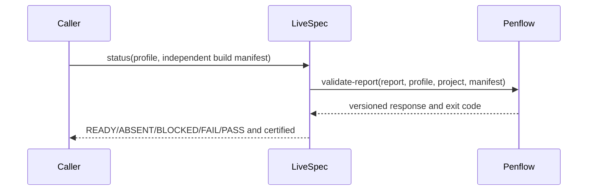

# Plan — Penflow cumulative verdict consumer

## Summary

Separate existing readiness inspection from explicit certification; delegate the latter to C51 through one subprocess boundary.

Compose source approval cumulatively: sorted governed selection plus explicit retired_features, exhaustive source and plan snapshots, and active-only projection. Snapshot.feature identifies the review trigger, never a replacement denominator. Package the actual native reviewer JSON automatically through the internal review-result command before the existing Plan Review transition; no success field is synthesized. Reuse immutable reviewed source records when semantic identity is unchanged. A new bound review sees the complete composition and prior delta; C51 evaluates all active features, and caller finalization checks membership plus every active Plan Review. All-retired produces an explicit empty retired projection. Test A then B, independent A/B closure, retirement and reactivation of A, complete retirement, omitted prior members, and missing immutable history.

## Technical Context

Existing Python 3.11+, Typer, dataclasses, subprocess, pytest, Ruff and Pyright. No new dependency or runtime launcher.

## Constitution Check

Filesystem authority, explicit errors, minimal CLI flags and provider independence preserved. Parent owns the native Codex objective; this subtask never replaces it. Report validation remains Penflow-owned.

## Interaction

```gherkin
Scenario: Revalidate through the installed producer
  Given a requested profile and current consumer inputs
  When LiveSpec invokes the installed Penflow validator
  Then only a matching recognized successful envelope can certify
```



## Implementation Plan

1. Add typed subprocess integration in validator/penflow_verification.py with explicit scope and strict wrapper acceptance.
2. Extend validator/penflow_contract.py status inputs/result, retaining inspection and project-owned checks.
3. Extend validator/cli_commands/penflow_contract_cmd.py flags and verdict/exit semantics.
4. Add tests/test_penflow_contract_verification.py and revise affected existing CLI expectations. Run real Penflow subprocess integration once C51 is available.
5. Add one lifecycle closure helper and invoke it before finalization/idempotence and terminal pipeline transitions; expose current visual classification signals without changing partial gate verdicts. Forward runner build manifest and test the lifecycle table.
6. Add the AST requirement adapter and review-snapshot/result boundary using the frozen C51 public types. On Plan Review completion, validate independent selection and semantic source identity under the existing project lock, publish baseline before phase completion, and preserve immutable prior approvals.
7. Update system/testing/penflow-contract.md, README and mappings. Coordinate shared skills separately to preserve active contract hashes.
8. Extend the existing Penflow bootstrap with the producer's consolidated ancestry schema: validate source design and its accepted source inventory, stage a bounded local immutable package, recheck source paths/bytes, then atomically publish its relative reference under the existing project lock. Preserve destination non-overwrite semantics and idempotence. Bind the package into the next real review snapshot and all subsequent cumulative approvals; resolve inherited obligations from these archived bytes, never the former source directory. Unproven historical copies remain inspectable and need authenticated import recovery before certification. No goal-infrastructure changes or new user-maintained registry.
9. Generate verification policy automatically inside the existing snapshot command from explicit metadata in every active producing plan. Archive their full bytes as one workflow, union required decisions and inherited authority, then independently recompute that union during input validation. Reject partial or ambiguous declarations; keep explicitly supplied dedicated workflows for their complete reviewed scope. Test A/B composition, attempted reduction before review, governed retirement and metadata examples without another user step.

## Testing Strategy

Baseline: 56 tests passed before changes. Parameterized protocol tests cover malformed versions (including bool), wrong profiles, contradictions, nonzero exit, absent executable, timeout and missing inputs. Public CLI tests cover readiness and explicit closure. Real installed Penflow tests validate rejection and positive acceptance with actual schema/engine, not substituted wrappers.

Bootstrap ancestry tests cover source relocation after import, cumulative retention when later features are approved, altered or missing archives, stale copied source references, concurrent source/path changes, interrupted publication and idempotent retry. An existing workspace without authentic origin is preserved and cannot silently acquire inherited certification. Exact public ancestry types are a dependency of step 8 and must be consolidated with the producer before implementation.

## Risks & Considerations

Old consumers parsing PASS during preparation must switch to READY. Certification callers explicitly select profile; no profile is inferred from missing runtime files. Runtime manifests come from build/capture runners, not HEAD. Compatible Penflow must be deployed before closure. Reports copied during handoff are revalidated. Unknown formats remain noncertifying. Preserve all unrelated goal/bootstrap modifications.
