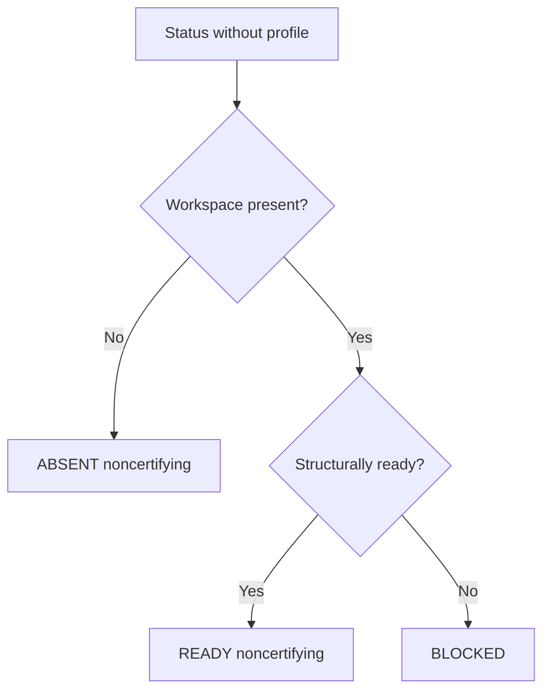
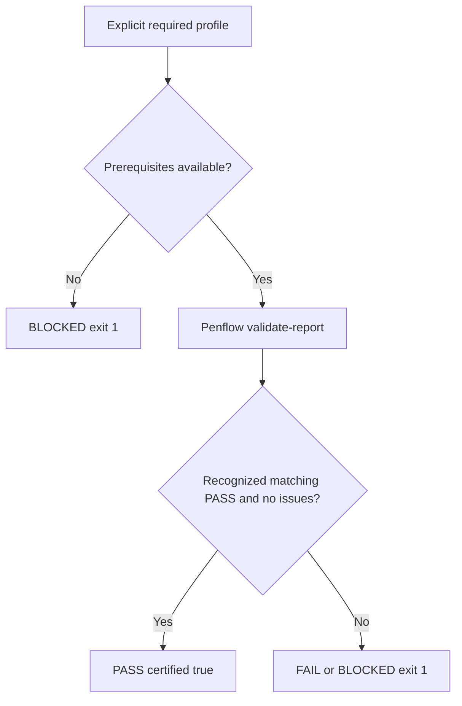
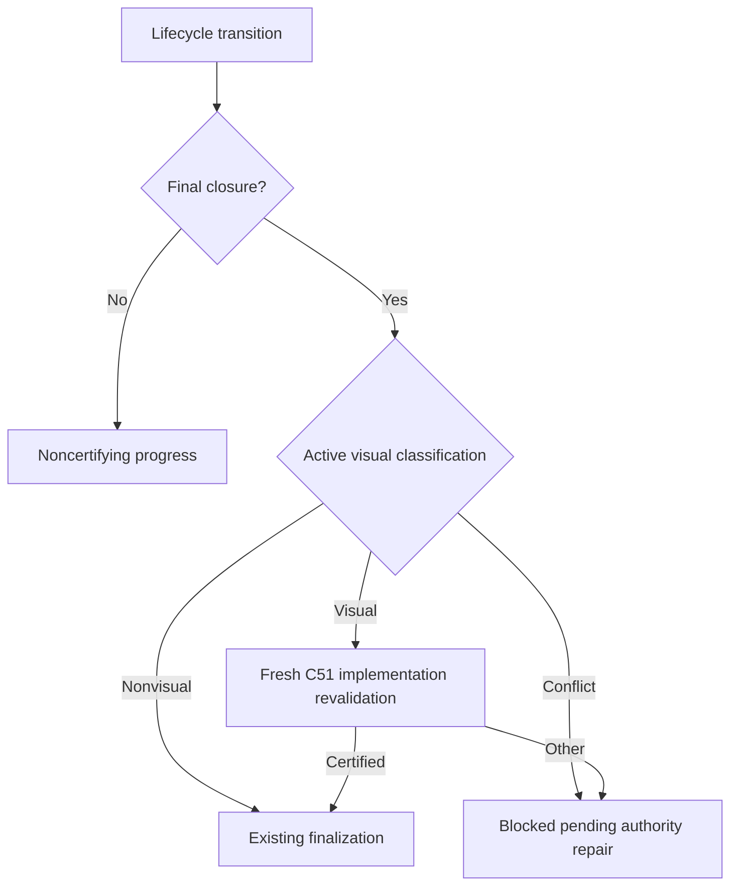
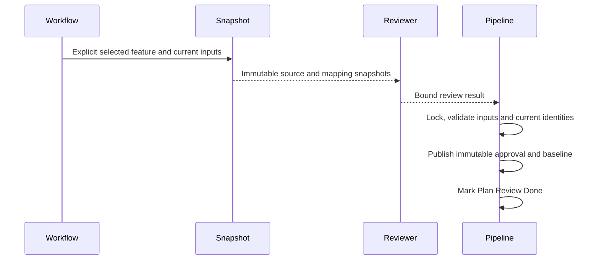
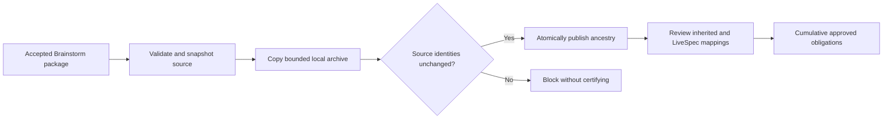
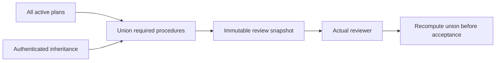

# Penflow cumulative verdict consumer

**Branch:** current-working-tree
**Date:** 2026-09-05
- **Status:** Implemented
**Input:** Integrate Penflow C51 into existing LiveSpec inspection and closure without duplicating its policy or adding a manual workflow.

## User Scenarios & Testing

### P1 — Inspect prerequisites without claiming certification

As an implementer I need to inspect unfinished inputs before generation completes.
**Independent test:** Existing valid artifacts without a final report return READY, certified false, exit 0.

```gherkin
Scenario: Inspect preparation
  Given valid legacy workspace artifacts and no certification request
  When status is inspected
  Then readiness is READY and certified is false
  And no Penflow final validation is invoked
Scenario: Inspect absent non-UI input
  Given no workspace and no certification request
  When status is inspected
  Then the verdict is ABSENT with exit 0
```



### P1 — Certify the requested stage with the authoritative engine

As a workflow caller I need a current design or implementation verdict, bound to the selected consumer.
**Independent test:** Exercise the external process protocol and installed Penflow revalidation on isolated fixtures.

```gherkin
Scenario: Certify the selected stage
  Given the caller requests design or implementation
  And implementation has an independent build manifest supplied by its runner
  When Penflow revalidates the workspace report for that profile and project
  Then LiveSpec accepts only a recognized consistent successful response
  And PASS has certified true and exit 0
Scenario Outline: Fail closed
  Given an explicit certification request
  When <failure> occurs
  Then status is noncertifying and exits 1
  Examples:
    | failure |
    | workspace or report is absent |
    | implementation build manifest is absent |
    | CLI is missing, incompatible or fails |
    | JSON response is malformed or contradictory |
    | source profile, scope or bindings are rejected |
```



### P1 — Enforce lifecycle closure without a manual extra step

As a workflow user I need finalization to reject incomplete visual work even if a caller omits a status inspection.

```gherkin
Scenario: Preparation progresses before runtime certification
  Given a visual feature has not completed runtime verification
  When preparation or coding is recorded without declaring Implemented
  Then the lifecycle remains noncertifying and can progress
Scenario: Final closure cannot omit fresh evidence
  Given a visual feature or unresolved active visual signals
  When Implemented or a completed test or terminal pipeline is requested
  Then current implementation certification and its runner manifest are required
  And replaying an existing completion revalidates the same requirement
Scenario: Nonvisual conversion respects current authority
  Given an explicit nonvisual specification and no active feature visual artifacts
  When finalization runs
  Then historical archived runs do not force visual certification
```



### P1 — Preserve the approved source denominator

As a feature owner I need review approval to bind the actual requirements, selection and outcome mapping used by certification.

```gherkin
Scenario: Review a fixed source selection
  Given the workflow selects its active feature before reviewer dispatch
  When source, plan and contract snapshots are reviewed without blocking findings
  Then Plan Review completion validates the exact reviewed inputs
  And an immutable approval and derived baseline are published before Done
Scenario: Preserve approval through normal lifecycle changes
  Given approved source snapshots and current matching requirement content
  When only lifecycle status or updated metadata changes
  Then approved semantic identity remains valid
  But changing visual scope, requirements, bindings or outcome predicates blocks certification
Scenario: Govern a reduction
  Given a prior approved source baseline
  When selected sources or requirement IDs are removed
  Then a new review must bind the immutable prior receipt and exact reduction
  And deleting selection metadata cannot certify
```



## Acceptance Criteria

- **AC-001:** Valid inspection returns READY and certified false; absent unrequired workspace returns ABSENT; invalid inspection returns BLOCKED. Inspection never emits certification PASS.
- **AC-002:** Explicit design/implementation closure delegates report validation to Penflow with the selected project root and profile; only exit 0 plus known wrapper kind/version, matching profiles, PASS, empty issues and caller-concordant report/scope/build identities certifies.
- **AC-003:** Missing workspace/report/CLI/build input, execution failure, malformed/unknown/contradictory wrapper, or rejected evidence prevents certification with exit 1.
- **AC-004:** require_actual aliases implementation and cannot weaken an explicit profile; build identity comes only from the supplied independent manifest, never report self-assertion or inferred HEAD.
- **AC-005:** Canonical bootstrap, non-overwrite semantics and LiveSpec-owned registry checks remain intact; imported reports are revalidated at their destination.
- **AC-007:** Finalization into Implemented, verification of Implemented, Test Done/Skipped and terminal pipeline success require fresh implementation certification for visual features before mutation or idempotent success. Preparation remains noncertifying. Active contradictory visual evidence blocks; explicit nonvisual work with only historical archives remains eligible.
- **AC-008:** Workflow-owned selection and a pre-dispatch snapshot bind reviewed source, plan, mapping categories and predicates. Plan Review Done validates exact review result and current semantic identity under the existing project lock, publishes immutable approval/baseline before recording completion, and supports fail-closed interrupted replay. Only lifecycle status/updated metadata is excluded from semantic identity; reductions require reviewed prior/new identity changes. Backlog outside caller selection is excluded, report-selected reductions block.
- **AC-006:** Targeted tests cover omitted evidence, transport boundaries and the real installed CLI; documentation distinguishes inspection from certification.
- **AC-009:** An imported Brainstorm origin is established by an authenticated, locally archived accepted source package bound to the LiveSpec review and cumulative approvals. Moving or removing the original source directory does not remove inherited obligations. Missing, altered or unproven origin blocks certification without deleting the inspectable workspace. Import validates source before copying and rechecks identities before atomic publication; repeating the same bootstrap is idempotent.

## Functional Requirements

- **FR-001:** Expose explicit required_profile and build_manifest inputs and noncertifying readiness (AC-001, AC-004).
- **FR-002:** Add one narrow external Penflow integration, without reproducing schema, gates or binding policy (AC-002).
- **FR-003:** Validate the versioned response envelope and fail closed on every execution or certification failure (AC-003).
- **FR-004:** Preserve consumer-root scope, bootstrap behavior and complementary LiveSpec registry requirements (AC-005).
- **FR-006:** Enforce the lifecycle table through one shared closure helper using public visual classification, with independent build-manifest forwarding and no goal infrastructure changes (AC-007).
- **FR-007:** Extract actual FR/AC definitions through Markdown AST, generate the approved projection automatically and revalidate the independently selected source approval before C51 without a second manual checklist (AC-008).
- **FR-005:** Prove the revised contract through regression tests and synchronized documentation (AC-006).
- **FR-008:** Extend the existing bootstrap to preserve reviewed Brainstorm source ancestry in bounded local archives with relative content references, carrying its obligations through subsequent LiveSpec approval revisions without a separate user-maintained registry or dependence on the old source location (AC-009).

### P1 — Retain authenticated imported obligations

```gherkin
Feature: Brainstorm source ancestry
  Scenario: Revalidate an imported project independently of its former location
    Given bootstrap authenticated and archived the accepted Brainstorm source package
    And a LiveSpec review approved its inherited obligations and current feature mappings
    When the original Brainstorm directory is moved or removed
    Then certification revalidates the local archived source and cumulative approval
    And no inherited obligation disappears because the former directory is unavailable

  Scenario: Inspect a historical copy without inventing its origin
    Given an existing copied workspace has no authenticated source package
    When the workflow requests certification of its claimed Brainstorm inheritance
    Then certification is blocked with an actionable import recovery
    And the workspace remains available for noncertifying inspection

  Scenario: Refuse a source changed during import
    Given the source package passes pre-copy validation
    When any bound source path or bytes change before publication
    Then bootstrap publishes no accepted ancestry
    And an idempotent retry requires valid current source evidence
```



## Public Contract

Invoke `penflow validate-report <workspace/run-report.json> --schema --required-profile <profile> --project <consumer-root> [--build-manifest <independent-path>] --json`.
The response kind is `penflow-verification-validation`, version integer 1, status PASS or FAIL, required_profile/profile matching the request, and issues list. Additional diagnostics are permitted. Penflow owns internal report/build schemas and current binding verification. Implementation requires the manifest path; design does not require an application build.

PASS also requires report_sha256 matching the requested raw bytes, scope.project_root/workspace matching resolved caller paths, and build_manifest null for design or matching resolved path/raw sha256 for implementation. Snapshot request identities before and after subprocess execution; changed report path/bytes or build identity blocks certification. These are transport bindings, not a second implementation of Penflow gates.

## Key Entities

Existing PenflowContractStatus plus a transient verification result. No database, new checklist or manually maintained ledger.

## Compatibility and Edge Cases

Supersedes feature051 FR-001/002/006/009 and AC-006/007/010 for final certification: old actual-only readiness and raw comparison PASS cannot certify. Feature066 canonical-first imports remain unchanged. Explicit implementation plus design conflict blocks. Mockup evidence flags remain partial visual inspection requirements; only the explicit required profile requests design certification. LiveSpec phase 0.5 remains noncertifying before FR/AC approval; certify design after approved source selection and before implementation, reusing valid mockup evidence. Shared spec-* instructions are updated only after coordination with active phase contracts.

## Quality Strategy

Risk high: false approval at a cross-project boundary. Correctness, compatibility, isolation and observability are mandatory; visual rendering is not applicable. Evidence must distinguish protocol tests from real producer verification. Missing positive integrated evidence remains an explicit limitation, never a simulated success.

## Success Criteria

- **SC-001:** Every negative protocol case fails certification.
- **SC-002:** Preparation and bootstrap work without final evidence.
- **SC-003:** No Penflow policy is reimplemented and no new user step is required.

## Lifecycle Authority

| Operation | Trigger | Requirement |
|---|---|---|
| Preparation or coding progress | No final status, no terminal pipeline | Noncertifying inspection only |
| finalize apply | Requested Implemented, or omitted status with current Implemented | Fresh implementation certification for visual scope |
| finalize verify | Current status Implemented | Fresh implementation certification for visual scope |
| pipeline update | Test Done/Skipped or all phases terminal | Fresh implementation certification for visual scope |
| pipeline next | All phases terminal | Fresh implementation certification for visual scope |

The caller forwards `--build-manifest` from the runtime runner; missing input blocks visual closure. Public classification exposes current feature-scoped signals even with visual false; closure blocks contradictions without changing the partial visual gate classification. Active design/contract/baseline/surface mappings count, historical run/check archives do not.

An explicit transition from Implemented to a nonfinal status reopens work without certification; registry PASS acknowledges that nonfinal transaction only. Reclosure and terminal pipeline success still require current certification.

Reclosure after explicit reopening must update the live status and registry row even if the same closure request left historical idempotence markers; do not duplicate historical changelog entries.

For an Implemented closure, finalization also checks the exact existing roadmap link resolved by the roadmap parser and checks that feature's item under the same project lock. Other items and examples remain unchanged. A replay repairs an unchecked matching item even when previous finalization markers exist, without duplicating changelog entries. Nonfinal status changes do not check roadmap items. This keeps the existing R1.3 verification consistent with actual finalization (FR-006, AC-007).

The writing path revalidates certification after acquiring that lock and before any registry write, so an approval published just before acquisition cannot be missed. An already-finalized return revalidates immediately before returning; the ordinary writing path performs one certification validation, not two.

## Reviewed Source Boundary

The standard producing plan declares closed `penflow_verification_policy` metadata describing its actual procedures. Before review, the existing snapshot command automatically archives the complete active plans and generates the union of their required procedures plus authenticated inheritance. If any active plan declares metadata, every active plan must declare it. A later plan cannot disable an earlier active requirement; only approved retirement changes the active union. The same union is independently recomputed during validation. Dedicated workflows may instead supply their complete real, archived procedure covering the entire reviewed scope; no implicit default or candidate C20 value supplies policy. Duplicate YAML keys at any metadata level are rejected.

```gherkin
Scenario: Preserve procedures across active plans
  Given active plan A requires native geometry and plan B declares it inapplicable
  When the workflow snapshots the cumulative review inputs
  Then geometry remains required for the combined scope
  And omitting either active plan's declaration blocks review
Scenario: Reduce procedures through approved retirement
  Given only active plan A requires geometry
  When a bound review approves retiring A while B remains active
  Then the active policy follows B and inherited requirements
  And the old approval cannot certify the reduction before review
```



The internal workflow calls `livespec penflow-contract review-snapshot --feature <slug> --json` before dispatching the reviewer. `pipeline update --phase plan-review --status done --review-result <path>` validates the structured result bound to those immutable inputs, then publishes the approved projection under the existing project lock. The exact versioned data definitions are owned by the Penflow C51 public contract. No finalization receipt or stdout PASS alone constitutes approval.

Before an active snapshot can be published, LiveSpec delegates read-only C20 validation to `penflow validate-flow-contract --require-test-ids --project <caller> --json`; absence, failure, missing selectors or changed bytes block. The existing C20 producer prepares missing deterministic identifiers before review through Penflow's public preparation operation. Review and certification never repair approved inputs. Retired historical contracts remain readable for governed withdrawal.

After receiving the actual reviewer JSON, the workflow automatically invokes `livespec penflow-contract review-result --snapshot <workflow-snapshot-path> --output <actual-reviewer-output-path> --json`. This internal assembler revalidates the current inputs, rejects missing or contradictory review fields and unknown requirement IDs, archives the original output bytes and emits the bound result path for the existing transition. It never invents a verdict, finding, producer identity or input hash. Packaging a blocking review does not approve it.

Review findings may reference current requirement IDs or IDs in the authenticated prior baseline when discussing a removal; prior IDs cannot satisfy active bindings. A warning about a removed ID may be accepted, a blocking finding still blocks, and an ID never governed is rejected.

Within authoritative FR/AC sections, definition-like paragraphs or headings beginning with FR-/AC- plus an identifier and colon must fail explicitly as unsupported syntax rather than silently shrinking the denominator. Canonical definitions remain list items or table rows. Introductions, cross-references, code, quotes and HTML examples are not definitions.

The approval transition updates the actual parsed phase status for supported two- or three-column pipeline tables. Idempotent success requires the requested status already present, never merely the phase name; row matching cannot consume adjacent lines.

Use the existing project lock and atomic writes per file: publish a valid baseline first, then mark the phase Done; interruption cannot announce completion without evidence. Retrying the same bound result is idempotent. Prior receipts and review source bytes are archived immutably before replacement. Current raw bytes are hashed for each run; semantic approval excludes only explicit lifecycle status/updated fields, never visual scope or business-state assertions.

## Governed Visual Retirement

The workspace selection accumulates previously approved features plus the current workflow feature, in canonical sorted order; Draft backlog is never scanned. Required `retired_features` records each governed retirement. The active denominator is exactly selection minus retired_features. A new review snapshots all governed specifications and plans and the complete active mapping. Its triggering feature does not replace prior membership. An unchanged approved source keeps its immutable reviewed identity across lifecycle metadata updates.

```gherkin
Scenario: Compose and retire approved features independently
  Given feature A has an approved source baseline
  When feature B completes review of the cumulative snapshot
  Then both A and B remain independently eligible for finalization
  And C51 evaluates the union of their active obligations
  When an approved revision retires A
  Then B remains active and A can close as nonvisual after cleanup
  When A is approved again as visual
  Then both active denominators are restored
Scenario: Retire the complete visual scope
  Given all governed features have approved nonvisual revisions
  When the final retirement is accepted
  Then the active projection is empty and disposition is retired
  And C51 cannot certify this as an active UI report
```

Certification requires Plan Review Done for every active feature; the consumer caller must belong to the governed selection with the requested per-feature disposition. Removing a baseline or immutable history cannot start a fresh adoption. Retired sources and plans remain governed; they cannot be silently reactivated or removed by report-selected membership.

Review snapshots, approvals and baselines carry required disposition active or retired. Retirement uses the same bound review and immutable prior history; the former contract stays archived. The reviewer can inspect artifacts still awaiting cleanup. Final nonvisual closure requires the current approved nonvisual revision and no active visual signals; deleting metadata/artifacts without that approval cannot bypass prior authority. C51 rejects retired baselines.

The existing Analyze phase envelope is accepted by the canonical phase parser, matching feature070 and the already documented pipeline; no alias or substitute archive is introduced.

<!-- finalize:spec-implement:2026-09-05:6ce4661e -->
