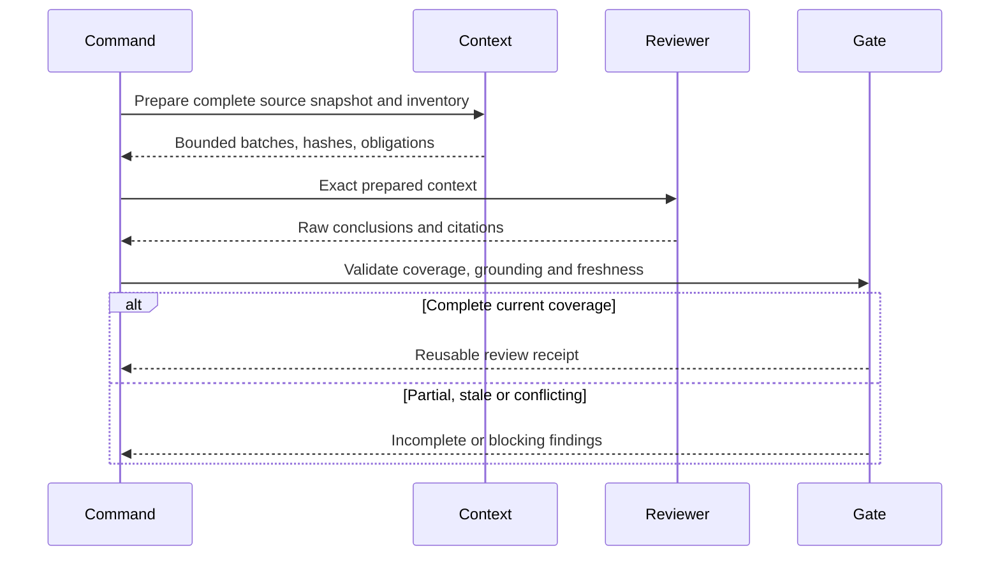
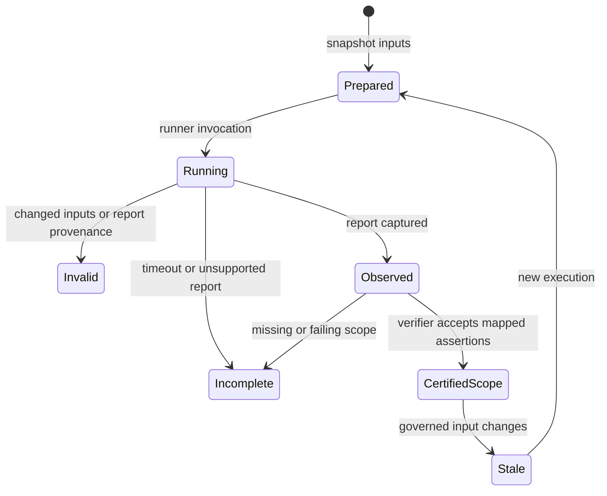

# Technical Plan: Requirement Evidence Integrity

## Summary

Implement all five axes in three lots: A complete semantic review and clarification, B execution evidence, C functional witnesses and migration. Read the approved [specification](spec.md) for the 16 FR/AC and witness contracts. Size **L**: shared command contracts, two evidence lifecycles and compatibility risk. Preserve existing commands and use generated run artifacts; no database, hosted service, extra mandatory user document or recurring review.

## Technical Context

| Aspect | Choice | Rationale |
|---|---|---|
| Runtime | Python >=3.11 | Preserve project compatibility; use stdlib hashing, subprocess and JSON |
| CLI/schema | Existing Typer and Pydantic 2 | Extend existing boundaries; strict versioned receipt parsing |
| Markdown | Existing parser/requirement extraction | Source spans and qualified identities; no parallel hand-maintained inventory |
| Review | Existing provider adapter and native reviewer | Same prepared context and validator for either transport |
| Persistence | Existing feature runs and goal archives | Immutable inputs and receipts, existing locks/atomic publication |
| Tests | pytest, Ruff, Pyright, mypy; Node/browser witnesses | Existing suites and integration levels; no new production dependency |

**Infrastructure Setup:** None. Optional local model, browser and Penflow executables are capabilities checked before their selected trials. No remote resource provisioning or new API endpoint; OpenAPI and database ER diagram are not applicable. Receipt entities are JSON files, not database tables. Framework is NON_VISUAL; UI witness executes in an isolated fixture.

## Constitution Check

| Principle | Decision |
|---|---|
| Layered validation | PASS: structural inventory remains deterministic; semantic readiness is an explicit separate result |
| Provider agnostic | PASS: provider calls remain behind call_llm; native review transports the same context/result schema |
| Filesystem authority | PASS: specs canonical, derived artifacts disposable and fingerprinted |
| Clear failures | PASS: incomplete, stale, unsupported and blocked have explicit reason/scope; no empty successful fallback |
| Minimal surface | PASS: extend existing review/check/pipeline/test/goal surfaces; generated receipts require no user editing |
| No hosted infrastructure | PASS: local isolated trials, optional existing provider capability |
| Code/test conventions | PASS: typed narrow modules, <=300 lines new module and <=50 lines new function; meaningful boundary tests |
| Compatibility | PASS: preserve preexisting 076 bootstrap/path confinement and 077 cumulative Penflow behavior; no unrelated refactor |

## Interaction and Evidence Lifecycle

```gherkin
Feature: Review consumption
  Scenario: Current complete review permits implementation
    Given every normative section and requirement has an exact reviewed identity
    When Analyze consumes the independently validated review receipt
    Then structural references and semantic conclusions are reported separately
    And implementation may start only when clarification also permits it
  Scenario: Missing context cannot disappear
    Given a section does not fit the bounded context budget
    When preparation or review cannot conclude its complete content
    Then readiness is incomplete with the affected section identity
```



```gherkin
Feature: Execution receipt lifecycle
  Scenario: Stable observed execution certifies its mapped scope
    Given the runner freezes the input manifest and starts a new invocation
    When passing mapped assertions finish with unchanged inputs
    Then an independently verified report can support execution proof
  Scenario: Concurrent source mutation invalidates the result
    Given a source, test or configuration changes during execution
    When the runner compares before and after identities
    Then the receipt is noncertifying even when every reported test passes
```



## Interface Contracts and Ownership

Implementer assigns separate owners A-review, A-gates, B-evidence and C-evaluation. The integration owner alone edits shared skills, orchestration glue, global docs/registry and existing dirty goal files; workers propose their call-site changes to that owner. New modules below are suggestions with fixed responsibilities, not justification for framework abstractions.

| Boundary | Required input/output |
|---|---|
| prepare_review_context | Project/feature, review kind, canonical source texts/paths, resolved model identity and policy versions → immutable source spans, qualified FR/AC inventory, unresolved references, batches and fingerprint |
| validate_review_result | Prepared context plus actual raw reviewer output → complete/incomplete receipt, grounded requirement dispositions, ambiguities, extra scope and diagnostics |
| evaluate_progression | Current feature + destination phase → allowed/blocked and exact missing/stale review or clarification reasons; no silent model call |
| capture_execution | Project/feature, selected command, scope manifest, report adapter, mapped acceptance assertions → runner-owned invocation directory and receipt |
| verify_execution | Receipt path + current goal/project/feature/required AC scope → independently recomputed observed coverage and unproven scope; never trust submitted success booleans |
| evaluate_witness | Witness ID, candidate path, separately frozen oracle, runtime identity, attempt/timeout policy → observed result with attempts, duration, nullable measured cost and explicit gaps |

Persist derived review data under existing feature run storage and execution/witness data under existing `.specs/.runs/` conventions. Reference those paths in existing goal evidence; do not duplicate full documents in the mutable goal state. Serialize schema/policy versions explicitly. All public dataclass/API additions use compatible defaults where legacy consumers require them; current mandatory gates reject incomplete legacy-shaped results.

### Review contract

- Qualified key is feature slug plus local FR/AC ID. Collapse repeated table/detail declarations of the same ID into one obligation retaining all source spans; conflicting duplicate definitions remain a diagnostic. Inventory includes full normative sections, Gherkin, exceptions, constitution, stack, project and referenced contracts. Resolve local references relative to source; detect cycles, missing paths and inaccessible normative references; never fetch an unpinned external contract silently.
- Keep exact UTF-8 source hashes and byte/line spans. Budget is explicit conservative characters/bytes unless the provider exposes reliable token counting; it is not advertised as exact tokens. Full fitting context uses one call. Otherwise partition at coherent section boundaries, include shared invariants and relevant cross references in every batch, and synthesize cross-batch contradictions with exhaustive batch/requirement IDs. If invariant context or an indivisible section cannot fit, return incomplete. Never truncate or summarize away normative text.
- Strict reviewer response includes submitted section IDs, per-requirement `covered|contradictory|missing|ambiguous`, source/plan citations, ambiguity findings and unapproved-scope findings. For `missing`, no invented plan citation: cite the source and searched plan section inventory. Validator checks exact excerpts against supplied spans, complete identities, no duplicates/foreign IDs, allowed dispositions and complete batch synthesis. Grounding validates provenance, not semantic truth; independent reviewer supplies that judgment.
- Cache key includes the exact governed dependency identity, review kind, actual resolved model/runtime identity, schema, prompt and policy. Apply the specification's Normative Identity v2 only to selected feature spec/plan: omit recognized complete lifecycle Status/status and Updated/updated scalar fields inside initial valid YAML and either the explicit Header section or the bounded legacy introductory H1 band ending at the next real heading/thematic break; exclude fenced examples, reject duplicate or competing metadata bands, and preserve every other byte. Keep original raw hash/bytes and exact citation spans separately; freshness equality never rewrites capture provenance. Referenced contracts remain raw-byte-bound. Unresolved default model identity is noncacheable. Partial or malformed reviews are retained as diagnostics, never reusable success. Governed source changes invalidate downstream gates by recomputation, without rewriting historical artifacts.

### Execution contract

- Distinguish existing task category (execution/DoD/injected) from new `evidence_kind=documentary|review|execution`; retain specialized requirements as additional checks. Classify semantic task purpose through explicit inventory metadata, not broad keyword guesses. Unknown runtime task cannot fall back to prose. Preserve applicability predicates: mentioning `--review-result` for UI in an always task must not require a Penflow artifact for NON_VISUAL work, and a conditional visual gate must remain conditional. Test these exact current spec-feature task shapes alongside actual visual obligations.
- Evidence policy 2 adds an immutable acceptance inventory separate from task evidence: parse `**Evidence:** execution|review` on detailed AC declarations and `**Review inputs:**` Markdown links for review ACs. Absent metadata defaults to execution; table/detail repeats deduplicate by qualified AC, absence is neutral, unknown/conflicting explicit kinds reject. Declare only AC-016 as review in 078; all 15 others remain execution.
- Prepare actual migration baseline/current input manifests through the existing native acceptance prepare/ingest path. Bind all declared linked inputs, raw independent output, citations, model and current hashes; unknown initial 076 baseline bytes remain explicitly unavailable. Reuse the actual external prepared bundle as input, never invent missing snapshots. Regenerate current source hashes after contract changes before ingestion.
- Runner owns invocation nonce, command argv, cwd, start/end, exit, captured stdout/stderr and fresh report location. Capture under a new run directory; do not reuse a preexisting report. An adapter must provide test identities, passing/failing/skipped status, executed assertion or acceptance-result count and report identity. JUnit can establish case results, but cannot invent fine-grained assertion counts; represent unknown counts explicitly and only certify a case when its acceptance assertion binding is evidenced.
- Generated mapping binds qualified AC, test ID, expected behavior/outcome and an exact test assertion/source span, validated by the existing independent test review. Many-to-many mappings are allowed only with justification. Never infer AC compliance from a name, anchor, global coverage percentage or passing test count alone. Keep unreviewed or uncovered mappings noncertifying.
- Freeze conservative application/shared source, test, configuration and feature dependency manifests before execution, rehash the same enumerated scope plus additions/deletions after it, and verify again at proof consumption. Preserve exact raw hashes for all captures; selected spec/plan freshness additionally uses Normative Identity v2 so finalization changing only lifecycle Status/Updated cannot invalidate the execution it closes. Initial dates, titles, requirement IDs, body text and referenced contracts remain governed. Exclude generated outputs through a versioned project-relative allowlist of exact registry/progress files and designated run directories, including `.specs/.runs/`, the feature's generated `run/`, `.specs/README.md`, `.specs/roadmap.md`, `.specs/changelog.md` and feature `progress.md`; normative references override these exclusions. Never exclude a source/test/config path by a matching word or basename. Bind report capture before/after identity and parse captured immutable bytes. Hold existing publication lock and use no-follow/path confinement patterns. Changed governed inputs, report replacement, empty/all-skipped results, nonzero execution, malformed or wrong-project/feature/nonce reports remain noncertifying.
- This local provenance model guards accidental reuse and caller-field forgery; arbitrary trusted local code with write access is not a cryptographic isolation boundary. Independent evaluator and external oracle placement are still required for generation claims. Reuse existing stronger visual/Penflow receipts rather than issuing substitutes.

## Implementation Plan

### Step 1 — Establish counterexamples and targeted normative compatibility (integration owner)

**FR covered:** FR-016.1: Supersede weak legacy contracts

Before behavior edits, update the affected requirements in existing features 001 auto review, 052 goal contracts, 069 clarification and 070 Analyze, preserving IDs/history and linking this contract. Keep 076/077 changes intact. Add baseline counterexamples to the test files owned by steps 2–7; replace tests explicitly demanding truncation or semantic ID-only success. Save the initial unrelated failures and dirty diff outside the repo. No whole-spec regeneration.

### Step 2 — Complete context and grounded review (A-review owner)

**FR covered:** FR-001.1: Inventory qualified requirements, FR-002.1: Bound complete review context, FR-003.1: Validate grounded conclusions, FR-004.1: Bind exact reusable reviews

Create focused `validator/semantic/review_context.py`, `review_contract.py`, `review_receipts.py` modules. Modify existing `validator/semantic/spec_review.py` and `plan_review.py` to consume the shared preparation/strict validation path and remove all silent text slices. Preserve legacy result fields with explicit completeness additions. Share a narrow versioned normative-identity helper with execution freshness; retain separate raw capture hashes for provenance/citations. Test full text after old cutoffs, references, duplicate IDs, oversized sections, batches/synthesis, malformed coverage and citation forgery, paraphrases and negative controls. Source-aware file wrappers belong in the integration layer; string-only public functions remain usable with explicit supplied context and cannot imply unread dependencies were reviewed.

### Step 3 — Clarification and structural/semantic Analyze (A-gates owner)

**FR covered:** FR-003.2: Consume semantic dispositions, FR-004.2: Reject stale review readiness, FR-005.1: Avoid negation false positives, FR-006.1: Merge useful bilingual ambiguities, FR-007.1: Preserve all critical questions, FR-008.1: Record decisions without ID churn

Modify `validator/pre_impl_analysis.py` to label ID coverage structural and consume the current validated semantic receipt separately. Missing mandatory review is incomplete, not semantic PASS; diagnostic structural-only invocation remains possible. Do not replace semantic review with heuristic antonyms. Remove broad constitutional substring violations; high-confidence explicit contradictions are grounded review findings, negated mentions alone never block.

Modify `validator/clarify_gate.py`; keep deterministic markers, add French/English quality vocabulary and metric association to the same quality claim (not any digit). Merge grounded review ambiguities and approved-context citations; deduplicate by affected qualified requirement plus observable decision. Return the full inventory separately from a presentation slice, and add source identity/criticality/resolution provenance. Existing spec-refinement path writes accepted decisions in its current Clarifications section while preserving IDs; writing recomputes source identity and invalidates dependent readiness. Test six critical questions, benign technical choices, constitution-resolved questions and unrelated-number traps.

### Step 4 — Wire shared gates into all actual producers/consumers (integration owner)

**FR covered:** FR-002.2: Share native review preparation, FR-003.3: Require review at Analyze, FR-006.2: Reuse spec-review ambiguities, FR-008.2: Invalidate refined dependencies, FR-015.1: Enforce direct and nested progression

Modify `validator/semantic/review_api.py`, `validator/orchestrator.py`, relevant existing check/clarify entry points and `validator/pipeline.py`; add a small `validator/progression_gate.py` if needed. Native skills receive the exact prepared context, persist actual raw JSON and pass it through the same assembler as Python reviews. Expose any preparation/ingest switches through existing review/check surfaces as internal optional flags, no new mandatory command. Legacy convenience wrappers may return None with clear diagnostics; current mandatory workflow must treat that as incomplete.

Use one progression authority for pipeline update/next, direct plan/implement entry and nested automatic commands. Before plan starts require current clarification readiness; before implement starts require current Clarify and Analyze. Explicit stale/missing findings prevent Done, including attempted skipped phase shortcuts. Preserve legitimate phase failure/retry/resume and idempotence, and all 077 visual plan-review/terminal guards. Direct commands without pipeline.md evaluate the same source-backed gate without manufacturing a pipeline. Update canonical skills spec-specify/spec-plan/spec-check/spec-feature/spec-implement/spec-refine and matching expectations; remove prose auto paths that jump past Clarify/Analyze. Integration tests invoke actual CLI boundaries and compare direct/nested rejection and success.

### Step 5 — Capture real execution receipts (B-evidence owner)

**FR covered:** FR-010.1: Capture stable runner proof, FR-011.1: Explain insufficient execution

Create focused `validator/execution_evidence.py`, `execution_capture.py`, `execution_reports.py` and mapping validation helpers only as needed. Extend `validator/drivers/schemas.py` with optional report adapter/acceptance binding metadata; preserve old manifests. Extend `validator/drivers/runner.py` to capture real subprocess invocation and automatic receipts, returning an optional receipt path plus explicit certification gap. Add adapters for actual structured pytest/JUnit and applicable existing UI results; unsupported/custom/manual capabilities still execute but cannot certify unsupported assertions. Wire test command driver calls to forward feature/scope and receipt, leaving existing global coverage semantics intact. Never implement speculative test selection feature 033 here.

### Step 6 — Enforce typed evidence at proof and archive boundaries (integration owner with B-evidence contract)

**FR covered:** FR-009.1: Declare evidence purpose, FR-010.2: Verify mapped acceptance scope, FR-011.2: Reject false execution claims, FR-016.2: Preserve versioned history

Modify existing dirty `validator/goal_contracts.py` narrowly, introducing small evidence-policy helpers rather than growing it. Integrate verifier into `validator/run_receipts.py` and existing goal run builder/archive validation. Current compiled contracts carry evidence policy version and explicit kind; proof verifier requires runner receipt for execution kind, strict complete review receipt for review kind, and retains documentary path/output for documentary tasks. Apply specialized conventions/finalize/visual/Penflow requirements in addition. Do not reinterpret the already active 078 planning/implementation goals mid-run; their original immutable policy remains historical, and new-contract tests demonstrate enforcement. New downstream certification cannot borrow such old-policy output as current proof.

For new policy 2 contracts operating on an existing specification, serialize all qualified AC/evidence declarations into canonical goal identity. An explicitly declared coordinator binding `ac-binding:reviewed-spec` instead freezes the obligation to certify the complete current independently reviewed specification, including when that specification is created after the contract. Preparatory tasks and their command archives retain individually declared typed scopes; they must not require future execution merely to prepare sources, reviews or plans. Final feature acceptance-certification tasks use the existing predicate `evidence_kind == execution` and `acceptance_scope == feature` and `evidence_expected_outcome != red`; require 15 mapped execution ACs plus independently reviewed AC-016. Documentary/review preparation and targeted test tasks keep their declared scope. The coordinator binding is valid only on non-RED `evidence:execution ac-scope:feature` tasks; require a current spec-kind review for the frozen model/budget and the full execution AND documentary acceptance conjunction. Historical contracts retain their original frozen inventories. Persist the immutable acceptance evidence contract with existing task scope/applicability in archive; archives of commands containing final acceptance tasks and their `verify-output` re-read the full conjunction with exact source/model/policy freshness. Preparatory-command `verify-output` checks only its own declared completed task scope. Preserve policy 1 validation unchanged; legacy omission defaults to execution only when compiling a new contract. Test successful scoped preparation before runtime evidence exists, rejection of incomplete final acceptance at prove/archive/verify-output, unknown/conflicting declarations, table/detail deduplication, missing review inputs/raw output, forged review booleans, stale manifests, foreign ACs, omitted serialized scope and review/execution substitution at prove/archive/verify-output. Keep specialized bootstrap/Penflow guards in the same conjunction.

Version policy/schema independently of global project migration where possible. Old contracts/archives remain readable with original evidence meaning and explicit legacy status; unknown future versions block certification. Any required global VERSION migration must be justified by an actual project schema change, not used to force mass rewrites. Test old/current/future boundaries, evidence paths, bootstrap pairing/archive races and 077 guards through their existing suites.

### Step 7 — Independent witness evaluation (C-evaluation owner)

**FR covered:** FR-012.1: Supply three behavioral witnesses, FR-013.1: Preserve isolated evaluation lifetime, FR-014.1: Select and report real coverage

Create small witness fixture directories under `tests/integration/fixtures/` for Python purge, TypeScript create API and UI form/Penflow. Put independent oracle definitions in evaluator-owned files outside the generated candidate workspace; freeze hash before generation and verify again after. Provide correct seed candidates and relevant behavioral mutants; evaluator checks real file deletion, API response plus persistence, browser invalid/valid submit behavior and the existing Penflow authority. Browser-only success never substitutes for missing Penflow evidence. No production app account/data.

Extend `tests/integration/helpers/sdk_runner.py` so the caller owns a context-managed workspace through evaluation, and `timeout_sec` actually cancels the generation process/async task and cleans up descendants. Bound attempts explicitly (initial plus at most one repair by default). Keep immutable original oracle outside all generator-owned paths; reject oracle mutations, candidate symlink escapes and missing independent capture. Use existing native runtime configuration/adapters where available; never infer Codex parity from Claude runs. Missing runtimes are explicit not-run/blocked records.

Add reusable evaluator/result helpers plus `tests/integration/test_generation_witnesses.py`, then strengthen `test_spec_feature.py`/`test_non_regression.py` to consume behavioral results instead of only headings. Record first_attempt_success, repaired_success, correct_blocked (only when witness expects blocking), failure, invalid and not_run separately, attempts, timeout, observed model/runtime, duration and measured nullable cost. Successful process exit is not behavioral success.

### Step 8 — Deterministic CI, opt-in local evaluation and final regression (integration owner)

**FR covered:** FR-014.2: Keep GitHub deterministic and local evaluation opt-in, FR-016.3: Complete targeted migration docs

Keep `.github/workflows/ci.yml` limited to deterministic unit and level_3a integration checks for pull requests, manual dispatch and releases. Remove generation-selection and generation-model jobs, unused evaluation inputs, provider CLI pins and model-secret references; do not replace them with another automatic provider. Retain existing local opt-in selection and generation helpers unchanged: callers can request a bounded sample or full corpus and runtime matrix. Local reports still distinguish selected, attempted, completed, blocked and not_run; only actual completed proof supports runtime coverage. Missing local capabilities remain explicit gaps, without becoming a GitHub model-credential requirement.

Update README, system anti-drift/testing/semantic docs and the affected command expectations to explain structural versus semantic coverage, evidence kinds, legacy readability and trial outcomes. Maintain implementation.md FR/AC-to-source/test evidence and progress.md at every step. Preserve all baseline unrelated modifications and failures; final report names external gaps without claiming ten-out-of-ten universal correctness. No Git publication is part of this implementation.

## Resolved Test Commands

| Action | Command | Availability |
|---|---|---|
| Unit/CLI tests | `.venv/bin/pytest tests/ --ignore=tests/integration -q` | pytest executable verified; baseline has unrelated failures |
| Deterministic integration | `LIVESPEC_TEST_LEVEL=3A .venv/bin/pytest tests/integration -m level_3a -q` | pytest verified |
| Witness corpus | `.venv/bin/pytest tests/integration/test_generation_witnesses.py -q` | Planned file; Node and Bun available; Penflow executable absent at planning |
| Real model trials | `LIVESPEC_TEST_LEVEL=3C .venv/bin/pytest tests/integration/test_generation_witnesses.py -m level_3c -q` | Runtime binaries observed; credentials and actual execution unverified |
| Lint/format | `.venv/bin/ruff check .` and `.venv/bin/ruff format --check .` | Both executable verified |
| Types | `.venv/bin/pyright validator` and `.venv/bin/mypy .` | Both executable verified |
| Full relevant suite | Above checks plus focused bootstrap/Penflow compatibility | Planned verification, not executed by planning |

## Testing Strategy

| Priority / level | Behavior and concrete test files | FR / AC |
|---|---|---|
| P0 unit | `tests/test_review_context.py`: late obligations, duplicate cross-feature IDs, all normative sources, oversized/incomplete batches | FR-001, FR-002 / AC-001, AC-002 |
| P0 unit/CLI | `tests/test_plan_review.py`, `tests/test_pre_impl_analysis.py`: contradictory IDs, paraphrase, extra scope, grounded citations, false prohibition, stale model/policy | FR-003, FR-004, FR-005 / AC-003, AC-004 |
| P0 unit/CLI | `tests/test_clarify_gate.py`, `tests/test_pipeline.py`: bilingual vague metrics, approved decisions, six critical items, source invalidation, direct/nested parity | FR-006, FR-007, FR-008, FR-015 / AC-005, AC-006, AC-014 |
| P0 integration | `tests/test_execution_evidence.py`: real subprocess/report, mapped expected assertions, report tampering, foreign/empty/skipped results, source/test/config mutation before/during/after run | FR-009, FR-010, FR-011 / AC-007, AC-008, AC-009, AC-010 |
| P0 compatibility | Existing `tests/test_goal_contracts.py`, `tests/test_goal_bootstrap_*.py`, `tests/test_penflow_contract*.py` plus new evidence policy cases | FR-009, FR-016 / AC-015, AC-016 |
| P1 deterministic integration | `tests/integration/test_generation_witnesses.py`: each correct candidate and mutant, oracle mutation, timeout, retained workspace | FR-012, FR-013 / AC-011, AC-012 |
| P1 policy/integration | `tests/test_generation_selection.py`, witness suite: sample/full selection, unavailable runtime, actual completion matrix and unknown cost | FR-014 / AC-013 |
| P1 provider fakes | `tests/test_spec_review.py`, `tests/test_plan_review.py`: fitting context one call, unchanged cache zero calls, precise invalidation, malformed output | FR-002, FR-004 / AC-002, AC-004 |
| P0 identity/integration | Review and execution evidence suites: actual finalization Status/Updated-only update preserves eligibility with distinct raw hashes; retention, threshold, permission, body Status text, initial Date/created and referenced-contract mutations invalidate; a real source/test/config path containing run/progress stays governed | FR-004, FR-010, FR-011 / AC-004, AC-008, AC-009 |

### Success Criteria Evidence Mapping

| Criterion | Implementation steps | Required observable proof |
|---|---|---|
| SC-001 | Steps 4–6 wire current review/execution proof; step 8 assembles the final AC matrix | The 16 AC rows reference actual current receipts and test reports, or name the external execution gap and its unproven scope. A missing, stale or unsupported result never yields certified status. |
| SC-002 | Steps 2–3 cover semantic and clarification counterexamples; steps 5–7 cover execution integrity and witness mutants | Paired positive/negative tests from the Testing Strategy execute and assert opposite outcomes: valid evidence passes while contradictions, omitted questions, forged/stale reports and faulty witness behavior fail. Preserve the captured results for each pair. |
| SC-003 | Step 2 implements complete-context preparation and exact cache; step 4 uses it through actual review entry points | Provider call-count tests show one call for a fitting first review and zero additional calls for an exact unchanged cache hit; changed inputs invalidate it. Oversized indivisible context returns incomplete and cannot pass Analyze. |
| SC-004 | Step 6 preserves old-policy archive interpretation and specialized validators; step 8 runs compatibility regression | Actual focused bootstrap pairing/archive/race and cumulative Penflow test results, plus old-archive readability fixtures. An unavailable real Penflow capability stays a named execution gap and does not satisfy this regression success claim. |

## Quality Engineering and Risks

High criticality, shared/cross-system blast radius, primary contract risk. Functional correctness, regression, compatibility, migration integrity, untrusted inputs/oracle isolation, performance and observability require proof. Product visual/a11y quality is N/A for the framework; UI witness has its own browser/Penflow requirements.

- **Evidence integrity gate:** actual transcripts, immutable source/report identities and AC mapping verification; prose, test anchors and global percentages are insufficient.
- **Contract gate:** old/new policy tests, direct/nested progression tests and preservation of bootstrap/finalization/conventions/Penflow protections. New code cannot silently bless old proof.
- **Semantic gate:** independent grounded review with complete inventory; fake providers test mechanics only and never establish universal semantic reliability.
- **Operational gate:** bounded context/calls/trial attempts/timeouts, exact cache hit tests, clear unsupported-capability results. Hashing is conservative initially; optimize only from measured cost without narrowing tested scope silently.
- **Generation gate:** oracle sensitivity plus observed runtime evaluation. Missing Penflow, browser or credentials remains an execution gap; full corpus selection is not full corpus completion.
- **Boundary:** QE specifies proof; independent plan review assesses design, spec-test executes tests, final audit inspects the combined diff. Existing unrelated baseline failures are recorded separately, never silently relabelled as new success.

## Completion and Next Action

Eight steps, one sequence and one state diagram, no database/OpenAPI artifacts. The implementation must produce an AC matrix with actual proof or explicit external gaps. Next: `$spec-implement 078-requirement-evidence-integrity` under the current authorized spec-feature supervisor.


## Coordinator acceptance lifecycle correction

- Declare `ac-binding:reviewed-spec` only on the final coordinator execution obligation: compile before specification without freezing an empty inventory.
- Require current independently verified spec-kind review plus all canonical execution and documentary acceptance at proof, archive and archive-read; ordinary commands and historical contracts keep frozen inventories.
- Exercise a contract rendered before the spec exists through real runner capture, proof, archive and verification; reject missing/stale/foreign/wrong-kind review, uncovered criteria and metadata misuse.
- Package catalog-declared conventions fixtures and deterministic test files in isolated witness snapshots, binding their hashes, so the complete production pipeline can close without external repair.
