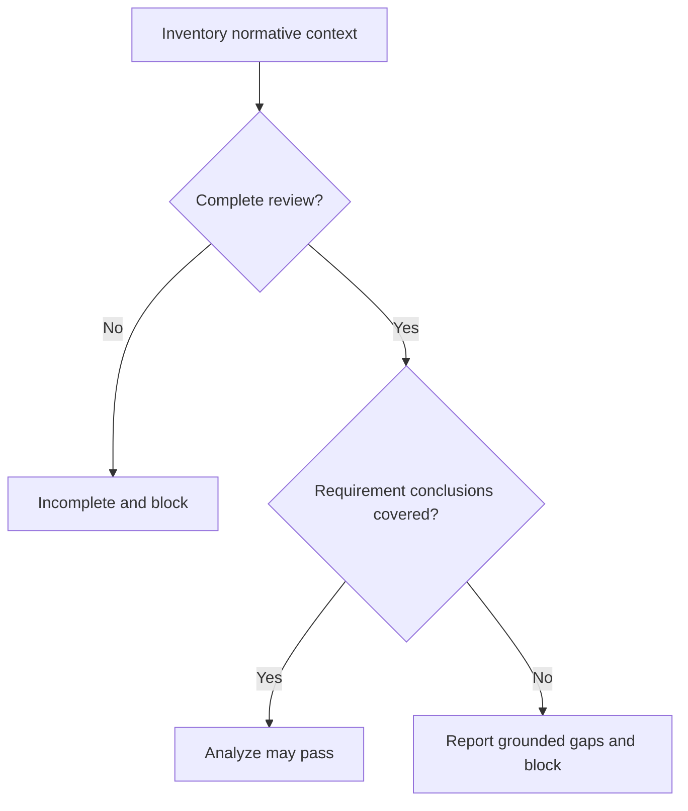
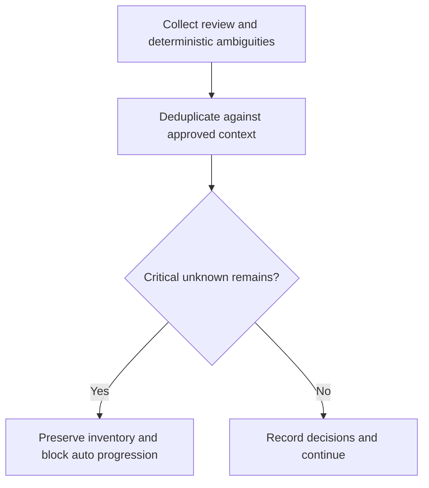
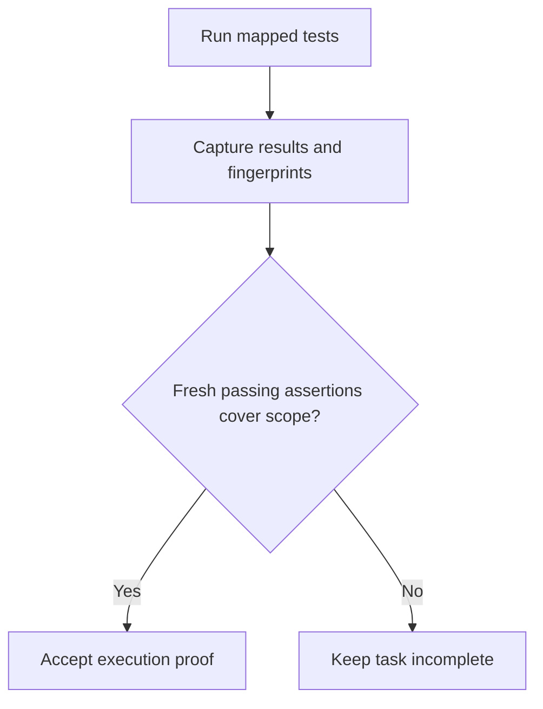
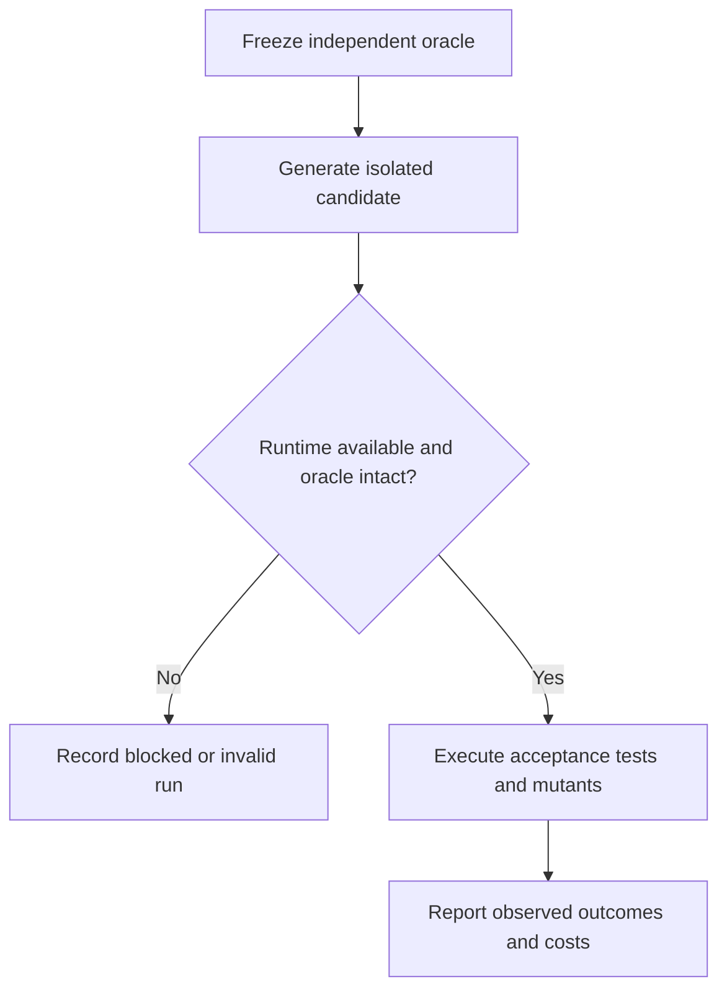
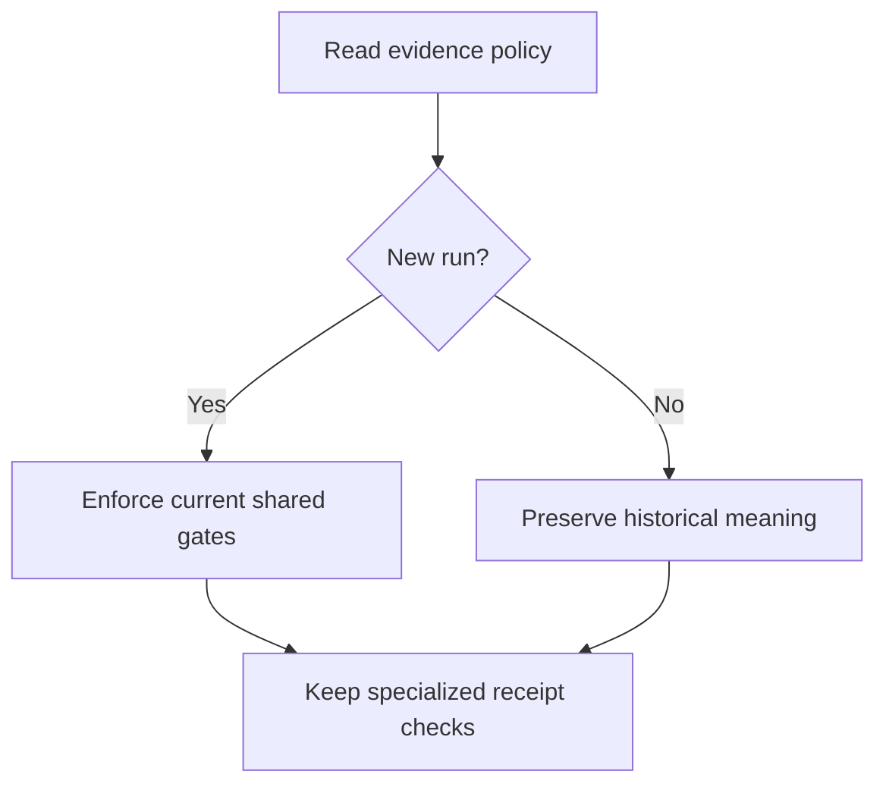

# Feature Spec: Requirement Evidence Integrity

## Header

- **Feature:** Requirement Evidence Integrity
- **Feature Number:** 078
- **Date:** 2026-09-06
- **Status:** In Progress
- **Input:** Implement the approved five-axis improvement plan: semantic contract alignment, complete review context, real execution evidence, useful clarification, and functional generation evaluation; retain the simplest effective workflow.
- **Scope:** Local CLI/framework, NON_VISUAL. The UI witness is an isolated test fixture, not a new LiveSpec interface.
- **Decision:** One feature, three delivery lots; all five axes are required. No new user-maintained document, command, database, or mandatory repeated review.

## User Scenarios & Testing

### Story 1 — Review the complete contract `P1`

**As a** maintainer, **I want to** review every normative requirement against its implementation plan, **so that** references cannot conceal a contradictory plan.

**Priority reason:** A false PASS defeats the framework purpose.

**Independent test:** Review deletion-after-24-hours against retention-forever with identical IDs.

```gherkin
Feature: Complete semantic contract review
  Scenario: Equivalent behavior passes
    Given a specification requires deletion after 24 hours
    And the plan expresses equivalent behavior in different words
    When the reviewer examines all normative context
    Then every requirement receives a grounded covered conclusion

  Scenario: Contradiction beyond the former cutoff blocks
    Given the deletion requirement occurs after character 8000
    And the plan cites its ID but retains data forever
    When the reviewer examines the complete context
    Then the requirement receives a contradictory conclusion
    And the Analyze gate blocks implementation
```



### Story 2 — Resolve only consequential uncertainty `P1`

**As a** feature author, **I want to** resolve unknown business behavior using approved context first, **so that** questions remain useful and no unresolved critical item disappears.

**Priority reason:** Unresolved permissions or retention can change the product contract.

**Independent test:** Create six distinct critical uncertainties and resolve one from the constitution.

```gherkin
Feature: Consequential clarification
  Scenario: Approved context resolves the question
    Given the constitution already determines a permission rule
    When the specification review raises that permission ambiguity
    Then clarification records the existing decision without asking again

  Scenario: Presentation cap preserves unresolved items
    Given six distinct critical business ambiguities remain unresolved
    When automatic clarification presents at most five questions
    Then all six remain in the outstanding inventory
    And progression blocks until every critical ambiguity is resolved
```



### Story 3 — Prove execution from observed tests `P1`

**As a** implementer, **I want to** attach actual test execution to acceptance criteria, **so that** a prose assertion cannot certify functioning code.

**Priority reason:** Runtime proof affects every completion gate.

**Independent test:** Run a passing mapped assertion, then change an application source file.

```gherkin
Feature: Execution evidence
  Scenario: Executed acceptance assertion proves its scope
    Given a runner executes a passing test mapped to an acceptance criterion
    And the feature, source, test and configuration fingerprints match
    When the completion gate verifies the runner receipt
    Then it accepts execution evidence for the mapped criterion

  Scenario: Reused or empty evidence cannot certify execution
    Given evidence is prose only, stale, foreign, empty or entirely skipped
    When it is submitted for an execution task
    Then the task remains incomplete with a specific reason
```



### Story 4 — Measure generated behavior independently `P1`

**As a** framework maintainer, **I want to** evaluate generated applications with an immutable acceptance oracle, **so that** generation quality reflects observed behavior.

**Priority reason:** Structural fixtures alone cannot establish functional correctness.

**Independent test:** Run each witness oracle against a correct candidate and a deliberately wrong mutant.

```gherkin
Feature: Independent generation evaluation
  Scenario: Correct candidate and sensitive oracle
    Given a frozen acceptance oracle for each Python CLI, TypeScript API and UI-Penflow witness
    When the evaluator runs a correct candidate and a behavioral mutant
    Then the correct candidate passes and the mutant fails
    And the evaluator records runtime identity, duration and observed outcome

  Scenario: Unavailable generation runtime remains explicit
    Given a selected real model runtime or credential is unavailable
    When the generation evaluation is requested
    Then that run is recorded as blocked or not run
    And it is excluded from claims of functional success and runtime parity
```



### Story 5 — Upgrade without workflow inflation `P1`

**As a** existing project owner, **I want to** reuse normal commands with versioned evidence policy, **so that** upgrades do not rewrite historical proof or bypass existing gates.

**Priority reason:** Shared contracts have a wide regression surface.

**Independent test:** Load an archived old run and start a new run under current policy.

```gherkin
Feature: Compatible policy transition
  Scenario: New runs enforce current policy
    Given an existing project uses normal LiveSpec commands
    When it starts a new review and implementation run
    Then current evidence policy is enforced through the existing phases
    And Clarify and Analyze cannot be skipped by automatic progression

  Scenario: Historical evidence remains historical
    Given an archive predates the new evidence policy
    When it is inspected after upgrade
    Then its original policy and verdict remain readable
    And it is not promoted to current execution certification
    And bootstrap and cumulative Penflow receipt checks remain enforced
```



## Acceptance Criteria

| ID | Criterion | Priority | Story |
|---|---|---|---|
| AC-001 | Given repeated FR/AC IDs across features, when context is inventoried, then feature-qualified identities remain distinct and reference coverage is labelled structural, never semantic compliance. | P1 | Story 1 |
| AC-002 | Given all normative sections, Gherkin, exceptions and referenced contracts, when reviewed, then every section is submitted and every requirement concluded; malformed, omitted, partial or over-budget review is incomplete and cannot PASS. | P1 | Story 1 |
| AC-003 | Given equivalent paraphrases, contradictory retention, unrelated text with matching IDs, or extra business scope, when reviewed, then covered/contradictory/missing/ambiguous conclusions cite exact source and plan excerpts; unsupported scope blocks and justified technical necessities remain allowed. | P1 | Story 1 |
| AC-004 | Given an explicit prohibition and a plan promising never to perform it, when checked, then mention alone does not create a violation; stale source/model/policy/schema/prompt reviews cannot be reused. | P1 | Story 1 |
| AC-005 | Given French or English vague quality language, when clarification is collected, then unrelated numbers do not resolve the quality ambiguity; approved-context decisions and duplicate questions are reused. | P1 | Story 2 |
| AC-006 | Given six unresolved critical business questions, when five are presented, then six remain recorded and automatic progression blocks; accepted decisions preserve requirement IDs and invalidate dependent review/proof. | P1 | Story 2 |
| AC-007 | Given documentary, review and execution tasks, when proving them, then evidence is validated according to its explicit category; output text plus a success boolean cannot prove execution. | P1 | Story 3 |
| AC-008 | Given real runner results, when mapped to ACs, then the receipt records executed test identities, assertion/result counts, statuses, report identity and feature/source/test/config fingerprints; only passing executed assertions whose behavior and expected outcome justify the mapping can certify mapped ACs; the verifier independently checks runner-owned capture and report provenance bound to invocation/project/feature and before-and-after source/test/config identity, not caller-supplied verdict fields; uncovered ACs remain unproven. | P1 | Story 3 |
| AC-009 | Given stale, foreign, zero-test, entirely-skipped, malformed or mismatched-report evidence, when the completion gate runs, then it rejects the claimed execution scope even with exit code zero. | P1 | Story 3 |
| AC-010 | Given a custom or manual driver that cannot provide mandatory proof, when invoked, then execution remains available but certification reports insufficient evidence rather than fabricating a PASS. | P1 | Story 3 |
| AC-011 | Given the three isolated witness projects, when deterministic evaluation runs, then each correct candidate passes its frozen independent behavioral oracle for the defined witness contract and at least one relevant mutant fails; modified oracles invalidate evaluation. | P1 | Story 4 |
| AC-012 | Given real generation trials, when results are reported, then first-attempt success, repaired success, correct blocking, failure and not-run outcomes remain distinct with observed attempts, duration, runtime/model and measured cost or explicit unknown cost. | P1 | Story 4 |
| AC-013 | Given CI or release evaluation, when deterministic and real-model suites are selected, then cheap deterministic checks run routinely, core generation changes select a bounded model sample, and release/model/runtime changes select the full corpus; absent runtimes never imply parity. | P1 | Story 4 |
| AC-014 | Given a current pipeline, when phases advance directly or in automatic nested commands, then both Clarify and Analyze gates must hold through the same authority, with no added mandatory user command or document. | P1 | Story 5 |
| AC-015 | Given legacy goals and archives, when loaded under upgraded code, then their versioned interpretation remains explicit and readable; they cannot certify a new run, and existing bootstrap, finalization, visual, conventions and cumulative Penflow protections still apply. | P1 | Story 5 |
| AC-016 | Given the existing specifications and tests that require character truncation or ID-only Analyze compliance, when upgraded, then targeted normative contracts and tests adopt this feature while unrelated old features remain unchanged. | P1 | Story 5 |

### AC-001

**Criterion:** Given repeated FR/AC IDs across features, when context is inventoried, then feature-qualified identities remain distinct and reference coverage is labelled structural, never semantic compliance.
**Priority:** P1 | **Story:** Story 1

### AC-002

**Criterion:** Given all normative sections, Gherkin, exceptions and referenced contracts, when reviewed, then every section is submitted and every requirement concluded; malformed, omitted, partial or over-budget review is incomplete and cannot PASS.
**Priority:** P1 | **Story:** Story 1

### AC-003

**Criterion:** Given equivalent paraphrases, contradictory retention, unrelated text with matching IDs, or extra business scope, when reviewed, then covered/contradictory/missing/ambiguous conclusions cite exact source and plan excerpts; unsupported scope blocks and justified technical necessities remain allowed.
**Priority:** P1 | **Story:** Story 1

### AC-004

**Criterion:** Given an explicit prohibition and a plan promising never to perform it, when checked, then mention alone does not create a violation; stale source/model/policy/schema/prompt reviews cannot be reused.
**Priority:** P1 | **Story:** Story 1

### AC-005

**Criterion:** Given French or English vague quality language, when clarification is collected, then unrelated numbers do not resolve the quality ambiguity; approved-context decisions and duplicate questions are reused.
**Priority:** P1 | **Story:** Story 2

### AC-006

**Criterion:** Given six unresolved critical business questions, when five are presented, then six remain recorded and automatic progression blocks; accepted decisions preserve requirement IDs and invalidate dependent review/proof.
**Priority:** P1 | **Story:** Story 2

### AC-007

**Criterion:** Given documentary, review and execution tasks, when proving them, then evidence is validated according to its explicit category; output text plus a success boolean cannot prove execution.
**Priority:** P1 | **Story:** Story 3

### AC-008

**Criterion:** Given real runner results, when mapped to ACs, then the receipt records executed test identities, assertion/result counts, statuses, report identity and feature/source/test/config fingerprints; only passing executed assertions whose behavior and expected outcome justify the mapping can certify mapped ACs; the verifier independently checks runner-owned capture and report provenance bound to invocation/project/feature and before-and-after source/test/config identity, not caller-supplied verdict fields; uncovered ACs remain unproven.
**Priority:** P1 | **Story:** Story 3

### AC-009

**Criterion:** Given stale, foreign, zero-test, entirely-skipped, malformed or mismatched-report evidence, when the completion gate runs, then it rejects the claimed execution scope even with exit code zero.
**Priority:** P1 | **Story:** Story 3

### AC-010

**Criterion:** Given a custom or manual driver that cannot provide mandatory proof, when invoked, then execution remains available but certification reports insufficient evidence rather than fabricating a PASS.
**Priority:** P1 | **Story:** Story 3

### AC-011

**Criterion:** Given the three isolated witness projects, when deterministic evaluation runs, then each correct candidate passes its frozen independent behavioral oracle for the defined witness contract and at least one relevant mutant fails; modified oracles invalidate evaluation.
**Priority:** P1 | **Story:** Story 4

### AC-012

**Criterion:** Given real generation trials, when results are reported, then first-attempt success, repaired success, correct blocking, failure and not-run outcomes remain distinct with observed attempts, duration, runtime/model and measured cost or explicit unknown cost.
**Priority:** P1 | **Story:** Story 4

### AC-013

**Criterion:** Given CI or release evaluation, when deterministic and real-model suites are selected, then cheap deterministic checks run routinely, core generation changes select a bounded model sample, and release/model/runtime changes select the full corpus; absent runtimes never imply parity.
**Priority:** P1 | **Story:** Story 4

### AC-014

**Criterion:** Given a current pipeline, when phases advance directly or in automatic nested commands, then both Clarify and Analyze gates must hold through the same authority, with no added mandatory user command or document.
**Priority:** P1 | **Story:** Story 5

### AC-015

**Criterion:** Given legacy goals and archives, when loaded under upgraded code, then their versioned interpretation remains explicit and readable; they cannot certify a new run, and existing bootstrap, finalization, visual, conventions and cumulative Penflow protections still apply.
**Priority:** P1 | **Story:** Story 5

### AC-016

**Criterion:** Given the existing specifications and tests that require character truncation or ID-only Analyze compliance, when upgraded, then targeted normative contracts and tests adopt this feature while unrelated old features remain unchanged.
**Priority:** P1 | **Story:** Story 5

**Evidence:** review
**Review inputs:** [migration evidence](.reviews/ac016-inputs/manifest.json)

## Functional Requirements

| ID | Requirement | AC References |
|---|---|---|
| FR-001 | Derive a feature-qualified normative inventory from canonical Markdown without a second user-maintained source of truth. | AC-001, AC-002 |
| FR-002 | Review complete normative context, using one review when it fits or coherent bounded batches plus shared invariants and cross-batch synthesis; never silently truncate source text. | AC-002 |
| FR-003 | Produce and validate one grounded semantic disposition per requirement, detect unapproved business scope, and keep structural reference coverage separate. | AC-003 |
| FR-004 | Reuse semantic reviews only for exact normative source identity under Normative Identity v2, reviewer-model and policy/prompt/schema identity; retain raw source identity for provenance and citations; a changed governed dependency or incomplete review blocks semantic readiness. | AC-002, AC-004 |
| FR-005 | Avoid treating a negated prohibition mention as a constitutional violation. | AC-004 |
| FR-006 | Merge existing review ambiguity findings with deterministic bilingual detection, resolving from approved context and deduplicating without an extra mandatory model call. | AC-005 |
| FR-007 | Retain the full ambiguity inventory independently of the presentation cap; unresolved critical observable business interpretations block automatic progression, while reversible technical choices follow conventions. | AC-006 |
| FR-008 | Record accepted clarification decisions in the existing spec, preserving IDs and invalidating downstream proof affected by changed meaning. | AC-006 |
| FR-009 | Classify task evidence explicitly as documentary, review or execution, retaining specialized evidence requirements and preventing generic prose from satisfying runtime tasks. | AC-007, AC-015 |
| FR-010 | Produce runner-owned execution receipts bound to project, feature and invocation, with independent capture/report verification, before-and-after application/shared-source, test and configuration identity, and executed passing assertions verifying each mapped AC expected outcome; uncovered ACs remain unproven. | AC-008 |
| FR-011 | Reject insufficient, stale or foreign execution evidence and report exact unproven scope; unsupported drivers remain usable without mandatory certification. | AC-009, AC-010 |
| FR-012 | Supply three small isolated Python CLI, TypeScript API and UI-Penflow witnesses for the Witness Contracts below, with independent frozen behavioral acceptance oracles and negative controls. | AC-011 |
| FR-013 | Evaluate generation using unchanged external oracles, bounded attempts and enforced execution timeouts, preserving the candidate workspace until independent evaluation completes, and observed outcome/runtime/duration/cost records; generated candidates cannot update their oracle. | AC-011, AC-012 |
| FR-014 | Integrate deterministic and opt-in real-model witness runs into existing testing surfaces with core-change sample and release/model/runtime full-corpus policies; report actual runtime coverage only. | AC-013 |
| FR-015 | Enforce Clarify and Analyze through shared progression rules in existing direct and nested commands, without adding recurring user process. | AC-014 |
| FR-016 | Version new evidence policy, preserve historical meaning and specialized 076/077 protections, and update conflicting normative contracts and tests selectively. | AC-015, AC-016 |

### FR-001

**Requirement:** Derive a feature-qualified normative inventory from canonical Markdown without a second user-maintained source of truth.
**AC References:** [AC-001](#ac-001), [AC-002](#ac-002)

### FR-002

**Requirement:** Review complete normative context, using one review when it fits or coherent bounded batches plus shared invariants and cross-batch synthesis; never silently truncate source text.
**AC References:** [AC-002](#ac-002)

### FR-003

**Requirement:** Produce and validate one grounded semantic disposition per requirement, detect unapproved business scope, and keep structural reference coverage separate.
**AC References:** [AC-003](#ac-003)

### FR-004

**Requirement:** Reuse semantic reviews only for exact normative source identity under Normative Identity v2, reviewer-model and policy/prompt/schema identity; retain raw source identity for provenance and citations; a changed governed dependency or incomplete review blocks semantic readiness.
**AC References:** [AC-002](#ac-002), [AC-004](#ac-004)

### FR-005

**Requirement:** Avoid treating a negated prohibition mention as a constitutional violation.
**AC References:** [AC-004](#ac-004)

### FR-006

**Requirement:** Merge existing review ambiguity findings with deterministic bilingual detection, resolving from approved context and deduplicating without an extra mandatory model call.
**AC References:** [AC-005](#ac-005)

### FR-007

**Requirement:** Retain the full ambiguity inventory independently of the presentation cap; unresolved critical observable business interpretations block automatic progression, while reversible technical choices follow conventions.
**AC References:** [AC-006](#ac-006)

### FR-008

**Requirement:** Record accepted clarification decisions in the existing spec, preserving IDs and invalidating downstream proof affected by changed meaning.
**AC References:** [AC-006](#ac-006)

### FR-009

**Requirement:** Classify task evidence explicitly as documentary, review or execution, retaining specialized evidence requirements and preventing generic prose from satisfying runtime tasks.
**AC References:** [AC-007](#ac-007), [AC-015](#ac-015)

### FR-010

**Requirement:** Produce runner-owned execution receipts bound to project, feature and invocation, with independent capture/report verification, before-and-after application/shared-source, test and configuration identity, and executed passing assertions verifying each mapped AC expected outcome; uncovered ACs remain unproven.
**AC References:** [AC-008](#ac-008)

### FR-011

**Requirement:** Reject insufficient, stale or foreign execution evidence and report exact unproven scope; unsupported drivers remain usable without mandatory certification.
**AC References:** [AC-009](#ac-009), [AC-010](#ac-010)

### FR-012

**Requirement:** Supply three small isolated Python CLI, TypeScript API and UI-Penflow witnesses for the Witness Contracts below, with independent frozen behavioral acceptance oracles and negative controls.
**AC References:** [AC-011](#ac-011)

### FR-013

**Requirement:** Evaluate generation using unchanged external oracles, bounded attempts and enforced execution timeouts, preserving the candidate workspace until independent evaluation completes, and observed outcome/runtime/duration/cost records; generated candidates cannot update their oracle.
**AC References:** [AC-011](#ac-011), [AC-012](#ac-012)

### FR-014

**Requirement:** Integrate deterministic and opt-in real-model witness runs into existing testing surfaces with core-change sample and release/model/runtime full-corpus policies; report actual runtime coverage only.
**AC References:** [AC-013](#ac-013)

### FR-015

**Requirement:** Enforce Clarify and Analyze through shared progression rules in existing direct and nested commands, without adding recurring user process.
**AC References:** [AC-014](#ac-014)

### FR-016

**Requirement:** Version new evidence policy, preserve historical meaning and specialized 076/077 protections, and update conflicting normative contracts and tests selectively.
**AC References:** [AC-015](#ac-015), [AC-016](#ac-016)

## Acceptance evidence policy v2

- Acceptance evidence kind is explicit metadata on the canonical detailed AC declaration, separate from command task category. Supported kinds are `execution` and `review`; omitted metadata defaults to `execution`. Repeated table/detail occurrences of one qualified AC remain one obligation; an absent marker is neutral, while conflicting explicit kinds or unknown kinds block compilation/certification.
- This feature has 15 execution ACs and one review AC: AC-016. Its criterion and every other FR/AC remain unchanged. AC-016 requires independent documentary migration review against its declared Review inputs, not a test that merely checks identifiers, file presence or a supplied success flag.
- Read the generated [migration evidence](.reviews/ac016-inputs/manifest.json): it binds actual baseline/current snapshots, source inventory and changes. Baseline provenance is explicit per file. Unavailable initial 076 bytes stay unavailable; HEAD or a later snapshot cannot be substituted as an invented initial baseline or used to assert global non-modification. Unsupported conclusions or missing required input scope remain unproven.
- Preparation/ingestion reuse existing native acceptance-review surfaces. Preserve actual independent raw output, exact input manifests, source citations, resolved reviewer model and policy identity; ingestion and consumption independently reject malformed, partial, foreign or stale review. A generated input manifest is not itself a review receipt.
- Policy 2 freezes the complete qualified AC/evidence inventory for commands operating on an existing specification. Newly compiled coordinating tasks explicitly declared with `ac-binding:reviewed-spec` instead freeze an obligation to certify the complete current independently reviewed specification, which may be created after the coordinator contract. This binding is valid only with `evidence:execution ac-scope:feature`; it requires a current complete ready spec-kind review receipt for the frozen reviewer model/budget, a nonempty canonical acceptance inventory, and the full execution AND documentary-review conjunction. Missing, stale, wrong-kind or foreign review evidence and uncovered criteria block proof, archive and archive-read verification. Existing contracts without this explicit binding retain their original frozen-inventory interpretation; no old contract is rewritten or retrospectively upgraded. Preparatory tasks retain their individually declared typed proof scope and do not require future acceptance execution merely to prepare sources, reviews or plans. Final feature acceptance-certification tasks are the existing tasks whose resolved evidence kind is `execution` and whose declaration has `ac-scope:feature`, excluding conditional RED observations. Their `goal prove` requires the conjunction of all 16 obligations: current mapped execution proof for the 15 execution ACs and current independent review proof for AC-016. Archives of commands containing those final acceptance tasks and their `verify-output` must revalidate that same complete conjunction. Neither evidence kind substitutes for the other; an omitted AC cannot disappear at serialization or terminal acceptance verification.
- Archive persists the immutable acceptance evidence contract, retaining the existing task scope and applicability declarations. Preparatory-command archives and their `verify-output` retain their own completed task scopes; archives containing the final `ac-scope:feature` acceptance tasks and their `verify-output` independently recheck all declared acceptance evidence against current governed inputs. Every declared Review input remains governed even under a generated-output directory; ordinary unrelated generated outputs retain their existing exclusions.
- Policy 1 contracts and archives retain their original immutable interpretation; missing AC metadata defaults to execution in newly compiled contracts. No historical policy 1 result certifies a new policy 2 run. Unknown future policies remain noncertifying. Existing bootstrap, finalization, conventions, path confinement and cumulative Penflow requirements remain additional gates.

## Key Entities

| Entity | Purpose | Key fields |
|---|---|---|
| Requirement review | Derived contract-to-plan conclusions | Qualified requirement, source spans, disposition, context coverage, source/model/policy identity |
| Execution receipt | Observed acceptance proof | Feature, task/category, command, test/assertion results, mapping, source/test/config/report fingerprints |
| Witness evaluation | Independent generation observation | Fixture/oracle identity, runtime/model, attempt, outcome, duration, cost or unknown, negative controls |

## Edge Cases

- An indivisible normative section exceeds the configured review budget: report incomplete with its identity, never remove its tail or silently summarize obligations.
- Requirements with identical numeric IDs in separate features remain separate; absent or unresolved normative references prevent complete review.
- A reported passing test with only skipped assertions cannot certify an AC. A shared application source change invalidates affected runtime proof conservatively.
- Unknown cost remains unknown. An unavailable native runtime is not-run or blocked, never an inferred equivalent of another runtime.
- Existing receipts retain original version/meaning; new run certification cannot borrow an old or foreign receipt. Changes under active bootstrap work are preserved.

## Normative Identity v2

- **Raw identity:** Preserve the exact hash and immutable bytes of each captured input for provenance and exact citation validation. A freshness comparison never rewrites a historical capture or claims its raw bytes equal a later document.
- **Normative identity:** For the selected feature's spec and plan only, versioned policy v2 omits solely complete lifecycle fields named `Status`/`status` and `Updated`/`updated` in initial valid YAML frontmatter and one recognized metadata band: either the explicit `## Header` section or the legacy introductory band after the initial H1 and before the next real heading or thematic break. Fenced examples and normative body never provide metadata slots. Parse recognized complete scalar fields; duplicate fields, competing header bands or malformed structure remain byte-bound or block, never broaden omission. All remaining bytes stay bound, including title, IDs, initial `Date`/`created`, arbitrary metadata, normative body and any body sentence mentioning Status. Referenced contracts, application/shared source, tests and configuration retain exact raw identity.
- **Freshness:** Reuse compares normative identity plus identity-policy version, model and existing review policy/prompt/schema versions; raw capture remains available for citations. Changing only the recognized lifecycle fields through finalization does not invalidate a review or execution proof. Changing retention, thresholds, permissions, normative body, initial date or any other governed input does invalidate it. This distinction applies equally to before/after execution checks and proof consumption.
- **Generated outputs:** Execution manifests exclude generated artifacts only through explicit project-relative path rules recorded in policy: run directories, generated registry files and feature progress records. No exclusion follows from a basename or path containing words such as `run`, `status` or `progress`; source/test/config paths remain governed. A referenced normative input stays governed even if its path otherwise matches a generated-output rule.
- **Required regression pairs (AC-004, AC-008, AC-009):** Status/Updated-only finalization preserves eligibility in both recognized header formats while raw provenance hashes differ; first and subsequent finalization add no specification body markers and preserve historical comments. Read-only copies of existing feature 001/077 headers and CRLF inputs exercise compatibility. Modifying retention, threshold, permission, body text or initial date rejects reuse. Changing an actual source/test/config file whose path includes a generated-output keyword also rejects reuse.

## Witness Contracts

- **Python CLI:** A purge command deletes files aged at least 24 hours and preserves newer files. The oracle controls timestamps and checks actual filesystem changes; the mutant retains expired files or deletes a newer file.
- **TypeScript API:** An unauthorized create request returns 403 without mutation; an authorized valid request returns 201 and persists the submitted item. The oracle checks response and stored state; the mutant bypasses authorization or reports success without persistence.
- **UI-Penflow:** Required input prevents submission while empty; valid submission reaches the contract success state. The oracle exercises browser behavior and verifies applicable existing Penflow proof through its authority; the mutant enables invalid submission or omits success. Missing Penflow/browser capability is explicit insufficient proof.
- Independent evaluator owns oracle identity before candidate generation, retains the candidate workspace through evaluation, and enforces a finite declared timeout. The generator may edit candidate implementation only; an oracle mutation or missing independent capture invalidates the run.

## Quality Engineering

- **Risk:** High criticality; Shared/Cross-system blast radius; primary risk Contract; implementation confidence remains unproven until tests execute.
- **Dimensions:** Functional correctness, regression, API/CLI/file compatibility, evidence/migration integrity, untrusted input and oracle isolation, bounded review cost, and actionable diagnostics apply. Product accessibility and visual fidelity are non-applicable to the framework feature; the UI witness validates its own isolated contract.
- **P0 evidence:** Counterexamples for contradiction after former cutoffs, false prohibition, lost sixth ambiguity, forged prose proof, stale/foreign/empty/skipped execution, changed oracle, legacy/bootstrap/Penflow compatibility.
- **P1 evidence:** Positive paraphrases, full-context coverage, exact cache reuse and invalidation, bilingual/context-resolved clarification, real runner mapping, each witness and mutant, direct/nested phase parity.
- **Non-functional expectations:** No network/model dependency for deterministic checks; one model review for fitting unchanged small context, exact cache reuse thereafter; explicit bounded batching and trial attempts; no new persistent service or mandatory user document. Existing Python >=3.11 and CLI entry points stay supported.
- **Gaps:** No implementation, runtime or real-model success is claimed by this specification. Missing optional runtime credentials must remain visible in evaluation reports and cannot satisfy a release claim of full corpus execution.
- **Boundary:** QE defines evidence requirements; independent semantic review, implementation tests and final audit execute their own checks. A finite passing corpus is not a universal correctness guarantee.

## Delivery and Compatibility

- **A:** Complete review context, grounded requirement conclusions and consequential clarification (FR-001 through FR-008, FR-015).
- **B:** Typed evidence and current runner proof (FR-009 through FR-011).
- **C:** Functional witnesses, evaluation and targeted migration (FR-012 through FR-014, FR-016).
- This contract supersedes silent 8000/2000-character review truncation and treating ID presence as semantic compliance. Update the affected existing contracts before code changes; do not regenerate the entire historical specification corpus.
- Retain current evidence-path confinement, bootstrap pairing/archive publication, conventions/finalization and cumulative Penflow certification checks. No change to user authorization or Git publication policy.

## Clarifications

### Session 2026-09-06

- Q: Split the approved programme or add a mandatory new workflow? -> A: Keep all five axes in one feature delivered in three lots through existing commands, as explicitly requested.
- Q: Does the UI witness make LiveSpec a UI feature? -> A: No; it is an isolated evaluation fixture and does not introduce user-facing framework screens.

## Success Criteria

| ID | Criterion | How to Measure |
|---|---|---|
| SC-001 | All 16 acceptance criteria have passing evidence or an explicitly reported external execution gap; no incomplete evidence is labelled certified. | AC evidence matrix and actual command receipts |
| SC-002 | All specified negative controls reject false compliance while corresponding positive controls pass. | Deterministic unit/integration and witness suite |
| SC-003 | The unchanged small-review path needs at most one review and then uses its exact valid cache; oversized unsupported context cannot PASS. | Provider call-count and context coverage tests |
| SC-004 | Existing bootstrap and cumulative Penflow regressions pass and historical archives remain readable. | Focused compatibility suites |

<!-- finalize:spec-specify:2026-09-06:165bc17e -->

<!-- finalize:spec-plan:2026-09-06:752c710f -->

<!-- finalize:spec-plan:2026-09-06:b64026f3 -->
