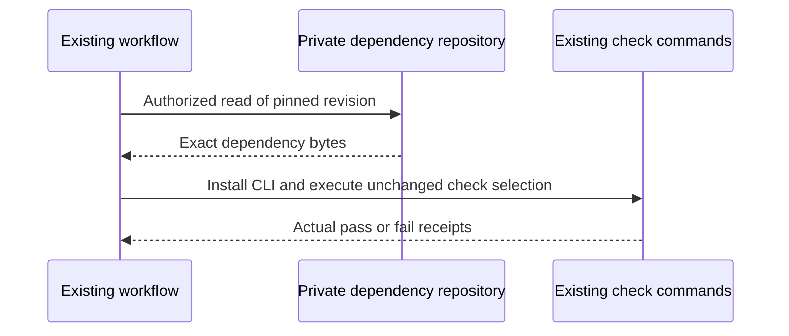
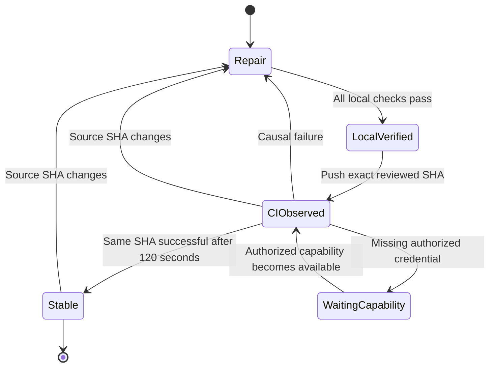

# Implementation Plan

## Summary

Restore the existing CI gates with source-preserving annotation/format repairs, typed fixture boundaries, actual pinned Penflow provision and meaningful visual-link regression tests.

## Technical Context

Python 3.12, existing Typer/Pydantic validator, Ruff 0.16.6, mypy 2.3.1, pyright, pytest; existing Node lockfile and Playwright Chromium. GitHub Actions remains the delivery proof. No new application capability, schema or service.

## Constitution Check

Keep production validation types and authority boundaries intact. Tests use real Penflow for the declared subprocess contract. Do not lower coverage, disable deterministic checks, widen credential access or publish private code. The explicit2026-09-08 policy removes only automatic model jobs. Treat local environment faults separately from source defects.

## Workflow Interaction

```gherkin
Feature: Restore exact Validator CI checks
Scenario: Run exact checks against immutable inputs
  Given the reviewed repair commit and pinned private dependency are accessible
  When CI installs the existing toolchain and dependency
  Then each existing check receives those exact inputs
  And any failed check blocks delivery
Scenario: Reset stability after a source change
  Given CI has observed a reviewed repair SHA
  When a repair changes that SHA
  Then the workflow returns to repair and requires new review and check evidence
Scenario: Retain missing-capability state
  Given a deterministic check lacks its authorized private dependency access
  When it requests that capability
  Then CI enters WaitingCapability without claiming success
  And execution resumes only after the capability is actually available
```





## Implementation Steps

1. FR-001 / AC-001: Move None last in the two recursive union declarations; run formatter only on rejected files; give negative-test dictionaries explicit types and narrow parsed JSON fixture shapes without relaxing production types. Use actual CliRunner Result return type. Preserve invalid values used by negative tests.
2. FR-002 / AC-002: Install actual Penflow at verified Git revision dcbfea6e2e6e6b359b1b0d80607670a4eb7ad6b7. Locally use an exact Git archive into isolated owned storage. CI uses a dedicated read-only private-repository access capability; absent capability remains a failure, never a stub or public vendoring.
3. FR-003 / AC-003: Keep npm ci and Chromium install. Install the real AST backend with npm install --global @ast-grep/cli@0.44.0 after restoring Node26 and before full unit collection; assert sg --version equals ast-grep0.44.0. The Ubuntu sg command may refer to Unix group switching, so PATH presence alone does not prove the backend. Local parity uses the same package in an isolated owned npm prefix and prepends its bin directory, without changing the global Mac installation. Remove runner-only inherited PYTEST_ADDOPTS and isolate test temp storage outside ancestor spec/package roots. Re-run complete unchanged unit and integration commands, repairing only actual remaining causes.
4. FR-004 / AC-004: Add correct and foreign healthy-symlink cases to visual-gate tests; retain the exact 94 percent threshold and existing coverage command.
5. FR-005 / AC-005, AC-006: Remove generation-selection/generation-model jobs and unused model inputs/pins/secrets from GitHub; keep all deterministic check commands and local opt-in helpers. In unit-tests, require AIRESOURCES_READONLY_DEPLOY_KEY and sparse-checkout only code-conventions/javascript.md, rust.md and swift-kotlin.md from private julien-m/ai-ressources at11976242fc5b9ae5f3a574e19339b78ebd18a0c4 into .ci-deps/ai-ressources, persist-credentials:false. Set AIRESOURCES to the absolute checkout path before unit collection. Keep real source-hash checks; cleanup always after consumers, without private artifacts or caches. Test missing-capability failure, exact pins/files/env/order and cleanup. Local tests use the same isolated three Git blobs. Update the two existing workflow-policy test modules and078FR-014/AC-013 current docs; preserve historical reports. Inspect staged scope/diff, commit/push existing PR35, and collect exact same-SHA GitHub checks twice at least120seconds apart. Independent Validator/Reviewer and main delivery belong to Manager.

## Files in Scope

The implementation artifact records every actual changed file, including formatting-only historical examples. Their old feature contracts are not incorporated as new functional requirements by this repair: formatting preserves their behavior and normative text. Source changes include the two union declarations, rejected fixtures, coverage regression cases, the existing workflow and mechanical partitions required by conventions on those touched files. Preserve original pytest entrypoints and node IDs through explicit reexports; verify equal collect-only inventories and no duplicate collection. Do not alter fixture meaning to hide a detector finding. Native conventions apply to all mapped source files.

| File | Concrete change |
|---|---|
| `.agent-sync/skills/spec-specify/SKILL.md` | Format rejected Python examples; preserve behavior and requirements |
| `.github/workflows/ci.yml` | Preserve pinned Penflow/runtime/checks; remove model jobs; privately provide exact normative corpus for unit collection |
| `tests/test_generation_ci_events.py` | Assert deterministic event/job policy and unchanged command set; no automatic model calls |
| `tests/test_generation_ci_selection.py` | Verify private corpus pin, sparse paths, required capability, environment, ordering and cleanup |
| `.specs/features/078-requirement-evidence-integrity/spec.md` | Align FR-014 and AC-013 with user-authorized GitHub policy; preserve local evaluation |
| `.specs/features/078-requirement-evidence-integrity/plan.md` | Synchronize Step8 policy implementation without changing other obligations |
| `README.md` | Document deterministic CI and opt-in local evaluation |
| `system/testing/execution-rules.md` | Align current execution policy with deterministic GitHub and explicit local model opt-in |
| `.specs/testing/strategy.md` | Replace old PR-triggered model guidance with explicit local opt-in; link the current deterministic CI |
| `.specs/features/002-layer-3-cli-surface/plan.md` | Format rejected Python examples; preserve behavior and requirements |
| `.specs/features/006-taxonomy-testing-infra/plan.md` | Format rejected Python examples; preserve behavior and requirements |
| `.specs/features/009-visual-state-baselines/plan.md` | Format rejected Python examples; preserve behavior and requirements |
| `.specs/features/009-visual-state-baselines/spec.md` | Format rejected Python examples; preserve behavior and requirements |
| `.specs/features/011-visual-migrate-integration/plan.md` | Format rejected Python examples; preserve behavior and requirements |
| `.specs/features/025-mutation-testing-on-demand/plan.md` | Format rejected Python examples; preserve behavior and requirements |
| `.specs/features/028-ui-runner-web/plan.md` | Format rejected Python examples; preserve behavior and requirements |
| `.specs/features/037-test-multi-runner-integration/plan.md` | Format rejected Python examples; preserve behavior and requirements |
| `.specs/features/039-command-expectations-and-verify-output/plan.md` | Format rejected Python examples; preserve behavior and requirements |
| `.specs/testing/strategy.md` | Format rejected Python examples; preserve behavior and requirements |
| `docs/superpowers/plans/2026-04-10-python-commit-hook-and-orchestration.md` | Format rejected Python examples; preserve behavior and requirements |
| `docs/superpowers/plans/2026-04-18-fix-visual-scaffolding-no-frontend.md` | Format rejected Python examples; preserve behavior and requirements |
| `docs/superpowers/plans/2026-04-18-legacy-test-merge-plan.md` | Format rejected Python examples; preserve behavior and requirements |
| `docs/superpowers/plans/2026-04-18-route-scan-full-coverage.md` | Format rejected Python examples; preserve behavior and requirements |
| `docs/superpowers/plans/2026-05-17-command-validation-hardening.md` | Format rejected Python examples; preserve behavior and requirements |
| `docs/superpowers/specs/2026-04-02-layer2-coherence-validation-design.md` | Format rejected Python examples; preserve behavior and requirements |
| `docs/superpowers/specs/2026-04-18-fix-visual-scaffolding-no-frontend-design.md` | Format rejected Python examples; preserve behavior and requirements |
| `system/contracts/ACTIVATION_CONTRACT.md` | Format rejected Python examples; preserve behavior and requirements |
| `system/contracts/SUPERPOWERS_RETURN.md` | Format rejected Python examples; preserve behavior and requirements |
| `tests/goal_bootstrap_support.py` | Repair rejected fixture typing or formatting; preserve all assertions |
| `tests/test_conventions_ast_engine.py` | Repair rejected fixture typing or formatting; preserve all assertions |
| `tests/test_conventions_diffguard.py` | Repair rejected fixture typing or formatting; preserve all assertions |
| `tests/test_conventions_lang_multilang.py` | Repair rejected fixture typing or formatting; preserve all assertions |
| `tests/test_conventions_taxonomy.py` | Repair rejected fixture typing or formatting; preserve all assertions |
| `tests/test_conventions_verify_scope.py` | Repair rejected fixture typing or formatting; preserve all assertions; partition into explicit reexported noncollectable support modules |
| `tests/test_device_cmd.py` | Repair rejected fixture typing or formatting; preserve all assertions |
| `tests/test_goal_bootstrap_archive.py` | Repair rejected fixture typing or formatting; preserve all assertions |
| `tests/test_goal_bootstrap_pairing.py` | Repair rejected fixture typing or formatting; preserve all assertions |
| `tests/test_goal_bootstrap_prove.py` | Repair rejected fixture typing or formatting; preserve all assertions |
| `tests/test_goal_bootstrap_render.py` | Repair rejected fixture typing or formatting; preserve all assertions |
| `tests/test_goal_contracts.py` | Repair rejected fixture typing or formatting; preserve all assertions; partition into explicit reexported noncollectable support modules |
| `tests/test_hooks_cli.py` | Repair rejected fixture typing or formatting; preserve all assertions |
| `tests/test_journey_v2_runner.py` | Repair rejected fixture typing or formatting; preserve all assertions; partition into explicit reexported noncollectable support modules |
| `tests/test_penflow_contract_validation.py` | Preserve real positive/negative C20 tests and exact absent-CLI raises guard; expose its existing diagnostic as an explicit assertion for native acceptance instrumentation |
| `tests/test_penflow_approval_models.py` | Repair rejected fixture typing or formatting; preserve all assertions |
| `tests/test_run_artifact.py` | Repair rejected fixture typing or formatting; preserve all assertions; partition into explicit reexported noncollectable support modules |
| `tests/test_visual_gate.py` | Add healthy/foreign symlink regressions; partition test module mechanically |
| `validator/conventions_gates.py` | Apply rejected formatting only |
| `validator/doctor/models.py` | Move None last in recursive union |

| `tests/_conventions_verify_scope_01.py` | Preserve original cases, shared fixtures and assertions in bounded support modules |
| `tests/_conventions_verify_scope_02.py` | Preserve original cases, shared fixtures and assertions in bounded support modules |
| `tests/_goal_contracts_01.py` | Preserve original cases, shared fixtures and assertions in bounded support modules |
| `tests/_goal_contracts_02.py` | Preserve original cases, shared fixtures and assertions in bounded support modules |
| `tests/_goal_contracts_03.py` | Preserve original cases, shared fixtures and assertions in bounded support modules |
| `tests/_goal_contracts_04.py` | Preserve original cases, shared fixtures and assertions in bounded support modules |
| `tests/_goal_contracts_05.py` | Preserve original cases, shared fixtures and assertions in bounded support modules |
| `tests/_goal_contracts_06.py` | Preserve original cases, shared fixtures and assertions in bounded support modules |
| `tests/_goal_contracts_07.py` | Preserve original cases, shared fixtures and assertions in bounded support modules |
| `tests/_goal_contracts_08.py` | Preserve original cases, shared fixtures and assertions in bounded support modules |
| `tests/_goal_contracts_09.py` | Preserve original cases, shared fixtures and assertions in bounded support modules |
| `tests/_goal_contracts_10.py` | Preserve original cases, shared fixtures and assertions in bounded support modules |
| `tests/_journey_v2_runner_01.py` | Preserve original cases, shared fixtures and assertions in bounded support modules |
| `tests/_journey_v2_runner_02.py` | Preserve original cases, shared fixtures and assertions in bounded support modules |
| `tests/_journey_v2_runner_03.py` | Preserve original cases, shared fixtures and assertions in bounded support modules |
| `tests/_journey_v2_runner_04.py` | Preserve original cases, shared fixtures and assertions in bounded support modules |
| `tests/_json_fixture.py` | Preserve original cases, shared fixtures and assertions in bounded support modules |
| `tests/_run_artifact_01.py` | Preserve original cases, shared fixtures and assertions in bounded support modules |
| `tests/_run_artifact_02.py` | Preserve original cases, shared fixtures and assertions in bounded support modules |
| `tests/_visual_gate_01.py` | Preserve original cases, shared fixtures and assertions in bounded support modules |
| `tests/_visual_gate_02.py` | Preserve original cases, shared fixtures and assertions in bounded support modules |
| `tests/_visual_gate_03.py` | Preserve original cases, shared fixtures and assertions in bounded support modules |
| `tests/_visual_gate_04.py` | Preserve original cases, shared fixtures and assertions in bounded support modules |

Extracted modules retain every original test selector through explicit reexports and __all__. The baseline 299 selectors match exactly before/after partition; one new healthy/foreign symlink regression is separately declared. The taxonomy serializer also checks deterministic FAIL and BLOCKED branches.

## Testing Strategy

The following commands reproduce the existing CI checks without importing unrelated historical feature requirements. Run ruff check ., ruff format --check ., pyright validator, mypy ., the entire non-integration pytest suite, the exact visual coverage command and all level_3a tests. Add targeted RED/GREEN baseline-link cases. No checks are weakened or substituted. Receipts bind actual argv, cwd, result and SHA. SC-001 maps to local receipts; SC-002 to stable GitHub checks; SC-003 to inspected staged diff and independent review.

## Risks & Considerations

Private Penflow and normative-corpus access require separate authorized read-only CI capabilities; no source workaround can manufacture them. GitHub model credentials are removed by explicit user policy. Local generation remains opt-in. Formatting examples changes hashes used by source-backed reviews; finish formatting before final review/capture. Keep prior evidence immutable. Existing unrelated feature debts are not included merely because legacy implementation maps mention their modules.
