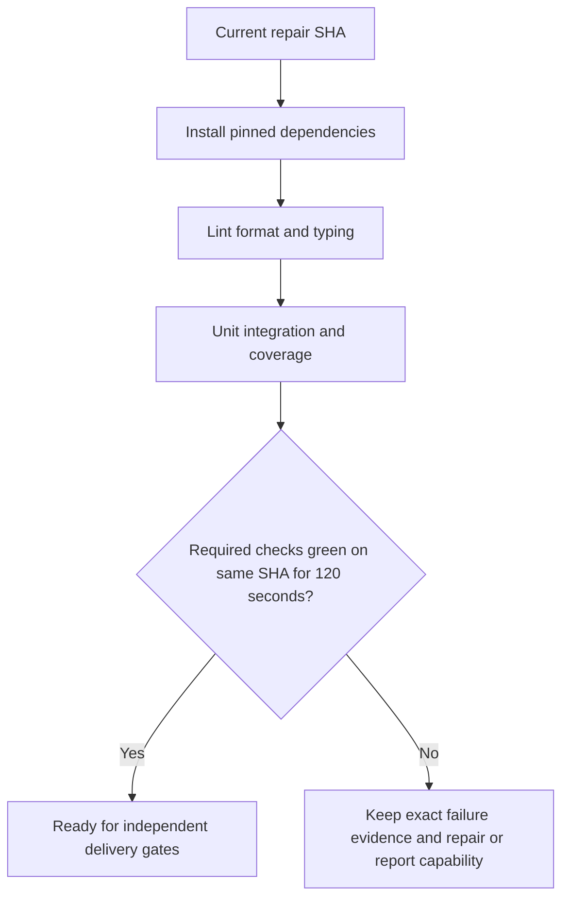

# Validator CI Prerequisites

**Branch:** codex/ci-guardian/2026-09-07-task-45c889a2
**Date:** 2026-09-07
**Status:** Approved
**Input:** Repair saved CI Guardian findings dc020452 and 2c66c241, including their actual CI prerequisites, without weakening checks or publishing private dependencies.

## User Scenarios & Testing

### P1 — Validate the complete current repair

As a maintainer I need the exact Validator Tests workflow to execute all its deterministic checks against the repair SHA.
**Priority reason:** The main workflow currently stops before its required tests execute.
**Independent test:** Run the unchanged lint, format, typing, unit, coverage and integration commands after provisioned dependencies; observe exact GitHub checks on the reviewed SHA.

```gherkin
Feature: Executable validator CI

Scenario: Repair source validation prerequisites
  Given Ruff rejects two union annotations and mypy rejects heterogeneous test fixtures
  When the repair is validated with the existing global check commands
  Then lint, formatting and typing finish without errors
  And negative fixtures still reject the same malformed data
Scenario: Provision the actual external authority
  Given tests require the real compatible Penflow CLI from a private repository
  When the workflow installs its pinned revision using authorized read-only access
  Then tests invoke the real CLI
  And private source and credentials are not published in this public repository
Scenario: Deterministic GitHub policy
  Given pull-request, manual or release validation is requested
  When GitHub runs the workflow
  Then only deterministic checks run without any model provider or model credential
  And local opt-in generation tools remain available
Scenario: Normative corpus is private and exact
  Given AST rules require javascript, rust and swift-kotlin convention documents
  When CI checks out only those documents from the verified immutable revision
  Then source-hash validation and the full AST tests remain active
  And private contents are removed after consumers without public artifacts or caches
Scenario: Preserve complete CI proof
  Given local unit, integration and visual coverage checks have passed
  When the exact workflow completes on the reviewed SHA
  Then all required checks remain successful for at least 120 seconds
  And missing private dependency access produces an explicit failure
Scenario: Missing private capability
  Given private dependency access is unavailable
  When deterministic CI validation requests that capability
  Then that check fails explicitly
  And no successful CI stability claim is recorded
```



## Functional Requirements

- **FR-001:** Correct the two RUF036 annotations, formatting violations and all fixture typing errors blocking the exact existing global checks; retain production types and negative-test behavior. Maps to AC-001.
- **FR-002:** Provision an actual compatible Penflow CLI from an immutable verified source revision through authorized private read access; never substitute a stub, vendor private source publicly or expose credentials. Maps to AC-002.
- **FR-003:** Run the existing unit and integration suites with required Node/Chromium dependencies and isolated test temporary directories; retain all tests and repair remaining causal failures. Maps to AC-003.
- **FR-004:** Preserve the exact 94 percent branch-coverage threshold and add behavioral regression tests for uncovered baseline-link validation paths. Maps to AC-004.
- **FR-005:** Keep GitHub validation deterministic: remove automatic real-model generation, provider installation and model-credential requirements while retaining local opt-in generation tools. Privately provision the three normative corpus documents at immutable revision11976242fc5b9ae5f3a574e19339b78ebd18a0c4, preserve source-hash validation and full AST tests, and record success only for the unchanged reviewed SHA after120seconds of stable successful checks. Maps to AC-005 and AC-006.

## Acceptance Criteria

### AC-001

Given the current repair tree, when existing global checks run, then global ruff check, ruff format --check, pyright validator and mypy . exit zero; the three approval-model fixture diagnostics disappear without ignored errors.
### AC-002

Given the pinned actual CLI, when the real authority suites run, then real Penflow positive/negative subprocess tests pass with the verified pinned CLI; missing CLI still rejects certification.
### AC-003

Given isolated dependency setup, when existing full suites run, then full unit and level_3a integration commands pass after isolated dependency setup; no test or required check is disabled.
### AC-004

Given correct and foreign healthy-link fixtures, when the existing coverage command runs, then the existing visual-gate coverage command exits zero at its unchanged 94 percent threshold; healthy correct links pass and foreign-target links are rejected by regression tests.
### AC-005

Given one reviewed repair SHA, when CI is observed twice at least 120 seconds apart, then the exact primary workflow and required checks are successful on one reviewed SHA in two observations at least 120 seconds apart; unavailable credentials remain explicit unmet evidence.

### AC-006

Given the committed GitHub workflow, when its deterministic policy and dependency wiring are checked, then it contains no automatic model-provider job, installation or model secret; local opt-in generation remains available; the three actual pinned normative files are privately supplied before full AST collection, source hashes stay enforced, and cleanup prevents publication of private contents.

## Key Entities

- Repair SHA: immutable identity shared by review, CI checks and delivery.
- Dependency revision: verified immutable Penflow and normative-corpus Git commits; access stays private.
- Check receipt: exact argv, cwd, exit code, scope, time and output artifact.

## Edge Cases

- Nested pytest must not inherit a parent basetemp that contains its cwd.
- Temporary fixtures must not inherit a parent .specs directory or ESM package.json.
- Private-source access may be unavailable; no fallback can claim the missing proof. GitHub validation requires no model credential.
- A changed SHA invalidates previous CI stability observations.

## Success Criteria

- **SC-001:** All existing local checks pass with zero suppressed failures (AC-001 through AC-004).
- **SC-002:** Exact same-SHA CI stability is proven before delivery gates (AC-005).
- **SC-003:** No private source, secret, check exclusion or threshold reduction appears in the delivered diff (AC-001 through AC-006).
