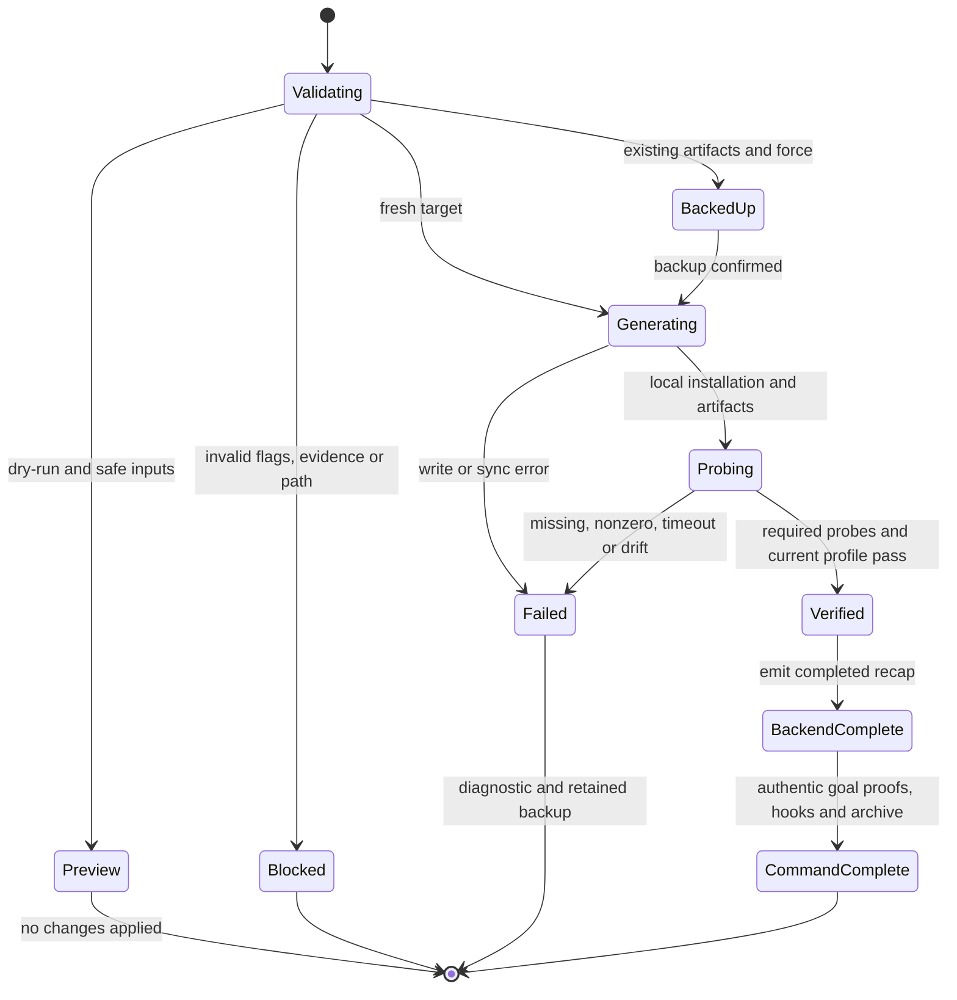

# Technical Plan: Autonomous From-Code Recovery

- **Feature:** 080-autonomous-from-code-recovery
- **Date:** 2026-10-09
- **Status:** Approved
- **Scope:** M — four FR, six AC; local bootstrap metadata and subprocess boundaries.

## Summary

Replace the hardcoded shell generator with typed, evidence-based Python detection, rendering and safe recovery; compile autonomous goals that retain genuine closure obligations.

Read [spec](spec.md) for normative requirements.

Implementation context:
- Inspect [bootstrap backend](../../../scripts/init-from-code-autonomous.sh).
- Inspect [installer](../../../scripts/init.sh).
- Inspect [agent sync](../../../scripts/sync-agent-assets.sh).
- Inspect [init skill](../../../.agent-sync/skills/spec-init/SKILL.md).
- Inspect [goal inventory](../../../validator/goal_inventory.py).

## Technical Context

| Aspect | Choice | Reason |
|---|---|---|
| Language | Existing Python >=3.11; stdlib JSON, tomllib, pathlib, subprocess | Current LiveSpec runtime; no new dependency or runtime migration |
| Models | Frozen typed dataclasses; explicit domain errors | Separate observed facts, provenance and unknown fields |
| Storage | Target-project files and unique local backup directories | Filesystem remains authoritative; no service/database |
| Entry point | Existing shell path becomes a thin Python launcher | Preserve backend positional target and timeout compatibility |
| Tooling | Existing pytest, Ruff and strict Pyright | Existing repository testing strategy |
| Platform | Local macOS/Linux CLI; target profiles may be desktop/web/Python/Rust | Detection describes the target, not LiveSpec's own stack |
| External interactions | Bounded version probes, official installer/sync/hooks CLI | No LLM, network install, application build or UI certification |

## Constitution Check

| Principle | Result | Application |
|---|---|---|
| Layered validation | PASS | Validate arguments, manifests and destination safety before writes; verify generated profile before completed recap |
| Provider agnosticism | PASS | Deterministic backend uses no model/provider; native reviews retain resolved model identity |
| Filesystem authority | PASS | All writes confined to selected project; source manifests read only; backups preserve prior artifacts |
| Fail fast/clear exits | PASS | Invalid arguments exit 2; operational failures nonzero with manifest/tool/artifact context; no READY on required failure |
| Minimal/composable surface | PASS | Keep existing wrapper; pure detector/renderer, isolated recovery/probe boundaries and read-only verification |
| No hosted infrastructure | PASS | No server, SaaS assumptions, telemetry or provisioning |
| Naming/size/typing | PASS | Python snake_case overrides general kebab-case; modules <=300 lines, focused functions preferably <=30 lines; typed public APIs and Google docstrings |
| Testing/traceability | PASS | Fixture execution proves each AC; later implementation maps source anchors and current acceptance evidence |

## Design Decisions

- Independently inspect `package.json`, root and `src-tauri/Cargo.toml`, `pyproject.toml`, Tauri JSON configuration and corroborating TypeScript/lockfile markers. Parse supported manifest structures strictly; contextual errors replace guessed fallbacks. Unsupported evidence-bearing manifest formats fail explicitly rather than silently misclassifying them.
- Product name precedence: observed Tauri `productName`, then observed package/project name; directory basename may identify the local directory but cannot become an observed product claim. Preserve technical package names separately. Retain every detected frontend/native family; Tauri native surface must not collapse to web-only.
- Manager evidence: explicit `packageManager`, then corroborated native build-command manager, then unique lockfile. Recognize manager command tokens without executing manifest commands. Conflicting evidence fails; absence stays unknown and cannot produce an npm probe/default. Installed testing tools and declared scripts are listed once; unobserved product roles, growth, regions, budget, deployment and auth remain Unknown.
- `ObservedProfile` includes evidence paths, content identities and fact provenance. `InitOptions` contains resolved target, force, dry-run, verify-only and finite total timeout. `ProbeResult` contains argv, actual stdout/stderr, exit, duration and timeout/missing status. No persisted database model; ER diagram and OpenAPI contract are not applicable.
- `--verify-only` re-detects current profile and checks the generated profile identity plus critical document values/content identity; existence or an old completed marker is insufficient. It writes no receipt, cache, directory, hook, integration or artifact. Missing/changed manifests, edited generated content and escaping paths return nonzero.
- Required probes come from observed families and selected manager (e.g. Bun plus Cargo for hybrid, npm for web/npm, current Python for Python, Cargo for standalone Rust). Execute only allowlisted version argv with stdin closed, captured output, finite per-call timeout capped by remaining total budget. Missing tool, nonzero or timeout yields an actual failure report and no READY/completed recap. Tool availability proves tooling only.
- Plan generation and path validation precede mutations. For existing specs without force, fail noninteractively; with force, back up existing `.specs`, `.conventions`, `.gitignore`, `AGENTS.md`, `CLAUDE.md` into a unique sibling project-local directory before any overwrite. Snapshot links without following external targets. Check every planned destination and ancestor; reject escaping symlinks, including integration/asset/provider-output paths. Source/manifests are never destinations.
- Recovery overlays an explicit generated-file allowlist rather than deleting `.specs`. Retain existing feature/hook/run histories, custom files and user integration text outside LiveSpec markers; retain custom preflight sections and valid convention routing. Back up invalid generated conventions before repairing their index/manifest to existing `ai-ressources/code-conventions` sources. Preserve historical ADRs/changelogs and update only owned bootstrap artifacts.
- Stage document bytes and use safe atomic replacement for each generated file after backup. Any subsequent sync/probe/verification failure leaves a non-completed state with exact diagnostics and the preserved backup; an old completed recap must not survive as current success. No promise of application runtime or all-or-nothing rollback after an external sync failure.
- Reuse official install/sync/hook procedures through explicit noninteractive paths. Add only the minimal installer compatibility needed to prevent prompts/false success during authorized force recovery; preserve standalone interactive behavior. Mutable local agents are copies, including replacing legacy shared-source symlinks safely before `cc-hub agent build`; read-only skill/rule links may remain links. Never write through a shared agent directory or provider-output escape.
- Normalize autonomous invocation to `--from-code --auto` before new goal render. Preserve `--dir` target and `--force`, support `--dry-run` without writes, and reject `--deep` or incompatible autonomous combinations contextually before mutations. Dry-run must not claim completed initialization. Interactive inventories keep interviews and stack confirmation; new autonomous inventories keep installation, observed generation, current verification, integrations, hooks and archive. Historical goals are immutable.

## Interaction Scenarios

```gherkin
Feature: Evidence-based bootstrap orchestration
  Scenario: Hybrid initialization executes real probes
    Given supported Tauri, Cargo and React manifests with consistent Bun evidence
    When autonomous initialization runs for the selected directory
    Then detection retains native and frontend facts with provenance
    And allowlisted Bun and Cargo version probes execute with bounded timeouts
    And generated artifacts pass current profile verification before completion
  Scenario: Required probe failure blocks completion
    Given a required tool is missing, fails or times out
    When the bootstrap executes its probes
    Then the report records the actual failure and contextual nonzero exit
    And no READY verdict or completed recap is emitted
```

```mermaid
sequenceDiagram
    participant C as Init command
    participant D as Detector
    participant R as Recovery writer
    participant P as Probe runner
    participant V as Read-only verifier
    C->>D: validated options, selected manifests
    D-->>C: profile, evidence identities or error
    C->>R: safe destinations, optional force backup
    R-->>C: installed/generated paths or failure
    C->>P: allowlisted argv, remaining deadline
    P-->>C: actual output, exit and timeout results
    alt Required probes pass
        C->>V: current manifests and generated artifacts
        V-->>C: verified identity or drift
        C-->>C: complete backend artifact; prove goal closure separately
    else Required probe fails
        C-->>C: nonzero diagnostic; no completed claim
    end
```

## Recovery Lifecycle

```gherkin
Feature: Safe initialization recovery
  Scenario: Force recovery preserves prior evidence
    Given prior generated specs and custom feature, hook and run history
    When authorized initialization runs with --force
    Then a unique local backup preserves prior generated artifacts before overwrite
    And custom history and source/shared-target bytes remain unchanged
    And current validation permits completion only after real required probes pass
  Scenario: Preview and unsafe destination have no mutation
    Given a dry-run invocation or an escaping generated-artifact destination
    When initialization validates its proposed writes
    Then dry-run displays the proposal with no changes applied
    And an unsafe destination returns a contextual error without modifying its outside target
```



## Implementation Plan

### Step 1 — Detect typed observed profiles

**FR covered:** FR-001.1: Independent manifest detection.
- New `validator/init_profile.py`: `detect_profile`, supported JSON/TOML parsers, immutable profile/evidence models; split family helpers if the module reaches 300 lines. Record source hash identities, product/technical names, independent families, manager conflicts and unknown fields.
- Derive tests from AC-001/002/003 in new `tests/test_init_profile.py`: hybrid Bun/Tauri/React, web/npm, Python, standalone Cargo, missing/ambiguous manager, malformed manifests, unsupported formats and contradictory manager evidence.

### Step 2 — Render documents and run actual tooling probes

**FR covered:** FR-001.2: Preserve observed facts, FR-002.1: Documents and bounded tooling proof.
- New `validator/init_documents.py`: `render_documents` returns path/content map for project, constitution, stack, observed ADR, roadmap, testing, preflight/report and recap; use explicit unknowns instead of invented product backlog. New focused `validator/init_probes.py` if needed: `run_probes` captures allowlisted bounded argv outcomes under total deadline.
- Generate a project-specific constitution and observed stack retention rationale, deduplicated declared test scripts/tools and native/frontend evidence distinctions. No generic unfilled templates or deployment assumption. Completed recap is written only after all required success predicates.
- New `tests/test_init_documents.py` and probe integration coverage: exact evidence values, unknown product/deployment values, no duplicate tests, missing tool, nonzero, timeout and no READY/completion on failure.

### Step 3 — Implement safe recovery and current read-only verification

**FR covered:** FR-002.2: Verify current generated identity, FR-003.1: Safe recovery and flag dispatch.
- New `validator/init_from_code.py`: thin parsed boundary `main` plus `initialize_from_code`/`verify_current_profile`; split recovery and verification into focused `validator/init_recovery.py`/`validator/init_verification.py` as needed. Existing `scripts/init-from-code-autonomous.sh` becomes a thin launcher retaining target/timeout/force compatibility.
- Guard all planned paths before backup/write, create unique local backup, overlay owned artifacts and preserve custom history. Dry-run and verify-only bypass every mutation. Reject unsupported/incompatible flags before writing. Minimal compatible changes to existing `scripts/init.sh` only where needed for explicit noninteractive install without resetting custom history.
- Extend `tests/test_spec_init_autonomous_bootstrap.py`: subprocess with closed stdin, target directory with spaces, force re-run backup equality, custom features/hooks/runs/integration text, invalid convention repair versus valid preservation, source hashes, current source drift/content tamper, dry-run tree equality and unsupported flags/combination failure.

### Step 4 — Isolate mutable agents and verify integration boundaries

**FR covered:** FR-003.2: Local mutable agent isolation.
- Modify `scripts/sync-agent-assets.sh`: create project-local agent copies, safely detach legacy links, validate local/provider output destinations before build/link; retain existing supported skill/rule linking. Keep copies inside selected root; never follow shared links on mutation.
- New `tests/test_init_agent_isolation.py`: fresh and legacy linked cases with a controlled `cc-hub` executable that writes during actual subprocess build; compare shared-source and outside-target hashes. Cover sync failure and escaping asset/integration destinations.

### Step 5 — Compile honest autonomous goals and synchronize commands

**FR covered:** FR-004.1: Autonomous branch and full closure, FR-003.3: Preserve command flag semantics.
- Modify `validator/goal_inventory.py`, `validator/goal_contract_model.py` and init SKILL execution/DoD rows: add `init-autonomous`/`init-interactive` branch selection. Normalize autonomous intent before goal render, preserve selected target/force/dry-run and reject unsupported scan combinations. Remove immediate return after backend exit 0; current profile verification, integration evidence, hooks and archive remain required.
- Modify `.agent-sync/skills/spec-init/expectations.md` with today's `last_reviewed`, and `README.md`/relevant command references for truthful profile/recovery/closure semantics. Optimize changed skill through the current meta-skill-creator guidance before any later commit; this task does not commit.
- Extend `tests/test_goal_contracts.py` or focused new `tests/test_init_goal_profiles.py`: actual rendered autonomous inventory omits interviews/confirmation but retains closure; interactive inventory unchanged, aliases normalized, historical fixture/goal files byte-identical. Update old early-return assertion to require complete current closure behavior.

### Step 6 — Execute acceptance evidence and map implementation

**FR covered:** FR-001.3: Profile fixture evidence, FR-002.3: Probe and verification evidence, FR-003.4: Preservation evidence, FR-004.2: Goal compatibility evidence.
- Execute the focused unit/subprocess fixture suites under an independent runner and mapped acceptance receipt; run scoped Ruff/Pyright and required repo-scope conventions verification. Use actual transcripts, fixture tree/backup comparisons and SHA256 before/after manifests; controlled tooling outputs are fixture behavior, not production tool certification.
- Update feature `implementation.md`, `progress.md`, feature/global changelogs and registry with actual source/test mappings. Refresh stale spec/plan review after governed init-skill changes, then require current Analyze/progression and native child goal closure. Never repair an old immutable goal by rewriting it or declaring an incomplete session complete.
- Parent orchestration resumes the real target session only after corrective validation. Its later target verification is the operational acceptance boundary; this feature does not modify Handy or certify application build/UI/runtime.

## Resolved Test Commands

| Action | Command | Availability |
|---|---|---|
| Unit/integration fixtures | `.venv/bin/pytest -q tests/test_init_profile.py tests/test_init_documents.py tests/test_spec_init_autonomous_bootstrap.py tests/test_init_agent_isolation.py tests/test_init_goal_profiles.py` | pytest 9.1.1 verified; new files planned |
| Existing goal regressions | `.venv/bin/pytest -q tests/test_goal_contracts.py` | pytest verified; existing suite |
| Lint | `.venv/bin/ruff check <changed Python files>` | Ruff 0.15.20 verified; resolve changed paths after implementation |
| Format | `.venv/bin/ruff format --check <changed Python files>` | Ruff verified |
| Type check | `.venv/bin/pyright <changed validator modules>` | Pyright 1.1.411 verified; strict project configuration |
| Conventions | `livespec conventions verify --repo . --feature 080-autonomous-from-code-recovery --json` | LiveSpec executable verified; repo-scope PASS required for implementation closure |
| Full no-LLM suite | `.venv/bin/pytest tests/ --ignore=tests/integration -v --tb=short` | Existing strategy; run only if changed boundaries warrant broader coverage |
| Visual/application runtime | Not applicable to bootstrap fixtures | No UI added; target app runtime remains separate operational verification |

## Testing Strategy and QE Gates

| Priority/gate | Concrete tests and evidence | FR/AC |
|---|---|---|
| P0 profile correctness | `test_init_profile.py` and `test_init_documents.py`: all four fixture families, evidence citations, unknowns, deduplication | FR-001/002; AC-001/002 |
| P0 fail-closed commands | `test_spec_init_autonomous_bootstrap.py`: malformed/conflict, real failed/missing/timed-out fixture probes, verify-only tamper/drift, dry-run/unsupported flags/selected target; nonzero and no READY/completed claim | FR-001/002/003; AC-003 |
| P0 preservation | Bootstrap subprocess backup equality, custom history and source bytes; reject escaping generated paths before outside-target mutation | FR-003; AC-004 |
| P0 shared isolation/conventions | `test_init_agent_isolation.py`: controlled executable mutates actual local copy only, legacy-link detachment, source hashes; valid routing unchanged/invalid repair resolves real files | FR-003; AC-005 |
| P1 inventory compatibility | `test_init_goal_profiles.py`, existing goal tests: rendered branch/closure/aliases and unchanged historical+interactive obligations | FR-004; AC-006 |
| P1 quality/semantic readiness | Scoped static checks, structural validation, current complete native spec/plan receipts, shared progression and repo conventions PASS | All FR/AC |

- **Risk:** High criticality, shared blast radius, primary Data/Contract risk. Applicable functional/regression/compatibility/data/security/performance/operability dimensions; accessibility not applicable to a non-UI bootstrap.
- **Execution evidence:** Independent runner receipt and mapped AC assertions; stdout/stderr with wrapped exit; before/after source/shared hashes, backup equality, current profile verification and goal inventories. Planned tests or availability probes do not prove implementation.
- **Current gaps:** Backend/test implementation and target session completion remain unproduced. Source changes require current semantic review refresh before final acceptance.
- **Boundaries:** QE sets gates; independent semantic review assesses design, execution tests prove fixture behavior, parent orchestration verifies real target recovery. Tooling READY never certifies an application runtime.

## Risks & Considerations

- Partial external sync can fail after backup and some installation writes; preserve backup, invalidate current completion and report the exact step. Safe force re-run is the recovery path; no silent destructive rollback.
- Mixed or incomplete manager evidence must remain unknown or fail on contradiction; no convention/runtime preference may override target manifests. Unsupported formats must name the unsupported file and recovery action.
- Symlink containment checks apply to all writable paths, including assets/integration outputs and backup ancestry. Preserve link metadata without following it; concurrent target mutation remains outside this single-run contract and should be detected by source identity recheck before completion.
- Probe timeout uses remaining total budget, preventing a sequence of individually bounded calls from exceeding autonomous execution budget. No package installation or dependency script execution occurs during detection/probes.
- Shared source and user history must remain byte-identical. Introduce narrowly scoped noninteractive installer behavior and test existing interactive semantics; avoid a wholesale unrelated installer rewrite.
- Genuine source changes invalidate review caches. Refresh current reviews without changing historical verdicts or inflating review budget preemptively.
