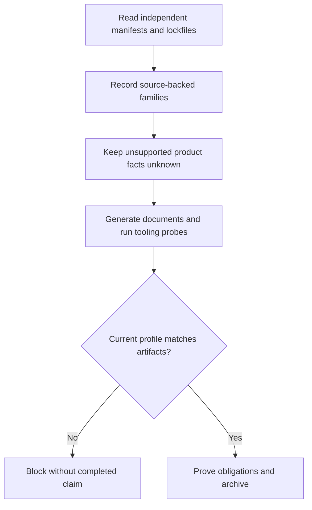
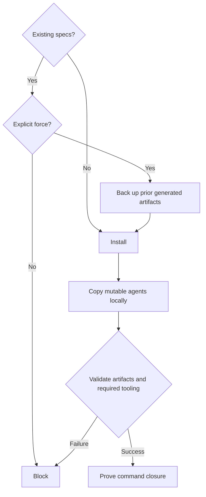

# Feature Spec: Autonomous From-Code Recovery

- **Feature:** Evidence-based autonomous bootstrap and safe recovery
- **Feature Number:** 080
- **Branch:** Current branch; no branch creation in this phase
- **Date:** 2026-10-09
- **Status:** Planned
- **Input:** Repair autonomous from-code initialization that misidentifies desktop projects, reports unexecuted checks, and leaves command completion unfinished.

## Scope and Source Evidence

- Repair the existing local bootstrap and recovery lifecycle; no application source change or new runtime.
- Inspect [the autonomous backend](../../../scripts/init-from-code-autonomous.sh): mutually incomplete package detection, hardcoded npm/web/product facts, preflight READY without a probe, and force recovery calling interactive init.
- Inspect [agent synchronization](../../../scripts/sync-agent-assets.sh): mutable agent builds can follow shared source symlinks.
- Inspect [init instructions](../../../.agent-sync/skills/spec-init/SKILL.md) and [goal inventory](../../../validator/goal_inventory.py): autonomous completion must preserve generation, validation, hooks and archive obligations.
- Existing goal identity/pairing and archive semantics remain outside this feature; historical immutable goals are preserved.

## User Scenarios & Testing

### Story 1 — Complete an observed autonomous bootstrap `P1`

**As a** maintainer, **I want** autonomous initialization to preserve all observed stack families and complete its command proof, **so that** the generated project facts and final status are verifiable.

**Priority reason:** Incorrect stack and false READY block continuation. **Independent test:** Initialize temporary hybrid, web, Python and Cargo projects and inspect their generated facts, executed tooling checks and normalized goal inventories.

```gherkin
Scenario: Hybrid desktop manifests remain independent evidence
  Given package.json declares React, Vite and TypeScript with Bun package manager evidence
  And src-tauri/Cargo.toml declares Tauri 2
  When spec-init --from-code --auto initializes the fixture
  Then the generated profile records Tauri 2, Rust, React, Vite, TypeScript and Bun with source evidence
  And unsupported roles, scale, budget, geography and deployment remain explicitly unknown
  And constitution, observed ADR and testing strategy contain no template placeholders
  And preflight contains executed version checks rather than an application runtime claim
Scenario: Standalone families and closure obligations are retained
  Given separate web/npm, Python and standalone Cargo fixtures
  When autonomous initialization compiles its goal and generates artifacts
  Then each fixture records only its observed families and tooling commands
  And interview and stack confirmation tasks are excluded from the autonomous goal
  And generation, output validation, integration verification, after-init hooks and archive remain required
  And backend exit zero alone does not complete the command
Scenario: Current profile verification detects drift without changing files
  Given previously generated artifacts and changed or malformed manifest evidence
  When profile verification runs
  Then it returns a contextual nonzero exit for inconsistent generated content
  And generated artifacts and application sources retain their prior bytes
  And no completed recap or READY claim is emitted
```



### Story 2 — Recover without altering source or shared agents `P1`

**As a** maintainer, **I want** explicit force recovery to preserve prior work and isolate mutable agents, **so that** recovery cannot overwrite source or another checkout.

**Priority reason:** Current force path can prompt or overwrite without backup. **Independent test:** Rerun initialized fixtures with custom features/hooks and legacy linked agents; compare backup contents and source/shared hashes.

```gherkin
Scenario: Explicit force preserves artifacts and uses local mutable agents
  Given prior generated specs, conventions and integration documents
  And existing feature, hook and run history plus legacy shared agent links
  When authorized autonomous initialization runs with --force
  Then a unique project-local backup preserves prior generated contents before overwrites
  And feature, hook and run history remain present
  And application source, manifests and outside shared targets are byte-identical
  And agent builds operate on project-local copies
Scenario: Unsafe inputs and failed tooling block completion
  Given malformed or contradictory manifest evidence, a missing required tool or an escaping generated-artifact symlink
  When autonomous initialization runs
  Then it returns a contextual nonzero exit
  And it emits no completed recap or READY claim
  And outside symlink targets remain unchanged
```



## Acceptance Criteria

### AC-001

A Tauri 2 + React/Vite/TypeScript + Bun fixture records all native/frontend families with file evidence; it invents no npm/web-only/SaaS/regions/roles/deployment facts.
### AC-002

Web/npm, Python and standalone Cargo fixtures record only observed families and tooling commands; testing tools are not duplicated and deployment is not invented.
### AC-003

Malformed or contradictory manifests, failed required tooling and changed/escaping generated-artifact content return contextual nonzero exits and no completed claim; current profile verification reads without mutation. Autonomous dispatch preserves the selected --dir target and explicit --force; --dry-run writes nothing, and unsupported --deep or flag combinations fail contextually before mutation.
### AC-004

A force rerun saves prior specs, conventions and integration documents in a unique local backup before overwrite, retains feature/hook/run contents, and leaves source/manifests and outside symlink targets byte-identical.
### AC-005

Fresh and legacy linked mutable-agent builds use local copies and leave shared-source hashes unchanged; valid convention sources remain intact and repaired convention sources resolve to actual ai-ressources files.
### AC-006

Autonomous from-code goal inventory excludes interview/stack confirmation but retains installation, generated-profile validation, integration verification, hooks and archive. Interactive initialization retains its interview obligations; historical immutable goals are unchanged.

## Functional Requirements

- **FR-001:** Detect manifest families independently. Explicit package-manager declarations, corroborated native build commands and lockfiles establish manager evidence; contradictory manager evidence and unsupported/malformed manifests fail contextually. Unsupported product roles, growth, geography, budget and deployment remain explicitly unknown. **Maps to:** AC-001, AC-002, AC-003.
- **FR-002:** Generate project-specific constitution, observed stack ADR and testing strategy; execute bounded argv version probes for actual tooling preflight. Required failures prevent completed recap and READY. Validate current generated content against observed source identities through a read-only profile check; tooling availability never represents application runtime success. **Maps to:** AC-001, AC-002, AC-003.
- **FR-003:** Autonomous dispatch preserves the selected --dir target and explicit --force, honors --dry-run without writes, and rejects unsupported --deep or flag combinations contextually before mutation. Force recovery is noninteractive and creates a unique local backup before overwriting generated specs, conventions or integration documents; retain features/hooks/run history and all source bytes. Reject escaping generated-artifact symlinks and copy mutable shared agents before local builds. Keep valid convention sources; back up and repair invalid generated conventions using actual ai-ressources paths. Resolve explicit AIRESOURCES configuration before the sibling checkout default. **Maps to:** AC-003, AC-004, AC-005.
- **FR-004:** Compile a distinct autonomous from-code branch before generation, excluding interview/confirmation while retaining generation, current profile/output validation, integration verification, hooks and archive. Only current artifacts plus authentic goal proof/archive permit command completion; interactive and historical contracts retain their original obligations. **Maps to:** AC-006.

## Key Entities

- **Observed profile:** Independently detected manifest families, package manager, source identities and explicit unknown product fields.
- **Recovery backup:** Unique project-local snapshot of prior generated artifacts before overwrite.
- **Autonomous command run:** Immutable current goal, task evidence and archive; backend success is one input only.

## Edge Cases

- Unsupported autonomous flags or combinations fail before any write; --dry-run leaves source and generated artifact bytes unchanged.
- Package-manager declaration conflicts with lockfiles or corroborated native commands: fail contextually without READY.
- Manifest decoding fails or observed source changes after generation: read-only verification detects drift.
- Existing generated artifact points outside the project: refuse mutation, retain outside bytes.
- Required version probe is absent, fails or times out: report the exact tooling failure and prevent completion.
- Existing valid conventions and feature/hook/run contents survive force recovery; invalid generated conventions are backed up before repair.

## Quality Engineering

- **Risk:** High criticality; shared blast radius; primary Data/Contract risk; confidence conditional on fixture evidence.
- **Applicable dimensions:** Functional correctness, regression, CLI/contract compatibility, data integrity, security boundaries, bounded subprocess performance, operability. Accessibility is not applicable to this CLI bootstrap.
- **P0 gates/evidence:** Fixture transcripts for each AC, before/after source and shared-target hashes, backup content equality, required-probe exit/timeout evidence, current goal inventory comparisons.
- **P1 gates/evidence:** Structural validation, independent native semantic review and unchanged interactive inventory comparison.
- **Non-functional expectations:** External version probes use explicit finite timeouts and argv; context identifies failed manifest/tool/artifact; existing autonomous command time budget remains bounded.
- **Gaps:** Implementation and runtime fixture evidence are not yet produced in this specification phase.
- **Boundary:** QE defines expected proof; independent review assesses the spec and subsequent test execution proves behavior. No tooling result certifies an application runtime.

## Clarifications

- Accepted parent scope: non-UI LiveSpec bootstrap recovery only; application source, user product decisions and goal-pairing/archive repair are excluded.
- Existing flag compatibility is a technical recovery constraint: preserve target/force and dry-run semantics, or reject unsupported scan combinations before writes.
- Missing business facts remain explicit unknowns; this correction does not authorize product assumptions.

## Success Criteria

- **SC-001:** All four fixture profiles (hybrid desktop, web/npm, Python, Cargo) match observed manifests with zero invented product or deployment facts.
- **SC-002:** Every recovery fixture retains prior generated backup contents and application/shared-source hashes; all unsafe/error fixtures return nonzero without completed claims.
- **SC-003:** Fresh autonomous goals retain every closure obligation and omit interview/confirmation; interactive and historical goal comparisons show no altered obligations.
