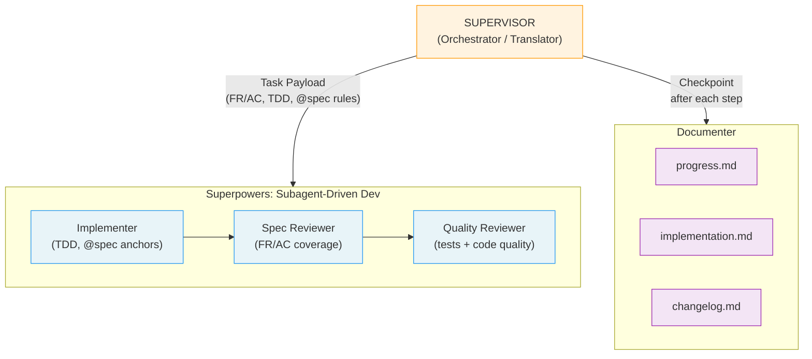

# 🔥 LiveSpec — Specs that live beyond implementation

> A universal, tool-agnostic specification framework with visual diagrams, living documentation, and spec-to-code traceability for AI-driven development.

---

## The Problem

Specs today are **throwaway documents**:

- Written once, never updated after implementation
- No visual diagrams — just walls of text
- No traceability between spec requirements and actual code
- No history of what changed and why
- Tools and AI assistants forget the context

Six months later, nobody knows **why** something was built the way it was.

---

## What LiveSpec Does Differently

| Problem | LiveSpec Solution |
|---|---|
| No visuals | **Mermaid diagrams mandatory** in every spec and plan |
| No traceability | **Implementation mapping** — every spec requirement links to `@spec` anchors in code |
| Specs rot after launch | **Living docs** — specs updated when behavior changes |
| No history | **Per-feature + journey changelogs** — every behavior and journey change is recorded |
| UI behavior hidden in screenshots | **Penflow contracts** — root `penflow/` owns semantic UI flow correctness |
| No visual testing | **Playwright baselines** built into implementation + check |
| Regression flows tied to one feature | **Cross-feature User Journeys v2** — global journeys cover multiple features, compile once, and run as non-regression tests |
| Stack decisions lost | **Stack presets with decision trees** — know WHY you chose each tool |
| One-time init | **Brainstorm-driven init** — AI interviews you before generating anything |
| Tool-specific | **Tool-agnostic** — works with Claude Code or any AI that reads Markdown |

---

## How It Works

```mermaid
flowchart LR
    P["/spec-propose\nDiscover what\nto build"] --> S["/spec-specify\nWrite the spec\n(stories, AC, FR)"]
    S --> PL["/spec-plan\nTechnical plan\n(diagrams, steps)"]
    PL --> I["/spec-implement\nCode, test,\nmap to spec"]
    I --> J["/spec-journey\nCross-feature\nregression flows"]
    J --> T["/spec-test\nAudit + Penflow\n+ visual gates"]
    T --> C["/spec-check\nVerify spec\nvs code"]
    C --> F["/spec-fix\nFix gaps\n(functional + visual)"]
    F --> E["/spec-explain\nLiving\ndocumentation"]

    style P fill:#e8f4f8,stroke:#2196F3
    style S fill:#e8f4f8,stroke:#2196F3
    style PL fill:#e8f4f8,stroke:#2196F3
    style I fill:#e8f4f8,stroke:#2196F3
    style J fill:#e8f4f8,stroke:#2196F3
    style T fill:#e8f4f8,stroke:#2196F3
    style C fill:#e8f4f8,stroke:#2196F3
    style F fill:#e8f4f8,stroke:#2196F3
    style E fill:#e8f4f8,stroke:#2196F3
```



Each command works standalone, or chain them all with `/spec-feature` for an end-to-end pipeline with validation gates.

---

## The 23 Commands

| Command | What it does |
|---|---|
| `/spec-init` | 3-phase conversational brainstorm → generates project profile, stack, `.specs/` structure + CLAUDE.md. `--from-code`: reverse-engineer existing codebase. |
| `/spec-migrate` | Upgrade project to latest LiveSpec version — applies pending migrations, updates local symlinks |
| `/spec-propose` | Analyze project context and intelligently propose the next feature(s) to build |
| `/spec-specify` | Create a new feature spec with user stories, Mermaid flows, AC, and FR |
| `/spec-plan` | Generate technical plan with sequence, state, and ER diagrams |
| `/spec-implement` | APEX-style auto-pipeline: implement → test → visual baselines → map to spec. Multi-agent orchestration by default (`--mono` for single-agent) |
| `/spec-test` | Audit AC test coverage, generate missing tests from Gherkin, execute suite, validate Penflow expected/actual UI trees, capture visual baselines, verify design fidelity |
| `/spec-journey` | Create, edit, bootstrap, impact-check, inspect, compile, and run global User Journeys v2 across multiple features |
| `/spec-check` | Compare spec vs actual code — find gaps, verify AC, report Penflow contract status, detect visual drift |
| `/spec-doctor` | Project health audit — orchestrates coherence validation and reports stale mappings, missing tests, runner drift, unenforced hooks, lifecycle gaps, visual orphans |
| `/spec-fix` | Fix implementation gaps from spec-check — functional and visual corrections with retry loop |
| `/spec-explain` | "How does X work?" — living documentation from spec + diagrams + history |
| `/spec-stack` | Evolve your stack and analyze impact on existing features |
| `/spec-feature` | Full pipeline: specify → plan → implement → test, with validation gates between phases |
| `/spec-preflight` | Verify tooling, auth, and API tokens before starting implementation — runs auto-install, detects blockers, gates feature work |
| `/spec-hooks` | Show, create, or edit lifecycle hooks for a command |
| `/spec-play-coverage` | Open spec coverage playground with live grep data |
| `/spec-ship` | Batch autopilot: ship multiple features from roadmap end-to-end |
| `/spec-refine` | Iteratively refine existing artifacts (project, feature spec, or plan) via guided conversation |
| `/spec-status` | Display factual status overview of roadmap and features |
| `/spec-refresh-conventions` | Manually initialize or refresh project conventions from the LiveSpec stack |
| `/spec-refresh-from-brainstorm` | Sync brainstorm lifecycle deltas into LiveSpec through an interactive Impact Report |
| `/spec-verify-output` | Verify a command run artifact against its expectations contract |

---

## User Integrations (`~/.config/livespec/*.md`)

LiveSpec supports **user-level Markdown integrations**: drop a `<name>.md`
file under `~/.config/livespec/` and it is automatically injected into the
LLM context of the LiveSpec commands you target via its YAML frontmatter.
This is a hook-resolution **Level 0**, prepended to the existing Global /
Project / Local levels.

```yaml
---
integration: <name>
commands: [specify, plan]   # any subset of .agent-sync/skills/spec-*
phase: before               # before | after (default: before)
mode: extend                # extend | override (default: extend)
order: 100                  # lower = injected earlier
---

<markdown body — injected as-is, with {{feature_name}} etc. substituted>
```

**Opt-in by design.** Without a file in `~/.config/livespec/`, the
framework is tool-agnostic — no warning, no error, identical behavior.
A starter template is shipped under
[`examples/config/mockups.md.example`](examples/config/mockups.md.example).

See [`system/integrations.md`](system/integrations.md) for the full
specification (eligibility rule, override scope, template variables,
chained-pipeline semantics, `--economy` mode limitation). Diagnostic:
`livespec integrations list` or `/spec-hooks <command>`.

This pattern is independent of `~/.config/livespec/provider.py` (the
existing Python callable that overrides LLM routing).

---

## Quick Start

### Claude Code (recommended)

```bash
# 1. Clone LiveSpec
git clone https://github.com/julien-m/livespec.git ~/livespec

# 2. Install the bootstrap commands globally (required once)
bash ~/livespec/scripts/install.sh

# 3. Initialize LiveSpec in your project (creates .specs/ + CLAUDE.md)
cd your-project
/spec-init

# 4. Discover what to build first
/spec-propose

# 5. Create your first feature spec
/spec-specify "User can receive real-time notifications"

# 6. Generate technical plan
/spec-plan notifications

# 7. Implement with auto-pipeline
/spec-implement notifications

# 8. Add a cross-feature regression journey when a flow spans features
/spec-journey create

# 9. Verify spec vs code
/spec-check notifications

# 10. Explain the feature (living docs)
/spec-explain "how do notifications work?"

# Alternative: full pipeline in one command
/spec-feature "User can receive real-time notifications"
```

### Other AI tools

For any AI tool that reads Markdown, paste the content of `system/spec-system.md` into your tool's context. The spec system is tool-agnostic — any AI that can read `.specs/` will follow the rules.

---

## Workflow Guide

### Manual flow (step by step)

Run each command individually with full control at every stage:

```bash
/spec-specify "User can filter by date"   # 1. Generate spec.md
/spec-plan date-filter                     # 2. Generate plan.md
/spec-implement date-filter                # 3. Implement from plan
/spec-journey create                       # 4. Add cross-feature regression flow
/spec-check date-filter                    # 5. Verify spec vs code
```

### Pipeline flow (`/spec-feature`)

Run the full pipeline in one command with validation gates between each phase:

```bash
# Interactive (default) — pauses for your approval between phases
/spec-feature "User can filter by date"

# Automatic — no pauses, auto-retries if plan review fails
/spec-feature "User can filter by date" --auto

# Resume an interrupted pipeline
/spec-feature --resume date-filter
```

### After implementation

```bash
/spec-test date-filter                     # Audit + generate missing tests
/spec-journey impact                       # Detect impacted old journeys
/spec-check date-filter                    # Verify spec-code alignment
/spec-explain "how does date filtering work?"  # Living documentation
/spec-stack                                # View or evolve the stack
```

---

## Command Reference

### `/spec-init`

Initialize LiveSpec in a project. Runs a 3-phase conversational brainstorm (interview → stack decisions → file generation).

```bash
/spec-init                       # Full interactive setup
/spec-init --auto                # Use defaults, skip questions
/spec-init --stack web-realtime  # Skip interview, use preset
/spec-init --from-code           # Reverse-engineer existing codebase into specs
/spec-init --from-code --deep    # Extended scan (git history, CI, env)
```

Key flags: `--auto`, `--stack [preset]`, `--from-code`, `--deep`, `--force`, `--dir [path]`, `--dry-run`

### `/spec-propose`

Analyze project context (vision, users, existing features, roadmap) and propose the next feature(s) to build. Read-only — no files created.

```bash
/spec-propose                     # Propose the next feature
/spec-propose --count 3           # Propose 3 ranked features
/spec-propose --role admin        # Focus on admin features
/spec-propose --mvp               # Only MVP-critical suggestions
```

Key flags: `--count N`, `--role [name]`, `--mvp`, `--auto`

### `/spec-specify`

Create a feature spec with user stories, Mermaid flowcharts, AC, and FR.

```bash
/spec-specify "User can upload profile photos"
/spec-specify "Payment processing" --branch --priority P1
```

Key flags: `--branch`, `--no-branch`, `--priority`

### `/spec-plan`

Generate a technical plan with sequence, state, and ER diagrams from a spec.

```bash
/spec-plan profile-photos
/spec-plan profile-photos --review          # LLM plan review (advisory)
/spec-plan profile-photos -r -R             # Review with all configured reviewers
/spec-plan profile-photos --no-contracts
```

Key flags: `--review` (`-r`), `--all-reviewers` (`-R`), `--no-contracts` (`-C`), `--diagram-only` (`-D`), `--auto` (`-a`)

### `/spec-implement`

Auto-implement from plan: code, test, verify, document. Multi-agent by default.

```bash
/spec-implement profile-photos            # Multi-agent (default)
/spec-implement profile-photos --mono     # Single-agent
/spec-implement profile-photos --resume   # Resume interrupted run
```

Key flags: `--mono`, `--economy`, `--resume`, `--no-visual`, `--no-save`, `--step`

### `/spec-test`

Audit test coverage against AC, generate missing tests from Gherkin scenarios, execute the full suite, and capture visual baselines.

```bash
/spec-test profile-photos                 # Test one feature
/spec-test --all                          # Test all implemented features
/spec-test profile-photos --audit-only   # Coverage audit only (no generation/execution)
/spec-test profile-photos --no-generate  # Run existing tests, don't generate missing ones
```

Key flags: `--audit-only`, `--no-generate`, `--no-visual`, `--all`, `--auto`, `--update`

### `/spec-journey`

Create and govern cross-feature User Journeys v2. Journey sources live globally at `.specs/journeys/<journey-id>/journey.yaml` and reference every covered feature/FR/AC with qualified `covers` refs. They can be created for old or already implemented features without `/spec-refine`.

```bash
/spec-journey create                       # Interactive journey from free-form intent
/spec-journey bootstrap --from-existing    # Propose journeys for old projects/features
/spec-journey edit onboarding-first-project # Governed edit with decision + changelog
/spec-journey impact                       # Detect changed files touching old journeys
/spec-journey run                          # Run compiled artifacts only
/spec-journey list
/spec-journey inspect onboarding-first-project
```

Low-level CLI:

```bash
livespec journey validate [--journey ID] [--feature SLUG] [--json]
livespec journey compile [--journey ID] [--feature SLUG] [--changed] [--force]
livespec journey run [--journey ID] [--feature SLUG] [--impacted] [--all] [--json]
livespec journey impact --changed-file PATH [--feature SLUG] [--json]
livespec journey migrate --from-v1 [--apply] [--json]
livespec journey list|inspect
```

Rules: create/edit compiles once; `run` never recompiles and fails on stale manifests. Edits require classification (`regression`, `intentional_update`, `obsolete`, `selector_fix`, or `coverage_expansion`) plus decision, changelog, validation, and run evidence. Visual checks may be native deterministic checks or strict JSON LLM screenshot checks. See [`system/testing/user-journeys.md`](system/testing/user-journeys.md).

### `/spec-check`

Compare spec vs actual code — find gaps, verify AC, detect visual drift.

```bash
/spec-check profile-photos
/spec-check                               # Check all features
```

### `/spec-explain`

Living documentation — understand how a feature works from spec + code + history.

```bash
/spec-explain "how do notifications work?"
/spec-explain profile-photos
```

### `/spec-stack`

View current stack, analyze change impact, create Architecture Decision Records.

```bash
/spec-stack                               # View current stack
/spec-stack "migrate from Supabase to Prisma"
```

### `/spec-feature`

Full pipeline: specify → plan → plan review → implement, with validation gates.

```bash
/spec-feature "Real-time notifications"              # Interactive
/spec-feature "CSV export" --auto                     # Automatic
/spec-feature --resume csv-export                     # Resume
/spec-feature "Dark mode" --mono                      # Single-agent implementation
/spec-feature "Payment processing" --branch --priority P1  # With branch + priority
```

Key flags: `--auto`, `--resume`, `--branch`, `--priority`, `--mono`, `--economy`, `--step`

### `/spec-doctor`

Project-level health audit. `livespec doctor` orchestrates `livespec validate --coherence` and adds practical downstream checks for stale implementation maps, missing mapped tests, runner inclusion, hook enforcement, lifecycle ambiguity, visual evidence orphans, cleanup safety, and `R3.2` traceability infos for mapped files missing `@spec(...)` anchors.

```bash
livespec doctor
livespec doctor --format json
livespec doctor --strict
livespec doctor --fix-plan
```

Key flags: `--format compact|full|json`, `--strict`, `--fix-plan`, `--apply-cleanup`; cleanup planning is read-only and destructive cleanup is refused.

### `/spec-preflight`

Verify tooling, authentication, and API tokens are ready before implementation. Auto-installs what it can, groups human blockers, gates feature work until all critical checks pass.

```bash
/spec-preflight                     # Full preflight check
/spec-preflight --light             # Light check (only new items since last run)
/spec-preflight --regenerate        # Regenerate manifest from stack
```

Key flags: `--light`, `--regenerate`, `--save`, `--no-save`

Runs automatically as part of `/spec-init` (Phase D), `/spec-implement` (Phase 0.5), and `/spec-feature` (Phase 2.7).

### `/spec-refine`

Iteratively refine existing artifacts through guided conversation. Enforces eligibility rules — blocks refinement on specs/plans that already have downstream code.

```bash
/spec-refine                        # Interactive menu
/spec-refine project                # Refine project profile, constitution, or testing strategy
/spec-refine notifications          # Refine a feature spec
/spec-refine 002 plan              # Refine a feature plan
```

Key flags: `--auto`, `--dry-run`

### `/spec-status`

Factual status overview — roadmap items, feature statuses, next actions. Read-only.

```bash
/spec-status                  # Full status
/spec-status --roadmap        # Roadmap only
/spec-status --features       # Features only
/spec-status --json           # Machine-readable output
```

Key flags: `--roadmap`, `--features`, `--json`

> Full command documentation is in `.agent-sync/skills/spec-*/SKILL.md`.

---

## Project Structure Created by `/spec-init`

```
# Optional: imported from a Brainstorm project `penflow/` folder or created by later UI workflow.
penflow/
├── flow-ui-contract/       ← Flow/screen specs used to generate semantic tree
├── ui.pen                  ← Canonical Pencil/Penflow source; no other .pen is allowed
├── semantic-ui-tree.json   ← Primary UI behavior contract
├── expected-ui-tree.json   ← Design-derived structural baseline
├── code-ir.json            ← UI implementation handoff
└── actual-ui-tree.json     ← Runtime tree from external adapter (required only for UI runtime comparison)

.specs/
├── README.md               ← Spec registry and artifact index (auto-maintained)
├── spec-system.md          ← The rules (READ FIRST — every tool reads this)
├── constitution.md         ← Project architecture principles
├── project.md              ← Vision, users, constraints (from brainstorm)
├── roadmap.md              ← Feature backlog (MVP / Post-MVP / Future)
│
├── stacks/
│   ├── _default.md         ← Your chosen stack + reasoning
│   └── decisions/          ← Architecture Decision Records (ADRs)
│       └── ADR-001-*.md
│
├── testing/
│   └── strategy.md         ← What to test, how, with which tools
│
├── journeys/
│   └── onboarding-first-project/
│       ├── journey.yaml     ← Global User Journey v2 source
│       ├── compiled/        ← Native compiled artifact + manifest
│       ├── decisions/       ← Required history for governed edits
│       └── changelog.md     ← Journey change history
│
├── features/
│   └── 001-notifications/
│       ├── spec.md          ← WHAT and WHY (user stories, Mermaid flows, AC, FR)
│       ├── plan.md          ← HOW (sequence/state/ER diagrams, file-by-file plan)
│       ├── implementation.md ← WHERE in code (FR/AC → @spec mapping)
│       ├── changelog.md     ← WHEN (every change recorded)
│       ├── journeys.md      ← Generated backlinks to global journeys
│       ├── contracts/       ← API contracts (OpenAPI/GraphQL)
│       └── baselines/       ← Playwright visual screenshots
│
└── changelog.md            ← Global project changelog
```

---

## Installation

### Global bootstrap (required once)

Install the two bootstrap skills that must exist before a project can sync the rest of LiveSpec locally:

```bash
bash ~/livespec/scripts/install.sh
```

This asks `cc-hub` to install only the two bootstrap skills required before a
project has `.specs/`:
- `spec-init` and `spec-migrate` as portable skills for Claude Code and Codex

### Per-project (automatic after bootstrap)

When you run `/spec-init` in a project, LiveSpec syncs `.agent-sync` assets
through `cc-hub`, which materializes the correct Claude Code and Codex provider
outputs. No manual provider-specific installation is needed.

For existing projects initialized before v16, run `/spec-migrate` to migrate to
the `.agent-sync` sync flow.

For other AI tools, paste `system/spec-system.md` into your tool's context.

---

## Comparison

| Feature | LiveSpec | Spec Kit (GitHub) | APEX (aiblueprint) |
|---|---|---|---|
| Mermaid diagrams | ✅ Mandatory | ❌ None | ❌ None |
| Spec-to-code traceability | ✅ FR/AC → `@spec` anchors with deep-links | ❌ None | ⚠️ Partial |
| Per-feature changelogs | ✅ Yes | ❌ No | ❌ No |
| Visual testing baselines | ✅ Playwright + design fidelity | ❌ None | ❌ None |
| Post-impl test validation | ✅ `/spec-test` (audit + generate + run) | ❌ None | ❌ None |
| Stack presets + decision trees | ✅ Yes | ❌ No | ⚠️ Minimal |
| Brainstorm-driven init | ✅ 3-phase conversation | ❌ No | ⚠️ Partial |
| Gap detection (spec vs code) | ✅ `/spec-check` | ❌ None | ❌ None |
| Living documentation | ✅ `/spec-explain` | ❌ None | ❌ None |
| Stack evolution + impact | ✅ `/spec-stack` | ❌ None | ❌ None |
| Tool-agnostic | ✅ Yes (Markdown-based) | ⚠️ GitHub only | ⚠️ Claude only |

---

## Portability

LiveSpec separates **format** from **automation**:

| Layer | Portable? | Details |
|---|---|---|
| **Spec format** (`.specs/`, Markdown, Mermaid, Gherkin) | ✅ Universal | Any AI tool that reads Markdown can follow the rules in `spec-system.md` |
| **Commands** (`/spec-*`) | ⚠️ Claude Code + Codex | `spec-init` and `spec-migrate` are bootstrapped globally; project commands sync through `.agent-sync` via `cc-hub` |
| **Routing rule** (auto-route to `/spec-*`) | ⚠️ Claude Code + Codex | Project-scoped via `/spec-init`; triggers on `.specs/` presence in cwd |
| **Agents** (multi-agent orchestration) | ⚠️ Claude Code + Codex | Portable `.agent-sync/agents` sources are built into provider-native outputs by `cc-hub` |
| **Shell scripts** (`link-local.sh`, `migrate.sh`, `init.sh`) | ⚠️ macOS | Uses `sed -i ''` (BSD), `open` (macOS), `mktemp` — not tested on Linux |

**For non-Claude AI tools:** paste the content of `system/spec-system.md` into your tool's context. The spec format and rules are tool-agnostic — the automation layer is Claude Code specific.

---

## Multi-Agent Mode (default)

`/spec-implement` uses multi-agent orchestration by default — a supervisor acts as **Orchestrator/Translator**, building a Task Payload per step and delegating execution to the `superpowers:subagent-driven-development` skill:



```bash
# Multi-agent implementation (default)
/spec-implement notifications

# Single-agent mode (original APEX pipeline)
/spec-implement notifications --mono

# Resume an interrupted run
/spec-implement notifications --resume
```

**Per-step cycle:** Supervisor builds Task Payload (FR/AC context, TDD commands, `@spec` rules, Definition of Done) → dispatches to `superpowers:subagent-driven-development` → Documenter writes `progress.md` checkpoint. Superpowers handles the full TDD loop, spec compliance review, and code quality review with isolated subagents (no context pollution).

Requires `CLAUDE_CODE_EXPERIMENTAL_AGENT_TEAMS: 1` in settings.

---

## Validator CLI

LiveSpec includes a Python-based validator (`livespec validate`) for structural, coherence, and semantic validation of `.specs/` files.

```bash
# Install
pip install -e .

# Layer 1 — structural validation
livespec validate

# Layer 2 — cross-file coherence
livespec validate --coherence

# Project health — coherence plus implementation/test/runner/hook/evidence drift
livespec doctor

# Layer 4 — LLM-based plan review
livespec validate --plan-review          # Review with first configured reviewer
livespec validate -r -R                  # Review with all configured reviewers
livespec validate --scorecard            # Quality scorecard
livespec validate --contradiction-only   # Contradiction detection
```

### Visual gate

For features that produce UI, `/spec-check`, `/spec-fix`, `/spec-test`, and `/spec-feature` MUST call the canonical visual gate before reporting `done`:

```bash
livespec visual-gate certify --feature <slug> --command <spec-*> --target <t> --run-id <run-id> --json
livespec visual-gate validate --feature <slug> --command <spec-*> --target <t> --receipt <receipt-path> --json
livespec visual-gate cleanup  --feature <slug> --dry-run         # then --apply (archive is the default mode)
livespec visual-gate promote  --feature <slug> --target <t> --screen <s> --run-id <ts>
```

Exit codes: `0` PASS · `6` FAIL (link copy, runtime under `.specs/design/screens/`, alignment FAIL) · `7` BLOCKED (mockup / baseline registry / compare report missing) · `8` cleanup drift.

Canonical layout (no duplicate physical copies):

| Path | Role |
|------|------|
| `.specs/design/screens/<slug>/<screen>.png` | Mockup registry. Runtime captures forbidden here. |
| `.specs/design/baselines/<slug>/<target>/<screen>.png` | Approved baseline registry — single physical copy. |
| `.specs/features/<slug>/baselines/<screen>.png` | Relative symlink (or manifest ref). |
| `.specs/features/<slug>/run/<ts>/<target>/<screen>.png` | Runner output. Targets: `web`, `ios`, `android`, `tauri`. |

See [docs/cli-reference.md](docs/cli-reference.md#livespec-visual-gate) for the full contract.

Plan review configuration (`.specs/semantic/config.yaml`):

```yaml
review_reviewers:
  - google/gemini-3.1-pro
  - openai/gpt-5.4
review_confidence_threshold: 3.0
```

When a single reviewer returns a suspiciously empty review on a complex plan, the validator automatically cascades to the next configured reviewer. If both agree there are no issues, the plan is validated with high confidence.

---

## Repository Structure

```
livespec/
├── README.md
├── system/
│   ├── spec-system.md              ← Core rules (install in .specs/)
│   ├── constitution-template.md    ← Constitution template
│   └── templates/
│       ├── spec-template.md
│       ├── plan-template.md
│       ├── implementation-template.md
│       ├── changelog-template.md
│       ├── project-template.md
│       ├── testing-strategy-template.md
│       └── roadmap-template.md
├── stacks/
│   └── presets/
│       ├── web-realtime.md
│       ├── web-static.md
│       └── api-rest.md
├── .agent-sync/                    ← Portable source for skills, agents, and rules
│   ├── skills/spec-*/              ← LiveSpec command skills + expectations.md
│   ├── skills/source-command-cli/  ← Codex `/cli` picker for the LiveSpec CLI
│   ├── agents/livespec-*/          ← Portable agent.yaml + prompt.md
│   └── rules/livespec/             ← Rules built by cc-hub for Claude/Codex
└── scripts/
    ├── install.sh                  ← Bootstrap global spec-init/spec-migrate skills through cc-hub
    ├── sync-agent-assets.sh        ← Sync .agent-sync assets into projects through cc-hub
    ├── link-local.sh               ← Backward-compatible wrapper around sync-agent-assets.sh
    └── init.sh                     ← Bootstrap .specs/ structure (shell)
```

---

## License

MIT — see [LICENSE](LICENSE)
