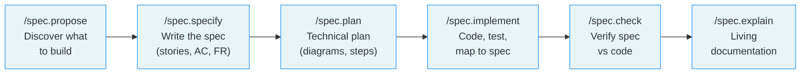
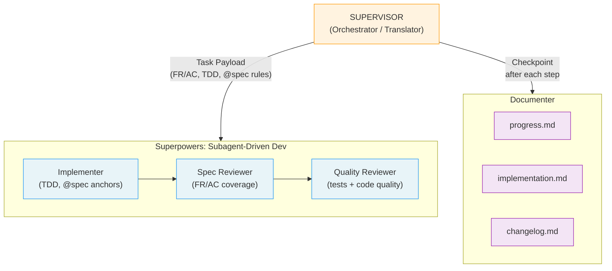

# 🔥 LiveSpec — Specs that live beyond implementation

> A universal, tool-agnostic specification framework with visual diagrams, living documentation, and spec-to-code traceability for AI-driven development.

---

## The Problem

Specs today are **throwaway documents**:

- Written once, never updated after implementation
- No visual diagrams — just walls of text
- No traceability between spec requirements and actual code
- No history of what changed and why
- Tools and AI assistants forget the context

Six months later, nobody knows **why** something was built the way it was.

---

## What LiveSpec Does Differently

| Problem | LiveSpec Solution |
|---|---|
| No visuals | **Mermaid diagrams mandatory** in every spec and plan |
| No traceability | **Implementation mapping** — every spec requirement links to `@spec` anchors in code |
| Specs rot after launch | **Living docs** — specs updated when behavior changes |
| No history | **Per-feature changelogs** — every change is recorded |
| No visual testing | **Playwright baselines** built into implementation + check |
| Stack decisions lost | **Stack presets with decision trees** — know WHY you chose each tool |
| One-time init | **Brainstorm-driven init** — AI interviews you before generating anything |
| Tool-specific | **Tool-agnostic** — works with Claude Code or any AI that reads Markdown |

---

## How It Works



Each command works standalone, or chain them all with `/spec.feature` for an end-to-end pipeline with validation gates.

---

## The 14 Commands

| Command | What it does |
|---|---|
| `/spec.init` | 3-phase conversational brainstorm → generates project profile, stack, `.specs/` structure + CLAUDE.md. `--from-code`: reverse-engineer existing codebase. |
| `/spec.propose` | Analyze project context and intelligently propose the next feature(s) to build |
| `/spec.specify` | Create a new feature spec with user stories, Mermaid flows, AC, and FR |
| `/spec.plan` | Generate technical plan with sequence, state, and ER diagrams |
| `/spec.implement` | APEX-style auto-pipeline: implement → test → visual baselines → map to spec. Multi-agent orchestration by default (`--mono` for single-agent) |
| `/spec.check` | Compare spec vs actual code — find gaps, verify AC, detect visual drift |
| `/spec.explain` | "How does X work?" — living documentation from spec + diagrams + history |
| `/spec.stack` | Evolve your stack and analyze impact on existing features |
| `/spec.feature` | Full pipeline: specify → plan → plan review → implement, with validation gates |
| `/spec.preflight` | Verify tooling, auth, and API tokens before starting implementation — runs auto-install, detects blockers, gates feature work |
| `/spec.hooks` | Show, create, or edit lifecycle hooks for a command |
| `/spec.play-coverage` | Open spec coverage playground with live grep data |
| `/spec.refine` | Iteratively refine existing artifacts (project, feature spec, or plan) via guided conversation |
| `/spec.status` | Display factual status overview of roadmap and features |

---

## Quick Start

### Claude Code (recommended)

```bash
# 1. Clone LiveSpec
git clone https://github.com/julien-m/livespec.git ~/livespec

# 2. Install /spec.* commands globally
bash ~/livespec/scripts/install.sh

# 3. Initialize LiveSpec in your project (creates .specs/ + CLAUDE.md)
cd your-project
/spec.init

# 4. Discover what to build first
/spec.propose

# 5. Create your first feature spec
/spec.specify "User can receive real-time notifications"

# 6. Generate technical plan
/spec.plan notifications

# 7. Implement with auto-pipeline
/spec.implement notifications

# 8. Verify spec vs code
/spec.check notifications

# 9. Explain the feature (living docs)
/spec.explain "how do notifications work?"

# Alternative: full pipeline in one command
/spec.feature "User can receive real-time notifications"
```

### Other AI tools

For any AI tool that reads Markdown, paste the content of `system/spec-system.md` into your tool's context. The spec system is tool-agnostic — any AI that can read `.specs/` will follow the rules.

---

## Workflow Guide

### Manual flow (step by step)

Run each command individually with full control at every stage:

```bash
/spec.specify "User can filter by date"   # 1. Generate spec.md
/spec.plan date-filter                     # 2. Generate plan.md
/spec.implement date-filter                # 3. Implement from plan
/spec.check date-filter                    # 4. Verify spec vs code
```

### Pipeline flow (`/spec.feature`)

Run the full pipeline in one command with validation gates between each phase:

```bash
# Interactive (default) — pauses for your approval between phases
/spec.feature "User can filter by date"

# Automatic — no pauses, auto-retries if plan review fails
/spec.feature "User can filter by date" --auto

# Resume an interrupted pipeline
/spec.feature --resume date-filter
```

### After implementation

```bash
/spec.check date-filter                    # Verify spec-code alignment
/spec.explain "how does date filtering work?"  # Living documentation
/spec.stack                                # View or evolve the stack
```

---

## Command Reference

### `/spec.init`

Initialize LiveSpec in a project. Runs a 3-phase conversational brainstorm (interview → stack decisions → file generation).

```bash
/spec.init                       # Full interactive setup
/spec.init --auto                # Use defaults, skip questions
/spec.init --stack web-realtime  # Skip interview, use preset
/spec.init --from-code           # Reverse-engineer existing codebase into specs
/spec.init --from-code --deep    # Extended scan (git history, CI, env)
```

Key flags: `--auto`, `--stack [preset]`, `--from-code`, `--deep`, `--force`, `--dir [path]`, `--dry-run`

### `/spec.propose`

Analyze project context (vision, users, existing features, roadmap) and propose the next feature(s) to build. Read-only — no files created.

```bash
/spec.propose                     # Propose the next feature
/spec.propose --count 3           # Propose 3 ranked features
/spec.propose --role admin        # Focus on admin features
/spec.propose --mvp               # Only MVP-critical suggestions
```

Key flags: `--count N`, `--role [name]`, `--mvp`, `--auto`

### `/spec.specify`

Create a feature spec with user stories, Mermaid flowcharts, AC, and FR.

```bash
/spec.specify "User can upload profile photos"
/spec.specify "Payment processing" --branch --priority P1
```

Key flags: `--branch`, `--no-branch`, `--priority`

### `/spec.plan`

Generate a technical plan with sequence, state, and ER diagrams from a spec.

```bash
/spec.plan profile-photos
/spec.plan profile-photos --no-contracts
```

Key flags: `--no-contracts`

### `/spec.implement`

Auto-implement from plan: code, test, verify, document. Multi-agent by default.

```bash
/spec.implement profile-photos            # Multi-agent (default)
/spec.implement profile-photos --mono     # Single-agent
/spec.implement profile-photos --resume   # Resume interrupted run
```

Key flags: `--mono`, `--economy`, `--resume`, `--no-visual`, `--no-save`, `--step`

### `/spec.check`

Compare spec vs actual code — find gaps, verify AC, detect visual drift.

```bash
/spec.check profile-photos
/spec.check                               # Check all features
```

### `/spec.explain`

Living documentation — understand how a feature works from spec + code + history.

```bash
/spec.explain "how do notifications work?"
/spec.explain profile-photos
```

### `/spec.stack`

View current stack, analyze change impact, create Architecture Decision Records.

```bash
/spec.stack                               # View current stack
/spec.stack "migrate from Supabase to Prisma"
```

### `/spec.feature`

Full pipeline: specify → plan → plan review → implement, with validation gates.

```bash
/spec.feature "Real-time notifications"              # Interactive
/spec.feature "CSV export" --auto                     # Automatic
/spec.feature --resume csv-export                     # Resume
/spec.feature "Dark mode" --mono                      # Single-agent implementation
/spec.feature "Payment processing" --branch --priority P1  # With branch + priority
```

Key flags: `--auto`, `--resume`, `--branch`, `--priority`, `--mono`, `--economy`, `--step`

### `/spec.preflight`

Verify tooling, authentication, and API tokens are ready before implementation. Auto-installs what it can, groups human blockers, gates feature work until all critical checks pass.

```bash
/spec.preflight                     # Full preflight check
/spec.preflight --light             # Light check (only new items since last run)
/spec.preflight --regenerate        # Regenerate manifest from stack
```

Key flags: `--light`, `--regenerate`, `--save`, `--no-save`

Runs automatically as part of `/spec.init` (Phase D), `/spec.implement` (Phase 0.5), and `/spec.feature` (Phase 2.7).

### `/spec.refine`

Iteratively refine existing artifacts through guided conversation. Enforces eligibility rules — blocks refinement on specs/plans that already have downstream code.

```bash
/spec.refine                        # Interactive menu
/spec.refine project                # Refine project profile, constitution, or testing strategy
/spec.refine notifications          # Refine a feature spec
/spec.refine 002 plan              # Refine a feature plan
```

Key flags: `--auto`, `--dry-run`

### `/spec.status`

Factual status overview — roadmap items, feature statuses, next actions. Read-only.

```bash
/spec.status                  # Full status
/spec.status --roadmap        # Roadmap only
/spec.status --features       # Features only
/spec.status --json           # Machine-readable output
```

Key flags: `--roadmap`, `--features`, `--json`

> Full command documentation is in `commands/*.md`.

---

## Project Structure Created by `/spec.init`

```
.specs/
├── README.md               ← Spec registry and artifact index (auto-maintained)
├── spec-system.md          ← The rules (READ FIRST — every tool reads this)
├── constitution.md         ← Project architecture principles
├── project.md              ← Vision, users, constraints (from brainstorm)
├── roadmap.md              ← Feature backlog (MVP / Post-MVP / Future)
│
├── stacks/
│   ├── _default.md         ← Your chosen stack + reasoning
│   └── decisions/          ← Architecture Decision Records (ADRs)
│       └── ADR-001-*.md
│
├── testing/
│   └── strategy.md         ← What to test, how, with which tools
│
├── features/
│   └── 001-notifications/
│       ├── spec.md          ← WHAT and WHY (user stories, Mermaid flows, AC, FR)
│       ├── plan.md          ← HOW (sequence/state/ER diagrams, file-by-file plan)
│       ├── implementation.md ← WHERE in code (FR/AC → @spec mapping)
│       ├── changelog.md     ← WHEN (every change recorded)
│       ├── contracts/       ← API contracts (OpenAPI/GraphQL)
│       └── baselines/       ← Playwright visual screenshots
│
└── changelog.md            ← Global project changelog
```

---

## Installation

```bash
bash scripts/install.sh              # Install /spec.* commands
bash scripts/install.sh --dry-run    # Preview without changes
bash scripts/install.sh --force      # Overwrite existing symlinks
bash scripts/install.sh --uninstall  # Remove all symlinks
```

Installs 14 commands (`~/.claude/commands/spec.*.md`) and 4 agents (`~/.claude/agents/livespec-*.md`) as symlinks. Changes to the LiveSpec repo are immediately reflected — no re-install needed.

For other AI tools, paste `system/spec-system.md` into your tool's context.

---

## Comparison

| Feature | LiveSpec | Spec Kit (GitHub) | APEX (aiblueprint) |
|---|---|---|---|
| Mermaid diagrams | ✅ Mandatory | ❌ None | ❌ None |
| Spec-to-code traceability | ✅ FR/AC → `@spec` anchors with deep-links | ❌ None | ⚠️ Partial |
| Per-feature changelogs | ✅ Yes | ❌ No | ❌ No |
| Visual testing baselines | ✅ Playwright | ❌ None | ❌ None |
| Stack presets + decision trees | ✅ Yes | ❌ No | ⚠️ Minimal |
| Brainstorm-driven init | ✅ 3-phase conversation | ❌ No | ⚠️ Partial |
| Gap detection (spec vs code) | ✅ `/spec.check` | ❌ None | ❌ None |
| Living documentation | ✅ `/spec.explain` | ❌ None | ❌ None |
| Stack evolution + impact | ✅ `/spec.stack` | ❌ None | ❌ None |
| Tool-agnostic | ✅ Yes (Markdown-based) | ⚠️ GitHub only | ⚠️ Claude only |

---

## Portability

LiveSpec separates **format** from **automation**:

| Layer | Portable? | Details |
|---|---|---|
| **Spec format** (`.specs/`, Markdown, Mermaid, Gherkin) | ✅ Universal | Any AI tool that reads Markdown can follow the rules in `spec-system.md` |
| **Commands** (`/spec.*`) | ⚠️ Claude Code | Installed as `~/.claude/commands/` symlinks — Claude Code specific |
| **Agents** (multi-agent orchestration) | ⚠️ Claude Code | Requires Claude Code agent teams + Superpowers skills |
| **Shell scripts** (`install.sh`, `init.sh`) | ⚠️ macOS | Uses `sed -i ''` (BSD), `open` (macOS), `mktemp` — not tested on Linux |

**For non-Claude AI tools:** paste the content of `system/spec-system.md` into your tool's context. The spec format and rules are tool-agnostic — the automation layer is Claude Code specific.

---

## Multi-Agent Mode (default)

`/spec.implement` uses multi-agent orchestration by default — a supervisor acts as **Orchestrator/Translator**, building a Task Payload per step and delegating execution to the `superpowers:subagent-driven-development` skill:



```bash
# Multi-agent implementation (default)
/spec.implement notifications

# Single-agent mode (original APEX pipeline)
/spec.implement notifications --mono

# Resume an interrupted run
/spec.implement notifications --resume
```

**Per-step cycle:** Supervisor builds Task Payload (FR/AC context, TDD commands, `@spec` rules, Definition of Done) → dispatches to `superpowers:subagent-driven-development` → Documenter writes `progress.md` checkpoint. Superpowers handles the full TDD loop, spec compliance review, and code quality review with isolated subagents (no context pollution).

Requires `CLAUDE_CODE_EXPERIMENTAL_AGENT_TEAMS: 1` in settings.

---

## Repository Structure

```
livespec/
├── README.md
├── system/
│   ├── spec-system.md              ← Core rules (install in .specs/)
│   ├── constitution-template.md    ← Constitution template
│   └── templates/
│       ├── spec-template.md
│       ├── plan-template.md
│       ├── implementation-template.md
│       ├── changelog-template.md
│       ├── project-template.md
│       ├── testing-strategy-template.md
│       └── roadmap-template.md
├── stacks/
│   └── presets/
│       ├── web-realtime.md
│       ├── web-static.md
│       └── api-rest.md
├── agents/                         ← Agent definitions (symlinked by install.sh)
│   ├── livespec-supervisor.md      ← Orchestrator — builds Task Payloads, dispatches to Superpowers
│   ├── livespec-implementer.md     ← Infrastructure provisioning (Phase 0 only)
│   ├── livespec-verifier.md        ← Spec review + plan review (code review via Superpowers)
│   └── livespec-documenter.md      ← Updates spec artifacts
├── commands/                       ← Command docs (symlinked by install.sh)
│   ├── init.md
│   ├── propose.md
│   ├── specify.md
│   ├── plan.md
│   ├── implement.md
│   ├── check.md
│   ├── explain.md
│   ├── stack.md
│   ├── feature.md
│   ├── preflight.md
│   ├── hooks.md
│   ├── play-coverage.md
│   └── refine.md
└── scripts/
    ├── install.sh                  ← Install commands + agents into ~/.claude/
    └── init.sh                     ← Bootstrap .specs/ structure (shell)
```

---

## License

MIT — see [LICENSE](LICENSE)

