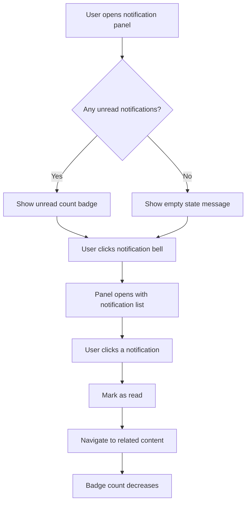
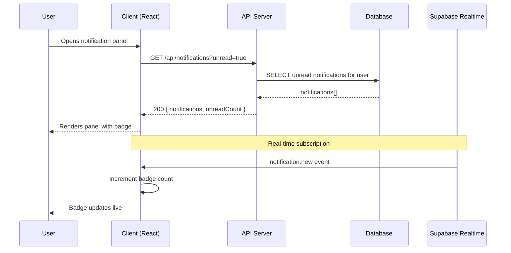
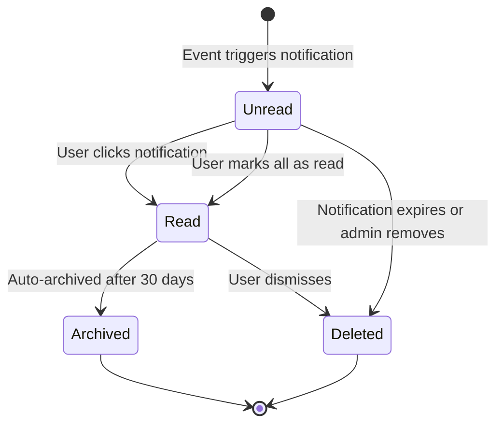
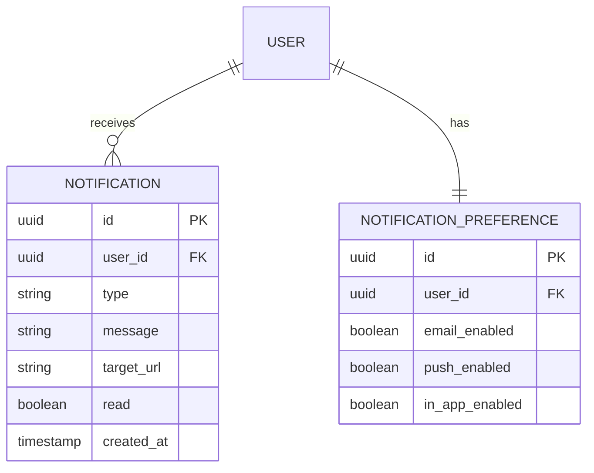

# Command: /spec.explain

> Living documentation — understand how any feature works without reading code.

---

## Overview

`/spec.explain [feature-name | natural language question]`

Answers "how does X work?" by synthesizing information from spec, plan, implementation map, changelog, and architecture decisions.

This is the **"6 months later"** command. When someone new joins the team, or when you've forgotten why something was built the way it was, this command gives you the full picture in seconds.

---

## Usage

```bash
# By feature name
/spec.explain notifications
/spec.explain 004-notifications

# By natural language question
/spec.explain "how do notifications work?"
/spec.explain "why did we choose Supabase over Firebase?"
/spec.explain "what changed in the auth feature last month?"
/spec.explain "how does the real-time messaging system work?"
```

---

## Steps

### Step 1 — Resolve Input

**If feature name or number:** find `.specs/features/NNN-feature-name/`

**If natural language question:**
1. Search `.specs/features/*/spec.md` for keywords
2. Search `.specs/stacks/decisions/*.md` for tech questions
3. Search `.specs/changelog.md` for temporal questions ("last month", "recently")
4. If multiple matches: show summary of each and ask which to explain

### Step 2 — Read All Sources

For the identified feature, read:
- `spec.md` — user stories and Mermaid flowcharts
- `plan.md` — sequence, state, and ER diagrams
- `implementation.md` — where it lives in code
- `changelog.md` — history of changes
- `.specs/stacks/decisions/` — ADRs (for "why" questions)

### Step 3 — Produce Visual Summary

Generate a structured explanation using the diagrams from the spec and plan.

The output should answer these questions WITHOUT requiring the reader to look at any code:

1. **What it does** — user-facing description
2. **Who uses it** — roles and their use of this feature
3. **How it flows** — Mermaid flowchart from spec
4. **How it works** — sequence and state diagrams from plan
5. **What data it uses** — ER diagram from plan
6. **Where it lives** — key files from implementation.md
7. **Why it was built this way** — ADR references
8. **What changed** — recent changelog entries

---

## Example Output

### `/spec.explain notifications`

---

**📋 Feature: Real-Time Notifications**
*`.specs/features/004-notifications/`*

---

#### What It Does

The notification system delivers real-time alerts to users when relevant events occur (new bids, messages, job updates). Users can view, dismiss, and manage their notification preferences without leaving their current page.

---

#### Who Uses It

| Role | How They Use Notifications |
|---|---|
| Designer | Receives alerts when a client views their profile or responds to a bid |
| Client | Receives alerts when designers bid on their job |
| Both | Can configure which notification types they receive per channel |

---

#### User Flow

*From `spec.md` — Story 1: User receives and views notifications*



---

#### How It Works (Technical Flow)

*From `plan.md` — Sequence Diagram*



---

#### Notification Lifecycle

*From `plan.md` — State Diagram*



---

#### Data Model

*From `plan.md` — ER Diagram*



---

#### Where It Lives in Code

*From `implementation.md`*

| Component | File | Description |
|---|---|---|
| Data queries | `src/data/notifications.ts` | Fetch, mark read, preferences |
| API endpoints | `src/api/notifications/route.ts` | REST endpoints |
| Bell component | `src/components/notifications/NotificationBell.tsx` | Badge + open panel |
| Panel component | `src/components/notifications/NotificationPanel.tsx` | Notification list |
| Real-time hook | `src/hooks/useNotificationSubscription.ts` | WebSocket subscription |
| Unit tests | `src/data/notifications.test.ts` | |
| E2E tests | `tests/e2e/notifications.spec.ts` | |

---

#### Why It Was Built This Way

*From `.specs/stacks/decisions/`*

- **ADR-001: Supabase Realtime** — Chosen over custom WebSocket because it integrates directly with our PostgreSQL data model, and Supabase provides managed connections at our scale.
- **Optimistic updates** — Notifications are marked as read optimistically on the client to avoid perceived latency, with server confirmation and rollback on failure.

---

#### History

*From `changelog.md` — last 3 entries*

| Date | Type | Change |
|---|---|---|
| 2024-03-25 | Spec Update | Added deleted notification edge case handling |
| 2024-03-22 | Feature | Implemented preferences + mark-all-read (completes all AC) |
| 2024-03-18 | Bugfix | Fixed badge count stale closure in WebSocket handler |

---

*For the full spec, see `.specs/features/004-notifications/spec.md`*
*For implementation details, see `.specs/features/004-notifications/implementation.md`*

---

## Flags

| Flag | Behavior |
|---|---|
| `--diagrams-only` | Show only Mermaid diagrams, no prose |
| `--history` | Show full changelog history for the feature |
| `--code` | Include file paths and line numbers from implementation.md |
| `--why` | Focus on ADR/decision explanations |
| `--since [date]` | Show only changes since a specific date |

---

*LiveSpec Command v1.0*
