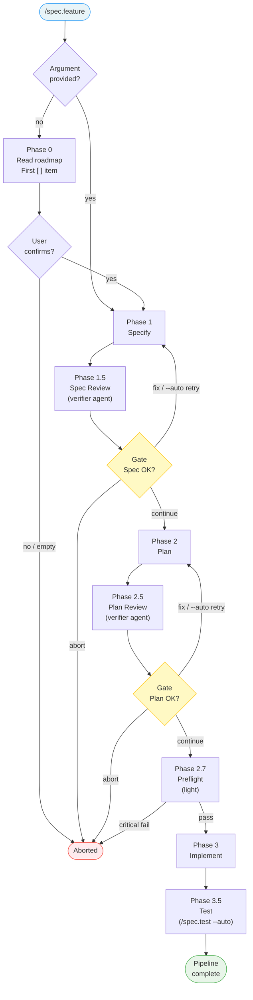

# Command: /spec.feature

> End-to-end feature pipeline — chains specify, plan, plan review, and implement with validation gates between each phase.

---

## Overview

`/spec.feature [feature description]`

Runs the full LiveSpec pipeline in a single command:



---

> **Hooks — before starting:** **Read** `before-feature` hooks from all 3 levels (skip missing files):
> 1. `~/.claude/livespec/hooks/before-feature.md`
> 2. `.specs/hooks/before-feature.md`
> 3. `.specs/hooks/before-feature.local.md` (if `mode: override` → use only this one)
>
> **Hooks — after completing:** Same resolution with `after-feature` at all 3 levels.
>
> **Sub-commands:** Each phase (specify, plan, implement) resolves its own before/after hooks at all 3 levels, in addition to feature-level hooks. For implement, also resolve `before-implement-step` / `after-implement-step` at all 3 levels for each step.

## Flags

| Flag | What it does |
|------|-------------|
| `--auto`, `-a` | Skip gates after plan and implement. If spec review or plan review reports **any findings** (BLOCKING, WARNING, or INFO) → re-generates the spec/plan with findings as context (max 2 iterations each). Aborts if BLOCKING findings remain after 2 attempts; proceeds if only WARNING/INFO remain. **Also commits automatically** at the end when audit + tests pass (see § Auto-Commit) |
| `--resume`, `-r` | Resume the pipeline where it stopped (reads `pipeline.md`). Also passed to implement for step-level resume via `progress.md` |
| `--branch`, `-b` | Create a git branch `feature/NNN-name` automatically after spec creation (no question asked) |
| `--no-branch`, `-B` | Skip the branch proposal entirely |
| `--priority`, `-p` `P1\|P2\|P3` | Force all user stories in the spec to the given priority (P1=critical/MVP, P2=important, P3=nice-to-have) |
| `--mono`, `-m` | Use a single agent for implementation instead of multi-agent orchestration (supervisor + superpowers + documenter) |
| `--economy`, `-e` | No sub-agents, direct tools only — uses fewer tokens but slower |
| `--step`, `-s` | Pause after each implementation step for manual validation |

> **Note:** Flags like `--no-review`, `--no-visual`, `--no-save`, and `--no-contracts` are intentionally **not** available on `/spec.feature`. This pipeline enforces all safety gates. These flags remain available on their respective sub-commands (`/spec.plan --no-contracts`, `/spec.implement --no-visual`, etc.) for power users running manual flows.

---

## State Tracking

Create `.specs/features/NNN-feature-name/pipeline.md` to track pipeline state using the CLI:

```
Run: livespec pipeline init --feature NNN-feature-name
```

This file is **distinct from `progress.md`** (which tracks individual implementation steps).

**Template:**

```markdown
# Pipeline — [Feature Name]

**Started:** YYYY-MM-DD HH:MM
**Flags:** `--auto --mono` (or `none`)

| Phase | Status | Completed At |
|-------|--------|--------------|
| Specify | Pending | — |
| Spec Review | Pending | — |
| Plan | Pending | — |
| Plan Review | Pending | — |
| Preflight | Pending | — |
| Implement | Pending | — |
| Test | Pending | — |
```

**Status values:** `Pending` → `In Progress` → `Done` or `Skipped`

Update the status and timestamp after each phase completes.

---

## Phase 0 — Resolve Feature (when no argument)

When no feature description is provided:

1. Read `.specs/roadmap.md`
2. Parse tier sections in order: MVP → Post-MVP → Future (skip Deferred)
3. Find the first unchecked item (`- [ ]`) across tiers
4. If found, display:
   ```
   Next up from roadmap: **<feature name>** (<tier>, Scope: <scope>)
   → Proceed? (yes / no / list all)
   ```
   - **yes** → use this item's description as the feature description, continue to Phase 1
   - **no** → abort
   - **list all** → display all unchecked items across tiers, let user pick one
5. If no unchecked items found → display "Roadmap is empty or fully shipped. Provide a feature description or run `/spec.propose`." and abort

When a feature description is provided → skip this phase entirely, proceed to Phase 1 as before.

---

## Phase 1 — Specify

1. Run: `livespec pipeline update --feature NNN-feature-name --phase specify --status in_progress`
2. Execute the steps described in `commands/specify.md`, passing:
   - The feature description (from user argument or resolved from roadmap)
   - `--priority` if provided
3. Run: `livespec pipeline update --feature NNN-feature-name --phase specify --status done --timestamp`

### Branch proposal

After the spec is created, determine whether a git branch is needed:

- **`--branch` provided:** Create `feature/NNN-name` immediately, no question asked.
- **`--no-branch` provided:** Skip entirely, no proposal.
- **Neither flag (default):** Analyze the generated spec's scope. Only propose a branch when the feature clearly warrants one (multi-file changes, new feature, breaking change). If the scope is small (single-file fix, documentation-only, minor tweak), do not propose — proceed without a branch.

> **When proposing:**
> [One sentence explaining why a branch is needed for this feature.]
> Create branch `feature/NNN-name`? (yes / no)

---

## Phase 1.5 — Spec Review

1. Run: `livespec pipeline update --feature NNN-feature-name --phase spec-review --status in_progress`
2. Dispatch the **livespec-verifier** agent in `spec-review` mode with:
   - Path to `spec.md`
   - Path to `.specs/constitution.md`
   - Path to `.specs/project.md`
   - Path to the stack file (e.g., `.specs/stacks/_default.md`)
3. Collect the Spec Review Report

The review findings are **embedded in the specify gate prompt** — the user sees both the spec and the review at once.

**Gate (interactive mode):**

> Phase 1 complete. Review the generated spec:
> `.specs/features/NNN-feature-name/spec.md`
>
> ### Spec Review Findings
> [Verifier report inserted here — findings table with severity]
>
> N BLOCKING, N WARNING, N INFO finding(s).
> Type **continue** to proceed to planning, or describe changes needed.

**If verdict has findings (BLOCKING, WARNING, or INFO):**

- **Interactive mode:** The user sees the findings in the gate prompt. They can:
  1. **Fix** — describe changes, the spec is regenerated and re-reviewed
  2. **Override** — proceed to planning despite findings
  3. **Abort** — stop the pipeline

- **`--auto` mode:** Automatically regenerate the spec (go back to Phase 1) with **all** review findings as additional context. Maximum 2 re-generation attempts. If BLOCKING findings remain after 2 attempts, abort the pipeline with error. If only WARNING/INFO remain after 2 attempts, proceed to planning.

**If verdict is PASS (no findings):** proceed to Phase 2 immediately (both modes).

4. Run: `livespec pipeline update --feature NNN-feature-name --phase spec-review --status done --timestamp`

---

## Phase 2 — Plan

1. Run: `livespec pipeline update --feature NNN-feature-name --phase plan --status in_progress`
2. Execute the steps described in `commands/plan.md`, passing:
   - The resolved feature name
3. Run: `livespec pipeline update --feature NNN-feature-name --phase plan --status done --timestamp`

---

## Phase 2.5 — Plan Review

1. Run: `livespec pipeline update --feature NNN-feature-name --phase plan-review --status in_progress`
2. Dispatch the **livespec-verifier** agent in `plan-review` mode with:
   - Path to `spec.md`
   - Path to `plan.md`
   - Path to `.specs/constitution.md`
3. Present the Plan Review Report to the user
4. If verdict is PASS (or user overrides BLOCKING):
   - Update `plan.md` header: `Status: Draft` → `Status: Approved`
5. Run: `livespec pipeline update --feature NNN-feature-name --phase plan-review --status done --timestamp`

**If verdict has findings (BLOCKING, WARNING, or INFO):**

- **Interactive mode:** Present findings and ask user how to proceed:
  > Plan review found N BLOCKING, N WARNING, N INFO issue(s). Options:
  > 1. **Fix** — I'll regenerate the plan addressing the findings
  > 2. **Override** — proceed to implementation despite findings
  > 3. **Abort** — stop the pipeline

- **`--auto` mode:** Automatically regenerate the plan (go back to Phase 2) with **all** review findings (BLOCKING, WARNING, and INFO) as additional context. Maximum 2 re-generation attempts. If BLOCKING findings remain after 2 attempts, abort the pipeline with error. If only WARNING/INFO remain after 2 attempts, proceed to implementation.

**If verdict is PASS (no findings):** proceed immediately (both modes).

**Gate (interactive mode, verdict PASS):**

> Plan review passed. Review the plan:
> `.specs/features/NNN-feature-name/plan.md`
>
> Type **continue** to proceed to implementation, or describe changes needed.

In `--auto` mode: skip gate, proceed immediately.

---

## Phase 2.7 — Preflight Check (Light)

Before starting implementation, run a light preflight check:

1. If `.specs/preflight.md` does not exist → log warning and continue
2. Run `/spec.preflight --light` with the current feature name as context
3. Gate behavior:
   - Any `critical` check failed → **STOP**. Write `preflight-report.md` with BLOCKED verdict. Report blocker + recovery command. Run: `livespec pipeline update --feature NNN-feature-name --phase preflight --status blocked`
   - Only `warning` checks failed → write `preflight-report.md` with WARNINGS verdict, display warning, continue
   - All pass → write `preflight-report.md` with READY verdict, continue to Phase 3

This ensures all tools and credentials are available before the autonomous implementation phase begins.

---

## Phase 3 — Implement

1. Run: `livespec pipeline update --feature NNN-feature-name --phase implement --status in_progress`
2. Execute the steps described in `commands/implement.md`, passing:
   - The resolved feature name
   - `--mono` if provided
   - `--economy` if provided
   - `--step` if provided
   - `--resume` if provided (implement uses `progress.md` for its own resume)
3. Run: `livespec pipeline update --feature NNN-feature-name --phase implement --status done --timestamp`

---

## Phase 3.5 — Test

After implementation completes, run `/spec.test` to validate test completeness:

1. Run: `livespec pipeline update --feature NNN-feature-name --phase test --status in_progress`
2. Execute `/spec.test <feature-name> --auto --update`
3. `/spec.test` generates missing tests that `/spec.implement`'s Phase 6 could not run because they didn't exist yet. It also captures visual baselines that may have been skipped during implement (`--no-visual` or tool unavailable).
4. If test report shows ❌ failures in AC coverage → these reveal implementation gaps. Output `SHIP_RESULT: BLOCKED` with test failure details if called from `/spec.ship`, or report findings in interactive mode. If only ⚠️ partial AC coverage or ✅ passed → proceed.
5. Run: `livespec pipeline update --feature NNN-feature-name --phase test --status done --timestamp`

In `--auto` mode: no confirmation prompts, proceeds automatically.

---

## Resume (`--resume`)

When `--resume` is provided:

1. Run: `livespec pipeline read --feature NNN-feature-name`
2. Run: `livespec pipeline next --feature NNN-feature-name` to find the first phase with status != `Done` and != `Skipped`
3. Resume execution from that phase
4. If pipeline.md doesn't exist (exit 1), start from Phase 1

**Feature resolution for resume:** If no feature description is provided with `--resume`, look for the most recently modified `pipeline.md` across all feature directories.

---

## Auto-Commit (`--auto` only)

When `--auto` is active and Phase 3.5 (Test) completes successfully:

1. Run `/audit --fix` — Codex audits and fixes in a single pass. If violations remain → abort (no commit)
2. Verify all tests pass
3. Run: `livespec git stage --feature NNN-feature-name`
   (Stages all feature files + modified roadmap.md and changelog.md)

4. **Resolve commit hook** from 3 levels (global → project → local), applying inheritance rules from `system/hooks.md`:
   - `~/.claude/livespec/hooks/commit.md`
   - `.specs/hooks/commit.md`
   - `.specs/hooks/commit.local.md`

5. Run: `livespec commit-context write --feature NNN-feature-name`
   (Writes `.specs/hooks/.commit-context.json` with resolved spec/plan/ADR paths)

   Run: `livespec commit-context read`
   (Read JSON output — use `spec_path`, `plan_path`, `adr_paths` in hook invocation step 6)

6. **If commit hook found:** inject resolved hook content into context, follow its instructions (e.g., invoke `/git.commit "feat({{feature_name}}): <message>" --intent "implements {{feature_name}} — spec: {{spec_path}}, plan: {{plan_path}}, ADRs: {{adr_paths}}"`)

7. **If no commit hook at any level:** invoke `/git.commit` without `--intent` (standard commit with Codex audit, no implementation intent)

8. After `/git.commit` succeeds, run: `livespec commit-context clear`
   (Removes `.specs/hooks/.commit-context.json`)

9. Run the following for each phase to mark all complete:
   `livespec pipeline update --feature NNN-feature-name --phase <phase> --status done --timestamp`

**Without `--auto`:** no commit is made. The user commits manually.

---

## Ship Result

When `/spec.feature` is called by `/spec.ship` (via a spawned agent), the pipeline **must** end with a structured result block that the ship orchestrator can parse:

**On success:**

```
SHIP_RESULT: OK
FEATURE: NNN-feature-name
BRANCH: feature/NNN-feature-name
COMMIT: <commit hash>
FILES_CHANGED: <count>
TESTS: <passed> passed, <failed> failed
```

**On failure:**

```
SHIP_RESULT: BLOCKED
FEATURE: NNN-feature-name
BRANCH: feature/NNN-feature-name
PHASE: <phase that failed>
ERROR: <one-line description>
```

This block is the **last thing output** by the agent. The ship orchestrator reads `SHIP_RESULT:` to decide whether to merge or stop.

---

## Completion

When all phases are done, display:

> **Pipeline complete!**
>
> - Spec: `.specs/features/NNN-feature-name/spec.md`
> - Plan: `.specs/features/NNN-feature-name/plan.md`
> - Review: PASS (or SKIPPED)
> - Implementation: Done
> - Commit: `<hash>` (if `--auto`)
>
> **Next:**
> - Verify: `/spec.check NNN-feature-name`
> - Next feature: `/spec.propose`

---

## Error Handling

If any phase fails:

1. The failed phase status remains `In Progress` — do not update it further
2. Display error with recovery instructions:
   > Phase N failed: [reason]
   >
   > Resume with: `/spec.feature --resume [feature-name]`
3. Do **not** continue to subsequent phases
4. If called from `/spec.ship` → output `SHIP_RESULT: BLOCKED` block (see § Ship Result)

---

## Examples

```bash
# Full pipeline — interactive (recommended for first use)
/spec.feature "User can filter search results by date range"

# Full pipeline — automatic, no pauses
/spec.feature "Add CSV export to reports" --auto

# Resume an interrupted pipeline
/spec.feature --resume csv-export

# Pipeline with single-agent implementation
/spec.feature "Real-time notifications" --mono

# Pipeline with specify flags
/spec.feature "Payment processing" --branch --priority P1
```

---

*LiveSpec Command v1.0*
