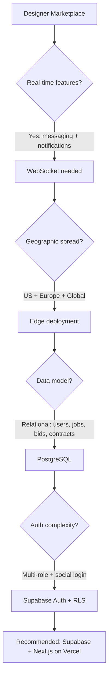

# Command: /spec.init

> Initialize LiveSpec in a project through a 3-phase conversational brainstorm.
> This is NOT a simple file copier. It interviews the user, decides the stack, and generates a tailored project setup.

---

## Overview

`/spec.init` runs a 3-phase process:

1. **Phase A — Brainstorm:** Conversational interview to understand the project
2. **Phase B — Stack Decisions:** AI-guided infrastructure decisions with visual decision trees
3. **Phase C — Installation:** Automatic creation of the `.specs/` directory structure

---

## Phase A — Brainstorm (Conversational)

The AI asks questions one at a time, waits for answers, and builds a PROJECT PROFILE.

### Conversation Flow

**Opening:**

> 👋 Let's set up LiveSpec for your project. I'll ask you a few questions to understand what you're building — then I'll recommend a stack and generate your spec system. This takes about 5 minutes.
>
> **Question 1/6: What are you building?**
> Describe it like you're explaining to a friend with no technical background.

---

*User answers, e.g.: "A platform where freelancers can find clients and manage projects, kind of like Upwork but focused on designers."*

---

> Got it — a freelancer marketplace for designers.
>
> **Question 2/6: WHO uses it?**
> What are the different types of people (roles) in your system, and what level of access does each have?
> Example: "Designers post portfolios (full access), Clients browse and hire (limited access), Admins manage disputes (admin access)"

---

*User answers: "Designers can create profiles and bid on jobs. Clients can post jobs and hire. Admins can manage disputes and ban users."*

---

> Got it. I see 3 roles:
> - **Designer** — create profiles, browse jobs, bid, manage contracts
> - **Client** — post jobs, review bids, hire, pay
> - **Admin** — moderation, disputes, user management
>
> **Question 3/6: WHERE do they use it?**
> Desktop browser? Mobile browser? Native iOS/Android app? On the go or at a desk?

---

*User answers: "Mostly desktop for clients posting jobs. Designers use both desktop and mobile."*

---

> Good — primarily web, but mobile-responsive is important for designers.
>
> **Question 4/6: WHAT needs to be fast (real-time)?**
> Which features need data to update instantly without the user refreshing?
> Think about: messaging, notifications, live status updates, collaborative editing, etc.

---

*User answers: "Messaging between clients and designers should be real-time. Notifications when a new bid comes in."*

---

> Real-time messaging and notifications — noted. Those drive infrastructure choices.
>
> **Question 5/6: WHERE are your users geographically?**
> Single country? Europe only? Global?
> This impacts where we deploy your infrastructure.

---

*User answers: "Initially US and Europe. Global within 2 years."*

---

> Multi-region from the start then. This means we'll want edge-capable infrastructure.
>
> **Question 6/6: What's your budget and scale expectation?**
> Rough estimate: how many users in year 1? Year 3? What's your infra budget (e.g., < $100/month, $500/month, flexible)?

---

*User answers: "Maybe 1,000 users year 1, 50,000 by year 3. Budget is flexible but ideally under $500/month to start."*

---

### Project Profile Summary

After the 6 questions, the AI presents a summary and asks for confirmation:

> 📋 **PROJECT PROFILE — [Project Name]**
>
> **What it is:** Freelancer marketplace for designers — Upwork-style platform focused on the design industry.
>
> **Users:**
> | Role | Access | Key Needs |
> |---|---|---|
> | Designer | Full (own data) | Mobile-friendly, fast bidding, real-time messages |
> | Client | Standard | Easy job posting, responsive bids, secure payments |
> | Admin | Full admin | Moderation tools, audit logs |
>
> **Scale:** 1,000 → 50,000 users over 3 years
> **Geography:** US + Europe initially, global by year 3
> **Budget:** < $500/month initial infra
>
> **Real-time needs:**
> - Messaging (< 500ms latency)
> - Notifications (< 2s latency)
>
> **Platforms:** Web (desktop primary, mobile-responsive)
>
> Does this look right? Type **yes** to continue to stack decisions, or tell me what to change.

---

## Phase B — Stack Decisions (AI-Guided)

Based on the project profile, the AI runs the infrastructure decision tree and recommends a stack.

### Step 1 — Run the Decision Tree

> Based on your project profile, here's how I'm reasoning about your stack:



### Step 2 — Present Recommended Stack

> Based on your needs, I recommend the **Web Real-Time** stack preset:
>
> | Layer | Choice | Why For Your Project |
> |---|---|---|
> | Framework | Next.js 14 (App Router) | Best for multi-role apps, SSR for SEO on job listings |
> | Deploy | Vercel Edge | Global edge network covers US + Europe + growing regions |
> | Database | Supabase PostgreSQL | Row-Level Security is perfect for multi-role data isolation |
> | Real-time | Supabase Realtime | WebSocket messaging + notifications built in |
> | Cache | Upstash Redis | Session management, rate limiting bids |
> | Auth | Supabase Auth | Social login (Google, LinkedIn) + multi-role with RLS |
> | Testing | Vitest + Playwright | Full coverage for marketplace flows |
>
> Would you like to use this stack, or adjust anything?
> Examples: "I prefer Firebase over Supabase" / "We already have an AWS account" / "Can we use Prisma instead of Supabase?"

---

*User might say: "Looks good, but we want to use Stripe for payments."*

---

> Good call. Adding Stripe to the stack:
> - **Payments:** Stripe (Connect for marketplace payouts to designers)
> - I'll create an ADR documenting this choice.
>
> Updated stack confirmed. Proceeding.

### Step 3 — Testing Strategy

> For a marketplace with real-time features, here's your testing strategy:
>
> | Feature Type | Test Types | Tools |
> |---|---|---|
> | Business logic (bidding, pricing) | Unit | Vitest |
> | API endpoints | Integration | Vitest + supertest |
> | Messaging | E2E + WebSocket | Playwright |
> | Notifications | E2E + visual | Playwright |
> | Job listing pages | E2E + visual regression | Playwright |
> | Payment flows | E2E (Stripe test mode) | Playwright |
>
> Visual tests will capture baselines for all key screens (job listing, profile, messaging).
> Threshold: 2% diff = FAIL.

### Step 4 — Architecture Decision Records

> I'll create ADRs for the key choices:
> - ADR-001: Supabase over Firebase (reasons: PostgreSQL, RLS, built-in realtime)
> - ADR-002: Next.js over Remix (reasons: larger ecosystem, Vercel integration)
> - ADR-003: Stripe Connect for marketplace payments (reasons: built-in split payments)

---

## Phase C — Installation (Automatic)

After confirmation, the AI creates the `.specs/` directory structure:

```
.specs/
├── spec-system.md          ← Copied from livespec system/spec-system.md
├── constitution.md         ← Generated from conversation
├── project.md              ← Generated from Phase A brainstorm
│
├── stacks/
│   ├── _default.md         ← Generated from Phase B decisions
│   └── decisions/
│       ├── ADR-001-supabase-over-firebase.md
│       ├── ADR-002-nextjs-over-remix.md
│       └── ADR-003-stripe-connect.md
│
├── testing/
│   └── strategy.md         ← Generated from Phase B testing decisions
│
├── features/               ← Empty, ready for /spec.specify
│
└── changelog.md            ← Global changelog (initial entry)
```

**Installation output:**

> ✅ **LiveSpec installed successfully!**
>
> Created:
> - `.specs/spec-system.md` — the rules (AI reads this first, always)
> - `.specs/constitution.md` — architecture principles for this project
> - `.specs/project.md` — your project profile
> - `.specs/stacks/_default.md` — your recommended stack
> - `.specs/stacks/decisions/` — 3 Architecture Decision Records
> - `.specs/testing/strategy.md` — your testing strategy
> - `.specs/features/` — ready for your first feature spec
> - `.specs/changelog.md` — global changelog
>
> **Next step:** Create your first feature spec with:
> ```
> /spec.specify "User can post a job listing"
> ```

---

## Flags

| Flag | Behavior |
|---|---|
| `--auto` | Use defaults, skip all questions (generates generic constitution) |
| `--stack [preset]` | Skip Phase A, use specified preset (web-realtime / web-static / api-rest) |
| `--dir [path]` | Install in specified directory instead of current directory |
| `--dry-run` | Show what would be created without creating files |

---

## Generated Files Reference

| File | Template Used | Customization |
|---|---|---|
| `.specs/spec-system.md` | `system/spec-system.md` (verbatim copy) | None — universal rules |
| `.specs/constitution.md` | `system/constitution-template.md` | Filled from conversation + stack |
| `.specs/project.md` | `system/templates/project-template.md` | Filled from Phase A answers |
| `.specs/stacks/_default.md` | Stack preset (e.g., `stacks/presets/web-realtime.md`) | Customized with project-specific choices |
| `.specs/testing/strategy.md` | `system/templates/testing-strategy-template.md` | Tailored to project type and stack |
| `.specs/changelog.md` | Inline | Empty global changelog with first entry |

---

*LiveSpec Command v1.0*
