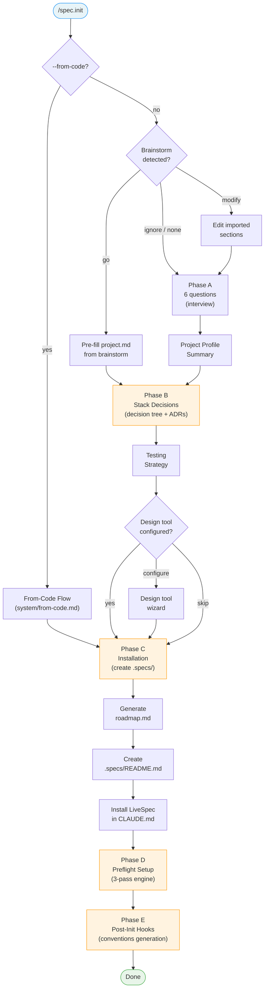
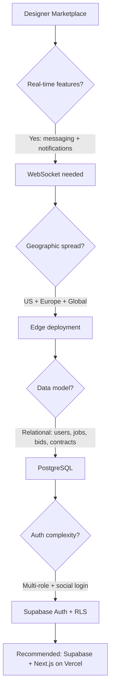
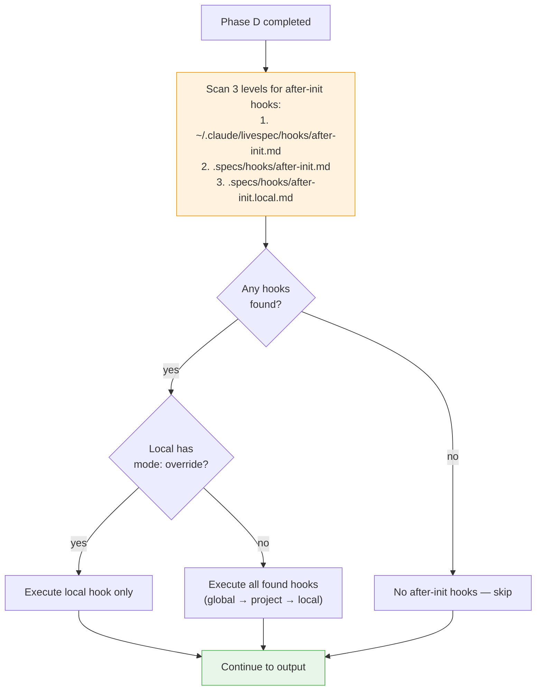

# Command: /spec.init

> Initialize LiveSpec in a project through a 3-phase conversational brainstorm.
> This is NOT a simple file copier. It interviews the user, decides the stack, and generates a tailored project setup.

---

## Overview

`/spec.init` runs a 3-phase process:

1. **Phase A — Brainstorm:** Conversational interview to understand the project
2. **Phase B — Stack Decisions:** AI-guided infrastructure decisions with visual decision trees
3. **Phase C — Installation:** Automatic creation of the `.specs/` directory structure

**Alternative: `--from-code` mode** — reverse-engineers an existing codebase into LiveSpec specs. See [From-Code Flow](#from-code-mode) below.


```mermaid
flowchart TD
    START(["/spec.init"]) --> FC{"--from-code?"}
    FC -->|yes| FROM["From-Code Flow\n(system/from-code.md)"]
    FC -->|no| PRE{"Brainstorm\ndetected?"}

    FROM --> C

    PRE -->|"go"| SKIP["Pre-fill project.md\nfrom brainstorm"]
    PRE -->|"ignore / none"| Q["Phase A\n6 questions\n(interview)"]
    PRE -->|"modify"| EDIT["Edit imported\nsections"] --> Q

    SKIP --> B
    Q --> PROFILE["Project Profile\nSummary"] --> B

    B["Phase B\nStack Decisions\n(decision tree + ADRs)"] --> TEST["Testing\nStrategy"]
    TEST --> DESIGN{"Design tool\nconfigured?"}
    DESIGN -->|"yes"| C
    DESIGN -->|"configure"| WIZARD["Design tool\nwizard"] --> C
    DESIGN -->|"skip"| C

    C["Phase C\nInstallation\n(create .specs/)"] --> ROAD["Generate\nroadmap.md"]
    ROAD --> README["Create\n.specs/README.md"]
    README --> CLAUDE["Install LiveSpec\nin CLAUDE.md"]
    CLAUDE --> D["Phase D\nPreflight Setup\n(3-pass engine)"]
    D --> E["Phase E\nPost-Init Hooks\n(conventions generation)"]
    E --> DONE(["Done"])

    style START fill:#e8f4f8,stroke:#2196F3
    style DONE fill:#e8f5e9,stroke:#4CAF50
    style B fill:#fff3e0,stroke:#FF9800
    style C fill:#fff3e0,stroke:#FF9800
    style D fill:#fff3e0,stroke:#FF9800
    style E fill:#fff3e0,stroke:#FF9800
```

---

> **Hooks — before starting:** **Read** `before-init` hooks from all 3 levels (skip missing files):
> 1. `~/.claude/livespec/hooks/before-init.md`
> 2. `.specs/hooks/before-init.md`
> 3. `.specs/hooks/before-init.local.md` (if `mode: override` → use only this one)

## Phase A — Brainstorm (Conversational)

The AI asks questions one at a time, waits for answers, and builds a PROJECT PROFILE.

### Pre-Check: Brainstorm Detection

Before starting the interview, check if a brainstorm from `project-brainstorm` already exists.

**Detection logic:**

1. Check if the file `.brainstorm/project-profile.md` exists in the current directory
2. If the file does NOT exist or is unreadable (broken symlink, empty, malformed) → skip this section entirely, proceed to **Conversation Flow** below
3. If the file exists and is readable:
   a. Read `.brainstorm/project-profile.md`
   b. Glob `.brainstorm/*.md` to discover additional brainstorm files
   c. Display the import summary (see format below)
   d. Wait for user response

**Import summary format:**

> 🔗 **Brainstorm detected** (`.brainstorm/project-profile.md`)
>
> **Vision:** [First line of "What the project does" from the Vision section]
> **Users:** [N] roles ([comma-separated role names from the Users table])
> **Scale:** [year 1 value] → [year 3 value] (from Constraints table)
> **Region:** [Primary region value from Constraints table]
> **Budget:** [Budget value from Constraints table]
> **Real-time:** [N] features requiring real-time (from Real-Time Requirements table)
>
> 📂 **Additional brainstorm files available:**
>    [list discovered files by display name: exploration · market-research · challenge · definition · plan]
>    _(usable as context for stack decisions in Phase B)_
>
> → Type **go** to use this profile and skip to Phase B (Stack Decisions)
> → Type **modify** to adjust sections before continuing
> → Type **ignore** to run the full interview instead

**Display name mapping for discovered files:**

| Filename pattern | Display name |
|---|---|
| `01-exploration.md` | exploration |
| `02-market-research.md` | market-research |
| `03-challenge.md` | challenge |
| `04-definition.md` | definition |
| `05-plan.md` | plan |

Only list files that actually exist in `.brainstorm/`.

**User response handling:**

- **"go"** (or equivalent confirmation):
  - Pre-fill `project.md` with the brainstorm data using direct section-by-section copy (Vision, Users, Constraints, Real-Time Requirements, Geographic Requirements — formats are identical)
  - Do NOT copy the "Stack Reference" or "Brainstorm Source" sections into `project.md` — these are brainstorm metadata
  - Pass the "Stack Reference" section content as context hint to Phase B (inform the decision tree, but do not skip Phase B)
  - **Skip the entire Conversation Flow (Q1-Q6) and Project Profile Summary below** → jump directly to **Phase B — Stack Decisions**

- **"modify"** (or equivalent):
  - Display the full imported content organized by section (Vision, Users, Constraints, Real-Time Requirements, Geographic Requirements)
  - Let the user edit any section
  - Once confirmed, write `project.md` and proceed to **Phase B — Stack Decisions** (skip Q1-Q6)

- **"ignore"** (or equivalent):
  - Discard the brainstorm data entirely
  - Proceed to **Conversation Flow** below as if no brainstorm existed

**Flag interaction:**

- `--auto` flag: if brainstorm is detected, brainstorm data takes priority over `--auto` defaults (brainstorm data is richer). Behaves as if user typed "go".
- `--stack` flag: brainstorm fills Phase A (project profile), `--stack` still overrides Phase B as normal.

---

### Conversation Flow

**Opening:**

> 👋 Let's set up LiveSpec for your project. I'll ask you a few questions to understand what you're building — then I'll recommend a stack and generate your spec system. This takes about 5 minutes.
>
> **Question 1/6: What are you building?**
> Describe it like you're explaining to a friend with no technical background.

---

*User answers, e.g.: "A platform where freelancers can find clients and manage projects, kind of like Upwork but focused on designers."*

---

> Got it — a freelancer marketplace for designers.
>
> **Question 2/6: WHO uses it?**
> What are the different types of people (roles) in your system, and what level of access does each have?
> Example: "Designers post portfolios (full access), Clients browse and hire (limited access), Admins manage disputes (admin access)"

---

*User answers: "Designers can create profiles and bid on jobs. Clients can post jobs and hire. Admins can manage disputes and ban users."*

---

> Got it. I see 3 roles:
> - **Designer** — create profiles, browse jobs, bid, manage contracts
> - **Client** — post jobs, review bids, hire, pay
> - **Admin** — moderation, disputes, user management
>
> **Question 3/6: WHERE do they use it?**
> Desktop browser? Mobile browser? Native iOS/Android app? On the go or at a desk?

---

*User answers: "Mostly desktop for clients posting jobs. Designers use both desktop and mobile."*

---

> Good — primarily web, but mobile-responsive is important for designers.
>
> **Question 4/6: WHAT needs to be fast (real-time)?**
> Which features need data to update instantly without the user refreshing?
> Think about: messaging, notifications, live status updates, collaborative editing, etc.

---

*User answers: "Messaging between clients and designers should be real-time. Notifications when a new bid comes in."*

---

> Real-time messaging and notifications — noted. Those drive infrastructure choices.
>
> **Question 5/6: WHERE are your users geographically?**
> Single country? Europe only? Global?
> This impacts where we deploy your infrastructure.

---

*User answers: "Initially US and Europe. Global within 2 years."*

---

> Multi-region from the start then. This means we'll want edge-capable infrastructure.
>
> **Question 6/6: What's your budget and scale expectation?**
> Rough estimate: how many users in year 1? Year 3? What's your infra budget (e.g., < $100/month, $500/month, flexible)?

---

*User answers: "Maybe 1,000 users year 1, 50,000 by year 3. Budget is flexible but ideally under $500/month to start."*

---

### Project Profile Summary

After the 6 questions, the AI presents a summary and asks for confirmation:

> 📋 **PROJECT PROFILE — [Project Name]**
>
> **What it is:** Freelancer marketplace for designers — Upwork-style platform focused on the design industry.
>
> **Users:**
> | Role | Access | Key Needs |
> |---|---|---|
> | Designer | Full (own data) | Mobile-friendly, fast bidding, real-time messages |
> | Client | Standard | Easy job posting, responsive bids, secure payments |
> | Admin | Full admin | Moderation tools, audit logs |
>
> **Scale:** 1,000 → 50,000 users over 3 years
> **Geography:** US + Europe initially, global by year 3
> **Budget:** < $500/month initial infra
>
> **Real-time needs:**
> - Messaging (< 500ms latency)
> - Notifications (< 2s latency)
>
> **Platforms:** Web (desktop primary, mobile-responsive)
>
> Does this look right? Type **yes** to continue to stack decisions, or tell me what to change.

---

## Phase B — Stack Decisions (AI-Guided)

Based on the project profile, the AI runs the infrastructure decision tree and recommends a stack.

### Step 1 — Run the Decision Tree

> Based on your project profile, here's how I'm reasoning about your stack:


```mermaid
flowchart TD
    A[Designer Marketplace] --> B{Real-time features?}
    B -- Yes: messaging + notifications --> C[WebSocket needed]
    C --> D{Geographic spread?}
    D -- US + Europe + Global --> E[Edge deployment]
    E --> F{Data model?}
    F -- Relational: users, jobs, bids, contracts --> G[PostgreSQL]
    G --> H{Auth complexity?}
    H -- Multi-role + social login --> I[Supabase Auth + RLS]
    I --> J[Recommended: Supabase + Next.js on Vercel]
```

### Step 2 — Present Recommended Stack

> Based on your needs, I recommend the **Web Real-Time** stack preset:
>
> | Layer | Choice | Why For Your Project |
> |---|---|---|
> | Framework | Next.js 14 (App Router) | Best for multi-role apps, SSR for SEO on job listings |
> | Deploy | Vercel Edge | Global edge network covers US + Europe + growing regions |
> | Database | Supabase PostgreSQL | Row-Level Security is perfect for multi-role data isolation |
> | Real-time | Supabase Realtime | WebSocket messaging + notifications built in |
> | Cache | Upstash Redis | Session management, rate limiting bids |
> | Auth | Supabase Auth | Social login (Google, LinkedIn) + multi-role with RLS |
> | Testing | Vitest + Playwright | Full coverage for marketplace flows |
>
> Would you like to use this stack, or adjust anything?
> Examples: "I prefer Firebase over Supabase" / "We already have an AWS account" / "Can we use Prisma instead of Supabase?"

---

*User might say: "Looks good, but we want to use Stripe for payments."*

---

> Good call. Adding Stripe to the stack:
> - **Payments:** Stripe (Connect for marketplace payouts to designers)
> - I'll create an ADR documenting this choice.
>
> Updated stack confirmed. Proceeding.

### Step 3 — Testing Strategy

> For a marketplace with real-time features, here's your testing strategy:
>
> | Feature Type | Test Types | Tools |
> |---|---|---|
> | Business logic (bidding, pricing) | Unit | Vitest |
> | API endpoints | Integration | Vitest + supertest |
> | Messaging | E2E + WebSocket | Playwright |
> | Notifications | E2E + visual | Playwright |
> | Job listing pages | E2E + visual regression | Playwright |
> | Payment flows | E2E (Stripe test mode) | Playwright |
>
> Visual tests will capture baselines for all key screens (job listing, profile, messaging).
> Threshold: 2% diff = FAIL.

### Step 3.1 — Dev Tooling (Optional)

After confirming the testing strategy, offer dev tooling choices:

> I have a few quick tooling questions. These help generate accurate coding conventions. Skip any you don't have a preference on.
>
> **Package manager?**
> - npm (default)
> - pnpm (fast, disk-efficient)
> - bun (fastest, native TypeScript)
> - yarn
>
> **Linter / Formatter?**
> - ESLint + Prettier (classic, wide plugin support)
> - Biome (fast, unified lint + format)
> - None

If the user skips or has no preference, use sensible defaults based on the stack:
- TypeScript project → ESLint + Prettier (unless Biome detected in existing config)
- Bun runtime → bun as package manager

Add the chosen tools as rows in the stack table under a "Dev Tooling" separator comment:

| Layer | Choice | Reason |
|---|---|---|
| ... existing layers ... |
| <!-- Dev Tooling --> |  |  |
| Package Manager | bun | User choice |
| Linter | Biome | User choice |
| Formatter | Biome | Same tool as linter |

These rows are optional — they appear in `_default.md` only if the user provided preferences or defaults were applied.

### Step 3.5 — Design Tool Check

1. Read `~/.claude/livespec/design.md` (loaded by `before-init` hook if it exists)
2. If config exists and `tool != none`:
   - Add a "Design" row to the recommended stack table:
     ```
     | Design | [Tool name] ([MCP status]) | [Design system], [export formats] |
     ```
   - Record choice in `.specs/stacks/_default.md` under a `## Design` section
3. If config does not exist:
   - Display the design gate prompt:
     ```
     ⚠️  No design tool configured.

     LiveSpec generates visual mockups for UI features.
     Without a configured tool, interfaces won't be validated visually before implementation.

     Supported tools:
       • Pencil    — browser-based design, MCP integration, export PNG/PDF (.pen)
       • Figma     — collaborative design, API available (.fig)
       • Excalidraw — sketch-style wireframes, CLI available (.excalidraw)
       • HTML      — AI-generated playground, zero dependency (.html)
       • Other     — any tool that exports PNG per screen

     → Configure now? (recommended)
     → Continue without design? (mockups will be skipped)
     ```
   - If "configure now": run interactive wizard (tool → MCP → design system → write `~/.claude/livespec/design.md` with `configured: YYYY-MM-DD`)
   - If "continue without": write `design.md` with `tool: none` and `confirmed: YYYY-MM-DD`
4. If config exists and `tool == none` → skip silently

### Step 4 — Architecture Decision Records (MANDATORY)

> **At least 1 ADR is REQUIRED before proceeding to Phase C.**
> Every significant stack choice (framework, database, auth, deploy) must have a corresponding ADR.
> An ADR documents WHAT was chosen, WHAT alternatives were considered, and WHY.
> Without ADRs, future developers (and AI tools) cannot understand the reasoning behind the stack.

> I'll create ADRs for the key choices:
> - ADR-001: Supabase over Firebase (reasons: PostgreSQL, RLS, built-in realtime)
> - ADR-002: Next.js over Remix (reasons: larger ecosystem, Vercel integration)
> - ADR-003: Stripe Connect for marketplace payments (reasons: built-in split payments)

ADR files are written to `.specs/stacks/decisions/ADR-NNN-short-name.md` with this structure:

```markdown
# ADR-NNN: [Choice] over [Alternative]

- **Date:** YYYY-MM-DD
- **Status:** Accepted
- **Context:** [What problem are we solving?]
- **Decision:** [What did we choose?]
- **Alternatives considered:** [What else was evaluated?]
- **Consequences:** [What are the trade-offs?]
```

---

## Phase C — Installation (Automatic)

After confirmation, the AI creates the `.specs/` directory structure:

```
.specs/
├── README.md               ← Spec registry and artifact index
├── spec-system.md          ← Copied from livespec system/spec-system.md
├── constitution.md         ← Generated from conversation
├── project.md              ← Generated from Phase A brainstorm
│
├── hooks/                  ← Lifecycle hooks directory (empty — add hooks to customize commands)
│
├── design/
│   ├── screens/            ← empty, ready for mockups
│   └── changelog.md        ← initial entry
│
├── stacks/
│   ├── _default.md         ← Generated from Phase B decisions (with `updated` frontmatter)
│   └── decisions/
│       ├── ADR-001-supabase-over-firebase.md
│       ├── ADR-002-nextjs-over-remix.md
│       └── ADR-003-stripe-connect.md
│
├── testing/
│   └── strategy.md         ← Generated from Phase B testing decisions
│
├── features/               ← Empty, ready for /spec.specify
│
├── roadmap.md              ← Feature backlog (MVP / Post-MVP / Future)
│
└── changelog.md            ← Global changelog (initial entry)
```

### Step 3.8 — Add Frontmatter to `_default.md`

When generating `.specs/stacks/_default.md` from Phase B decisions, **always** include a YAML frontmatter block at the top of the file:

```yaml
---
updated: {today's date YYYY-MM-DD}
---
```

This `updated` field is used by LiveSpec hooks to determine if `.conventions/conventions.md` needs refreshing. It is bumped by `/spec.stack` on every stack change.

### Step 3.9 — Generate Roadmap

Generate `.specs/roadmap.md` as the feature backlog for the project.

**Template:** `system/templates/roadmap-template.md`

**Logic:**

1. Read `project.md` — extract roles, vision, real-time needs, scale
2. Read `constitution.md` + `_default.md` — understand stack capabilities
3. Infer expected feature domains using this matrix:

| Signal from project profile | Expected domain |
|---|---|
| Any project with users | Authentication (signup, login, password reset) |
| Multiple roles with different access | Role management / RBAC |
| Role has "post", "create", "manage" actions | CRUD for that entity |
| Real-time messaging mentioned | Messaging system |
| Real-time notifications mentioned | Notification system |
| "Search", "browse", "discover" in vision | Search & discovery |
| "Pay", "invoice", "billing", "monetize" | Payments / billing |
| Admin role exists | Admin dashboard |
| "Mobile" or "responsive" mentioned | Mobile-optimized views |
| "Analytics", "reports", "metrics" | Reporting & analytics |
| "Settings", "preferences", "profile" | User settings / profiles |

4. Classify each inferred feature into tiers:
   - **MVP**: Features required for core value proposition + auth + primary entity CRUD
   - **Post-MVP**: Enhancement features (search, notifications, analytics, admin tools)
   - **Future**: Nice-to-have (advanced analytics, integrations, i18n)

5. Estimate scope per item:
   - **S**: single entity, few stories (settings, preferences)
   - **M**: 1-2 entities, standard CRUD + some logic (auth, messaging)
   - **L**: multiple entities, complex workflows (payments, bidding system)

6. Infer dependencies:
   - Everything depends on auth (if present)
   - Messaging depends on user profiles
   - Payments depend on core entity CRUD
   - Admin dashboard depends on the features it moderates

7. Generate `.specs/roadmap.md` from template, filling tier sections with inferred items
8. Remove `> No items yet.` hints from tiers that have items

**Item format:**

```markdown
- [ ] **Feature name** — short description · Roles: X, Y · Scope: S/M/L · Deps: feature-a, feature-b
```

**Flag interactions:**
- `--auto`: Roadmap is generated using AI inference with no user review of items.
- `--dry-run`: Roadmap is listed in the dry-run output but not created.

### Step 3.10 — Create README.md

Create `.specs/README.md` as the centralized spec registry and artifact index.

**Template:**

```markdown
# .specs — [Project Name]

> Specification registry for [Project Name]. All artifacts produced by LiveSpec are indexed here.
>
> Last updated: YYYY-MM-DD

---

## System Files

| Document | Description |
|---|---|
| [spec-system.md](spec-system.md) | Universal spec rules (read first) |
| [constitution.md](constitution.md) | Architecture principles |
| [project.md](project.md) | Project profile (vision, users, constraints) |
| [stacks/_default.md](stacks/_default.md) | Current tech stack |
| [testing/strategy.md](testing/strategy.md) | Testing strategy |
| [changelog.md](changelog.md) | Global changelog |
| [roadmap.md](roadmap.md) | Feature backlog (MVP / Post-MVP / Future) |

---

## Design

| Document | Description |
|---|---|
| [design/](design/) | UI mockups and screen references |
| [design/changelog.md](design/changelog.md) | Design change history |

---

## Features

<!-- readme:features:start -->
| # | Feature | Status | Created | Updated | Spec |
|---|---|---|---|---|---|
<!-- readme:features:end -->

> No features yet. Create your first with `/spec.specify "feature description"`.

---

## Architecture Decisions

<!-- readme:decisions:start -->
| ADR | Decision | Date | Status |
|---|---|---|---|
<!-- readme:decisions:end -->

---

## Recent Activity

> Latest entries from [changelog.md](changelog.md).

<!-- readme:activity:start -->
| Date | Type | Description |
|---|---|---|
| YYYY-MM-DD | Setup | LiveSpec initialized |
<!-- readme:activity:end -->

---

*Maintained automatically by LiveSpec commands. Do not remove section markers.*
```

**Fill instructions:**
- Replace `[Project Name]` with the project name from Phase A brainstorm
- Replace `YYYY-MM-DD` with today's date
- Populate the Architecture Decisions table with all ADRs created in Phase B Step 4 (one row per ADR, Status: Active)
- The Features table starts empty (only header row between markers)

### Step 3.11 — Install LiveSpec section in CLAUDE.md

After creating the `.specs/` structure, install the LiveSpec section in the project's `CLAUDE.md`:

1. **If `CLAUDE.md` does not exist** → create it with the LiveSpec section
2. **If `CLAUDE.md` exists but does NOT contain `<!-- livespec:start -->`** → append the LiveSpec section at the end
3. **If `CLAUDE.md` exists and contains `<!-- livespec:start -->`** → replace everything between `<!-- livespec:start -->` and `<!-- livespec:end -->` markers (idempotent update)

The section content is minimal — a boot pointer to `spec-system.md` plus the command list:

```markdown
<!-- livespec:start -->
## LiveSpec

This project uses [LiveSpec](https://github.com/julien-m/livespec). **Read `.specs/spec-system.md` before any spec command or code modification.**

Commands: `/spec.init` · `/spec.propose` · `/spec.specify` · `/spec.plan` · `/spec.implement` · `/spec.check` · `/spec.explain` · `/spec.stack` · `/spec.feature` · `/spec.refine` · `/spec.preflight` · `/spec.hooks` · `/spec.play-coverage` · `/spec.status` · `/spec.refresh-conventions`
<!-- livespec:end -->
```

This keeps the CLAUDE.md lean. All rules, intent classification, and guardrails are in `.specs/spec-system.md`.

---

## Phase D — Preflight Setup

After `.specs/` structure is installed, generate and execute the preflight manifest:

1. **Generate manifest:** Read `.specs/stacks/_default.md`, match stack technologies against the catalog defined in `/spec.preflight`, generate `.specs/preflight.md` using `system/templates/preflight-manifest-template.md` as base structure
2. **Detect `.env` tokens:** If a `.env` file exists at project root, scan for `creds:*` entries and add them as Token checks
3. **Execute full preflight:** Run the 3-pass execution engine (Pass 1: verify all → Pass 2: auto-resolve → Pass 3: human blockers)
4. **Present blockers:** The user is present during init — present all human-required actions (OAuth login, `creds set`) grouped together
5. **Commit:** Add `preflight.md` and `preflight-report.md` to the init commit

If the user declines to resolve blockers during init, the manifest is still committed with the checks marked as failing in the report. They can re-run `/spec.preflight` later.

---

## Phase E — Post-Init Hooks

After Phase D completes, resolve and execute after-init hooks. This phase is critical — it triggers conventions generation.


```mermaid
flowchart TD
    D["Phase D completed"] --> SCAN["Scan 3 levels for after-init hooks:\n1. ~/.claude/livespec/hooks/after-init.md\n2. .specs/hooks/after-init.md\n3. .specs/hooks/after-init.local.md"]
    SCAN --> EXISTS{"Any hooks\nfound?"}
    EXISTS -->|no| SKIP["No after-init hooks — skip"]
    EXISTS -->|yes| MODE{"Local has\nmode: override?"}
    MODE -->|yes| LOCAL["Execute local hook only"]
    MODE -->|no| ALL["Execute all found hooks\n(global → project → local)"]
    LOCAL --> DONE["Continue to output"]
    ALL --> DONE
    SKIP --> DONE

    style SCAN fill:#fff3e0,stroke:#FF9800
    style DONE fill:#e8f5e9,stroke:#4CAF50
```

### Steps

1. **Scan** for `after-init` hook files at 3 levels:
   - `~/.claude/livespec/hooks/after-init.md` (global)
   - `.specs/hooks/after-init.md` (project)
   - `.specs/hooks/after-init.local.md` (local)

2. **Resolve** the hook chain:
   - If local hook exists and has `mode: override` → execute only the local hook
   - Otherwise → execute all found hooks in order: global → project → local

3. **Execute** each hook: Read the file and follow its instructions sequentially.

4. **Convention guard (--from-code):** If `.conventions/` directory already exists AND contains `conventions.md`, skip `conventions.init`. The project already has conventions configured — do not overwrite them.

5. **Expected outcome (standard mode):** The global `after-init` hook runs `conventions-sync.md`, which detects that `.conventions/conventions.md` does not exist and triggers `/conventions.init` to generate it from the stack.

---

**Installation output:**

> ✅ **LiveSpec installed successfully!**
>
> Created:
> - `.specs/spec-system.md` — the rules (AI reads this first, always)
> - `.specs/constitution.md` — architecture principles for this project
> - `.specs/project.md` — your project profile
> - `.specs/stacks/_default.md` — your recommended stack
> - `.specs/stacks/decisions/` — 3 Architecture Decision Records
> - `.specs/testing/strategy.md` — your testing strategy
> - `.specs/hooks/` — lifecycle hooks (customize commands with before/after hooks)
> - `.specs/design/` — design mockups and screen references
> - `.specs/features/` — ready for your first feature spec
> - `.specs/README.md` — spec registry and artifact index
> - `.specs/changelog.md` — global changelog
> - `.specs/roadmap.md` — feature roadmap (N items across MVP/Post-MVP/Future)
> - `.specs/preflight.md` — preflight manifest (tooling, auth, tokens)
> - `.specs/preflight-report.md` — preflight execution report
> - `.conventions/conventions.md` — coding conventions (generated from stack)
>
> **Next step:** Discover what to build first:
> ```
> /spec.propose
> ```
> Or create a specific feature directly: `/spec.specify "feature description"`

---

## Flags

| Flag | Behavior |
|---|---|
| `--auto`, `-a` | Use defaults, skip all questions (generates generic constitution) |
| `--stack`, `-s` `[preset]` | Skip Phase A, use specified preset (web-realtime / web-static / api-rest) |
| `--dir`, `-D` `[path]` | Install in specified directory instead of current directory |
| `--dry-run`, `-d` | Show what would be created without creating files |
| `--from-code`, `-f` | Reverse-engineer an existing codebase into LiveSpec specs (see below) |
| `--deep` | Include Tier 4 scan: git history, CI configs, env files (only with `--from-code`) |
| `--force`, `-F` | Backup existing `.specs/` and/or overwrite existing `bootstrap-recap.md` (only with `--from-code`) |

### Flag Interactions

| Combination | Behavior |
|---|---|
| `--from-code` alone | Scan → generate recap → wait for human → Phase C/D/E |
| `--from-code --auto` | Scan → generate recap → skip human validation → Phase C/D/E immediately |
| `--from-code --deep` | Extended scan (Tier 4: git history, CI, env). Budget: 60K tokens |
| `--from-code --force` | Backup `.specs/` to `.specs.bak-YYYYMMDD-HHMMSS/`, overwrite recap if exists |
| `--from-code --stack` | Warning: "--stack ignored in --from-code mode (stack detected from code)." |
| `--from-code --dry-run` | Show what would be scanned and generated, without writing files |

---

## From-Code Mode

When `--from-code` is set, **Read** [`system/from-code.md`](../system/from-code.md) and follow it instead of Phase A and Phase B.

The from-code flow:
1. Checks `.specs/` existence (refuses or backs up with `--force`)
2. Checks `bootstrap-recap.md` state (none / draft / validated / malformed)
3. If no recap: scans the codebase in 3-4 tiers and auto-generates answers to the 6 brainstorm questions
4. Generates `bootstrap-recap.md` with confidence tags (`[OBSERVED]`, `[INFERRED]`, `[SPECULATIVE]`)
5. Human reviews and edits the recap, sets `status: validated`
6. On re-run: validates the recap, then enters Phase C with the recap data

**After Phase C/D/E:** moves `bootstrap-recap.md` into `.specs/bootstrap-recap.md` with `status: completed`.

All details (tier system, token budget, scan patterns, validation rules, edge cases) are in **Read** [`system/from-code.md`](../system/from-code.md).

---

## Generated Files Reference

| File | Template Used | Customization |
|---|---|---|
| `.specs/spec-system.md` | `system/spec-system.md` (verbatim copy) | None — universal rules |
| `.specs/constitution.md` | `system/constitution-template.md` | Filled from conversation + stack |
| `.specs/project.md` | `system/templates/project-template.md` | Filled from Phase A answers |
| `.specs/stacks/_default.md` | Stack preset (e.g., `stacks/presets/web-realtime.md`) | Customized with project-specific choices |
| `.specs/testing/strategy.md` | `system/templates/testing-strategy-template.md` | Tailored to project type and stack |
| `.specs/README.md` | Inline (template) | Filled with project name, initial ADRs |
| `.specs/hooks/` | — (empty directory) | Lifecycle hooks — add `before-*.md` / `after-*.md` to customize commands |
| `.specs/changelog.md` | Inline | Empty global changelog with first entry |
| `.specs/roadmap.md` | `system/templates/roadmap-template.md` | Filled from Phase A project profile inference |
| `.specs/bootstrap-recap.md` | `system/templates/bootstrap-recap-template.md` | Only with `--from-code` — provenance doc |

---

## Execution Reliability Addendum

### Ambiguity and Contradiction Handling

If user answers are vague or contradictory, do not continue with hidden assumptions.

1. Ask up to **2 targeted questions** to resolve conflicts.
2. If conflict remains, present **2 explicit options** with trade-offs and ask for selection.
3. If user says "not sure", apply conservative defaults and mark them as `[ASSUMED]` in `project.md` and `_default.md`.

Common conflict examples:
- "Global users" + "single-region low cost"
- "No backend" + "real-time collaborative editing"
- "Under $100/month" + "high-throughput multi-region"

### Fast-Path Mode (Short Interview)

If user already knows their stack, allow a compact flow:

- Ask only 3 questions: project type, expected scale, must-have constraints.
- Confirm preset and generate files.
- Record skipped interview fields as `[NOT PROVIDED]` in `project.md`.

### Exit Criteria (Must Pass)

Before declaring success, verify:

- [ ] `.specs/spec-system.md` exists
- [ ] `.specs/project.md` contains users, scale, geography (or explicit placeholders)
- [ ] `.specs/stacks/_default.md` contains chosen stack + rationale
- [ ] At least 1 ADR exists in `.specs/stacks/decisions/`
- [ ] `.specs/testing/strategy.md` exists
- [ ] `.specs/README.md` exists with project name and initial ADRs
- [ ] `CLAUDE.md` contains a valid `<!-- livespec:start --> ... <!-- livespec:end -->` block
- [ ] `.specs/hooks/` directory exists
- [ ] `.specs/design/` directory exists with `screens/` subdirectory and `changelog.md`
- [ ] `.gitignore` contains `.specs/hooks/*.local.md`
- [ ] `roadmap.md` exists with at least 1 item in at least 1 tier (empty tiers are acceptable)
- [ ] `.specs/preflight.md` exists with checks generated from stack
- [ ] `.specs/preflight-report.md` exists with execution results
- [ ] After-init hooks resolved and executed (Phase E)
- [ ] `.conventions/conventions.md` exists (generated from stack by after-init hook, OR pre-existing in --from-code mode)
- [ ] If `--from-code`: `.specs/bootstrap-recap.md` exists with `status: completed`
- [ ] If `--from-code`: no `bootstrap-recap.md` in project root (moved to `.specs/`)

If any check fails, report the exact missing artifact and create/fix it before finishing.

*LiveSpec Command v1.1*
