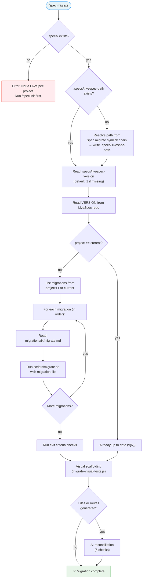

# Command: /spec.migrate

> Upgrade a LiveSpec project to the latest version by applying pending migrations sequentially.

---

## Overview

`/spec.migrate` compares the project's LiveSpec version against the current repo version and applies all pending migrations in order.



---

## Prerequisite

- `.specs/` directory must exist (project must have been initialized with `/spec.init`)

---

## Execution Flow

### Step 1 — Resolve LiveSpec repo path

1. Read `.specs/.livespec-path`
2. If missing: resolve from this command's own symlink chain:
   - `readlink ~/.claude/commands/spec.migrate.md` → `/path/to/livespec/commands/migrate.md`
   - Strip `commands/migrate.md` → `/path/to/livespec`
   - Write to `.specs/.livespec-path`
3. Verify the resolved path contains a `VERSION` file

### Step 2 — Compare versions

1. Read `.specs/livespec-version` — if missing, assume `1`
2. Read `VERSION` from the LiveSpec repo
3. If equal → display `Already up to date (v{N})` and **fall through** to Step 4.5 (Visual Scaffolding)
4. If project > repo → display error: "Project version (v{P}) is newer than repo (v{R}). This should not happen."

### Step 3 — Apply migrations

For each version N from `project_version + 1` to `repo_version`:
1. Check `migrations/N/migrate.md` exists
2. Display: `Applying migration vN: {description from frontmatter}`
3. Execute: `bash scripts/migrate.sh migrations/N/migrate.md <project-dir> <livespec-dir>`
4. If script exits non-zero → stop and report error

### Step 4 — Validate

After all migrations complete:
- [ ] All command symlinks in `.claude/commands/` exist and resolve
- [ ] All agent symlinks in `.claude/agents/` exist and resolve
- [ ] `.specs/livespec-version` matches `VERSION` from repo
- [ ] No orphaned symlinks (from commands removed in newer versions)

<!-- @spec FR-001: Unconditional invocation after migration, FR-002: Silent no-prompt — .specs/features/011-visual-migrate-integration/spec.md#fr-001 -->
### Step 4.5 — Visual Test Scaffolding

**This step runs unconditionally** — after core migrations complete AND on the "already up to date" path. No user prompt.

1. Resolve `VISUAL_SCRIPT` = `{livespec_dir}/scripts/migrate-visual-tests.js`

2. **Guard: script exists?**
   If `VISUAL_SCRIPT` does not exist on disk:
   - Display: `WARNING: migrate-visual-tests.js not found — visual scaffolding skipped`
   - Proceed to Step 5 (Report)

3. **Guard: Node.js available?**
   If `command -v node` fails:
   - Display: `WARNING: Node.js required for visual scaffolding — skipped`
   - Proceed to Step 5 (Report)

4. **Run with safe subprocess capture** (safe under `set -euo pipefail`):
   ```bash
   set +e
   VISUAL_OUTPUT=$(node "$VISUAL_SCRIPT" --generate 2>&1)
   VISUAL_EXIT=$?
   set -e
   ```

5. **Guard: non-zero exit?**
   If `VISUAL_EXIT != 0`:
   - Display: `WARNING: visual scaffolding failed (exit {VISUAL_EXIT})`
   - Display captured output for debugging
   - Proceed to Step 5 (Report)

6. **Parse sentinel from output:**
   Extract the `VISUAL_SCAFFOLD_RESULT: files=N dirs=M routes=R [reason=...]` line from `VISUAL_OUTPUT`.
   Store `FILES`, `DIRS`, `ROUTES` counts and optional `REASON` for display in Step 5.

7. Display human-readable lines from the script output (all lines except the sentinel line).

### Step 4.6 — Visual Test Reconciliation (AI)

**Runs when:** Step 4.5 sentinel shows `FILES > 0` (new test files were generated or modified).
**Skip when:** `FILES == 0`, Step 4.5 was skipped/failed, or `REASON == no-frontend`.

**Rollback boundary:** Before modifying any file, stage all files generated/modified by Step 4.5:
```
git add <TEST_DIR>/
```
This creates a clean boundary — Step 4.6 corrections remain unstaged and can be reverted with `git checkout -- <TEST_DIR>/`.

**Procedure:** Read all `.spec.ts` files in the test directory (`frontend/tests/e2e/` or `tests/visual/`). Apply the 5 checks below **in order**. Fix issues directly and log each correction.

#### Check 1: Duplicate coverage (run first — reduces file count)

List all `.spec.ts` files. Determine if two or more files **test the same page or functionality**. Use your judgment — do NOT rely solely on comparing `ROUTE` string literals. Consider all signals:
- File names: `not-found.spec.ts` and `route-not-found.spec.ts` are obviously the same page
- Route values: `/this-route-does-not-exist` and `/nonexistent-page-404` both test a 404 page
- Headings and describe blocks: `"Not Found"` in both files
- Feature slug: both reference the same feature

If duplicates found:
- Keep the file with more test cases (count `test(` occurrences) and better coverage
- Delete the other file(s)
- Log: `Duplicate removed: {deleted-file} (same page as {kept-file})`

#### Check 2: Syntax errors from merge (requires accurate file inventory)

For each file created or modified by Step 4.5:
- Count opening `{` and closing `}` braces — they must be equal
- Check for consecutive `});` on adjacent lines at the end of the file (sign of double-close from legacy merge)
- If found: remove the orphan `});` and fix indentation
- Log: `Syntax fixed: {file} (removed orphan closing brace)`

#### Check 3: Dead code in preserved sections (requires parseable files)

For each file containing `// ── Preserved from`:
- **NEVER delete content with real logic** (assertions, `page.goto`, `expect`, `locator` calls, `waitForSelector`)
- Delete ONLY empty stubs: `test("placeholder", async () => {});` or `test.describe.skip(...)` blocks with no assertions
- Log: `Dead stub removed: {file} (empty placeholder in Preserved section)`

#### Check 4: Orphaned route tests (requires accurate file inventory from Check 1)

Cross-reference `route-*.spec.ts` files with the project's route directory:
- Read the routes directory (e.g., `frontend/app/routes/`, `src/routes/`, `src/pages/`)
- If a `route-*.spec.ts` targets a route with no matching file: **warn but do NOT delete** (route may be in development)
- Log: `⚠ Potentially orphaned: {file} (route {route} not found in project)`

#### Check 5: Slug/route/heading coherence (final validation on clean set)

For each file, verify:
- `ROUTE` value is plausible for the file slug (e.g., `route-analytics.spec.ts` → `ROUTE` should contain `/analytics`)
- `HEADING` is not a generic placeholder like `"Page Title"`, `"Feature Name"`, or identical to the raw feature slug in Title Case
- Log warnings only (do not auto-fix headings): `⚠ Check heading: {file} (HEADING="{value}" may need manual update)`

**Early exit:** If all 5 checks pass with zero findings, log `Visual test reconciliation: clean — no issues found` and skip to Step 5.

**On failure:** If any check fails unexpectedly (e.g., file read error), log the error and continue with remaining checks. Do not abort the entire migration.

**Idempotency:** If Step 4.6 runs on already-reconciled files (e.g., second run of `spec.migrate`), all checks should find zero issues and exit cleanly.

**Summary:** After all checks, store total `FIXES` count and `WARNINGS` count for Step 5 report.

### Step 5 — Report

Display migration summary:

```
🔄 LiveSpec migration: v{old} → v{new}

Applying migration v{N}: {description}
  ✓ MKDIR ...
  ✓ RUN ...
  ...

Validation:
  ✓ {N} command symlinks valid
  ✓ {N} agent symlinks valid
  ✓ .specs/livespec-version = {new}

✅ Migration complete: v{old} → v{new}
```

<!-- @spec FR-007: Post-migration visual summary — .specs/features/011-visual-migrate-integration/spec.md#fr-007 -->
**Append visual scaffolding summary** (if Step 4.5 ran successfully):

```
Visual test scaffolding:
  {FILES} file(s) created
  {DIRS} baseline directory(ies) created
```

If `FILES > 0`, list each created `.spec.ts` path:
```
Visual test scaffolding:
  2 file(s) created:
    tests/visual/001-auth-ui.spec.ts
    tests/visual/003-dashboard.spec.ts
  12 baseline directory(ies) created
```

If `FILES == 0`:
```
Visual test scaffolding: 0 files created
```

**Append reconciliation summary** (if Step 4.6 ran):

```
Visual test reconciliation:
  {FIXES} fix(es) applied, {WARNINGS} warning(s)
```

If `FIXES > 0`, list each fix:
```
Visual test reconciliation:
  ✓ 1 duplicate removed (not-found.spec.ts → covered by route-not-found.spec.ts)
  ✓ 5 syntax fixes (double }); in route-*.spec.ts)
  ✓ 5 dead stubs removed (placeholder tests)
  ⚠ 1 potentially orphaned route
  0 heading issues
```

If Step 4.6 found no issues:
```
Visual test reconciliation: clean — no issues found
```

If Step 4.6 was skipped (no changes from Step 4.5):
```
Visual test reconciliation: skipped (no new files)
```

---

## Flags

| Flag | Behavior |
|------|----------|
| `--dry-run` | Show what migrations would run and which DSL actions they contain, without executing |
| `--force` | Re-run all migrations from v1 regardless of current project version. Useful when LiveSpec repo path changed (symlinks broken). |

---

## Edge Cases

### LiveSpec repo moved
If `.specs/.livespec-path` points to a non-existent directory:
1. Resolve the new path from the symlink chain (Step 1)
2. Update `.specs/.livespec-path`
3. Run `--force` to recreate all symlinks

### Missing migration file
If `migrations/N/migrate.md` does not exist for a version in the range:
- Display warning: `⚠️ No migration file for vN — skipping`
- Continue to next version

### Partial migration
If a previous migration failed mid-execution:
- Re-running `spec.migrate` is safe (all DSL verbs are idempotent)
- `SET_VERSION` is always the last action — version only bumps on full success

<!-- @spec FR-008: Script-missing guard, FR-009: Node-missing guard, FR-010: Non-fatal on failure — .specs/features/011-visual-migrate-integration/spec.md#fr-008 -->
### Visual scaffolding — script absent
If `scripts/migrate-visual-tests.js` does not exist (older LiveSpec install without Feature 010):
- Warning logged, visual scaffolding skipped
- Core migration unaffected, exit code remains 0

### Visual scaffolding — Node.js unavailable
If `node` is not in PATH:
- Warning logged, visual scaffolding skipped
- Core migration unaffected, exit code remains 0

### Visual scaffolding — script exits non-zero
If `migrate-visual-tests.js` exits with a non-zero code:
- Warning logged with captured script output for debugging
- Core migration unaffected, exit code remains 0

---

*LiveSpec Command v1.0*
