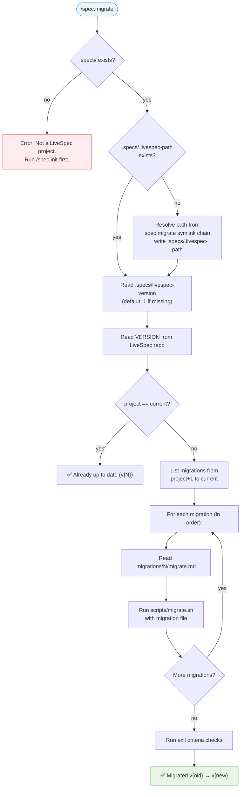

# Command: /spec.migrate

> Upgrade a LiveSpec project to the latest version by applying pending migrations sequentially.

---

## Overview

`/spec.migrate` compares the project's LiveSpec version against the current repo version and applies all pending migrations in order.



---

## Prerequisite

- `.specs/` directory must exist (project must have been initialized with `/spec.init`)

---

## Execution Flow

### Step 1 — Resolve LiveSpec repo path

1. Read `.specs/.livespec-path`
2. If missing: resolve from this command's own symlink chain:
   - `readlink ~/.claude/commands/spec.migrate.md` → `/path/to/livespec/commands/migrate.md`
   - Strip `commands/migrate.md` → `/path/to/livespec`
   - Write to `.specs/.livespec-path`
3. Verify the resolved path contains a `VERSION` file

### Step 2 — Compare versions

1. Read `.specs/livespec-version` — if missing, assume `1`
2. Read `VERSION` from the LiveSpec repo
3. If equal → display `✅ Already up to date (v{N})` and exit
4. If project > repo → display error: "Project version (v{P}) is newer than repo (v{R}). This should not happen."

### Step 3 — Apply migrations

For each version N from `project_version + 1` to `repo_version`:
1. Check `migrations/N/migrate.md` exists
2. Display: `Applying migration vN: {description from frontmatter}`
3. Execute: `bash scripts/migrate.sh migrations/N/migrate.md <project-dir> <livespec-dir>`
4. If script exits non-zero → stop and report error

### Step 4 — Validate

After all migrations complete:
- [ ] All command symlinks in `.claude/commands/` exist and resolve
- [ ] All agent symlinks in `.claude/agents/` exist and resolve
- [ ] `.specs/livespec-version` matches `VERSION` from repo
- [ ] No orphaned symlinks (from commands removed in newer versions)

### Step 5 — Report

Display migration summary:

```
🔄 LiveSpec migration: v{old} → v{new}

Applying migration v{N}: {description}
  ✓ MKDIR ...
  ✓ RUN ...
  ...

Validation:
  ✓ {N} command symlinks valid
  ✓ {N} agent symlinks valid
  ✓ .specs/livespec-version = {new}

✅ Migration complete: v{old} → v{new}
```

---

## Flags

| Flag | Behavior |
|------|----------|
| `--dry-run` | Show what migrations would run and which DSL actions they contain, without executing |
| `--force` | Re-run all migrations from v1 regardless of current project version. Useful when LiveSpec repo path changed (symlinks broken). |

---

## Edge Cases

### LiveSpec repo moved
If `.specs/.livespec-path` points to a non-existent directory:
1. Resolve the new path from the symlink chain (Step 1)
2. Update `.specs/.livespec-path`
3. Run `--force` to recreate all symlinks

### Missing migration file
If `migrations/N/migrate.md` does not exist for a version in the range:
- Display warning: `⚠️ No migration file for vN — skipping`
- Continue to next version

### Partial migration
If a previous migration failed mid-execution:
- Re-running `spec.migrate` is safe (all DSL verbs are idempotent)
- `SET_VERSION` is always the last action — version only bumps on full success

---

*LiveSpec Command v1.0*
