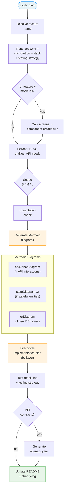

# Command: /spec.plan

> Generate a technical plan with sequence, state, and ER diagrams from a feature spec.

---

## Overview

`/spec.plan [feature-name]`

Reads the spec.md and generates a complete `plan.md` with:
- Technical context (stack-aware)
- Mermaid sequence, state, and ER diagrams
- File-by-file implementation plan
- Testing strategy



---

## Flags

| Flag | Behavior |
|---|---|
| `--auto`, `-a` | Skip confirmation, generate plan silently |
| `--no-contracts`, `-C` | Skip API contract generation |
| `--diagram-only`, `-D` | Regenerate only the Mermaid diagrams in an existing plan |
| `--no-review`, `-N` | Skip LLM plan review (review runs by default) |
| `--all-reviewers`, `-R` | Use all configured reviewers (default: first only) |

---

> **Hooks — before starting:** **Read** `before-plan` hooks from all 3 levels (skip missing files):
> 1. `~/.claude/livespec/hooks/before-plan.md`
> 2. `.specs/hooks/before-plan.md`
> 3. `.specs/hooks/before-plan.local.md` (if `mode: override` → use only this one)
>
> **Hooks — after completing:** Same resolution with `after-plan` at all 3 levels.

## Steps

### Step 1 — Resolve Feature

1. If feature name provided: find `.specs/features/NNN-feature-name/`
2. If no feature name: use current git branch (parse NNN from branch name)
3. If still no match: scan `.specs/features/*/spec.md` for the first feature with status `Draft` that has no `plan.md` (lifecycle: Draft → Planned → Approved → Implemented). If found, display:
   ```
   Next to plan: **NNN-feature-name** (Draft)
   → Proceed? (yes / no / list all)
   ```
   - **yes** → use this feature
   - **no** → abort
   - **list all** → display all plannable features (Draft, no plan.md), let user pick
4. Verify `spec.md` exists — if not, prompt user to run `/spec.specify` first

### Step 2 — Read Context Files

Read ALL of these before generating anything:

```
.specs/features/NNN-feature-name/spec.md   ← WHAT to build
.specs/constitution.md                      ← Architectural constraints
.specs/stacks/_default.md                   ← Tech stack choices
.specs/testing/strategy.md                  ← How to test
.specs/project.md                           ← Project context (users, scale)
```

### Step 2.5 — Design Reference (UI features only)

If the feature's `spec.md` contains a `## Screens` section:

1. Read the screen references and their linked PNG files from `.specs/design/screens/`
2. Check if `.specs/design/theme.css` exists — if yes, read it and `.specs/design/theme.md`
3. Generate a `## Design Reference` section in the plan, mapping each screen to its component breakdown:

   ```markdown
   ## Design Reference

   | Screen | Component Breakdown | Reference |
   |--------|-------------------|-----------|
   | [screen-name] | [Components identified from mockup] | [screen-name.png](../../design/screens/screen-name.png) |
   ```

4. If theme.css exists, add a `## Theme` subsection:

   ```markdown
   ### Theme

   - **Source:** [from theme.md]
   - **Install:** `bunx shadcn@latest add <url>` *(if available)*
   - **CSS:** [theme.css](../../design/theme.css)

   All UI implementation steps must use CSS variables from `theme.css` (e.g., `var(--primary)`, `var(--background)`). Do not hardcode colors or spacing when a matching theme token exists.
   ```

5. Use the mockups to inform the implementation plan — component hierarchy, layout structure, responsive breakpoints

If no `## Screens` section exists → skip this step.

### Step 3 — Analyze Requirements

From the spec, extract:
- All Functional Requirements (FR-001, FR-002, ...)
- All Acceptance Criteria (AC-001, AC-002, ...)
- Key Entities (for ER diagram)
- User Stories with API interactions (for sequence diagrams)
- Entities with states/lifecycle (for state diagrams)
- Infrastructure dependencies (databases, KV stores, object storage, queues, CDN, external APIs requiring credentials)
  - If spec has an "Infrastructure Requirements" section, extract directly
  - If spec mentions external resources in FR/stories but lacks the section, flag: `[INFRA DETECTED — consider adding Infrastructure Requirements section to spec]`

### Step 3.5 — Scope Sizing (Avoid Over-Planning)

Classify feature size before generating artifacts:

- **S (small):** <= 3 FR, no new entity, single API route
- **M (medium):** 4-8 FR, 1-2 entities, multiple interactions
- **L (large):** > 8 FR, cross-domain dependencies, migration risk

Apply output budget:

- S: 1 sequence diagram max, no ER unless new entity exists
- M: 1-2 sequence + state if lifecycle exists + ER if needed
- L: full set + explicit risk section with phased delivery

### Step 4 — Generate Technical Context

Auto-fill from `.specs/stacks/_default.md`:

```markdown
| Aspect | Choice | Reason |
|---|---|---|
| Language | TypeScript | From project stack |
| Framework | Next.js 14 | From stack preset |
| Database | Supabase PostgreSQL | From stack preset |
| Real-time | Supabase Realtime | Feature requires WebSocket |
| Testing | Vitest + Playwright | From testing strategy |
```

### Step 5 — Constitution Check

For each principle in `.specs/constitution.md`, verify the planned approach:
- Simplicity: is this the simplest solution?
- Separation: are UI, logic, and data properly separated?
- Testing: are all business logic functions unit-testable?
- Naming: do proposed file names follow conventions?
- Infrastructure: every cloud resource referenced in code has a provisioning step (if applicable)

Mark each gate as ✅ or add a note if deviation is needed.

### Step 6 — Generate Mermaid Diagrams

#### Decision: Which diagrams to generate?

| Condition | Gherkin | Mermaid |
|---|---|---|
| Feature has API calls or service interactions | ✅ Gherkin interaction scenarios (MANDATORY) | ✅ Sequence diagram (MANDATORY) |
| Feature has an entity with multiple states | ✅ Gherkin state transition scenarios (MANDATORY) | ✅ State diagram (MANDATORY) |
| Feature introduces new database tables | — | ✅ ER diagram only (no behavioral flow) |
| Feature is UI-only with no state or API | Already in spec (Gherkin scenarios) | Only flowchart in spec (already done) |

#### Sequence Diagrams
- Map out every API call in the feature
- Show happy path first, then error paths with `alt` blocks
- Include all participants: User, Client, API, Database, external services
- Show real-time events separately if applicable

#### State Diagrams
- Identify all states an entity can be in
- Map transitions between states (what triggers each transition?)
- Add notes explaining business rules for key states
- Use `stateDiagram-v2` syntax

#### ER Diagrams
- Include all new tables introduced by the feature
- Include existing tables that are JOINed or referenced
- Show primary keys (PK), foreign keys (FK), and important fields
- Show relationships with cardinality (||, |{, etc.)

### Step 7 — Generate File-by-File Implementation Plan

For each FR, map to specific files:

0. **Infrastructure layer** (if detected) — provisioning commands, binding configuration, verification. Generates an "Infrastructure Setup" section in the plan before Step 1.
1. **Database layer** — migrations, schema changes
2. **Data access layer** — query functions
3. **Business logic layer** — services
4. **API layer** — routes, handlers
5. **UI layer** — components, pages, hooks
6. **Test files** — unit, integration, E2E

**FR sub-task format:** Each FR mentioned in a step's `**FR covered:**` line must include a sequential sub-task number and a short description of the work done in that step:

```markdown
**FR covered:** FR-001.1: Schema creation, FR-003.1: Read status mutations
```

- Sub-task numbers increment per FR across the entire plan (e.g., FR-001.1 in Step 1, FR-001.2 in Step 3, FR-001.3 in Step 5)
- Description is mandatory and must be < 50 characters
- This enables the FR Dependency Graph playground to assign each sub-task to its correct step

For each file:
- State whether it's new or modified
- List the functions/components to create
- Reference which FR it satisfies

### Step 7.5 — Test Resolution

Before generating the testing strategy, resolve the project's test infrastructure:

1. **Read `.specs/testing/strategy.md`** — check if test commands are already resolved
2. **If not resolved**, follow the discovery procedure in `system/testing/discovery.md`:
   - Detect language/runtime
   - Detect test runners, linters, type checkers, visual testing tools
3. **Verify availability** of detected tools
4. **Record** resolved commands in the plan:

| Action | Command | Tool | Status |
|---|---|---|---|
| Unit tests | `[resolved]` | `[resolved]` | Verified / Not verified |
| Integration tests | `[resolved]` | `[resolved]` | Verified / Not verified |
| E2E tests | `[resolved]` | `[resolved]` | Verified / Not available |
| Visual tests | `[resolved]` | `[resolved]` | Verified / Not available |
| Type check | `[resolved]` | `[resolved]` | Verified / N/A |
| Lint | `[resolved]` | `[resolved]` | Verified / Not verified |
| Full suite | `[resolved]` | `[resolved]` | Verified / Not verified |

5. If a tool is missing → mark `[TOOL NEEDED: install command]` in the plan

### Step 7.6 — Theme Installation Step (UI features with theme)

If `.specs/design/theme.css` exists and the feature has UI components:

1. Check `.specs/design/theme.md` for an install command
2. If an install command exists (Mode A/C themes), add a **Step 0** to the implementation plan before any UI work:

   ```markdown
   **Step 0 — Install Theme** (if not already installed)
   - Check if `theme.css` is already imported in the project's global CSS
   - If not: run `[install command from theme.md]` (e.g., `bunx shadcn@latest add <url>`)
   - If install command is unavailable (Mode B): copy `.specs/design/theme.css` to the project's CSS directory and import it in the global stylesheet
   - Verify: theme CSS variables are accessible in the browser dev tools
   ```

3. If no install command (Mode B — generated theme), the step instructs to copy the CSS file manually
4. This step runs only once per project — subsequent features skip it if theme is already installed. Add a guard: "Skip if theme variables are already present in the project's CSS output"

### Step 8 — Generate Testing Strategy

Using the commands resolved in Step 7.5, map each test type to specific files based on `.specs/testing/strategy.md`:

```markdown
| Test Type | What | File | Command | FR/AC |
|---|---|---|---|---|
| Unit | getUnreadNotifications() | src/data/notifications.test.ts | `[resolved unit command] -- src/data/notifications.test.ts` | FR-001 |
| Integration | GET /api/notifications | tests/api/notifications.test.ts | `[resolved integration command] -- tests/api/notifications.test.ts` | AC-001 |
| E2E | Full notification flow | tests/e2e/notifications.spec.ts | `[resolved E2E command]` | AC-001, AC-002 |
| Visual | Notification panel states | tests/e2e/notifications.spec.ts | `[resolved visual command]` | SC-004 |
```

### Step 9 — Generate API Contracts (if applicable)

If the feature introduces new API endpoints:
1. Create `.specs/features/NNN-feature-name/contracts/` directory
2. Generate `openapi.yaml` with endpoint specifications
3. Include request/response schemas based on the ER diagram

### Step 9.5 — Update README.md

Update the feature row in `.specs/README.md`:
- Set Status to `Planned`
- Update the `Updated` date to today

Find the row by matching the feature number (column 1) between `<!-- readme:features:start -->` and `<!-- readme:features:end -->`.
Update the `Last updated` date in the header.

If `.specs/README.md` does not exist, create it by scanning existing artifacts (see spec-system.md README.md Recovery).

### Step 9.6 — Update Changelog

Add an entry to `.specs/features/NNN-feature-name/changelog.md`:

```markdown
### YYYY-MM-DD — Plan: Technical plan generated

- **Type:** Feature
- **Spec modified:** No
- **Code modified:** None (plan.md created)
- **AC impacted:** None (pre-implementation)
- **Author:** [tool name]
```

Also add a summary entry to `.specs/changelog.md` (global):
`[Feature NNN] Plan created: [Feature Name] — N implementation steps, N diagrams`

### Step 9.7 — LLM Plan Review (default, unless `--no-review`)

Unless the `--no-review` flag is set:

1. Read the generated `plan.md` content
2. Load reviewer models from `.specs/semantic/config.yaml` → `review_reviewers` list
3. If no reviewers configured, use the provider's default model
4. Send the plan + spec + stack + constitution to the first reviewer via `call_llm()`
5. Display findings inline with severity markers:
   ```
   Plan Review (google/gemini-3.1-pro):
     [ERROR] Coverage gap: AC-003 has no corresponding implementation step
       → Add a step covering notification preferences (FR-005)
     [WARNING] Ordering: Step 3 depends on Step 5's migration output
       → Move database migration before business logic layer
     Confidence: 4/5 | Findings: 2 | Complexity: 6 FR, 9 files, 5 AC, 3 diagrams
   ```
6. If `--all-reviewers` is set and multiple reviewers are configured, run each reviewer sequentially and display all findings
7. If confidence is low (< threshold) and findings are empty, display warning:
   ```
   ⚠ Review suspiciously empty for a plan of this complexity. Consider using a different reviewer model.
   ```

**On findings — correction behavior:**

- **`[ERROR]` / BLOCKING findings:** Regenerate `plan.md` with the findings injected as hard constraints (max 2 retries). On each retry, re-run the review. If BLOCKING findings remain after 2 retries → display all remaining findings and stop with:
  ```
  ⚠ Plan still has blocking issues after 2 correction attempts. Review manually then re-run /spec.plan.
  ```
- **`[WARNING]` / `[INFO]` findings only:** Display findings and proceed. These are informational — no regeneration triggered.
- **PASS (no findings):** Proceed silently.

### Step 9.8 — Structural Validation

After generating `plan.md`, validate its structure:

```bash
livespec validate .specs/features/NNN-feature-name/plan.md --format compact
```

**Exit 0:** proceed to plan gate.

**Exit non-zero:** inject verbatim errors:

> "The plan.md you just generated failed structural validation. Regenerate plan.md fixing these issues:
> `<livespec validate --format compact output verbatim>`"

Regenerate `plan.md` (spec.md + constitution + stack + error constraints). **Maximum 2 retries.** On 3rd failure:
```
ABORT: "plan.md failed structural validation after 2 retries.
        Last errors: <livespec validate output>"
```

### Step 10 — Present for Approval

> ✅ **Plan generated:** `.specs/features/004-notifications/plan.md`
>
> **Summary:**
> - 2 sequence diagrams (notification fetch, mark as read)
> - 1 state diagram (notification lifecycle)
> - 1 ER diagram (2 new tables: notifications, notification_preferences)
> - 7 implementation steps across 9 files
> - API contract: `contracts/openapi.yaml`
>
> **Constitution check:** All gates ✅
>
> Ready to implement? Run: `/spec.implement notifications`
> Or review the plan first in `.specs/features/004-notifications/plan.md`

---

## Output

```
.specs/features/004-notifications/
├── spec.md          ← Existing (read-only during plan)
├── plan.md          ← Generated now
└── contracts/
    └── openapi.yaml ← Generated if API endpoints exist
```

---

## Definition of Done (Command-Level)

`/spec.plan` is complete only if all are true:

- [ ] `plan.md` generated in target feature directory
- [ ] Every FR appears in implementation plan mapping
- [ ] Diagram set matches feature size — Gherkin scenarios paired with Mermaid diagrams (except ER)
- [ ] If spec has Infrastructure Requirements: plan includes Infrastructure Setup section with provisioning and verification for every listed resource
- [ ] Constitution check contains explicit pass/deviation notes
- [ ] Test commands are resolved (Resolved Test Commands table filled)
- [ ] Testing strategy maps AC/FR to concrete test files
- [ ] `.specs/README.md` feature row Status is `Planned`
- [ ] Feature `changelog.md` has a plan entry
- [ ] Global `.specs/changelog.md` has a summary entry
- [ ] Next action is proposed (`/spec.implement [feature]`)

If a requirement cannot be planned safely, mark it `[DECISION NEEDED]` with owner and unblock options.

---

*LiveSpec Command v1.0*
