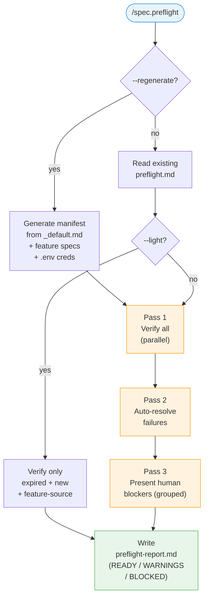

<!-- Anti-drift block injected via @import (Chantier 1, AUDIT.md). See system/anti-drift-block.md for the canonical 6-field step shape, ERROR/BLOCKED line formats, and timeout/retry policy. -->
<!-- @import system/anti-drift-block.md -->


# Command: /spec.preflight

> Preflight check — verify all tools, sessions, and tokens are ready before autonomous implementation.

---

## Overview

`/spec.preflight [flags]`

Reads `.specs/preflight.md` (the manifest), executes verification checks, auto-resolves what it can, and presents human-required actions grouped together. Produces both inline terminal output and a persisted `.specs/preflight-report.md`.

Can also generate/regenerate the manifest from the project stack and feature specs.



---

> **Hooks — before starting:** **Read** `before-preflight` hooks from all 3 levels (skip missing files):
> 1. `~/.claude/livespec/hooks/before-preflight.md`
> 2. `.specs/hooks/before-preflight.md`
> 3. `.specs/hooks/before-preflight.local.md` (if `mode: override` → use only this one)
>
> **Hooks — after completing:** Same resolution with `after-preflight` at all 3 levels.

## Manifest Format

The manifest (`.specs/preflight.md`) has 4 sections. Each check is a `###` heading with bullet-point fields.

**Tooling checks:**

```markdown
### <check-name>
- **binary:** `<binary-name>`
- **verify:** `<command to check presence/version>`
- **install:** `<command to install>`
- **severity:** critical | warning
- **source:** stack (_default.md) | spec (NNN-feature-name) | manual
```

**Authentication checks:**

```markdown
### <check-name>
- **type:** oauth
- **verify:** `<command to check session>`
- **resolve:** `<command to re-authenticate>`
- **severity:** critical | warning
- **expires:** true
- **source:** stack (_default.md) | spec (NNN-feature-name) | manual
```

**Token checks:**

```markdown
### <check-name>
- **type:** creds
- **entry:** `<creds entry path>`
- **verify:** `creds get <entry> > /dev/null 2>&1`
- **resolve:** human
- **severity:** critical | warning
- **source:** stack (_default.md) | spec (NNN-feature-name) | manual
```

**Custom section** uses markers:

```markdown
## Custom

<!-- preflight:custom:start -->
<!-- user entries here -->
<!-- preflight:custom:end -->
```

### Field Definitions

| Field | Values | Description |
|-------|--------|-------------|
| `binary` | String | Binary name (Tooling only) |
| `verify` | Shell command | Command to check if the check passes (exit 0 = pass) |
| `install` / `resolve` | Shell command or `human` | How to fix a failed check. `human` = requires user action |
| `severity` | `critical` / `warning` | Critical blocks implementation, warning is informational |
| `type` | `oauth` / `creds` | Authentication/Token type discriminator |
| `entry` | String | `creds` entry path (Tokens only) |
| `expires` | `true` / absent | If true, re-verified on every light check |
| `source` | String | Traceability — where this check was inferred from |
| `timeout` | Integer (seconds) | Per-check timeout override for `verify` command. Default: 10s |

### Custom Section Merge Algorithm

Regeneration preserves the Custom section:

1. Locate `<!-- preflight:custom:start -->` and `<!-- preflight:custom:end -->` markers
2. Extract content between markers verbatim
3. Regenerate Tooling, Authentication, Tokens sections from stack + specs
4. Re-insert Custom content between markers unchanged
5. If markers missing/malformed → abort, warn: "Custom section markers corrupted. Run `/spec.preflight --regenerate --force` to reset, or fix markers manually."
6. If duplicate check name between generated and Custom → keep both, rename Custom entry with `(custom)` suffix, warn

---

## Generator — Stack-to-Checks Catalog

| Stack detected in `_default.md` | Generated checks |
|---------------------------------|------------------|
| Cloudflare Workers | `wrangler` (tooling, critical) + `cloudflare-oauth` (auth, critical) |
| Supabase | `supabase` CLI (tooling) + `supabase-login` (auth) + token if direct API |
| Vercel | `vercel` CLI (tooling) + `vercel-oauth` (auth) |
| Next.js | `node` + `npm` (tooling) |
| Playwright | `npx playwright` (tooling) + `playwright install` (browsers) |
| Vitest / Jest | test runner (tooling, warning) |
| ESLint | linter (tooling, warning) |
| TypeScript | `tsc` (tooling, warning) |
| Stripe | `stripe` CLI (tooling) + `stripe-login` (auth) + `creds:*/stripe_secret_key` (token) |
| AWS | `aws` CLI (tooling) + `aws-sso` or `creds:*/aws_*` |
| GitHub API | `gh` CLI (tooling) + `gh-auth` (auth) |
| `creds` (token checks) | `creds` CLI (tooling, critical) — required when any `type: creds` check exists in manifest |
| Multi-agent mode | `superpowers:subagent-driven-development` skill (tooling, warning) + `CLAUDE_CODE_EXPERIMENTAL_AGENT_TEAMS` env var (tooling, warning) — required for default `/spec.implement` mode |

This catalog is extensible — new mappings can be added as new stacks are supported.

### `creds` CLI Detection

When the manifest contains any `type: creds` check, a `creds` binary check is **automatically prepended** to the Tooling section:

```markdown
### creds CLI
- **binary:** `creds`
- **verify:** `creds --version`
- **install:** `git clone https://github.com/julien-m/keychain-creds.git ~/keychain-creds && cd ~/keychain-creds && bun install && bun run build && bun link`
- **severity:** critical
- **source:** auto (required by token checks)
```

If `creds` is not installed, all `type: creds` checks will fail. The preflight report should surface this clearly: "Install `creds` first — see https://github.com/julien-m/keychain-creds".

### Multi-Agent Prerequisites

When the project uses LiveSpec multi-agent mode (default for `/spec.implement`), preflight auto-generates these checks:

```markdown
### Superpowers plugin
- **binary:** —
- **verify:** `ls ~/.claude/plugins/marketplaces/superpowers-marketplace/SKILL.md 2>/dev/null`
- **install:** human
- **severity:** warning
- **source:** auto (required by multi-agent mode)

### Agent Teams config
- **binary:** —
- **verify:** `grep -q 'CLAUDE_CODE_EXPERIMENTAL_AGENT_TEAMS' ~/.claude/settings.json 2>/dev/null`
- **install:** human
- **severity:** warning
- **source:** auto (required by multi-agent mode)
```

If these checks fail, preflight emits a warning: "Multi-agent mode requires Superpowers skills and CLAUDE_CODE_EXPERIMENTAL_AGENT_TEAMS=1. Use `--mono` flag as fallback."

### Generation Rules

1. **Parse `_default.md`** — extract the stack (framework, deploy, DB, auth, testing, etc.)
2. **Match catalog** — each recognized technology generates its checks
3. **Scan specs** — parse "Infrastructure Requirements" sections from all `spec.md` files for additional needs. If no feature specs exist yet (fresh init), only stack-level checks are generated
4. **Detect tokens** — if a `.env` file exists at project root, each `creds:*` entry becomes a Token check
5. **Deduplicate** — if a check already exists (manually added or from previous run), do not overwrite
6. **Preserve Custom** — everything in the Custom section is untouched

### Regeneration Behavior

When `--regenerate` is used:

1. Parse existing `preflight.md` and extract Custom section (between `<!-- preflight:custom:start -->` and `<!-- preflight:custom:end -->` markers)
2. If markers missing or malformed → abort, warn: "Custom section markers corrupted. Run `/spec.preflight --regenerate --force` to reset, or fix markers manually."
3. Read `.specs/stacks/_default.md` — extract stack technologies
4. Match against catalog — generate Tooling, Authentication, Tokens sections
5. Scan all `.specs/features/*/spec.md` for "Infrastructure Requirements" sections
6. If `.env` exists at project root, scan for `creds:*` entries → add Token checks
7. Deduplicate against existing entries (do not overwrite)
8. If duplicate check name between generated and Custom → keep both, rename Custom entry with `(custom)` suffix, warn
9. Re-insert Custom section between markers unchanged
10. Write updated `preflight.md`

When `--regenerate --force` is used: reset Custom section to empty template markers.

---

## Execution Engine — 3-Pass Algorithm

### Pass 1 — Verification (parallel)

Execute all `verify` commands in parallel (max concurrency: system default). Default timeout per command: 10 seconds (override with `timeout` field in manifest).

Each check receives a status:
- `pass` — exit code 0
- `fail` — exit code non-zero
- `error` — timed out or command not found

### Pass 2 — Auto-resolution (sequential)

For each `fail` check where `resolve`/`install` is not `human`:

0. If `source: manual` → prompt user: "Execute `[resolve command]` for check `[name]`? (y/n)". If declined → mark `failed`, escalate to Pass 3
1. Execute the `resolve`/`install` command
2. Re-execute the `verify` command
3. Final status: `resolved` (verify now passes) or `failed` (still failing)

Sequential to avoid conflicts (e.g., two npm installs racing).

Partial failure: if auto-resolution fails, mark check `failed` and escalate to Pass 3 as human blocker with the error output. No rollback — all install/resolve commands must be idempotent.

### Pass 3 — Human blockers (grouped)

Present all remaining `failed` checks that require human action together:

```
⚠ Preflight — N actions required:

  1. [TYPE] check-name
     → Run: <resolve command>

  ...

Resolve these, then press Enter to re-verify (or type 'skip' to continue — critical failures will still block).
```

After user action (Enter): run a full Pass 1 + Pass 2 cycle. This catches cascading dependencies. If new failures detected, re-enter Pass 3.

If user types 'skip': continue. Critical failures still enforce the gate.

Loop terminates when all checks pass or user skips.

---

## Report Generation

After execution (regardless of verdict — READY, WARNINGS, or BLOCKED), write `.specs/preflight-report.md` using the template from `system/templates/preflight-report-template.md`. Fill in:

- Generated timestamp (ISO-8601)
- Mode (`full` or `light`)
- Duration
- Summary table with counts per category
- Verdict: `READY` (all pass), `BLOCKED` (any critical failed), or `WARNINGS` (only warnings failed)
- Auto-resolved list
- Blocked list
- Details tables per category with check name, status symbol, command + output (version for `--version` commands, exit code only for token/auth checks), duration

Token values are **never** displayed — only `exists` or `missing`.

---

## Inline Output

### READY verdict

```
✓ Preflight Complete (N checks)

  Tooling         name1 ✓  name2 ✓
  Authentication  name3 ✓
  Tokens          name4 ✓
  Custom          name5 ✓

  ⏱ Xs | N passed, N auto-resolved, 0 blocked
```

### WARNINGS verdict

```
⚠ Preflight Complete with warnings (N checks)

  Tooling         name1 ✓  name2 ✓
  ...

  Warnings:
    name — reason (warning, non-blocking)

  ⏱ Xs | N passed, N auto-resolved, 0 blocked, N warning
```

### BLOCKED verdict

Execution does not complete — Pass 3 loop is active until resolved or skipped.

---

## Light Check Mode (`--light`)

Verifies only a subset of the manifest:
- Items with `expires: true` (OAuth sessions — may have expired)
- Items whose `source` references the current feature (if feature name provided)
- Items added since last full run (check name exists in manifest but not in Details tables of `preflight-report.md`)
- Skips all other items already `pass` at last run

If `preflight.md` does not exist: log warning "No preflight manifest found. Run `/spec.preflight --regenerate` to create one." and **continue** without blocking.

If `preflight-report.md` does not exist: treat all items as new (run full check set).

---

## Dry Run Mode (`--dry-run`)

Parse the manifest and display what would be checked without executing:

```
Preflight dry run — N checks would be executed:

  Tooling (N):        name1, name2, ...
  Authentication (N): name3, ...
  Tokens (N):         name4, ...
  Custom (N):         name5, ...

  Critical: N | Warning: N
```

---

## Gate Behavior

| Condition | Result |
|-----------|--------|
| Any `critical` check `failed` after Pass 3 | **BLOCKS** — cannot proceed to implementation |
| Only `warning` checks `failed` | Displays warning, **continues** |
| All checks `pass` or `resolved` | **READY** — proceeds normally |

---

## Flags

| Flag | Behavior |
|------|----------|
| `--light`, `-l` | Light check - only expires, feature-source, and new items |
| `--regenerate`, `-r` | Regenerate manifest from stack + specs (preserves Custom) |
| `--regenerate --force`, `-r -f` | Regenerate manifest and reset Custom section |
| `--dry-run`, `-d` | Show what would be checked without executing |
| `--fix` | Auto-install missing tools and init resources (Feature 034) |
| `--full` | With `--fix`: disable smart scoping; verify every entry |
| `--auto` | With `--fix`: non-interactive, auto-yes to safe installs |

### Auto-Install & Init Mode (`--fix`) - Feature 034

`/spec.preflight --fix` extends the read-only verifier with auto-install
and resource-init capability. Implemented by `validator.preflight_autofix`
(invoke directly via `python3 -m validator.preflight_autofix --manifest .specs/preflight.md`).

**Install dispatchers:** `brew install`, `cargo install`, `npm install -g`
(uses `pnpm` when available), `pip install --user`, `pipx install`,
allowlisted curl-pipe installers (Maestro, rustup, Bun, Starship).

**Init dispatchers:** `xcrun simctl create` (iOS Simulator),
`avdmanager create avd` (Android AVD), `sdkmanager` (system images),
`sudo xcodebuild -license accept` (Xcode license),
`xcode-select --install` (Xcode CLI tools).

**Smart scoping (default):** examines `git diff HEAD~1..HEAD` and only
verifies/installs dependencies for drivers and UI runners impacted by
files in the recent commit. File-pattern to driver/runner mapping is
declared in `validator/preflight_autofix.py::FILE_PATTERN_MAP`.

**Manual-action guides:** when an installer is `human` (Xcode app, Apple
Developer auth, etc.), `--fix` emits a numbered step-by-step guide and
exits with code `2` ("manual action required"). Failed automatic installs
exit with code `1`. `0` means everything is satisfied or auto-resolved.

**Summary table:** rendered after every run with counts for
*Verified / Installed / Would install / Manual required / Failed / Skipped*.

The migration that enriches `.specs/preflight.md` with entries from
features 016-033 is shipped as migration v10 - run `/spec.migrate`.

---

## Definition of Done (Command-Level)

`/spec.preflight` is complete only if all are true:

- [ ] `.specs/preflight.md` exists (or was just generated with `--regenerate`)
- [ ] All `verify` commands were executed (or skipped per `--light` rules)
- [ ] Auto-resolvable failures were attempted
- [ ] Human blockers were presented grouped (if any)
- [ ] `.specs/preflight-report.md` was written with Verdict
- [ ] Inline output was displayed with summary
- [ ] If called as Phase 0.5: gate behavior enforced (critical = block, warning = continue)

---

## Changelog Policy

Preflight manifest updates are infrastructure-level artifacts — they do not generate entries in feature changelogs or the global `.specs/changelog.md`.

---

## Security

- Auto-generated entries use only well-known package manager commands
- Entries with `source: manual` require user confirmation before auto-resolution
- Token values are never displayed — only existence checked via `creds get ... > /dev/null`
- The manifest is versioned in git — modifications visible in diffs

---

*LiveSpec Command v1.0*
