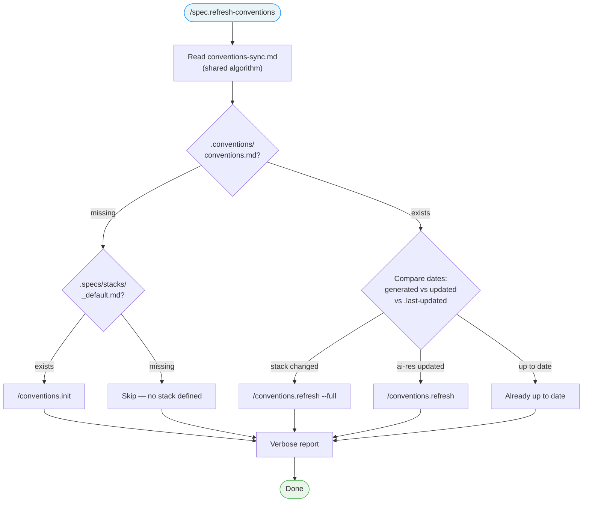

<!-- Anti-drift block injected via @import (Chantier 1, AUDIT.md). See system/anti-drift-block.md for the canonical 6-field step shape, ERROR/BLOCKED line formats, and timeout/retry policy. -->
<!-- @import system/anti-drift-block.md -->


# Command: /spec.refresh-conventions

> Manually trigger conventions initialization or refresh based on the current LiveSpec stack.

---

## Overview

`/spec.refresh-conventions` runs the conventions-sync algorithm manually, with verbose output. Use it when:
- `/spec.init` was run but conventions were not generated (e.g., hook was not triggered)
- You changed ai-ressources and want to propagate updates
- You want to force a conventions refresh without changing the stack



---

## Steps

### Step 1 — Guard

Verify `.specs/` directory exists. If not:

> This project has not been initialized with LiveSpec. Run `/spec.init` first.

Stop.

### Step 2 — Extract Signals from Stack

**Read** `.specs/stacks/_default.md` fully. **Read** `.specs/project.md` if it exists.

Extract a flat list of keyword signals: technology names, dependency names, architecture keywords, project type keywords, platform keywords. These are **raw signals** — do not attempt to map them to convention domains yourself.

Example: for a Bun + TypeScript + cron-parser project → `typescript, bun, cron-parser, parseArgs, cli`

### Step 3 — Run Conventions Sync

**Read** [`~/.claude/livespec/references/conventions-sync.md`](~/.claude/livespec/references/conventions-sync.md) and follow its algorithm. When invoking `/conventions.init` or `/conventions.refresh`, pass the extracted signals from Step 2 so the skill can resolve them via `domain-catalog.md`.

### Step 4 — Verbose Report

Regardless of the outcome (even on skip), display a verbose report:

```
Conventions Sync Report
═══════════════════════

  Stack file:        .specs/stacks/_default.md
  Stack updated:     2026-03-30
  Conventions file:  .conventions/conventions.md
  Conventions gen:   2026-03-28
  ai-ressources:     2026-03-29

  Status: STALE (ai-ressources updated since last generation)
  Action: /conventions.refresh
  Result: Conventions refreshed successfully
```

If conventions did not exist:
```
  Status: MISSING
  Action: /conventions.init
  Result: Conventions initialized from stack (12 domains detected)
```

If already up to date:
```
  Status: UP TO DATE
  Action: None
```

If no stack file:
```
  Status: NO STACK
  Action: None — run /spec.init to define a stack
```

### Step 5 — Flags

| Flag | Behavior |
|------|----------|
| `--force`, `-f` | Skip freshness check, always run `/conventions.refresh --full` |
| `--dry-run`, `-d` | Show what would happen without executing |

If `--force` is passed, skip Step 3's date comparisons (performed inside `conventions-sync.md`) and directly run `/conventions.refresh --full`.
If `--dry-run` is passed, display the report but do not execute `/conventions.init` or `/conventions.refresh`.

---

## Output

- Verbose report on stdout (always)
- `.conventions/conventions.md` created or updated (unless `--dry-run` or already up to date)

---

## Definition of Done

- [ ] Guard checks `.specs/` existence
- [ ] Reads and follows `conventions-sync.md` algorithm
- [ ] Displays verbose report with all 3 dates
- [ ] `--force` bypasses freshness check
- [ ] `--dry-run` shows report without executing
- [ ] Works when conventions don't exist yet (init case)
- [ ] Works when conventions are stale (refresh case)
- [ ] Works when conventions are up to date (skip case)

---

*LiveSpec Command v1.0*
