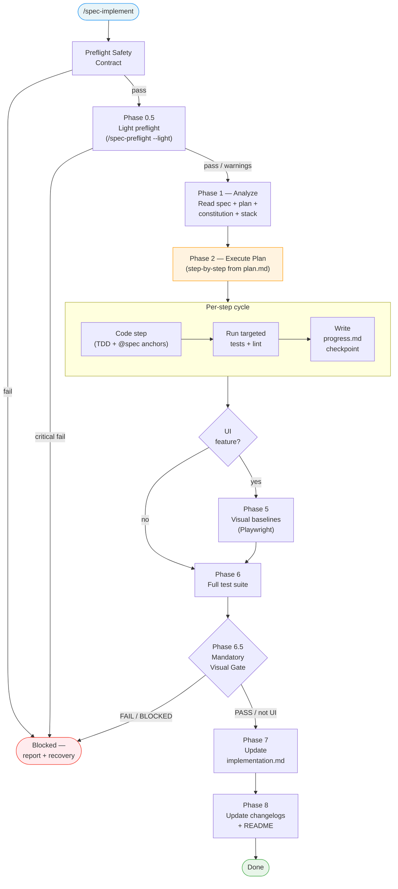

<!-- Anti-drift block injected via @import (Chantier 1, AUDIT.md). See system/anti-drift-block.md for the canonical 6-field step shape, ERROR/BLOCKED line formats, and timeout/retry policy. -->
<!-- @import system/anti-drift-block.md -->


# Command: /spec-implement

> APEX-style auto-pipeline: implement → test → visual baselines → map to spec.

---

## Overview

`/spec-implement [feature-name]`

Executes a full implementation pipeline from `plan.md` to working, tested, documented code. By default, uses multi-agent orchestration (supervisor + superpowers + documenter). Use `--mono` for single-agent mode.



---

> **Hooks — before starting:** **Read** `before-implement` hooks from all 3 levels (skip missing files):
> 1. `~/.claude/livespec/hooks/before-implement.md`
> 2. `.specs/hooks/before-implement.md`
> 3. `.specs/hooks/before-implement.local.md` (if `mode: override` → use only this one)
>
> **Hooks — after completing:** Same resolution with `after-implement` at all 3 levels.
> **Hooks — before each step:** Same resolution with `before-implement-step` at all 3 levels.
> **Hooks — after each step:** Same resolution with `after-implement-step` at all 3 levels.

## Surface-Aware Test Directory Resolution

**Before any step that creates or references test files:** If `.specs/surfaces.yaml` exists, read it and use each surface's `testDir` as the test directory. Test paths in this command (e.g., `tests/e2e/screens/`) are **examples** — replace with the actual surface-resolved path. If no `surfaces.yaml` exists, use legacy detection.

---

## Feature Resolution

1. If feature name provided: find `.specs/features/NNN-feature-name/`
2. If no feature name: use current git branch (parse NNN from branch name)
3. If still no match: scan `.specs/features/*/spec.md` for the first feature with status `Approved` or `Planned` (has plan.md, not yet implemented — lifecycle: Draft → Planned → Approved → Implemented). If found, display:
   ```
   Next to implement: **NNN-feature-name** (Approved)
   → Proceed? (yes / no / list all)
   ```
   - **yes** → use this feature
   - **no** → abort
   - **list all** → display all implementable features (Approved/Planned with plan.md), let user pick
4. Verify `spec.md` and `plan.md` exist — if not, prompt user to run the appropriate command first

---

## Pipeline Phases

### Phase 1 — Analyze

**Read everything before writing anything:**

1. `.specs/features/NNN-feature-name/spec.md` — requirements and acceptance criteria
2. `.specs/features/NNN-feature-name/plan.md` — implementation plan and diagrams
3. `.specs/constitution.md` — architectural rules
4. `.specs/stacks/_default.md` — stack and patterns to follow
5. `.specs/testing/strategy.md` — testing requirements
6. `.specs/design/screens/*.png` — if feature has a `## Screens` section in spec.md, read the referenced mockup PNGs as visual targets for UI implementation
7. `.specs/design/theme.css` — if exists, read as the authoritative theme for CSS variables (colors, spacing, typography)
8. `.specs/design/theme.md` — if exists, read for install command and color palette reference

<!-- @spec FR-005: Behavioral TDD step insertion, FR-006: Taxonomy test patterns — .specs/features/005-ui-behavioral-testing/spec.md#fr-005 -->

9. **Behavioral AC detection:** Check whether spec.md contains a `## Behavioral AC` section.
   - If present: extract all declared traits and their test patterns by reading `system/testing/ui-behavioral-taxonomy.md`. Record the list of traits + required test patterns for Phase 2.
   - If absent: no behavioral TDD step is added (AC-008).
   - If taxonomy is missing but `## Behavioral AC` exists: log WARNING — "Behavioral AC declared but taxonomy not found. Behavioral TDD step will be skipped. Create taxonomy or run /spec-specify --no-behavioral." (EC-005 graceful degradation — see taxonomy section 6.)

**Explore the codebase:**
- Find existing patterns matching what needs to be built
- Identify files that will need modification
- Locate test utilities and fixtures to reuse
- Understand naming conventions from existing code

**Verify prerequisites:**
- Does the plan.md exist? If not, prompt to run `/spec-plan` first
- Are there any `[DECISION NEEDED]` markers in the plan? Surface them before starting

**Design fidelity:** When implementing UI components, reference the corresponding mockup PNG from `.specs/design/screens/`. Match the layout, colors, and spacing from the mockup. When creating `implementation.md`, add a "Visual Ref" column linking each UI-related FR to its mockup.

**Theme enforcement:** If `.specs/design/theme.css` exists, all UI implementation must use its CSS variables (`var(--primary)`, `var(--background)`, etc.) instead of hardcoded color/spacing values. If `theme.md` contains an install command, execute it as Step 0 before any UI code (skip if theme is already installed in the project).

## Preflight Safety Contract

Before Phase 1, run a preflight check and stop early on blockers:

- [ ] Target feature directory exists
- [ ] `spec.md` exists and status is not Deprecated
- [ ] `plan.md` exists and contains no unresolved `[DECISION NEEDED]`
- [ ] Project test commands are resolved in plan.md Resolved Test Commands (use `system/testing/discovery.md` if not)
- [ ] Required tooling is available for chosen steps (verified during test discovery)
- [ ] If plan has "Infrastructure Setup" section: infrastructure provisioning tools are available (e.g., `wrangler` for Cloudflare, `aws` CLI for AWS)

If one check fails, do not start implementation. Report blocker + minimal recovery command.

### Environment Failure Protocol

When tooling is broken (install failure, missing binary, config crash):

1. Stop code edits after current safe checkpoint.
2. Record `Blocked by Environment` section in execution output.
3. Provide minimal unblock plan with exact commands.
4. Offer `/spec-implement [feature] --resume` once unblocked.

### Change Scope Guard

To avoid large accidental edits:

- Maximum initial touch set: 12 files.
- If plan requires more, split into phases and ask for confirmation.
- For each phase, list exact files before editing.

### Phase 0.5 — Preflight Check (Light)

<!-- @spec FR-008: Phase ordering and single progress.md creation site — .specs/features/013-state-model-identity-resolution/spec.md#fr-008 -->
> **Phase numbering note (Chantier 4 / Feature 013):** There is intentionally no `Phase 1` in this command — Phase 1 was historically a separate "Analyze" step that has been collapsed into Phase 2 (Plan Execution). The preflight check is numbered 0.5 to mark its position between the Preflight Safety Contract (no number) and Phase 2. Implementations must NOT insert a Phase 1; the next phase after 0.5 is always Phase 2.

After verifying spec/plan files exist (Preflight Safety Contract), run a light preflight check to verify tools and access are ready:

1. If `.specs/preflight.md` does not exist → log warning: "No preflight manifest found. Run `/spec-preflight --regenerate` to create one." and continue to Phase 2
2. Run `/spec-preflight --light` with the current feature name as context
3. Gate behavior:
   - Any `critical` check failed → **STOP**. Write `preflight-report.md` with BLOCKED verdict. Report blocker + recovery command. Do not start implementation.
   - Only `warning` checks failed → write `preflight-report.md` with WARNINGS verdict, display warning, continue to Phase 2
   - All pass → write `preflight-report.md` with READY verdict, continue to Phase 2

This phase ensures tools, OAuth sessions, and API tokens are available before autonomous work begins. It runs AFTER the Preflight Safety Contract (which checks spec/plan file existence) and BEFORE the Infrastructure Gate (Phase 2 Step 0, which checks cloud resource existence).

### Phase 2 — Plan Execution

Create an ordered todo list from `plan.md`:

```
[ ] Step 0a: Behavioral TDD (if ## Behavioral AC present) — runs BEFORE infrastructure
[ ] Step 0: Infrastructure setup (provision, bind, verify) — only if plan has Infrastructure Setup
[ ] Step 1: Create database migration
[ ] Step 2: Create data access functions
[ ] Step 3: Create API endpoints
[ ] Step 4: Create UI components
[ ] Step 5: Create real-time subscription hook
[ ] Step 6: Write unit tests
[ ] Step 7: Write integration tests
[ ] Step 8: Write E2E tests
[ ] Step 9: Capture visual baselines
[ ] Step 10: Update implementation.md
[ ] Step 11: Update changelog.md
```

#### Step 0a — Behavioral TDD (if `## Behavioral AC` present)

> **Ordering note:** Step 0a runs BEFORE Step 0 (Infrastructure). The "a" suffix indicates it precedes the existing Step 0. This step is entirely skipped when no `## Behavioral AC` section exists in spec.md.

This step runs BEFORE any infrastructure provisioning and BEFORE any component code.

For each trait declared in `## Behavioral AC`:
1. Read the trait's required test patterns from `system/testing/ui-behavioral-taxonomy.md`
2. Generate a failing test file covering ALL required patterns for ALL declared traits (combined into one test file per component — not one file per trait)
3. Run tests to confirm RED phase (tests must fail — if they pass before implementation, flag as: "Tests pass before implementation — investigate whether component already exists or test is incorrectly written")
4. Record Step 0a in `progress.md` as Done only after: test file written AND tests confirmed failing (RED)

**Deduplication:** See taxonomy deduplication rule (section 5).

**Taxonomy reference:** The implementer must include a comment in the test file:
```
# Behavioral patterns from: system/testing/ui-behavioral-taxonomy.md
# Traits: [list of detected traits]
```

### Step Gate (Blocking) — obligatoire avant passage au step suivant

Règle globale: un step ne peut passer à `Done` que si ses vérifications sont vertes (ou `Blocked` documenté).

<!-- @spec FR-008: Single creation site for progress.md — .specs/features/013-state-model-identity-resolution/spec.md#fr-008 -->
> **MANDATORY: `progress.md` must exist before any step is marked Done, and updated after EVERY step.**
> Creation site (Chantier 4 / Feature 013):
> - If the spec contains a `## Behavioral AC` section → Step 0a creates `progress.md` (writes its own checkpoint when test files are RED).
> - Otherwise → Step 1 creates `progress.md` as its first action (before any code is written).
>
> In both cases the file MUST exist before any step transitions to `Done`. Step Gate is the single enforcement point and refuses to advance if `progress.md` is missing. The file is created exactly once per feature; subsequent steps only append/update entries.
>
> This file is the only mechanism enabling `--resume`. Skipping it is NOT allowed.
> If the implementation is interrupted without `progress.md`, all progress is lost.

Pour chaque `Step N`:

1. Exécuter les checks ciblés du step (tests unitaires/intégration/E2E selon le scope).
2. Exécuter les checks transverses impactés (au minimum lint/typecheck sur fichiers touchés).
3. Si échec: corriger et re-tester dans les limites d'itération.
4. Si limite atteinte: marquer `Blocked`, enregistrer le contexte, arrêter la progression.
5. **Écrire le checkpoint dans `.specs/features/NNN-feature-name/progress.md` (BLOCKING — do NOT proceed without writing this).**
6. Passer au `Step N+1` uniquement si statut `Done`.

#### Statuts autorisés par step

- `Todo`
- `In Progress`
- `Done`
- `Blocked`

#### Format de checkpoint (persistant, utilisé par `--resume`)

| Step | Status | Files | Tests run | Result | Updated at |
|---|---|---|---|---|---|
| 1 | Done | `db/migrations/2026xxxx.sql` | [resolved test command] | Pass | 2026-03-12 10:42 |
| 2 | Blocked | `src/data/notifications.ts` | [resolved test command] | Fail (3/3) | 2026-03-12 11:03 |

#### Règle `--resume`

`--resume` lit `.specs/features/NNN-feature-name/progress.md` et reprend au premier step non `Done`.

### Phase 3 — Convert & Dispatch (Superpowers Bridge)

Instead of coding directly, construct a **Task Payload** for the current step and dispatch it to Superpowers.

#### 3.1 — Build the Task Payload

For each step, assemble the following payload:

**1. Context**
- Functional Requirements (FR) and Acceptance Criteria (AC) from `spec.md` that are addressed by this step.
- A summary of how this step fits into the overall plan (reference `plan.md` step description and diagrams).

**2. Implementation Instructions**
- Exact step description from `plan.md` (files to create/modify, patterns to follow, exact code structure if specified).
- Relevant rules from `.specs/constitution.md` that apply to the files being touched.
- Stack and patterns from `.specs/stacks/_default.md`.
- **Conventions payload** — built per `~/.claude/livespec/references/conventions-sync.md` § Load Path:
  1. Read `.conventions/index.md`. If absent, set the conventions payload to `NONE` and skip the rest of this bullet.
  2. Select sub-domains relevant to this step: always include `code`; add `design-tokens`, `design-components`, `design-views` (and other visual sub-domains) if the step touches UI; add `design-dataviz`, `design-realtime`, `design-quality` based on the work signal.
  3. Resolve every `→ $AIRESOURCES/...` path for the selected sub-domains.
  4. **Read** the content of each resolved file and inline it in the subagent payload under a `## Conventions (MANDATORY)` section, grouped by sub-domain. The subagent has fresh context — it cannot reload these files on its own.
  5. State explicitly that the subagent MUST follow every rule in the listed files for any code it produces.
- **Full content of `.specs/design/theme.css`** (if exists and step involves UI) — include so the subagent uses theme CSS variables for all color/spacing values. Add instruction: "Use CSS variables from theme.css (e.g., `var(--primary)`, `var(--secondary)`) for all colors and design tokens. Never hardcode colors when a matching CSS variable exists."

**3. LiveSpec Mandatory Rules**
- Every source file that implements a FR **must** contain an inline `@spec` anchor comment with a deep-link to the spec:
  ```
  // @spec FR-NNN: <description> — .specs/features/NNN-feature-name/spec.md#fr-nnn   ← JS/TS/C-style
  # @spec FR-NNN: <description> — .specs/features/NNN-feature-name/spec.md#fr-nnn     ← Python/Ruby/Shell
  -- @spec FR-NNN: <description> — .specs/features/NNN-feature-name/spec.md#fr-nnn    ← SQL
  <!-- @spec FR-NNN: <description> — .specs/features/NNN-feature-name/spec.md#fr-nnn --> ← HTML/XML
  ```
  Use the comment syntax appropriate to the target language.
- Description must be < 50 chars, extracted from the FR text in `spec.md`.
- When a single block implements multiple FRs, combine them: `// @spec FR-001: Fetch count, FR-003: Mark read — .specs/features/NNN-feature-name/spec.md#fr-001`
- These anchors are **non-negotiable** — the Spec Reviewer must verify their presence and deep-link before approving.
- Anchors must be placed on the line immediately above the function, class, or block that implements the requirement.

**4. Strict TDD Protocol**
- Tests **must** be written before production code (RED → GREEN → REFACTOR).
- The following **Resolved Test Commands** from `plan.md` must be executed to validate the step:
  - (List the exact commands — e.g. `npx vitest run src/...`, `npx playwright test`, `npm run lint`, `npm run typecheck`)
- For UI/visual steps: `npx playwright test` (or the resolved visual test command) is **mandatory**.
- Visual baselines must be saved to `.specs/features/NNN-feature-name/baselines/`.
- All commands must pass before the step can be declared `Done`.

**5. Definition of Done (for Superpowers reviewers)**

The **Spec Reviewer** must confirm:
- [ ] All FR/AC assigned to this step are implemented
- [ ] Every implemented FR has a `@spec FR-NNN: description — path/to/spec.md#fr-nnn` anchor (with deep-link) in the source file
- [ ] No FR from `spec.md` is implemented partially (all-or-nothing per FR)

The **Code Quality Reviewer** must confirm:
- [ ] All resolved test commands pass (unit, integration, E2E, visual as applicable)
- [ ] Lint and typecheck pass on all touched files
- [ ] No God files (max 300 lines per file)
- [ ] No function exceeds 50 lines
- [ ] Code follows existing patterns and constitution rules
- [ ] No SQL/XSS/command injection risks
- [ ] No secrets or credentials in code
- [ ] No sensitive data in logs or error messages
- [ ] Input validation on user-facing boundaries

#### 3.2 — Dispatch to Superpowers

Spawn a subagent with the following instruction, passing the Task Payload assembled in 3.1:

```
Spawn subagent with prompt:
  "Use the `superpowers:subagent-driven-development` skill to implement the following task.

   <Task Payload from 3.1>"
```

The subagent will auto-activate the `superpowers:subagent-driven-development` skill, which will:
1. Spin up a fresh **Implementer** subagent to write code and tests (TDD, context-isolated).
2. Spin up a **Spec Reviewer** subagent to verify FR/AC compliance and `@spec` anchors.
3. Spin up a **Code Quality Reviewer** subagent to verify test passage and code quality.
4. Loop back to the Implementer if either review fails (with findings).
5. Apply `systematic-debugging` if tests fail after the implementation loop.

**On Superpowers completion:** receive the list of files created/modified, FR/AC addressed, and test results. Feed these into the Step Gate (Phase 2) to write the `progress.md` checkpoint.

<!-- @spec FR-007: Canonical log path — .specs/features/013-state-model-identity-resolution/spec.md#fr-007 -->
**Execution logs:** By default, a detailed execution log is saved to `.specs/features/{feature_slug}/logs/YYYY-MM-DD.md` after completion (where `{feature_slug}` is the resolved `NNN-feature-name` from `commands/spec-feature.md § Identity Resolution`). This path is mirrored by `agents/livespec-documenter.md` Step 5 — both writers must converge on the same directory. Use `--no-save` to disable.

### Phase 5 — Visual Baselines (TDD Phase 5: UI features only)

**Prerequisite:** Feature spec has a `## Screens` section with visual AC. If absent, skip this phase.

During TDD implementation (inside Phase 3 dispatch loop), when a visual step completes:

1. **Capture baselines** using the resolved visual test command from `plan.md`:
   ```bash
   Example: npx playwright test --update-snapshots tests/e2e/screens/
   ```
2. **Baseline storage:** New screenshots automatically saved to `.specs/features/NNN-feature-name/baselines/`
3. **Commit strategy:** Only commit baseline PNG files **if Phase 4 non-visual tests pass**. If Phase 4 fails or doesn't exist yet, keep baselines uncommitted until the full test suite passes.
4. **Reference:** Read [`visual-baselines.md`](../../system/testing/visual-baselines.md) for screenshot lifecycle rules and 3-image format (baseline, diff, previous).
5. **If visual tooling is unavailable for a UI feature:** Visual tooling unavailable on a UI feature is BLOCKED; do not continue without blocking. Record the missing tool, recovery command, and resume point in `progress.md`; status remains `In Progress`.

### Phase 6 — Validate

Before declaring implementation complete:

**Step 1: Run full test suite** — Execute the final validation sequence from `system/testing/execution-rules.md`:
- All commands come from `plan.md` **Resolved Test Commands** — no hardcoded commands
- Order: Types → Linter → Unit → Integration → E2E → Visual (if applicable)
- All checks must pass. Fix any issues found within iteration limits.

**Step 2: Validate visual tests** (if Phase 5 captured baselines):
- Confirm all baseline PNG files in `.specs/features/NNN-feature-name/baselines/` have corresponding test references in `implementation.md`
- Confirm diff and previous PNG files exist alongside baselines (3-image format per visual-baselines.md)

**Step 3: Check Phase 4 gate** — If any test suite fails (unit, integration, E2E):
- DO NOT commit baseline PNG files yet
- Fix the failing tests first
- Re-run Phase 6 validation
- Only commit baselines once Phase 4 fully passes

> **Note:** Phase 6 runs EXISTING tests (created during Phase 3 TDD) as a validation gate. For post-implementation test coverage audit, generation of missing tests, design fidelity checks, and visual baseline review, use `/spec-test` after implementation is complete (see `/spec-feature` Phase 3.5).

<!-- @spec FR-001: Mandatory visual gate, FR-002: Tooling blocks UI, FR-003: no-visual caps status — .specs/features/046-visual-implementation-gate/spec.md#fr-001 -->
### Phase 6.5 — Mandatory Visual Gate

This phase runs after Phase 6 validation and before Phase 7 documentation. It is the final implementation gate for visual features.

**Trigger:** A feature is visual when `spec.md` has a `## Screens` section, visual AC/FR, mockup references under `.specs/design/screens/`, visual-state Gherkin, or declared UI surfaces.

**Required command for visual features:**

```bash
/spec-test <feature> --auto --visual
```

The command may also execute the same `/spec-test` visual phases inline: audit, missing-test generation, execution, screenshot capture, baseline comparison, and design-fidelity comparison. Do not duplicate a weaker visual path in `/spec-implement`; `/spec-test` owns visual certification.

**Gate behavior:**

| Visual Gate Verdict | `/spec-implement` behavior |
|---|---|
| `PASS` | Continue to Phase 7 and Phase 8.5. |
| `FAIL` | Stop before Phase 7; record visual diffs/missing baselines in `progress.md`; feature status remains `In Progress`. |
| `BLOCKED` | Stop before Phase 7; record missing tooling/simulator/browser/runner and recovery command; feature status remains `In Progress`. |
| Not a visual feature | Skip Phase 6.5 and continue normally. |

`Visual Gate Verdict: PASS` is required before Phase 7 can create final visual mappings and before Phase 8.5 can mark a visual feature as `Implemented`. A visual feature must never be marked `Implemented` with missing visual tests, missing baselines, unapproved visual diffs, or blocked runner tooling.

**`--no-visual` rule:** `--no-visual` on a visual feature is allowed only for partial implementation runs. It must set Status to `In Progress`, never `Implemented`, and the output must state: "Visual validation skipped by flag." Backend-only features are unaffected by this flag.

### Phase 7 — Update implementation.md

Create or update `.specs/features/NNN-feature-name/implementation.md`:

For every FR and AC, fill in:

```markdown
| [FR-001: Fetch unread count](spec.md#fr-001) | src/data/notifications.ts | `@spec FR-001: Fetch unread count — .specs/features/004-notifications/spec.md#fr-001` | ✅ Implemented | 2024-03-15 |
| [FR-002: Real-time count updates](spec.md#fr-002) | src/hooks/useNotificationSubscription.ts | `@spec FR-002: Real-time count updates — .specs/features/004-notifications/spec.md#fr-002` | ✅ Implemented | 2024-03-15 |
```

The `@spec` anchor in source code must include `: description` extracted from the FR text in `spec.md`. The Requirement column deep-links to `spec.md#fr-nnn` for direct navigation.

For every visual baseline:

```markdown
| panel-empty.png | .specs/features/004-notifications/baselines/ | 2024-03-15 | ✅ Active |
```

List all files created or modified.

### Phase 8 — Update changelog.md

Add an entry to `.specs/features/NNN-feature-name/changelog.md`:

```markdown
### 2024-03-15 — Feature: Initial implementation of notification system

- **Type:** Feature
- **Spec modified:** No
- **Code modified:** [list all files created/modified]
- **AC impacted:** [list ACs now satisfied]
- **Author:** [tool name, e.g., claude-code]
```

Also add a summary entry to `.specs/changelog.md` (global).

### Phase 8.5 — Update spec.md status and README.md

**Update `spec.md` status (MANDATORY — do this first):**

1. Open `.specs/features/NNN-feature-name/spec.md`
2. In the YAML frontmatter, set:
   - `status: Implemented` (all steps done) or `status: In Progress` (blocked or partial)
   - `updated: YYYY-MM-DD` (today's date)
3. In the body header block, update the `**Status:**` line to match (e.g. `**Status:** Implemented`)

This ensures the spec reflects the implementation state and `/spec-implement` feature resolution can detect the feature as done on subsequent runs.

**Update `.specs/README.md`:**

1. Update the feature row in `.specs/README.md`:
   - If all steps completed successfully and any required visual gate returned `PASS`: set Status to `Implemented`
   - If blocked or partial: set Status to `In Progress`
   - Update the `Updated` date to today

2. Regenerate the Recent Activity section:
   - Read `.specs/changelog.md`
   - Extract the last 10 entries (most recent first)
   - Rewrite the content between `<!-- readme:activity:start -->` and `<!-- readme:activity:end -->`

3. Update the `Last updated` date in the header.

If `.specs/README.md` does not exist, create it by scanning existing artifacts (see spec-system.md README.md Recovery).

---

## Output

```
.specs/README.md         ← Updated (feature row, recent activity, last updated)

.specs/features/004-notifications/
├── spec.md              ← Updated (status + updated date)
├── plan.md              ← Unchanged
├── progress.md          ← Step-by-step checkpoint (used by --resume)
├── implementation.md    ← Created/updated with FR→@spec mapping
├── changelog.md         ← Updated with new entry
├── logs/                ← Execution logs (default, use --no-save to disable)
│   └── YYYY-MM-DD.md
└── baselines/           ← Playwright screenshots (if UI feature)
    ├── panel-empty.png
    ├── panel-unread.png
    └── bell-badge.png

src/                     ← New/modified source files
tests/                   ← New/modified test files
db/migrations/           ← New migration files
```

---

## Flags

| Flag | Behavior |
|---|---|
| `--auto`, `-a` | Skip all confirmation prompts, full automatic pipeline |
| `--no-save`, `-N` | Do not save execution logs (by default, logs are saved to `.specs/features/NNN/logs/YYYY-MM-DD.md`) |
| `--mono`, `-m` | Single-agent mode — no orchestration, all phases executed directly (original APEX pipeline) |
| `--economy`, `-e` | No subagents, direct tools only (slower but uses less tokens) |
| `--resume`, `-r` | Resume an interrupted implementation (reads `progress.md`, restarts at first non-`Done` step) |
| `--no-visual`, `-V` | Skip visual baseline capture. For a visual feature this is partial-only: status must remain `In Progress`, never `Implemented`. |
| `--step`, `-s` `[N]` | Start from step N (skip earlier steps, useful for partial re-runs) |

---

## Multi-Agent Mode (default)

By default, the pipeline is orchestrated by a **supervisor agent** acting as **Orchestrator/Translator**. The supervisor no longer writes code or runs tests itself — it delegates all execution to Superpowers' isolated subagents.

```
Supervisor (Orchestrator/Translator — never codes, never tests)
  │
  ├── [Per step] superpowers:subagent-driven-development
  │     ├── Implementer subagent  (writes code + tests, places @spec anchors)
  │     ├── Spec Reviewer subagent (verifies FR/AC compliance + @spec presence)
  │     └── Code Quality Reviewer subagent (verifies tests pass + code quality)
  │
  └── Documenter (updates progress.md, implementation.md, changelogs, README)
```

**Per-step cycle:**
1. Supervisor builds the Task Payload (FR/AC, instructions, TDD commands, Definition of Done)
2. Supervisor dispatches to `superpowers:subagent-driven-development`
3. Superpowers executes: Implementer → Spec Review → Quality Review (with fix loops)
4. Supervisor receives results, updates `progress.md` via Documenter

**Final phase:**
1. Supervisor dispatches a Final Validation to Superpowers (full test suite regression check)
2. Supervisor spawns Documenter to finalize `implementation.md`, changelogs, and README

> **Note:** The `livespec-implementer` agent is only used for infrastructure provisioning (Phase 0). The `livespec-verifier` agent is only used for spec/plan review in `/spec-feature`. All feature code implementation, testing, and code review are handled by Superpowers' isolated subagents. The `livespec-documenter` agent is retained for post-implementation traceability.

All existing flags (`--resume`, `--auto`, `--no-save`, `--no-visual`, `--step`) work in multi-agent mode.

Use `--mono` to disable orchestration and run all phases directly in a single agent (original APEX pipeline).

Requires `CLAUDE_CODE_EXPERIMENTAL_AGENT_TEAMS: 1` in settings.

---

## Iteration Limits

See `system/testing/failure-handling.md` for iteration limits per test type.

---

## Definition of Done (Command-Level)

`/spec-implement` is complete only if all are true:

- [ ] `progress.md` exists with a checkpoint row for every step executed
- [ ] Planned FR scope for this run is implemented or explicitly deferred
- [ ] Relevant tests pass for touched scope (or blocker documented)
- [ ] For visual features, `/spec-test <feature> --auto --visual` completed with `Visual Gate Verdict: PASS`
- [ ] For visual features, every `## Screens` row has a visual test, current baseline artifact, and passing design-fidelity comparison
- [ ] If `--no-visual` was used on a visual feature, status is `In Progress` and the skipped gate is documented
- [ ] `implementation.md` updated with FR/AC -> `@spec` mappings
- [ ] Feature `changelog.md` updated
- [ ] Global `.specs/changelog.md` updated
- [ ] `.specs/README.md` feature row Status updated (Implemented or In Progress)
- [ ] `.specs/README.md` Recent Activity regenerated from changelog
- [ ] Execution log saved to `logs/YYYY-MM-DD.md` (unless `--no-save`)
- [ ] Resume point is saved when incomplete work remains

If not complete, return a resumable status report instead of a success message.

---

## Error Reporting Format

See `system/testing/failure-handling.md` for the structured error reporting template.

---

*LiveSpec Command v1.0*
