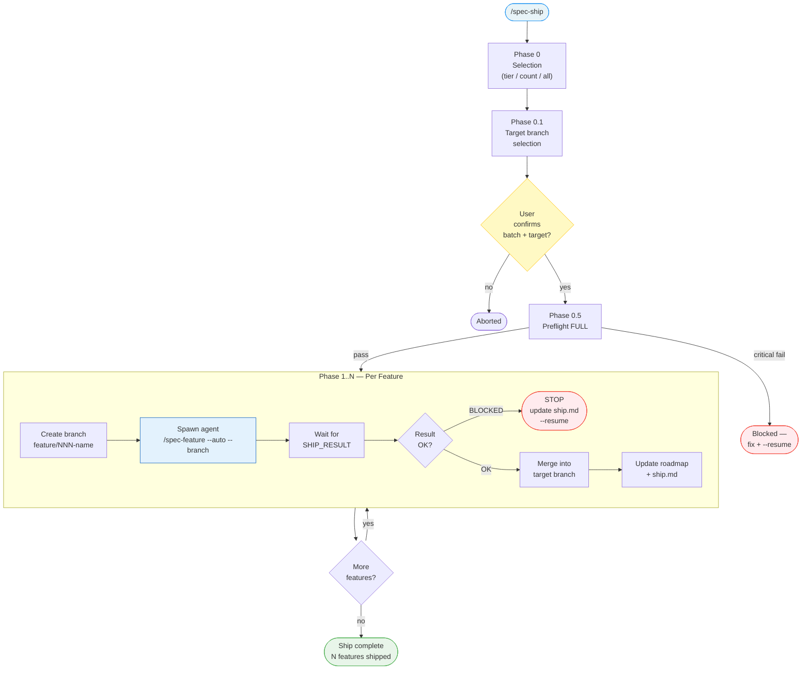

<!-- Anti-drift block injected via @import (Chantier 1, AUDIT.md). See system/anti-drift-block.md for the canonical 6-field step shape, ERROR/BLOCKED line formats, and timeout/retry policy. -->
<!-- @import system/anti-drift-block.md -->


# Command: /spec-ship

> Batch autopilot — selects features from the roadmap and runs `/spec-feature --auto --branch` for each, with preflight, audit, merge, and roadmap updates.

---

## Overview

`/spec-ship [flags]`

Ships multiple features from the roadmap in sequence. **Each feature is executed by a spawned agent** with its own fresh context, preventing context window exhaustion on large batches. The main context stays lightweight — it only orchestrates, merges, and tracks progress.



### Architecture — Agent per Feature

To avoid context window exhaustion, each feature runs in a **separate spawned agent**:

- **Main context (ship orchestrator):** reads roadmap, manages branches, parses agent results, merges, updates ship.md. Stays under ~10k tokens per feature cycle.
- **Spawned agent (per feature):** executes `/spec-feature --auto --branch` with a fresh context. Handles specify, review, plan, implement, test, audit, and commit. Returns a structured `SHIP_RESULT` block (see `feature.md` § Ship Result).

The agent commits on its feature branch. The main context merges into the target branch after receiving `SHIP_RESULT: OK`.

---

> **Hooks:** No command-level hooks for `/spec-ship`. Each spawned agent resolves its own `before-feature` / `after-feature` hooks (and sub-command hooks) via `/spec-feature`.

## Flags

| Flag | Behavior |
|------|----------|
| `--tier`, `-t` `mvp\|postmvp\|future` | Ship only features from this roadmap tier |
| `--count`, `-n` `N` | Ship the next N features (across tiers, in roadmap order) |
| `--resume`, `-r` | Resume from last incomplete feature in `ship.md` |
| `--mono`, `-m` | Pass `--mono` to each `/spec-feature` call |
| `--economy`, `-e` | Pass `--economy` to each `/spec-feature` call |

When no flag is provided → interactive selection (Phase 0).

---

## Phase 0 — Selection

### Interactive mode (no flags)

1. Read `.specs/roadmap.md`
2. Count unchecked items (`- [ ]`) per tier
3. Display selection menu:

```
What do you want to ship?

  1. MVP          (N features remaining)
  2. Post-MVP     (N features remaining)
  3. Future       (N features remaining)
  4. Next N       (specify count)
  5. Everything   (N features total)

→ Choose (1-5):
```

4. After selection → proceed to Phase 0.1

### Flag mode

- `--tier mvp` → skip menu, collect all `[ ]` items from MVP tier
- `--count 3` → skip menu, collect first 3 `[ ]` items across tiers (MVP → Post-MVP → Future)
- Both skip the menu but still go through Phase 0.1 and confirmation

---

## Phase 0.1 — Target Branch Selection

After scope selection, choose the merge target branch:

1. Detect available branches: `git branch --list`
2. Detect current branch: `git branch --show-current`
3. Display branch selection:

```
Target branch for merges:

  Current: main
  Available: main, dev

  → Merge features into: dev (recommended) / main / other?
```

**Recommendation logic:**
- If `dev` or `develop` exists → recommend it (safest — not production)
- If only `main` exists → recommend `main` with warning:
  ```
  ⚠ Only main detected — merges will go directly to production branch.
  → Merge into main? (yes / no)
  ```
- User can type any existing branch name

4. After branch selection, display the full batch plan with confirmation:

```
Ship plan — MVP tier (3 features) → merge into dev:

  1. 003-notifications — Real-time notification system · Scope: M
  2. 004-billing — Payment processing integration · Scope: L
  3. 005-export — CSV/PDF export for reports · Scope: S

→ Confirm? (yes / no)
```

5. User confirms → proceed to Phase 0.5
6. User declines → abort

---

## Phase 0.5 — Preflight (Full)

Run `/spec-preflight` in full mode (not `--light`) once for the entire batch.

- **READY** → proceed to Phase 1
- **WARNINGS** → display warnings, proceed
- **BLOCKED** → stop. Display: "Preflight blocked. Fix the issues, then `/spec-ship --resume`"

This ensures all tooling, auth, and tokens are verified before entering the autonomous loop. Individual features still run their own light preflight (Phase 2.7 in `/spec-feature`).

---

## Tracking — ship.md

Create `.specs/ship.md` at the start of the batch. Update after each feature.

Template: see `system/templates/ship-template.md`

```markdown
# Ship Session

**Started:** YYYY-MM-DD HH:MM
**Scope:** <tier name or "Next N" or "All">
**Flags:** `--tier mvp` (or `none`)
**Base branch:** main (or dev)

| # | Feature | Status | Branch | Started | Completed |
|---|---------|--------|--------|---------|-----------|
| 1 | 003-notifications | Pending | — | — | — |
| 2 | 004-billing | Pending | — | — | — |
| 3 | 005-export | Pending | — | — | — |
```

**Status values:** `Pending` → `In Progress` → `Done` or `Blocked`

Update the row after each feature completes or fails.

---

## Phase 1..N — Per Feature Loop

For each feature in the batch (in roadmap order):

### Step 1 — Prepare Branch

1. Update `ship.md`: feature status → `In Progress`, record start time
2. Ensure on target branch (selected in Phase 0.1): `git checkout <target>`
3. Create feature branch: `livespec git branch feature/NNN-name`
4. Update `ship.md`: record branch name

### Step 2 — Spawn Agent

Spawn a new agent with a fresh context to execute the feature pipeline:

```
Agent prompt:
  /spec-feature
  You are working on project: <project name from .specs/project.md>
  Current branch: feature/NNN-name (already created and checked out)
  Target: Execute `/spec-feature "<description from roadmap item>" --auto --branch`
  Additional flags: --mono (if ship --mono), --economy (if ship --economy)

  The .specs/ directory contains all project context (constitution, stack, roadmap, existing features).
  Read .specs/project.md and .specs/stacks/_default.md for project and stack context.
  Your hooks (before-feature, after-feature, and sub-command hooks) will resolve normally.

  IMPORTANT: End your response with the SHIP_RESULT block (see feature.md § Ship Result).
```

> **D-α (Hook resolution for chained invocations).** The first prompt line `/spec-feature`
> is a synthetic invocation header consumed by the spawned agent's anti-drift directive
> (`system/anti-drift-block.md § 7`) so that `livespec hooks resolve --event before
> --command feature` is invoked at the outer pipeline boundary. The agent will then,
> in turn, prepend `/spec.<subcmd>` headers when spawning its own Specify/Plan/…
> subagents (see `commands/spec-feature.md`). Do NOT remove this line. See
> [`system/integrations.md`](../system/integrations.md) for the contract.

The agent executes the full pipeline autonomously: specify → spec review → plan → plan review → preflight light → implement → audit → commit. Each agent gets a **fresh context window**, preventing exhaustion on large batches.

**Wait for the agent to complete and return its result.**

### Step 3 — Parse Result

<!-- @spec FR-002: SHIP_RESULT JSON schema — .specs/features/014-supervisor-contracts/spec.md#fr-002 -->
<!-- @spec FR-005: Regex-anchored parser — .specs/features/014-supervisor-contracts/spec.md#fr-005 -->
<!-- @spec FR-007: Validation gate before destructive git ops — .specs/features/014-supervisor-contracts/spec.md#fr-007 -->

Read the agent's output and extract the `SHIP_RESULT` block using the typed contract from [`system/contracts/SHIP_RESULT.md`](../system/contracts/SHIP_RESULT.md). Use [`validator/contracts.py`](../validator/contracts.py) `parse_ship_result()`:

```python
from validator.contracts import parse_ship_result, ContractParseError, ContractValidationError

try:
    result = parse_ship_result(agent_stdout)
except (ContractParseError, ContractValidationError) as exc:
    # Cannot trust this result; halt with canonical BLOCKED line
    print(f"BLOCKED at step ship - state_invalid - SHIP_RESULT invalid: {exc}")
    sys.exit(1)

if result.status != "OK":
    print(f"BLOCKED at step ship - state_invalid - {result.error}")
    sys.exit(1)

# Defense-in-depth: branch must match the resolved slug
if result.branch != f"feature/{result.feature_slug}":
    print(f"BLOCKED at step ship - state_invalid - branch/slug mismatch")
    sys.exit(1)
```

- **`result.status == "OK"` AND branch/slug consistent** → proceed to Step 3.5
- **Any failure above** → STOP (see Error Handling). The validation gate explicitly prevents `livespec git delete` from being invoked on a malformed or injected result.

### Step 3.5 — Test Gate

After the agent completes implementation, validate test completeness:

1. The spawned agent runs `/spec-test <feature> --auto` as part of `/spec-feature` Phase 3.5
2. If the test report shows ❌ failures in AC coverage → `SHIP_RESULT: BLOCKED` with test failure details
3. If all AC are covered (✅ or ⚠️ Partial) → proceed to Step 4

This gate catches AC that have no test at all — `/spec-implement`'s Phase 6 only runs existing tests, while `/spec-test` generates missing ones and reveals implementation gaps.

### Step 4 — Merge

The agent has already committed on the feature branch. Now merge:

1. Switch to target branch: `git checkout <target>`
2. Merge feature branch: `livespec git merge feature/NNN-name --no-ff`
3. Delete feature branch: `livespec git delete feature/NNN-name`

**Merge conflict handling:**

On exit 2 (`livespec git merge` merge conflict):
- Update `ship.md`: feature status → `Blocked (merge conflict)`
- Stay on target branch, keep feature branch intact
- STOP — display: "Merge conflict on **NNN-name**. Resolve manually on `feature/NNN-name`, then `/spec-ship --resume`"

On `livespec git delete` exit 2 (branch not fully merged):
- Display error and stop — use `livespec git delete --force` only after confirming the branch was actually merged

### Step 5 — Update Roadmap & Tracking

1. In `.specs/roadmap.md`, update the feature's line:
   - `- [ ] **Feature name** — ...` → `- [x] **Feature name** — ... → [NNN-name](features/NNN-name/spec.md)`
2. Update `ship.md`: feature status → `Done`, record completion time

### Step 6 — Log Progress

Display:

```
✓ [1/3] 003-notifications — Done
  → Next: 004-billing
```

Proceed to next feature (spawn new agent with fresh context).

---

## Resume (`--resume`)

When `--resume` is provided:

1. Read `.specs/ship.md`
2. Find the first feature with status != `Done`
3. **Validate branch state** before resuming:
   - Check if `feature/NNN-name` branch exists (`git rev-parse --verify feature/NNN-name 2>/dev/null`)
   - If branch exists but ship.md says `In Progress` → the agent may have crashed mid-pipeline
   - If branch is gone but ship.md says `In Progress` → feature was likely completed and merged externally; verify on target branch and mark `Done`
4. If status is `Blocked`:
   - Check if the blocking issue is resolved (re-run audit on the feature branch)
   - If resolved → continue from Step 4 (merge)
   - If `Blocked (merge conflict)` → attempt merge again
   - If not resolved → report still blocked
5. If status is `In Progress`:
   - Check if `pipeline.md` exists for this feature
   - If yes → run `/spec-feature --resume <feature-name>` (spawned agent)
   - If no → restart the feature from Step 2 (spawned agent)
6. If status is `Pending` → start from Step 1

If `ship.md` doesn't exist → display "No ship session found. Run `/spec-ship` to start." and abort.

---

## Error Handling

When a feature fails (audit fail after 3 retries, test failure, pipeline error):

1. Update `ship.md`: feature status → `Blocked`
2. Do NOT continue to subsequent features
3. Display:

```
✗ Blocked on **004-billing** — audit failed after 3 attempts

  Shipped: 1/3 features
  Blocked: 004-billing
  Remaining: 005-export

  Fix the issues, then resume: /spec-ship --resume
```

4. Stay on the feature branch (do not merge broken code)

---

## Completion

When all features are shipped:

```
✓ Ship complete — 3/3 features shipped

  1. ✓ 003-notifications (12m)
  2. ✓ 004-billing (28m)
  3. ✓ 005-export (8m)

  Total time: 48m
  Roadmap updated: 3 items checked
  Branches merged into: <target branch>
```

---

## Definition of Done (Command-Level)

`/spec-ship` is complete only if all are true:

- [ ] `.specs/ship.md` exists with final state
- [ ] All features in scope are `Done` (or `Blocked` with clear error)
- [ ] Roadmap updated for each shipped feature
- [ ] All feature branches merged and deleted
- [ ] Each feature's own hooks resolved (via spawned agents)

---

## Examples

```bash
# Interactive selection — choose tier or count
/spec-ship

# Ship all MVP features
/spec-ship --tier mvp

# Ship next 3 features from roadmap
/spec-ship --count 3

# Resume after fixing a blocked feature
/spec-ship --resume

# Ship with single-agent mode (lighter resource usage)
/spec-ship --tier mvp --mono
```

---

*LiveSpec Command v1.0*
