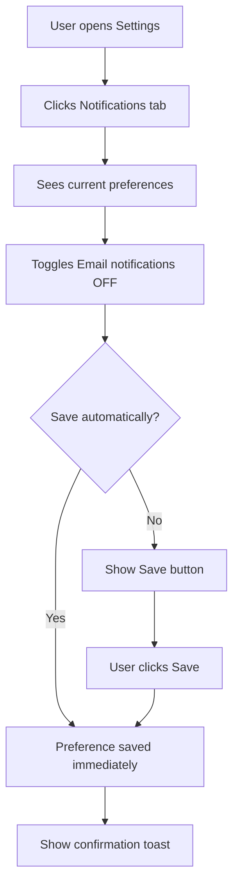

# Command: /spec.specify

> Create a new feature spec with user stories, Mermaid flowcharts, acceptance criteria, and functional requirements.

---

## Overview

`/spec.specify [feature description]`

Takes a feature description and generates a complete `spec.md` in `.specs/features/NNN-feature-name/`.

---

## Steps

### Step 1 — Parse Feature Description

Extract from user input:
- Feature name (convert to kebab-case for directory)
- Core user action or problem being solved
- Any priority hints from the description

**Input examples:**
```
/spec.specify "User can receive real-time notifications"
/spec.specify notifications --priority P1
/spec.specify "As a designer, I want to bid on jobs"
```

### Step 1.5 — Ambiguous Input Protocol

If input is ambiguous, run this protocol before generating files:

1. If request contains **multiple independent features**, propose splitting into separate specs and ask for confirmation.
2. If request is primarily a **bugfix**, route to existing feature and ask whether to update current spec or create a dedicated bugfix feature.
3. If user mentions implementation details only ("use Redis", "add endpoint") without user outcome, ask for the user-facing behavior first.
4. Limit clarification to **max 2 questions**, then proceed with explicit assumptions marked `[ASSUMED]` in `spec.md`.

### Step 2 — Auto-Number the Feature

1. Scan `.specs/features/` for existing directories
2. Find the highest existing number (e.g., `003-*`)
3. Increment to get the next number (e.g., `004`)
4. Zero-pad to 3 digits: `004`

```
.specs/features/
├── 001-user-auth/
├── 002-job-listings/
├── 003-messaging/
└── 004-notifications/     ← New feature gets NNN=004
```

### Step 3 — Create Feature Directory

```bash
mkdir -p .specs/features/004-notifications
```

### Step 4 — Read Context Files

Before generating the spec, read:
- `.specs/project.md` — understand users, roles, constraints
- `.specs/constitution.md` — architecture principles
- `.specs/stacks/_default.md` — technical stack context

### Step 5 — Generate spec.md

Using `system/templates/spec-template.md` as the base, generate a complete spec with:

#### User Stories
- Identify 3-5 user stories from the feature description
- Assign priorities: P1 (critical), P2 (important), P3 (nice-to-have)
- For each story: write description, priority reason, and independent test
- Write Given/When/Then acceptance scenarios (at least 2 per story)
- **Generate Mermaid flowchart for EVERY user story** (MANDATORY — do not omit)

#### Mermaid Flowchart Rules
- Use `flowchart TD` (top-down) for linear flows
- Use `flowchart LR` (left-right) for state transitions
- Include decision diamonds `{condition?}` for branching paths
- Show error/failure paths in addition to happy paths
- Label branches clearly: `-- Yes -->` and `-- No -->`

#### Acceptance Criteria
- Number sequentially: AC-001, AC-002, AC-003, ...
- Each must be: specific, testable, and verifiable
- Reference the user story it belongs to
- Target: 5-10 AC for a typical feature

#### Functional Requirements
- Number sequentially: FR-001, FR-002, FR-003, ...
- Each FR maps to at least one AC
- FRs describe WHAT the system must do, not HOW
- Target: 5-8 FR for a typical feature

#### Key Entities, Edge Cases, Success Criteria
- Extract entities from the feature (data objects involved)
- List realistic edge cases (what could go wrong?)
- Write measurable success criteria (SC-001, SC-002, ...)

### Step 6 — Quality Validation

Before presenting the spec, check:
- [ ] Every user story has a Mermaid flowchart
- [ ] All AC are in Given/When/Then format or specific testable statements
- [ ] All FR reference at least one AC
- [ ] No more than 3 `[NEEDS CLARIFICATION]` markers (if unclear input)
- [ ] Key Entities section is not empty
- [ ] At least 2 Edge Cases listed
- [ ] At least 2 Success Criteria defined

If validation fails, fix the issues before presenting.

### Step 7 — Present and Confirm

Show the generated spec and ask for confirmation:

> ✅ **Spec created:** `.specs/features/004-notifications/spec.md`
>
> **Summary:**
> - 3 user stories (1×P1, 1×P2, 1×P3)
> - 5 acceptance criteria (AC-001 → AC-005)
> - 6 functional requirements (FR-001 → FR-006)
> - 3 Mermaid flowcharts generated
>
> Would you like to:
> 1. Proceed to planning: `/spec.plan notifications`
> 2. Review and edit the spec first
> 3. Create a git branch: `feature/004-notifications`

### Step 7.5 — Update README.md

Add a new row to the Features table in `.specs/README.md` (between `<!-- readme:features:start -->` and `<!-- readme:features:end -->` markers):

| NNN | Feature Name | Draft | YYYY-MM-DD | YYYY-MM-DD | [spec](features/NNN-feature-name/spec.md) |

Maintain ascending order by feature number. Update the `Last updated` date in the header.

If this is the first feature, remove the `> No features yet.` hint line below the table.

If `.specs/README.md` does not exist, create it by scanning existing artifacts (see spec-system.md README.md Recovery).

### Step 7.6 — Update Changelog

Add a first entry to `.specs/features/NNN-feature-name/changelog.md`:

```markdown
### YYYY-MM-DD — Spec: Feature specification created

- **Type:** Spec Update
- **Spec modified:** Yes (created — all sections)
- **Code modified:** None
- **AC impacted:** AC-001 through AC-NNN (all defined)
- **Author:** [tool name]
```

Also add a summary entry to `.specs/changelog.md` (global):
`[Feature NNN] Spec created: [Feature Name] — N stories, N AC, N FR`

### Step 8 — Optionally Create Git Branch

If user confirms branch creation:

```bash
git checkout -b feature/004-notifications
```

---

## Output

```
.specs/features/004-notifications/
└── spec.md    ← Generated from spec-template.md
```

---

## Examples

### Example Input
```
/spec.specify "User can manage their notification preferences — turn on/off email, push, and in-app notifications per category"
```

### Example Output Structure

```markdown
# Feature Spec: Notification Preferences

- **Feature:** Notification Preferences
- **Branch:** feature/004-notification-preferences
- **Date:** 2024-03-15
- **Status:** Draft
- **Input:** User can manage leur notification preferences...
- **Feature Number:** 004

## User Scenarios & Testing

### Story 1 — User views and edits notification preferences `P1`
...
#### User Flow

...
```

---

## Flags

| Flag | Behavior |
|---|---|
| `--auto` | Skip confirmation, create spec and proceed silently |
| `--branch` | Automatically create git branch after spec creation |
| `--no-branch` | Skip branch creation prompt |
| `--priority [P1|P2|P3]` | Override all stories to specified priority |

---

## Definition of Done (Command-Level)

`/spec.specify` is complete only if all are true:

- [ ] Feature directory `NNN-feature-name/` exists
- [ ] `spec.md` exists and contains required sections
- [ ] Every user story has a Mermaid flowchart
- [ ] Every FR maps to >= 1 AC
- [ ] `spec.md` includes either explicit values or `[ASSUMED]` markers for missing context
- [ ] `.specs/README.md` Features table contains the new feature row with Status: Draft
- [ ] Feature `changelog.md` has an initial entry
- [ ] Global `.specs/changelog.md` has a summary entry
- [ ] Next action is proposed (`/spec.plan [feature]`)

If any item fails, fix before returning final output.

---

*LiveSpec Command v1.0*
