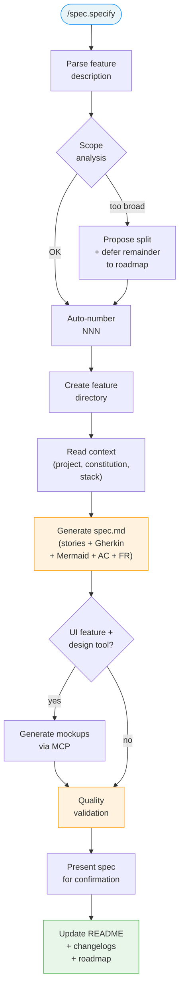
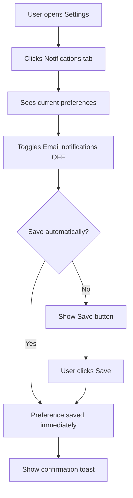

# Command: /spec.specify

> Create a new feature spec with user stories, Mermaid flowcharts, acceptance criteria, and functional requirements.

---

## Overview

`/spec.specify [feature description]`

Takes a feature description and generates a complete `spec.md` in `.specs/features/NNN-feature-name/`.


```mermaid
flowchart TD
    START(["/spec.specify"]) --> PARSE["Parse feature\ndescription"]
    PARSE --> SCOPE{"Scope\nanalysis"}
    SCOPE -->|"too broad"| SPLIT["Propose split\n+ defer remainder\nto roadmap"]
    SCOPE -->|"OK"| NUM["Auto-number\nNNN"]

    SPLIT --> NUM
    NUM --> DIR["Create feature\ndirectory"]
    DIR --> CTX["Read context\n(project, constitution,\nstack)"]
    CTX --> GEN["Generate spec.md\n(stories + Gherkin\n+ Mermaid + AC + FR)"]
    GEN --> MOCK{"UI feature +\ndesign tool?"}
    MOCK -->|"yes"| MCP["Generate mockups\nvia MCP"] --> VALID
    MOCK -->|"no"| VALID["Quality\nvalidation"]
    VALID --> PRESENT["Present spec\nfor confirmation"]
    PRESENT --> SYNC["Update README\n+ changelogs\n+ roadmap"]

    style START fill:#e8f4f8,stroke:#2196F3
    style GEN fill:#fff3e0,stroke:#FF9800
    style VALID fill:#fff3e0,stroke:#FF9800
    style SYNC fill:#e8f5e9,stroke:#4CAF50
```

---

> **Hooks — before starting:** **Read** `before-specify` hooks from all 3 levels (skip missing files):
> 1. `~/.claude/livespec/hooks/before-specify.md`
> 2. `.specs/hooks/before-specify.md`
> 3. `.specs/hooks/before-specify.local.md` (if `mode: override` → use only this one)
>
> **Hooks — after completing:** Same resolution with `after-specify` at all 3 levels.

## Steps

### Step 1 — Parse Feature Description

Extract from user input:
- Feature name (convert to kebab-case for directory)
- Core user action or problem being solved
- Any priority hints from the description

**Input examples:**
```
/spec.specify "User can receive real-time notifications"
/spec.specify notifications --priority P1
/spec.specify "As a designer, I want to bid on jobs"
```

### Step 1.5 — Scope Analysis & Split Detection

Before generating spec.md, analyze the request scope:

#### 1.5.1 — Extract Functional Domains

- Each action verb + object = 1 candidate domain
- Junction words ("and", "with", "plus", "also", "et aussi") signal domain boundaries
- Example: "auth with SSO, role management, and audit trail" → 3 domains

#### 1.5.2 — Test Independence

Two domains are independent if:
- They serve different user stories (different actors or goals)
- They can be delivered and tested separately
- They touch different primary entities

#### 1.5.3 — Evaluate Complexity

Flag if the combined request would produce:
- More than 5 P1 user stories
- More than 3 distinct primary entities
- More than 8 acceptance criteria

#### 1.5.4 — Split Proposal

If split detected (≥2 independent domains OR complexity exceeded):

```
🔀 Split detected — your request covers multiple independent areas:

| # | Domain | Scope | Independent? |
|---|--------|-------|-------------|
| 1 | Auth + SSO | M | — (core) |
| 2 | Role management (RBAC) | M | Yes |
| 3 | Audit trail | S | Yes |

Proposal: I specify **Auth + SSO** now.
The others go into the roadmap for next specifications.

→ OK? Or do you prefer to keep everything together?
```

#### 1.5.5 — User Accepts Split

- Proceed with domain #1 as the spec to create
- Add remaining domains to `.specs/roadmap.md` Deferred section with: source request, item name, context from the original request, date
- If a domain matches an existing unchecked roadmap item, update that item's context instead of duplicating

#### 1.5.6 — User Declines Split

- Proceed with the full request as a single spec (current behavior)

#### 1.5.7 — Bugfix Routing

If request is primarily a **bugfix**, route to existing feature and ask whether to update current spec or create a dedicated bugfix feature.

#### 1.5.8 — Implementation Details Only

If user mentions implementation details only ("use Redis", "add endpoint") without user outcome, ask for the user-facing behavior first.

#### 1.5.9 — Clarification Limit

Limit clarification to **max 2 questions**, then proceed with explicit assumptions marked `[ASSUMED]` in `spec.md`.

### Step 2 — Auto-Number the Feature

1. Scan `.specs/features/` for existing directories
2. Find the highest existing number (e.g., `003-*`)
3. Increment to get the next number (e.g., `004`)
4. Zero-pad to 3 digits: `004`

```
.specs/features/
├── 001-user-auth/
├── 002-job-listings/
├── 003-messaging/
└── 004-notifications/     ← New feature gets NNN=004
```

### Step 3 — Create Feature Directory

```bash
mkdir -p .specs/features/004-notifications
```

### Step 4 — Read Context Files

Before generating the spec, read:
- `.specs/project.md` — understand users, roles, constraints
- `.specs/constitution.md` — architecture principles
- `.specs/stacks/_default.md` — technical stack context

### Step 5 — Generate spec.md

Using `system/templates/spec-template.md` as the base, generate a complete spec with:

#### User Stories
- Identify 3-5 user stories from the feature description
- Assign priorities: P1 (critical), P2 (important), P3 (nice-to-have)
- For each story: write description, priority reason, and independent test
- Write Gherkin scenarios (```gherkin blocks) for every acceptance scenario — source of truth for all test scaffolding
- **Generate Mermaid flowchart for EVERY user story** (MANDATORY — visualizes the Gherkin scenarios)

#### Gherkin Scenario Rules
- Use proper `Feature:` / `Scenario:` / `Given` / `When` / `Then` / `And` keywords
- Fenced with ````gherkin` (not plain ``` blocks)
- Each story must have at least 2 scenarios (happy path + edge case)
- Scenarios must be specific enough to derive Playwright test steps directly
- Use present tense, third person
- All tests (unit, integration, E2E, visual) are derived from Gherkin, never from Mermaid

#### Mermaid Flowchart Rules
- Use `flowchart TD` (top-down) for linear flows
- Use `flowchart LR` (left-right) for state transitions
- Include decision diamonds `{condition?}` for branching paths
- Show error/failure paths in addition to happy paths
- Label branches clearly: `-- Yes -->` and `-- No -->`
- The flowchart visualizes the same flow defined in the Gherkin scenarios above

#### Acceptance Criteria
- Number sequentially: AC-001, AC-002, AC-003, ...
- Each must be: specific, testable, and verifiable
- Reference the user story it belongs to
- Target: 5-10 AC for a typical feature

#### Functional Requirements
- Number sequentially: FR-001, FR-002, FR-003, ...
- Each FR maps to at least one AC
- FRs describe WHAT the system must do, not HOW
- Target: 5-8 FR for a typical feature

#### Key Entities, Edge Cases, Success Criteria
- Extract entities from the feature (data objects involved)
- List realistic edge cases (what could go wrong?)
- Write measurable success criteria (SC-001, SC-002, ...)
- If the feature involves external cloud resources (storage, databases, queues, CDN, edge workers, external APIs with credentials):
  - Generate an "Infrastructure Requirements" section after Key Entities
  - List each resource with type, provider, environment, and when it's needed
  - If unsure whether a resource is needed, mark it `[ASSUMED]` in the table

### Step 5.5 — Emerging Dependencies & Absorption Detection

After generating spec.md, analyze it for roadmap interactions. Skip silently if `.specs/roadmap.md` does not exist.

#### Detection A — Emerging Dependencies

1. Extract all referenced entities, services, and capabilities from the just-generated spec:
   - Key Entities section
   - Functional Requirements (references to external systems)
   - User stories (mentions of features the user expects to exist)
   - Infrastructure Requirements (if present)
2. Read `.specs/features/*/spec.md` headers — build list of existing feature names and key entities
3. Read `.specs/roadmap.md` — build list of roadmap items (all tiers + Deferred)
4. For each referenced entity/capability NOT found in existing features OR roadmap → it's an **emerging dependency**

5. If emerging dependencies found:

```
📋 Emerging dependencies detected in this spec:

| Dependency | Found in | Suggested tier | Source in spec |
|-----------|----------|---------------|----------------|
| Push notifications | — (nowhere) | Post-MVP | FR-003: message alerts |
| Organization entity | — (nowhere) | MVP | Key Entities: multi-tenant |

→ Add to roadmap? (y/n)
```

6. If confirmed: add items to appropriate tier in `roadmap.md`
7. If no emerging dependencies found: skip silently (no output)

#### Detection B — Absorption

8. For each existing unchecked roadmap item, check if the current spec **covers it** — the spec's key entities or FR descriptions contain the roadmap item's bold name or primary domain keyword (case-insensitive)

9. If absorption detected:

```
📋 This spec appears to cover existing roadmap items:

| Roadmap item | Tier | Overlap |
|-------------|------|---------|
| Push notifications | Post-MVP | Covered by FR-003 + Story 3 |

→ Check these items as covered? (y/n)
```

10. If confirmed: check the item in roadmap (`- [ ]` → `- [x]`) and link to this spec
11. If no absorption detected: skip silently (no output)

**Flag interaction:** `--auto` → add emerging deps and check absorbed items without confirmation.

### Step 5.6 — Generate Mockups (UI features only)

After generating spec.md, determine if the feature involves UI:

1. **Detect UI feature:** Scan the generated spec.md for user stories that mention screens, pages, forms, buttons, navigation, or visual elements. If no UI detected → skip this step entirely.

2. **Check design config:** Read `~/.claude/livespec/design.md`.
   - If missing → trigger design gate (see `/spec.init` Step 3.5 for the gate prompt and wizard)
   - If `tool: none` → skip silently
   - If tool configured → proceed

3. **Identify screens:** From user stories and flowcharts, list all unique screens/views the feature requires (new screens) and modifies (existing screens).

4. **Generate mockups:**
   - If MCP available (`mcp: true` in design config) → use the tool's MCP to generate mockups programmatically, applying the configured design system
   - If MCP not available → instruct user to create mockups manually and provide the screen list as guidance

5. **Export assets:**
   - Create feature subfolder: `.specs/design/screens/<NNN-feature-name>/`
   - Via MCP: export each screen as PNG to `.specs/design/screens/<NNN-feature-name>/<screen-name>.png` (immutable versioned copy)
   - Copy each PNG to `.specs/design/screens/<screen-name>.png` (latest copy — used by plan/implement/check)
   - Via MCP: export PDF to `.specs/design/ui.pdf`
   - The source file (`ui.pen`, etc.) must be saved manually by the user

6. **User validation gate:**
   For each screen, check `.specs/design/changelog.md` for previous entries. If a screen was modified by a previous feature, show the link to the last version:

   ```
   🎨 Mockups generated for [feature name]:
     • screen-name.png (modified — description of change)
       ↳ Previous: NNN-prev-feature (YYYY-MM-DD) — [📸](screens/NNN-prev-feature/screen-name.png)
     • other-screen.png (new)

   Exported to .specs/design/screens/<NNN-feature-name>/

   → Open the design tool to review and save the source file:
     open .specs/design/ui.<ext>

   → Approve mockups to continue, or describe changes needed.
   ```

7. **Add screen references to spec.md:** After validation, add a `## Screens` section to the feature's `spec.md`. References point to the **versioned** path (immutable — this spec always shows the mockup validated for THIS feature):

   ```markdown
   ## Screens

   | Screen | Status | Reference |
   |--------|--------|-----------|
   | screen-name | Modified | [screen-name.png](../../design/screens/NNN-feature-name/screen-name.png) |
   | other-screen | New | [other-screen.png](../../design/screens/NNN-feature-name/other-screen.png) |
   ```

   **Path divergence (by design):** `spec.md` and `plan.md` reference the immutable versioned path. `implement.md` and `check.md` reference the latest copy (`screens/<name>.png`). See design spec for rationale.

8. **Update design changelog:** Update `.specs/design/changelog.md` (screen-centric format):

   For each screen generated:
   - If screen already has a `##` section → append a new row to its table
   - If screen is new → create a new `##` section with a single-row table, inserted in alphabetical order among existing sections
   - Update the `**Latest:**` link after the table
   - Date = the date when `/spec.specify` runs

   Entry format per screen section:

   ```markdown
   ## screen-name

   | Spec | Date | Mockup | Notes |
   |------|------|--------|-------|
   | [NNN-feature-name](../features/NNN-feature-name/spec.md) | YYYY-MM-DD | [📸](screens/NNN-feature-name/screen-name.png) | Description of what changed |

   **Latest:** [screen-name.png](screens/screen-name.png)
   ```

   If the changelog doesn't exist yet, create it from the template (`system/templates/design-changelog-template.md`).

**Re-modification:** When `/spec.specify` is run on a feature that already has mockups (screens listed in existing spec.md), the AI detects existing screens, determines which need updating based on spec changes, regenerates via MCP (or instructs manual update), re-exports PNGs in the feature's own subfolder (`screens/<NNN-feature-name>/`), updates the latest copies, and updates the existing changelog row for this feature+screen pair (same spec = update row, not append).

### Step 6 — Quality Validation

Before presenting the spec, check:
- [ ] Every acceptance scenario uses ```gherkin fenced blocks (source of truth for tests)
- [ ] Every user story has a Mermaid flowchart (visual representation)
- [ ] Gherkin scenarios and Mermaid flowcharts describe the same flow
- [ ] All AC are in Given/When/Then format or specific testable statements
- [ ] All FR reference at least one AC
- [ ] No more than 3 `[NEEDS CLARIFICATION]` markers (if unclear input)
- [ ] Key Entities section is not empty
- [ ] At least 2 Edge Cases listed
- [ ] At least 2 Success Criteria defined
- [ ] If feature references external resources in stories/FR: Infrastructure Requirements section exists
- [ ] If feature has UI: `## Screens` section exists in spec.md with references to PNG files
- [ ] If feature has UI and design tool configured: PNG files exist in `.specs/design/screens/`

If validation fails, fix the issues before presenting.

### Step 7 — Present and Confirm

Show the generated spec and ask for confirmation:

> ✅ **Spec created:** `.specs/features/004-notifications/spec.md`
>
> **Summary:**
> - 3 user stories (1×P1, 1×P2, 1×P3)
> - 5 acceptance criteria (AC-001 → AC-005)
> - 6 functional requirements (FR-001 → FR-006)
> - 3 Mermaid flowcharts generated
> - N screen mockups generated (if applicable)
>
> Would you like to:
> 1. Proceed to planning: `/spec.plan notifications`
> 2. Review and edit the spec first
> 3. Create a git branch: `feature/004-notifications`

### Step 7.5 — Update README.md

Add a new row to the Features table in `.specs/README.md` (between `<!-- readme:features:start -->` and `<!-- readme:features:end -->` markers):

| NNN | Feature Name | Draft | YYYY-MM-DD | YYYY-MM-DD | [spec](features/NNN-feature-name/spec.md) |

Maintain ascending order by feature number. Update the `Last updated` date in the header.

If this is the first feature, remove the `> No features yet.` hint line below the table.

If `.specs/README.md` does not exist, create it by scanning existing artifacts (see spec-system.md README.md Recovery).

### Step 7.6 — Update Changelog

Add a first entry to `.specs/features/NNN-feature-name/changelog.md`:

```markdown
### YYYY-MM-DD — Spec: Feature specification created

- **Type:** Spec Update
- **Spec modified:** Yes (created — all sections)
- **Code modified:** None
- **AC impacted:** AC-001 through AC-NNN (all defined)
- **Author:** [tool name]
```

Also add a summary entry to `.specs/changelog.md` (global):
`[Feature NNN] Spec created: [Feature Name] — N stories, N AC, N FR`

### Step 7.7 — Update Roadmap

1. Read `.specs/roadmap.md` (if it exists; if not, skip silently)
2. **Tier match:** Search all tier sections (MVP, Post-MVP, Future) for an unchecked item matching the new feature. Match criteria: case-insensitive substring match on the item's bold name OR shared primary entity/domain keyword (e.g., "auth" matches "**User authentication**")
3. If tier match found: check the checkbox (`- [ ]` → `- [x]`) + append spec link (`→ [NNN-name](features/NNN-name/spec.md)`)
4. **Deferred match:** Search the Deferred table for a row matching the new feature (same matching criteria). If found:
   a. Remove the row from the Deferred table
   b. Add a checked+linked item to the appropriate tier (MVP if no tier preference is obvious, otherwise infer from scope/dependencies)
5. If split was performed in Step 1.5: add deferred items to Deferred table
6. Update the `Last updated` date
7. Remove `> No items yet.` hint from the tier if it now has checked or unchecked items

### Step 8 — Optionally Create Git Branch

If user confirms branch creation:

```bash
git checkout -b feature/004-notifications
```

### Step 9 — Preflight Manifest Update

After `spec.md` is generated, check if it contains an "Infrastructure Requirements" section with content:

1. If the section is empty or absent → skip this step
2. If the section has content:
   a. Read `.specs/preflight.md` (if it exists)
   b. Compute which new checks would be needed based on the infrastructure requirements (new CLI tools, new OAuth sessions, new tokens)
   c. Show the proposed additions as a diff:
      ```
      Preflight manifest — 2 checks to add:

        [TOOLING]  redis-cli (verify: redis-cli ping, install: brew install redis)
        [TOKEN]    project/dev/redis_url (verify: creds get ..., resolve: human)

      Add to preflight manifest? (y/n)
      ```
   d. If confirmed → add entries to the appropriate sections in `preflight.md`, commit
   e. If declined → no change. User can run `/spec.preflight --regenerate` later
3. No execution — this step only updates the manifest, it does not run checks

---

## Output

```
.specs/features/004-notifications/
└── spec.md    ← Generated from spec-template.md
```

---

## Examples

### Example Input
```
/spec.specify "User can manage their notification preferences — turn on/off email, push, and in-app notifications per category"
```

### Example Output Structure

```markdown
# Feature Spec: Notification Preferences

- **Feature:** Notification Preferences
- **Branch:** feature/004-notification-preferences
- **Date:** 2024-03-15
- **Status:** Draft
- **Input:** User can manage leur notification preferences...
- **Feature Number:** 004

## User Scenarios & Testing

### Story 1 — User views and edits notification preferences `P1`
...
#### User Flow

```mermaid
flowchart TD
    A[User opens Settings] --> B[Clicks Notifications tab]
    B --> C[Sees current preferences]
    C --> D[Toggles Email notifications OFF]
    D --> E{Save automatically?}
    E -- Yes --> F[Preference saved immediately]
    E -- No --> G[Show Save button]
    G --> H[User clicks Save]
    H --> F
    F --> I[Show confirmation toast]
```
...
```

---

## Flags

| Flag | Behavior |
|---|---|
| `--auto`, `-a` | Skip confirmation, create spec and proceed silently |
| `--branch`, `-b` | Automatically create git branch after spec creation |
| `--no-branch`, `-B` | Skip branch creation prompt |
| `--priority`, `-p` `[P1\|P2\|P3]` | Override all stories to specified priority |

---

## Definition of Done (Command-Level)

`/spec.specify` is complete only if all are true:

- [ ] Feature directory `NNN-feature-name/` exists
- [ ] `spec.md` exists and contains required sections
- [ ] Every acceptance scenario uses proper Gherkin syntax (```gherkin blocks)
- [ ] Every user story has a Mermaid flowchart
- [ ] Every FR maps to >= 1 AC
- [ ] `spec.md` includes either explicit values or `[ASSUMED]` markers for missing context
- [ ] `.specs/README.md` Features table contains the new feature row with Status: Draft
- [ ] Feature `changelog.md` has an initial entry
- [ ] Global `.specs/changelog.md` has a summary entry
- [ ] If feature has UI and design tool configured: mockups generated and validated
- [ ] If feature has UI: `## Screens` section in spec.md with PNG references
- [ ] If `.specs/roadmap.md` exists: matching item checked OR no match (skip)
- [ ] If split performed: deferred items added to roadmap.md Deferred section
- [ ] If `.specs/roadmap.md` exists: emerging dependencies detected and proposed (or none found)
- [ ] If `.specs/roadmap.md` exists: absorption detection run (or no overlap found)
- [ ] Next action is proposed (`/spec.plan [feature]`)

If any item fails, fix before returning final output.

---

*LiveSpec Command v1.0*
