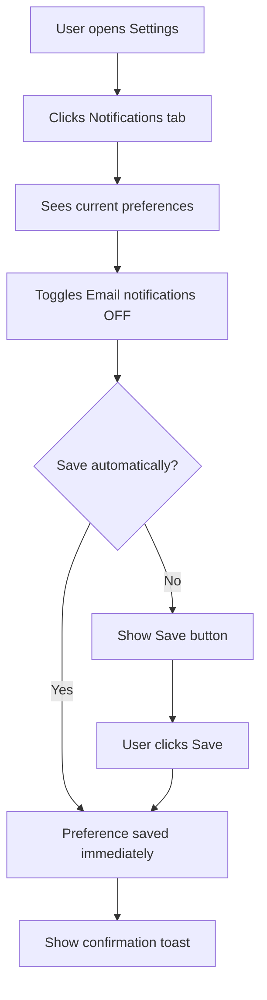

<!-- Anti-drift block injected via @import (Chantier 1, AUDIT.md). See system/anti-drift-block.md for the canonical 6-field step shape, ERROR/BLOCKED line formats, and timeout/retry policy. -->
<!-- @import system/anti-drift-block.md -->


# Command: /spec.specify

> Create a new feature spec with user stories, Mermaid flowcharts, acceptance criteria, and functional requirements.

---

## Overview

`/spec.specify [feature description]`

Takes a feature description and generates a complete `spec.md` in `.specs/features/NNN-feature-name/`.


```mermaid
flowchart TD
    START(["/spec.specify"]) --> PARSE["Parse feature\ndescription"]
    PARSE --> SCOPE{"Scope\nanalysis"}
    SCOPE -->|"too broad"| SPLIT["Propose split\n+ defer remainder\nto roadmap"]
    SCOPE -->|"OK"| NUM["Auto-number\nNNN"]

    SPLIT --> NUM
    NUM --> DIR["Create feature\ndirectory"]
    DIR --> CTX["Read context\n(project, constitution,\nstack)"]
    CTX --> GEN["Generate spec.md\n(stories + Gherkin\n+ Mermaid + AC + FR)"]
    GEN --> MOCK{"UI feature +\ndesign tool?"}
    MOCK -->|"yes"| MCP["Generate mockups\nvia MCP"] --> VALID
    MOCK -->|"no"| VALID["Quality\nvalidation"]
    VALID --> PRESENT["Present spec\nfor confirmation"]
    PRESENT --> SYNC["Update README\n+ changelogs\n+ roadmap"]

    style START fill:#e8f4f8,stroke:#2196F3
    style GEN fill:#fff3e0,stroke:#FF9800
    style VALID fill:#fff3e0,stroke:#FF9800
    style SYNC fill:#e8f5e9,stroke:#4CAF50
```

---

> **Hooks — before starting:** **Read** `before-specify` hooks from all 3 levels (skip missing files):
> 1. `~/.claude/livespec/hooks/before-specify.md`
> 2. `.specs/hooks/before-specify.md`
> 3. `.specs/hooks/before-specify.local.md` (if `mode: override` → use only this one)
>
> **Hooks — after completing:** Same resolution with `after-specify` at all 3 levels.

## Steps

### Step 1 — Parse Feature Description

Extract from user input:
- Feature name (convert to kebab-case for directory)
- Core user action or problem being solved
- Any priority hints from the description

**Input examples:**
```
/spec.specify "User can receive real-time notifications"
/spec.specify notifications --priority P1
/spec.specify "As a designer, I want to bid on jobs"
```

### Step 1.5 — Scope Analysis & Split Detection

Before generating spec.md, analyze the request scope:

#### 1.5.1 — Extract Functional Domains

- Each action verb + object = 1 candidate domain
- Junction words ("and", "with", "plus", "also", "et aussi") signal domain boundaries
- Example: "auth with SSO, role management, and audit trail" → 3 domains

#### 1.5.2 — Test Independence

Two domains are independent if:
- They serve different user stories (different actors or goals)
- They can be delivered and tested separately
- They touch different primary entities

#### 1.5.3 — Evaluate Complexity

Flag if the combined request would produce:
- More than 5 P1 user stories
- More than 3 distinct primary entities
- More than 8 acceptance criteria

#### 1.5.4 — Split Proposal

If split detected (≥2 independent domains OR complexity exceeded):

```
🔀 Split detected — your request covers multiple independent areas:

| # | Domain | Scope | Independent? |
|---|--------|-------|-------------|
| 1 | Auth + SSO | M | — (core) |
| 2 | Role management (RBAC) | M | Yes |
| 3 | Audit trail | S | Yes |

Proposal: I specify **Auth + SSO** now.
The others go into the roadmap for next specifications.

→ OK? Or do you prefer to keep everything together?
```

#### 1.5.5 — User Accepts Split

- Proceed with domain #1 as the spec to create
- Add remaining domains to `.specs/roadmap.md` Deferred section with: source request, item name, context from the original request, date
- If a domain matches an existing unchecked roadmap item, update that item's context instead of duplicating

#### 1.5.5.1 — Seed Creation for Deferred Sub-features

<!-- @spec FR-001: Seed creation step after split — .specs/features/008-feature-seed/spec.md#fr-001 -->
<!-- @spec FR-004: 4-field Markdown schema with placeholders — .specs/features/008-feature-seed/spec.md#fr-004 -->
<!-- @spec FR-006: Origin field structure — .specs/features/008-feature-seed/spec.md#fr-006 -->

For each domain added to the Deferred section in Step 1.5.5:

1. **Create feature directory:** If `.specs/features/NNN-slug/` does not exist, create it using the next available NNN number (same allocation logic as Step 2).

2. **Check for existing spec.md:** If the directory already has `spec.md`, skip seed creation for this sub-feature -- it is already specified. (EC-001)

3. **Write seed.md:** If no `spec.md` exists (but `seed.md` may or may not exist), write `seed.md` with the following schema. If `seed.md` already exists, overwrite it (latest split context wins -- EC-001).

   ```markdown
   # Seed — {NNN-feature-slug}

   > Context preserved from parent feature split. Consumed by `/spec.specify`.

   ## Origin

   - **Parent:** {parent-NNN-name}
   - **Split reason:** {why this domain was deferred -- one line from the split proposal}
   - **Created:** {YYYY-MM-DD}

   ## Decisions

   {bullet list of decisions already made during this session relevant to this sub-feature, or "None yet -- to be determined at specify time"}

   ## Constraints

   {bullet list of constraints inherited from the parent feature or project context, or "None yet -- to be determined at specify time"}

   ## Open Questions

   {bullet list of open questions that should be addressed when this sub-feature is specified}
   ```

4. **Field rules:**
   - `## Origin` is always populated: parent feature number+name, split reason, creation date
   - `## Decisions` and `## Constraints` use placeholder text if empty: "None yet -- to be determined at specify time"
   - `## Open Questions` should always have at least one entry (the scope boundary with the parent feature)

5. **No split, no seed:** When no sub-features are identified during scope analysis (Step 1.5.3/1.5.4), no seed.md files are created anywhere.

#### 1.5.6 — User Declines Split

- Proceed with the full request as a single spec (current behavior)

#### 1.5.7 — Bugfix Routing

If request is primarily a **bugfix**, route to existing feature and ask whether to update current spec or create a dedicated bugfix feature.

#### 1.5.8 — Implementation Details Only

If user mentions implementation details only ("use Redis", "add endpoint") without user outcome, ask for the user-facing behavior first.

#### 1.5.9 — Clarification Limit

Limit clarification to **max 2 questions**, then proceed with explicit assumptions marked `[ASSUMED]` in `spec.md`.

### Step 1.7 — Seed Detection and Loading

<!-- @spec FR-002: Seed detection and context injection — .specs/features/008-feature-seed/spec.md#fr-002 -->
<!-- @spec FR-007: Seeded attribution in Input section — .specs/features/008-feature-seed/spec.md#fr-007 -->

Before generating spec.md, check the target feature directory for seed context:

1. **Check target feature directory:** If the feature directory already exists (e.g., the user specified a feature by number or slug), check for files:
   - If `spec.md` exists: proceed with the normal refine flow. If `seed.md` also exists alongside `spec.md`, log a WARNING: "Both spec.md and seed.md found in NNN-slug/. seed.md is ignored -- consider removing it or renaming to seed.absorbed.md." (EC-003). Do NOT load seed.md.
   - If `spec.md` does NOT exist but `seed.md` exists: load `seed.md` content and inject it into the LLM prompt context under a `## Seed Context` heading. This gives the LLM the decisions, constraints, and open questions from the parent feature session.
   - If neither `spec.md` nor `seed.md` exists: proceed with the normal specify flow from scratch.

2. **Seed context injection format:** When seed.md is loaded, add to the LLM prompt:
   ```markdown
   ## Seed Context

   This feature was seeded from a parent feature split. The following context
   was preserved from the original session. Use it to inform the spec generation.

   [verbatim seed.md content]
   ```

3. **Seeded attribution:** When generating spec.md from a seed, the `Input` section must include a note: `Seeded from [parent-feature-number-name] -- see seed.absorbed.md for original context.`

### Step 2 — Auto-Number the Feature (atomic reservation)

<!-- @spec FR-001: Atomic NNN reservation — .specs/features/015-global-write-locks/spec.md#fr-001 -->

> **Concurrency safety (Chantier 3 / Feature 015):** the previous "scan + increment + mkdir" sequence was racy — two parallel runs could allocate the same NNN. Use [`validator.locks.reserve_nnn(specs_root, name)`](../validator/locks.py) instead, which:
> 1. Computes `nnn = max(existing) + 1`
> 2. Calls `mkdir(features/NNN-name)` atomically (fails fast on `EEXIST`)
> 3. Writes a `.reserved` marker inside the new directory
> 4. Returns `NnnReservation(slug, directory, resumed=False)` on success
> 5. Raises `NnnCollisionError` if the target directory exists without a marker (foreign creation)
>
> Steps 1–4 below describe the conceptual flow; the implementation is the single `reserve_nnn()` call.

1. Scan `.specs/features/` for existing directories
2. Find the highest existing number (e.g., `003-*`)
3. Increment to get the next number (e.g., `004`)
4. Zero-pad to 3 digits: `004`

```python
from pathlib import Path
from validator.locks import reserve_nnn, NnnCollisionError

try:
    reservation = reserve_nnn(Path(".specs"), "notifications")
except NnnCollisionError as exc:
    raise SystemExit(f"BLOCKED at step 2 - state_invalid - NNN collision: {exc}")

print(reservation.slug)        # → "004-notifications"
print(reservation.directory)   # → .specs/features/004-notifications/
```

### Step 3 — Create Feature Directory

The directory is already created by `reserve_nnn` in Step 2 (atomicity requires
the `mkdir` to be the reservation primitive itself). This step is a no-op when
Step 2's `reserve_nnn` succeeds; it remains documented for callers that bypass
`reserve_nnn` (e.g., manual setup, migration tooling) — those callers must
ensure the directory exists before Step 4.

After spec.md is fully written and committed (typically at the end of Step 7.7),
call `release_reservation(reservation)` to remove the `.reserved` marker.

### Step 4 — Read Context Files

Before generating the spec, read:
- `.specs/project.md` — understand users, roles, constraints
- `.specs/constitution.md` — architecture principles
- `.specs/stacks/_default.md` — technical stack context

### Step 5 — Generate spec.md

Using `system/templates/spec-template.md` as the base, generate a complete spec with:

#### User Stories
- Identify 3-5 user stories from the feature description
- Assign priorities: P1 (critical), P2 (important), P3 (nice-to-have)
- For each story: write description, priority reason, and independent test
- Write Gherkin scenarios (```gherkin blocks) for every acceptance scenario — source of truth for all test scaffolding
- **Generate Mermaid flowchart for EVERY user story** (MANDATORY — visualizes the Gherkin scenarios)

#### Gherkin Scenario Rules
- Use proper `Feature:` / `Scenario:` / `Given` / `When` / `Then` / `And` keywords
- Fenced with ````gherkin` (not plain ``` blocks)
- Each story must have at least 2 scenarios (happy path + edge case)
- Scenarios must be specific enough to derive Playwright test steps directly
- Use present tense, third person
- All tests (unit, integration, E2E, visual) are derived from Gherkin, never from Mermaid

#### Mermaid Flowchart Rules
- Use `flowchart TD` (top-down) for linear flows
- Use `flowchart LR` (left-right) for state transitions
- Include decision diamonds `{condition?}` for branching paths
- Show error/failure paths in addition to happy paths
- Label branches clearly: `-- Yes -->` and `-- No -->`
- The flowchart visualizes the same flow defined in the Gherkin scenarios above

#### Acceptance Criteria
- Number sequentially: AC-001, AC-002, AC-003, ...
- Each must be: specific, testable, and verifiable
- Reference the user story it belongs to
- Target: 5-10 AC for a typical feature

#### Functional Requirements
- Number sequentially: FR-001, FR-002, FR-003, ...
- Each FR maps to at least one AC
- FRs describe WHAT the system must do, not HOW
- Target: 5-8 FR for a typical feature

#### Key Entities, Edge Cases, Success Criteria
- Extract entities from the feature (data objects involved)
- List realistic edge cases (what could go wrong?)
- Write measurable success criteria (SC-001, SC-002, ...)
- If the feature involves external cloud resources (storage, databases, queues, CDN, edge workers, external APIs with credentials):
  - Generate an "Infrastructure Requirements" section after Key Entities
  - List each resource with type, provider, environment, and when it's needed
  - If unsure whether a resource is needed, mark it `[ASSUMED]` in the table

### Step 5.7 — Behavioral AC Injection

<!-- @spec FR-002: UI signal detection, FR-003: Behavioral AC injection, FR-004: AC section separation — .specs/features/005-ui-behavioral-testing/spec.md#fr-002 -->

After generating spec.md, detect behavioral traits and inject Gherkin AC:

1. **Taxonomy gate:** Check that `system/testing/ui-behavioral-taxonomy.md` exists.
   - If missing and no `--no-behavioral` flag: fail fast with: "Behavioral taxonomy not found at system/testing/ui-behavioral-taxonomy.md. Run /spec.specify --no-behavioral or create the taxonomy first." Do NOT skip silently.
   - If `--no-behavioral` flag is set: skip this step entirely.

2. **Phase 1 — LLM Structured Signal Extraction:** Prompt the LLM to analyze the feature description and extract UI signals as structured JSON. The prompt includes:
   - The feature description text
   - The taxonomy's detection signal vocabulary as reference (read from `system/testing/ui-behavioral-taxonomy.md` section 3, signal tables)
   - Explicit instruction: "Return ONLY a JSON object with a single key `signals` containing an array of UI signal strings detected in the description. If no UI signals are detected, return `{"signals": []}`. Do not include explanations."

   <!-- @spec FR-001: 3-phase pipeline refactoring, FR-002: Structured JSON prompt — .specs/features/007-structured-signal-extraction/spec.md#fr-001 -->

   JSON validation rules:
   - Valid JSON with `"signals"` key containing an array of strings → proceed to Phase 2
   - Valid JSON but missing `"signals"` key or `signals: null` → treat as `signals = []`
   - Not valid JSON → retry once with a stricter prompt: "You MUST return ONLY valid JSON matching: `{"signals": ["signal1", "signal2"]}`. Return `{"signals": []}` if no UI signals found." If the second response is also unparseable, default `signals = []` and log a WARNING

3. **Phase 2 — Deterministic Trait Detection:** Call `validator.taxonomy.detect_traits(signals, path=<taxonomy_path>)` with the signal list extracted in Phase 1. This is a deterministic Python function call — the command file contains NO hardcoded signal-to-trait mapping table. All detection logic is delegated to `detect_traits()`.

   <!-- @spec FR-003: detect_traits delegation — .specs/features/007-structured-signal-extraction/spec.md#fr-003 -->

   - If `detect_traits()` returns an empty set → skip to sub-step 7 (no traits detected)
   - If `detect_traits()` returns traits → proceed to sub-step 4 (template injection, unchanged)

4. **Template injection:** For each mapped trait, load the Gherkin template from the taxonomy and parameterize it with feature-specific names (entity names, field names from the feature description).

<!-- @spec FR-003: Visual state Gherkin injection — .specs/features/009-visual-state-baselines/spec.md#fr-003 -->

4.5. **Visual state assertion injection:** For each detected trait that has visual states defined in the taxonomy (`trait.visual_states` is non-empty):
   - Load `trait.visual_states` from the parsed taxonomy (via `load_taxonomy()`)
   - For each `VisualState` in the list, append to the injected Gherkin scenario:
     ```gherkin
     And the [element] matches visual state "[state_id]"
     ```
   - Replace `[element]` with the feature-specific element name extracted from the description (same parameterization as the base Gherkin template)

   **Example:** For `is_submittable` trait with states disabled/enabled/loading:
   ```gherkin
   Scenario: Form submission — disabled state
     Given the form has invalid or incomplete data
     Then the submit button is disabled
     And the submit button matches visual state "disabled"

   Scenario: Form submission — enabled state
     Given the form has all required valid data
     Then the submit button is enabled
     And the submit button matches visual state "enabled"
   ```

   **EC-001 handling:** If a trait has no visual states table (empty `visual_states` list), skip visual state assertions for that trait. Add a comment in the generated spec:
   ```markdown
   <!-- WARNING: No visual states defined for trait "[trait_name]" in ui-behavioral-taxonomy.md -->
   ```

5. **Section injection:** Add a `## Behavioral AC` section to spec.md AFTER the `## Acceptance Criteria` section. Content = parameterized Gherkin templates. DO NOT add behavioral scenarios to `## Acceptance Criteria` (FR-004).

6. **Replace-not-append rule:** If `## Behavioral AC` already exists in the target spec.md, **replace it entirely** (do not append). This ensures re-running `/spec.specify` on an existing spec produces a clean behavioral section without duplicates.

7. **No traits detected:** If no traits are found, skip injection. No `## Behavioral AC` section is created. Spec.md structure is identical to current behavior (AC-005).

8. **Overlap note:** If the feature description already contains behavioral boilerplate in `## Acceptance Criteria` (detectable by trait pattern keywords), add a comment in `## Behavioral AC`:
   > Note: Behavioral patterns also referenced in ## Acceptance Criteria (AC-NNN).
   > /spec.implement will deduplicate. See taxonomy deduplication rule (section 5).

### Step 5.1 — Structural Validation

After generating `spec.md`, validate its structure before presenting to the user:

```bash
livespec validate .specs/features/NNN-feature-name/spec.md --format compact
```

**Exit 0 — validation passed:** proceed to the next step.

**Exit non-zero — validation failed:**

Inject the verbatim `livespec validate` output as a hard constraint for regeneration:

> "The spec.md you just generated failed structural validation. Regenerate spec.md fixing these issues exactly as listed:
> `<livespec validate --format compact output verbatim>`"

Regenerate `spec.md` from scratch (original feature description + constitution + stack + error constraints). Increment retry counter.

**Maximum 2 retries.** On 3rd failure:
```
ABORT: "spec.md failed structural validation after 2 retries.
        Last errors: <livespec validate output>
        Fix manually then re-run /spec.specify."
```

### Step 5.5 — Emerging Dependencies & Absorption Detection

After generating spec.md, analyze it for roadmap interactions. Skip silently if `.specs/roadmap.md` does not exist.

#### Detection A — Emerging Dependencies

1. Extract all referenced entities, services, and capabilities from the just-generated spec:
   - Key Entities section
   - Functional Requirements (references to external systems)
   - User stories (mentions of features the user expects to exist)
   - Infrastructure Requirements (if present)
2. Read `.specs/features/*/spec.md` headers — build list of existing feature names and key entities
3. Read `.specs/roadmap.md` — build list of roadmap items (all tiers + Deferred)
4. For each referenced entity/capability NOT found in existing features OR roadmap → it's an **emerging dependency**

5. If emerging dependencies found:

```
📋 Emerging dependencies detected in this spec:

| Dependency | Found in | Suggested tier | Source in spec |
|-----------|----------|---------------|----------------|
| Push notifications | — (nowhere) | Post-MVP | FR-003: message alerts |
| Organization entity | — (nowhere) | MVP | Key Entities: multi-tenant |

→ Add to roadmap? (y/n)
```

6. If confirmed: add items to appropriate tier in `roadmap.md`
7. If no emerging dependencies found: skip silently (no output)

#### Detection B — Absorption

8. For each existing unchecked roadmap item, check if the current spec **covers it** — the spec's key entities or FR descriptions contain the roadmap item's bold name or primary domain keyword (case-insensitive)

9. If absorption detected:

```
📋 This spec appears to cover existing roadmap items:

| Roadmap item | Tier | Overlap |
|-------------|------|---------|
| Push notifications | Post-MVP | Covered by FR-003 + Story 3 |

→ Check these items as covered? (y/n)
```

10. If confirmed: check the item in roadmap (`- [ ]` → `- [x]`) and link to this spec
11. If no absorption detected: skip silently (no output)

**Flag interaction:** `--auto` → add emerging deps and check absorbed items without confirmation.

### Step 5.6 — Generate Mockups (UI features only)

After generating spec.md, determine if the feature involves UI:

1. **Detect UI feature:** Scan the generated spec.md for user stories that mention screens, pages, forms, buttons, navigation, or visual elements. If no UI detected → skip this step entirely.

2. **Check design config:** Read `~/.claude/livespec/design.md`.
   - If missing → trigger design gate (see `/spec.init` Step 3.5 for the gate prompt and wizard)
   - If `tool: none` → skip silently
   - If tool configured → proceed

2.5. **Brainstorm fallback check:**
   - If `.specs/design/screens/` exists but contains no PNG files AND brainstorm design artifacts exist (`.brainstorm/mockups/*.png` or `.brainstorm/*.png`):
     - Display: "Design screens directory is empty but brainstorm mockups were found. Import into `.specs/design/`? [yes/no]"
     - On **yes** → run the brainstorm import procedure:
       1. Copy source file (`.brainstorm/.../ui.<ext>` → `.specs/design/ui.<ext>`)
       2. Export via MCP or copy PNGs to `.specs/design/screens/` (strip numeric prefix: `01-dashboard.png` → `dashboard.png`)
       3. Generate `screens/index.md` from template with Source = `Brainstorm import`
       4. Initialize `changelog.md` sections for imported screens
     - On **no** → proceed with new mockup generation
     - With `--auto` → auto-import if brainstorm exists and screens/ is empty
   - If screens/ already has PNGs → skip this check

3. **Identify screens:** From user stories and flowcharts, list all unique screens/views the feature requires (new screens) and modifies (existing screens).

4. **Generate mockups:**
   - If MCP available (`mcp: true` in design config) → use the tool's MCP to generate mockups programmatically, applying the configured design system
   - If MCP not available → instruct user to create mockups manually and provide the screen list as guidance

5. **Export assets:**
   - Create feature subfolder: `.specs/design/screens/<NNN-feature-name>/`
   - Via MCP: export each screen as PNG to `.specs/design/screens/<NNN-feature-name>/<screen-name>.png` (immutable versioned copy)
   - Copy each PNG to `.specs/design/screens/<screen-name>.png` (latest copy — used by plan/implement/check)
   - Via MCP: export PDF to `.specs/design/ui.pdf`
   - The source file (`ui.pen`, etc.) must be saved manually by the user

5.5. **Update screen index:** After exporting PNGs, update `.specs/design/screens/index.md`:
   - For each **new** screen: add a row with Source = `spec.specify (NNN-feature-name)`, First Added = today, Last Modified = today
   - For each **modified** screen: update Last Modified = today
   - If `index.md` does not exist: create from `system/templates/screen-index-template.md` first

6. **User validation gate:**
   For each screen, check `.specs/design/changelog.md` for previous entries. If a screen was modified by a previous feature, show the link to the last version:

   ```
   🎨 Mockups generated for [feature name]:
     • screen-name.png (modified — description of change)
       ↳ Previous: NNN-prev-feature (YYYY-MM-DD) — [📸](screens/NNN-prev-feature/screen-name.png)
     • other-screen.png (new)

   Exported to .specs/design/screens/<NNN-feature-name>/

   → Open the design tool to review and save the source file:
     open .specs/design/ui.<ext>

   → Approve mockups to continue, or describe changes needed.
   ```

7. **Add screen references to spec.md:** After validation, add a `## Screens` section to the feature's `spec.md`. References point to the **versioned** path (immutable — this spec always shows the mockup validated for THIS feature):

   ```markdown
   ## Screens

   | Screen | Status | Reference |
   |--------|--------|-----------|
   | screen-name | Modified | [screen-name.png](../../design/screens/NNN-feature-name/screen-name.png) |
   | other-screen | New | [other-screen.png](../../design/screens/NNN-feature-name/other-screen.png) |
   ```

   **Path divergence (by design):** `spec.md` and `plan.md` reference the immutable versioned path. `implement.md` and `check.md` reference the latest copy (`screens/<name>.png`). See design spec for rationale.

8. **Update design changelog:** Update `.specs/design/changelog.md` (screen-centric format):

   For each screen generated:
   - If screen already has a `##` section → append a new row to its table
   - If screen is new → create a new `##` section with a single-row table, inserted in alphabetical order among existing sections
   - Update the `**Latest:**` link after the table
   - Date = the date when `/spec.specify` runs

   Entry format per screen section:

   ```markdown
   ## screen-name

   | Spec | Date | Mockup | Notes |
   |------|------|--------|-------|
   | [NNN-feature-name](../features/NNN-feature-name/spec.md) | YYYY-MM-DD | [📸](screens/NNN-feature-name/screen-name.png) | Description of what changed |

   **Latest:** [screen-name.png](screens/screen-name.png)
   ```

   If the changelog doesn't exist yet, create it from the template (`system/templates/design-changelog-template.md`).

**Re-modification:** When `/spec.specify` is run on a feature that already has mockups (screens listed in existing spec.md), the AI detects existing screens, determines which need updating based on spec changes, regenerates via MCP (or instructs manual update), re-exports PNGs in the feature's own subfolder (`screens/<NNN-feature-name>/`), updates the latest copies, and updates the existing changelog row for this feature+screen pair (same spec = update row, not append).

### Step 5.8 — Surface Annotation

**Runs when:** `.specs/surfaces.yaml` exists AND declares more than 1 surface with `runner: playwright`.

**Purpose:** Add an optional `Surfaces:` field to the spec.md header so the migration knows which surfaces this feature targets.

1. Read `.specs/surfaces.yaml`
2. If only 1 playwright surface or no `surfaces.yaml`: skip (no annotation needed — feature implicitly targets all surfaces)
3. If multiple playwright surfaces:
   - List the available surfaces by `id` and `name`
   - Ask: "Which surfaces does this feature target? (default: all)"
   - Add `- Surfaces: web, mobile` (or `all`) to the spec.md metadata header (after `- Priority:`)
4. If the feature is clearly platform-specific (e.g., "Apple Watch haptic feedback"), auto-select the matching surface without asking

### Step 6 — Quality Validation

Before presenting the spec, check:
- [ ] Every acceptance scenario uses ```gherkin fenced blocks (source of truth for tests)
- [ ] Every user story has a Mermaid flowchart (visual representation)
- [ ] Gherkin scenarios and Mermaid flowcharts describe the same flow
- [ ] All AC are in Given/When/Then format or specific testable statements
- [ ] All FR reference at least one AC
- [ ] No more than 3 `[NEEDS CLARIFICATION]` markers (if unclear input)
- [ ] Key Entities section is not empty
- [ ] At least 2 Edge Cases listed
- [ ] At least 2 Success Criteria defined
- [ ] If feature references external resources in stories/FR: Infrastructure Requirements section exists
- [ ] If feature has UI: `## Screens` section exists in spec.md with references to PNG files
- [ ] If feature has UI and design tool configured: PNG files exist in `.specs/design/screens/`

If validation fails, fix the issues before presenting.

### Step 6.5 — LLM Spec Review (default, unless `--no-review`)

Unless the `--no-review` flag is set:

1. Read the generated `spec.md` content
2. Load reviewer models from `.specs/semantic/config.yaml` → `review_reviewers` list
3. If no reviewers configured, use the provider's default model
4. Send the spec + project.md + constitution to the first reviewer via `call_llm()`
5. Display findings inline with severity markers:
   ```
   Spec Review (google/gemini-3.1-pro):
     [ERROR] AC-003 is not testable: "system performs well" has no measurable criterion
       → Rewrite as: "API responds in < 200ms for 95th percentile of requests"
     [WARNING] Story 2 has no edge case for empty state
       → Add edge case: what happens when the list is empty?
     Confidence: 4/5 | Findings: 2 | Stories: 3, AC: 8, FR: 6
   ```
6. If `--all-reviewers` is set and multiple reviewers are configured, run each reviewer sequentially and display all findings
7. If confidence is low (< threshold) and findings are empty, display warning:
   ```
   ⚠ Review suspiciously empty for a spec of this complexity. Consider using a different reviewer model.
   ```

**On findings — correction behavior:**

- **`[ERROR]` / BLOCKING findings:** Regenerate `spec.md` with the findings injected as hard constraints (max 2 retries). On each retry, re-run the review. If BLOCKING findings remain after 2 retries → display all remaining findings and stop with:
  ```
  ⚠ Spec still has blocking issues after 2 correction attempts. Review manually then re-run /spec.specify.
  ```
- **`[WARNING]` / `[INFO]` findings only:** Display findings and proceed to Step 7. These are informational — no regeneration triggered.
- **PASS (no findings):** Proceed silently to Step 7.

### Step 7 — Present and Confirm

Show the generated spec and ask for confirmation:

> ✅ **Spec created:** `.specs/features/004-notifications/spec.md`
>
> **Summary:**
> - 3 user stories (1×P1, 1×P2, 1×P3)
> - 5 acceptance criteria (AC-001 → AC-005)
> - 6 functional requirements (FR-001 → FR-006)
> - 3 Mermaid flowcharts generated
> - N screen mockups generated (if applicable)
>
> Would you like to:
> 1. Proceed to planning: `/spec.plan notifications`
> 2. Review and edit the spec first
> 3. Create a git branch: `feature/004-notifications`

### Step 7.3 — Seed Absorption

<!-- @spec FR-003: Seed absorption after spec generation — .specs/features/008-feature-seed/spec.md#fr-003 -->

After `spec.md` has been successfully written to the feature directory:

1. **Check for seed.md:** If `seed.md` exists in the feature directory, rename it to `seed.absorbed.md`:
   ```
   mv .specs/features/NNN-slug/seed.md .specs/features/NNN-slug/seed.absorbed.md
   ```

2. **Content preservation:** The file content must be identical -- this is a rename, not a rewrite.

3. **Skip if already absorbed:** If `seed.absorbed.md` already exists (from a previous specify run) and `spec.md` also exists, the seed detection step (Step 1.7) already skipped loading -- no action needed here. (EC-005)

4. **Skip if no seed:** If neither `seed.md` nor `seed.absorbed.md` exists, skip this step silently.

### Step 7.5 — Update README.md

<!-- @spec FR-005: Acquire .specs/.LOCK before Steps 7.5/7.6 — .specs/features/015-global-write-locks/spec.md#fr-005 -->

> **Concurrency safety (Chantier 3 / Feature 015):** Steps 7.5, 7.6, and 7.7 all write to global `.specs/` files (`README.md`, `changelog.md`, `roadmap.md`). They MUST run inside a single critical section guarded by `validator.locks.acquire_lock(specs_root)`, and each individual write MUST go through `validator.locks.write_with_hash_check(target, content)`. See [`system/locks.md`](../system/locks.md) for the full primitives.
>
> Reference Python skeleton:
> ```python
> from validator.locks import acquire_lock, write_with_hash_check
> with acquire_lock(specs_root):
>     write_with_hash_check(specs_root / "README.md", new_readme_content)
>     write_with_hash_check(specs_root / "features" / slug / "changelog.md", feature_changelog)
>     write_with_hash_check(specs_root / "changelog.md", new_global_changelog)
>     write_with_hash_check(specs_root / "roadmap.md", new_roadmap)
> ```
>
> If lock acquisition times out → emit `BLOCKED at step 7.5 - policy_blocked - .specs/.LOCK timeout (10s)`. The `10s` budget comes from the lock primitive's default CLI-facing timeout: long enough to cover the README/changelog/roadmap write burst, short enough to fail fast instead of leaving concurrent `/spec.*` runs waiting indefinitely. If a hash mismatch is detected → emit `BLOCKED at step 7.5 - state_invalid - hash mismatch on <path>`.

Add a new row to the Features table in `.specs/README.md` (between `<!-- readme:features:start -->` and `<!-- readme:features:end -->` markers):

| NNN | Feature Name | Draft | YYYY-MM-DD | YYYY-MM-DD | [spec](features/NNN-feature-name/spec.md) |

Maintain ascending order by feature number. Update the `Last updated` date in the header.

If this is the first feature, remove the `> No features yet.` hint line below the table.

If `.specs/README.md` does not exist, create it by scanning existing artifacts (see spec-system.md README.md Recovery).

**Regenerate Recent Activity** (after Step 7.6 has appended the changelog entry):

1. Read `.specs/changelog.md`
2. Extract the last 10 entries (most recent first)
3. Rewrite the content between `<!-- readme:activity:start -->` and `<!-- readme:activity:end -->`

This step keeps the README's Recent Activity table in sync with the changelog after every spec creation, mirroring the regeneration performed by `/spec.implement` and `/spec.stack`.

### Step 7.6 — Update Changelog

Add a first entry to `.specs/features/NNN-feature-name/changelog.md`:

```markdown
### YYYY-MM-DD — Spec: Feature specification created

- **Type:** Spec Update
- **Spec modified:** Yes (created — all sections)
- **Code modified:** None
- **AC impacted:** AC-001 through AC-NNN (all defined)
- **Author:** [tool name]
```

Also add a summary entry to `.specs/changelog.md` (global):
`[Feature NNN] Spec created: [Feature Name] — N stories, N AC, N FR`

### Step 7.7 — Update Roadmap

1. Read `.specs/roadmap.md` (if it exists; if not, skip silently)
2. **Tier match:** Search all tier sections (MVP, Post-MVP, Future) for an unchecked item matching the new feature. Match criteria: case-insensitive substring match on the item's bold name OR shared primary entity/domain keyword (e.g., "auth" matches "**User authentication**")
3. If tier match found: check the checkbox (`- [ ]` → `- [x]`) + append spec link (`→ [NNN-name](features/NNN-name/spec.md)`)
4. **Deferred match:** Search the Deferred table for a row matching the new feature (same matching criteria). If found:
   a. Remove the row from the Deferred table
   b. Add a checked+linked item to the appropriate tier (MVP if no tier preference is obvious, otherwise infer from scope/dependencies)
5. **No match (ad-hoc feature):** If neither tier match (step 2) nor deferred match (step 4) found a corresponding item, add a new checked+linked item to the MVP tier: `- [x] **Feature Name** → [NNN-name](features/NNN-name/spec.md)`
6. If split was performed in Step 1.5: add deferred items to Deferred table
7. Update the `Last updated` date
8. Remove `> No items yet.` hint from the tier if it now has checked or unchecked items

### Step 8 — Optionally Create Git Branch

If user confirms branch creation:

```bash
git checkout -b feature/004-notifications
```

### Step 9 — Preflight Manifest Update

After `spec.md` is generated, check if it contains an "Infrastructure Requirements" section with content:

1. If the section is empty or absent → skip this step
2. If the section has content:
   a. Read `.specs/preflight.md` (if it exists)
   b. Compute which new checks would be needed based on the infrastructure requirements (new CLI tools, new OAuth sessions, new tokens)
   c. Show the proposed additions as a diff:
      ```
      Preflight manifest — 2 checks to add:

        [TOOLING]  redis-cli (verify: redis-cli ping, install: brew install redis)
        [TOKEN]    project/dev/redis_url (verify: creds get ..., resolve: human)

      Add to preflight manifest? (y/n)
      ```
   d. If confirmed → add entries to the appropriate sections in `preflight.md`, commit
   e. If declined → no change. User can run `/spec.preflight --regenerate` later
3. No execution — this step only updates the manifest, it does not run checks

---

## Output

```
.specs/features/004-notifications/
└── spec.md    ← Generated from spec-template.md
```

---

## Examples

### Example Input
```
/spec.specify "User can manage their notification preferences — turn on/off email, push, and in-app notifications per category"
```

### Example Output Structure

```markdown
# Feature Spec: Notification Preferences

- **Feature:** Notification Preferences
- **Branch:** feature/004-notification-preferences
- **Date:** 2024-03-15
- **Status:** Draft
- **Input:** User can manage leur notification preferences...
- **Feature Number:** 004

## User Scenarios & Testing

### Story 1 — User views and edits notification preferences `P1`
...
#### User Flow

```mermaid
flowchart TD
    A[User opens Settings] --> B[Clicks Notifications tab]
    B --> C[Sees current preferences]
    C --> D[Toggles Email notifications OFF]
    D --> E{Save automatically?}
    E -- Yes --> F[Preference saved immediately]
    E -- No --> G[Show Save button]
    G --> H[User clicks Save]
    H --> F
    F --> I[Show confirmation toast]
```
...
```

---

## Flags

| Flag | Behavior |
|---|---|
| `--auto`, `-a` | Skip confirmation, create spec and proceed silently |
| `--branch`, `-b` | Automatically create git branch after spec creation |
| `--no-branch`, `-B` | Skip branch creation prompt |
| `--priority`, `-p` `[P1\|P2\|P3]` | Override all stories to specified priority |
| `--no-review`, `-N` | Skip LLM spec review (review runs by default) |
| `--no-behavioral` | Skip behavioral AC injection (Step 5.7). Use when feature is confirmed non-UI or taxonomy not yet created |

---

## Definition of Done (Command-Level)

`/spec.specify` is complete only if all are true:

- [ ] Feature directory `NNN-feature-name/` exists
- [ ] `spec.md` exists and contains required sections
- [ ] Every acceptance scenario uses proper Gherkin syntax (```gherkin blocks)
- [ ] Every user story has a Mermaid flowchart
- [ ] Every FR maps to >= 1 AC
- [ ] `spec.md` includes either explicit values or `[ASSUMED]` markers for missing context
- [ ] `.specs/README.md` Features table contains the new feature row with Status: Draft
- [ ] Feature `changelog.md` has an initial entry
- [ ] Global `.specs/changelog.md` has a summary entry
- [ ] If feature has UI and design tool configured: mockups generated and validated
- [ ] If feature has UI: `## Screens` section in spec.md with PNG references
- [ ] If `.specs/roadmap.md` exists: matching item checked OR ad-hoc feature added as checked item in MVP
- [ ] If split performed: deferred items added to roadmap.md Deferred section
- [ ] If `.specs/roadmap.md` exists: emerging dependencies detected and proposed (or none found)
- [ ] If `.specs/roadmap.md` exists: absorption detection run (or no overlap found)
- [ ] Next action is proposed (`/spec.plan [feature]`)

If any item fails, fix before returning final output.

---

*LiveSpec Command v1.0*
