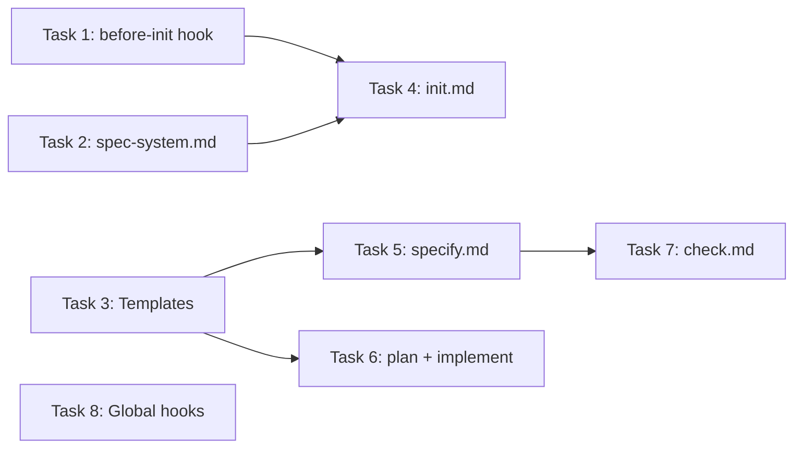

# Design Integration Implementation Plan

> **For agentic workers:** REQUIRED SUB-SKILL: Use superpowers:subagent-driven-development (recommended) or superpowers:executing-plans to implement this plan task-by-task. Steps use checkbox (`- [ ]`) syntax for tracking.

**Goal:** Integrate a configurable design tool pipeline into LiveSpec — from mockup generation during specify to design fidelity checks during check.

**Architecture:** All changes are Markdown files (commands, templates, hooks, spec-system). No code — LiveSpec is a spec framework, not a codebase. Each task modifies 1-3 files with well-defined insertion points.

**Tech Stack:** Markdown, YAML frontmatter

**Spec:** `docs/superpowers/specs/2026-03-23-design-integration-design.md`

---

## File Map

### Create

| File | Responsibility |
|------|---------------|
| `~/.claude/livespec/hooks/before-init.md` | Load stack-ref, user memory, and design config before init |

### Modify

| File | Change Summary |
|------|---------------|
| `system/spec-system.md` | Add `design/` to project layout tree, add design quality gates, add design convention rules |
| `system/templates/spec-template.md` | Add `## Screens` section between Key Entities and Infrastructure Requirements |
| `system/templates/plan-template.md` | Add `## Design Reference` section after Technical Context |
| `system/templates/implementation-template.md` | Add Visual Ref column note to Requirement Mapping |
| `commands/init.md` | Add design gate in Phase B, add `.specs/design/` in Phase C, update exit criteria |
| `commands/specify.md` | Add Step 5.5 (mockup generation), update quality gates, add re-modification workflow |
| `commands/plan.md` | Add design reference step after reading context |
| `commands/implement.md` | Add mockup reference in Phase 1, visual fidelity note |
| `commands/check.md` | Add design fidelity sub-step in Step 8 |
| `~/.claude/livespec/hooks/before-specify.md` | Append design tool config section |
| `~/.claude/livespec/hooks/before-plan.md` | Append mockup validation section |
| `~/.claude/livespec/hooks/before-implement.md` | Append design reference section |

---

### Task 1: Create `before-init.md` Global Hook

**Files:**
- Create: `~/.claude/livespec/hooks/before-init.md`

- [ ] **Step 1: Create the hook file**

Write `~/.claude/livespec/hooks/before-init.md` with this exact content:

```markdown
---
mode: extend
---

# Before Init — Load Stack Knowledge & User Preferences

## 1. Stack Reference (always load)

**Read** [`decision-matrix.md`](~/projects/ai-ressources/stack-ref/decision-matrix.md) — decision trees, cost comparisons, recommended combos.
**Read** [`index.yaml`](~/projects/ai-ressources/stack-ref/index.yaml) — catalog of all evaluated technologies by category.

Use these references to anchor stack recommendations in evaluated data rather than general knowledge.
When recommending a technology, cite the relevant entry from the stack-ref if available.

## 2. User Preferences (always load)

**Read** [`dev.md`](~/.claude-memory/dev.md) — user's preferred stack, runtime, package manager, testing approach.

Propose the user's preferred technologies first. Present alternatives second.
If a preferred technology is suboptimal for the project's constraints, explain why and suggest the alternative.

## 3. Design Tool Config

**Read** [`design.md`](~/.claude/livespec/design.md) — user's preferred design tool configuration.

If this file exists and `tool` is not `none`:
- Include the design tool in the stack summary during Phase B
- Note the design system for future reference in the constitution
- Add a "Design" row to the recommended stack table

If this file does not exist:
- Trigger the design gate during Phase B (after stack decisions, before Phase C)
```

- [ ] **Step 2: Verify the file exists and is valid**

Run: `cat ~/.claude/livespec/hooks/before-init.md | head -5`
Expected: Shows the YAML frontmatter with `mode: extend`

---

### Task 2: Update `spec-system.md` — Project Layout, Quality Gates, Design Rules

**Files:**
- Modify: `system/spec-system.md`

- [ ] **Step 1: Add `design/` to the project layout tree**

In the `.specs/` tree diagram (around line 80, after the `hooks/` entry and before `changelog.md`), insert:

```markdown
│
├── design/
│   ├── ui.<ext>            ← Design source file (tool-specific)
│   ├── ui.pdf              ← Full PDF export
│   ├── screens/            ← Per-screen PNG exports
│   │   └── *.png
│   └── changelog.md        ← Design change history
```

- [ ] **Step 2: Add design quality gates**

In "Before a spec is considered complete" (around line 430), add after the last existing gate:

```markdown
- [ ] If feature has UI screens: `## Screens` section exists with PNG references
- [ ] If design tool configured: referenced PNGs exist in `.specs/design/screens/`
```

In "Before implementation is considered complete" (around line 445), add after the last existing gate:

```markdown
- [ ] For visual features with design mockups: design fidelity check performed
```

- [ ] **Step 3: Add design convention rules**

After the "When REVIEWING a feature" subsection (around line 293), add:

```markdown
### When working with DESIGN mockups

1. Design mockups are centralized in `.specs/design/` — one source file per project
2. PNGs in `screens/` are the reference for implementation — always the latest version
3. The design source file (`ui.pen`, `ui.fig`, etc.) is saved manually by the user
4. When a feature modifies existing screens, overwrite the PNG — git tracks history
5. The `## Screens` section in `spec.md` links features to their visual references
6. Design fidelity threshold is 5% (more permissive than visual regression at 2%)
```

- [ ] **Step 4: Verify changes**

Run: `grep -c "design" system/spec-system.md`
Expected: Multiple matches (layout tree, quality gates, convention rules)

---

### Task 3: Update Templates (spec, plan, implementation)

**Files:**
- Modify: `system/templates/spec-template.md`
- Modify: `system/templates/plan-template.md`
- Modify: `system/templates/implementation-template.md`

- [ ] **Step 1: Add `## Screens` section to spec-template.md**

Insert after the "Key Entities" section (after the Key Entities table, around line 263) and before "Infrastructure Requirements":

```markdown
---

## Screens

> **Include this section only when the feature involves user-facing interfaces.** Omit entirely for API-only or backend features.
> Screens are generated during `/spec.specify` using the configured design tool (see `~/.claude/livespec/design.md`).

| Screen | Status | Reference |
|--------|--------|-----------|
| [screen-name] | New / Modified | [screen-name.png](../../design/screens/screen-name.png) |

**Example (Notifications):**

| Screen | Status | Reference |
|--------|--------|-----------|
| notification-panel | New | [notification-panel.png](../../design/screens/notification-panel.png) |
| dashboard | Modified | [dashboard.png](../../design/screens/dashboard.png) |
```

- [ ] **Step 2: Add `## Design Reference` section to plan-template.md**

Insert after the "Technical Context" table (around line 29) and before "Constitution Check":

```markdown
---

## Design Reference

> **Include this section only when the feature has screens defined in spec.md.** Omit for non-UI features.
> Use these mockups to identify components, determine hierarchy, and plan responsive breakpoints.

| Screen | Component Breakdown | Reference |
|--------|-------------------|-----------|
| [screen-name] | [Component1, Component2, ...] | [screen-name.png](../../design/screens/screen-name.png) |
```

- [ ] **Step 3: Add Visual Ref note to implementation-template.md**

After the Requirement Mapping table header (around line 34), add a note:

```markdown
> **Visual features:** When the feature has screens in spec.md, add a "Visual Ref" column linking to the mockup PNG:
> `| [FR-001](spec.md#fr-001) | file.tsx | @spec FR-001 | [screen.png](../../design/screens/screen.png) | ✅ |`
```

- [ ] **Step 4: Verify all three templates**

Run: `grep -l "Screen" system/templates/spec-template.md system/templates/plan-template.md system/templates/implementation-template.md`
Expected: All three files listed

---

### Task 4: Update `commands/init.md` — Design Gate + Phase C

**Files:**
- Modify: `commands/init.md`

- [ ] **Step 1: Add Design Tool Check step in Phase B**

After the "Step 3 — Testing Strategy" section in Phase B and before "Step 4 — Architecture Decision Records (MANDATORY)", insert:

```markdown
### Step 3.5 — Design Tool Check

1. Read `~/.claude/livespec/design.md` (loaded by `before-init` hook if it exists)
2. If config exists and `tool != none`:
   - Add a "Design" row to the recommended stack table:
     ```
     | Design | [Tool name] ([MCP status]) | [Design system], [export formats] |
     ```
   - Record choice in `.specs/stacks/_default.md` under a `## Design` section
3. If config does not exist:
   - Display the design gate prompt:
     ```
     ⚠️  No design tool configured.

     LiveSpec generates visual mockups for UI features.
     Without a configured tool, interfaces won't be validated visually before implementation.

     Supported tools:
       • Pencil    — browser-based design, MCP integration, export PNG/PDF (.pen)
       • Figma     — collaborative design, API available (.fig)
       • Excalidraw — sketch-style wireframes, CLI available (.excalidraw)
       • HTML      — AI-generated playground, zero dependency (.html)
       • Other     — any tool that exports PNG per screen

     → Configure now? (recommended)
     → Continue without design? (mockups will be skipped)
     ```
   - If "configure now": run interactive wizard (tool → MCP → design system → write `~/.claude/livespec/design.md`)
   - If "continue without": write `design.md` with `tool: none` and `confirmed: YYYY-MM-DD`
4. If config exists and `tool == none` → skip silently
```

- [ ] **Step 2: Add `.specs/design/` to Phase C directory creation**

In Phase C installation (the directory tree listing), add after the `hooks/` entry:

```markdown
├── design/
│   ├── screens/            ← empty, ready for mockups
│   └── changelog.md        ← initial entry: "Design directory created"
```

- [ ] **Step 3: Add Design section to README.md template**

In the README.md template section (Step 3.10), add after "## System Files" table:

```markdown
## Design

| Document | Description |
|---|---|
| [design/](design/) | UI mockups and screen references |
| [design/changelog.md](design/changelog.md) | Design change history |
```

- [ ] **Step 4: Update exit criteria**

In the "Exit Criteria (Must Pass)" checklist, add:

```markdown
- [ ] `.specs/design/` directory exists with `screens/` subdirectory and `changelog.md`
```

- [ ] **Step 5: Update installation output message**

In the installation output block, add after the hooks line:

```markdown
> - `.specs/design/` — design mockups and screen references
```

---

### Task 5: Update `commands/specify.md` — Mockup Generation

**Files:**
- Modify: `commands/specify.md`

- [ ] **Step 1: Add Step 5.5 — Generate Mockups**

After Step 5 (Generate spec.md) and before Step 6 (Quality Validation), insert the full Step 5.5 content from the design spec Section 3.5.3. This is the largest single insertion — it includes:
1. UI feature detection
2. Design config check (gate if missing)
3. Screen identification from user stories
4. Mockup generation (MCP or manual)
5. Asset export (PNG + PDF)
6. User validation gate
7. Add `## Screens` section to spec.md
8. Update design changelog

Copy the full content from the design spec Section 3.5.3, steps 1-8.

- [ ] **Step 2: Add re-modification workflow**

After Step 5.5, add a note about re-modification:

```markdown
**Re-modification:** When `/spec.specify` is run on a feature that already has mockups (screens listed in existing spec.md), the AI detects existing screens, determines which need updating based on spec changes, regenerates via MCP (or instructs manual update), re-exports PNGs (overwriting previous versions), and updates the design changelog.
```

- [ ] **Step 3: Update quality gates in Step 6**

Add to the quality validation checklist:

```markdown
- [ ] If feature has UI: `## Screens` section exists in spec.md with references to PNG files
- [ ] If feature has UI and design tool configured: PNG files exist in `.specs/design/screens/`
```

- [ ] **Step 4: Update Definition of Done**

Add to the Definition of Done checklist:

```markdown
- [ ] If feature has UI and design tool configured: mockups generated and validated
- [ ] If feature has UI: `## Screens` section in spec.md with PNG references
```

---

### Task 6: Update `commands/plan.md` and `commands/implement.md`

**Files:**
- Modify: `commands/plan.md`
- Modify: `commands/implement.md`

- [ ] **Step 1: Add Design Reference step to plan.md**

After Step 2 (Read Context Files) and before the diagram generation steps, add:

```markdown
### Step 2.5 — Design Reference (UI features only)

If the feature's `spec.md` contains a `## Screens` section:

1. Read the screen references and their linked PNG files from `.specs/design/screens/`
2. Generate a `## Design Reference` section in the plan, mapping each screen to its component breakdown:

| Screen | Component Breakdown | Reference |
|--------|-------------------|-----------|
| [screen-name] | [Components identified from mockup] | [screen-name.png](../../design/screens/screen-name.png) |

3. Use the mockups to inform the implementation plan — component hierarchy, layout structure, responsive breakpoints

If no `## Screens` section exists → skip this step.
```

- [ ] **Step 2: Add design reference to implement.md Phase 1**

In Phase 1 (Analyze), after the "Read everything before writing anything" list (around line 31), add:

```markdown
6. `.specs/design/screens/*.png` — if feature has a `## Screens` section in spec.md, read the referenced mockup PNGs as visual targets for UI implementation
```

And add a note in the implementation behavior:

```markdown
**Design fidelity:** When implementing UI components, reference the corresponding mockup PNG from `.specs/design/screens/`. Match the layout, colors, and spacing from the mockup. When creating `implementation.md`, add a "Visual Ref" column linking each UI-related FR to its mockup.
```

---

### Task 7: Update `commands/check.md` — Design Fidelity

**Files:**
- Modify: `commands/check.md`

- [ ] **Step 1: Add Design Fidelity sub-step**

In Step 8 (Detect Visual Drift), after the existing visual drift detection content (around line 250), add:

```markdown
#### Design Fidelity Check (UI features with mockups)

If the feature's `spec.md` contains a `## Screens` section:

1. For each referenced screen:
   a. Look for a Playwright baseline in `baselines/` matching the screen name
   b. If baseline exists → compare baseline vs mockup PNG from `.specs/design/screens/`
   c. Report fidelity status:
      - ✅ Faithful — implementation matches mockup (< 5% diff)
      - 🎨 Diverged — implementation differs from mockup (> 5% diff)
      - ❌ No baseline — cannot compare (Playwright screenshot not captured)

2. Add to gap report after Visual Tests section:

   ```markdown
   ### Design Fidelity

   | Screen | Mockup | Baseline | Diff | Status |
   |--------|--------|----------|------|--------|
   | login | [mockup](../../design/screens/login.png) | [baseline](baselines/login.png) | 2.1% | ✅ Faithful |
   | dashboard | [mockup](../../design/screens/dashboard.png) | [baseline](baselines/dashboard.png) | 8.4% | 🎨 Diverged |
   ```

**Threshold distinction:**
- Visual regression (code vs previous code): 2% — catches unintended changes
- Design fidelity (code vs mockup): 5% — allows minor implementation differences
```

- [ ] **Step 2: Update consolidated report format**

In the Step 11 consolidated report (Feature Health table), update to include Design column:

```markdown
| Feature | Spec Quality | Code Alignment | Visual | Design | Overall |
```

---

### Task 8: Update Global Hooks (before-specify, before-plan, before-implement)

**Files:**
- Modify: `~/.claude/livespec/hooks/before-specify.md`
- Modify: `~/.claude/livespec/hooks/before-plan.md`
- Modify: `~/.claude/livespec/hooks/before-implement.md`

- [ ] **Step 1: Append design section to before-specify.md**

Add at the end of the file:

```markdown

## 3. Design Tool Config

**Read** [`design.md`](~/.claude/livespec/design.md) — load the design tool configuration.

If tool is configured and not `none`:
- Prepare to generate mockups after spec generation
- Load the design system tokens if specified in design.md
```

- [ ] **Step 2: Append mockup validation to before-plan.md**

Add at the end of the file:

```markdown

## 5. Design Mockup Validation

If the feature spec.md contains a `## Screens` section:
- Verify that all referenced PNG files exist in `.specs/design/screens/`
- If any are missing, warn before proceeding: "Screen mockup [name].png referenced in spec but not found"
```

- [ ] **Step 3: Append design reference to before-implement.md**

Add at the end of the file:

```markdown

## 7. Design Reference

If the feature spec.md contains a `## Screens` section:
- **Read** each referenced PNG from `.specs/design/screens/` as the visual target
- When implementing UI components, match the layout, colors, and spacing from the mockup
- Use the design system tokens (shadcn, Material, etc.) specified in the project's constitution
```

- [ ] **Step 4: Verify all hooks**

Run: `grep -l "Design" ~/.claude/livespec/hooks/before-*.md`
Expected: `before-init.md`, `before-specify.md`, `before-plan.md`, `before-implement.md`

---

## Task Dependencies



**Independent tasks (can run in parallel):** T1, T2, T3, T8
**Sequential after T1+T2:** T4
**Sequential after T3:** T5, T6
**Sequential after T5:** T7

---

*Plan — LiveSpec Design Integration v1.0*
