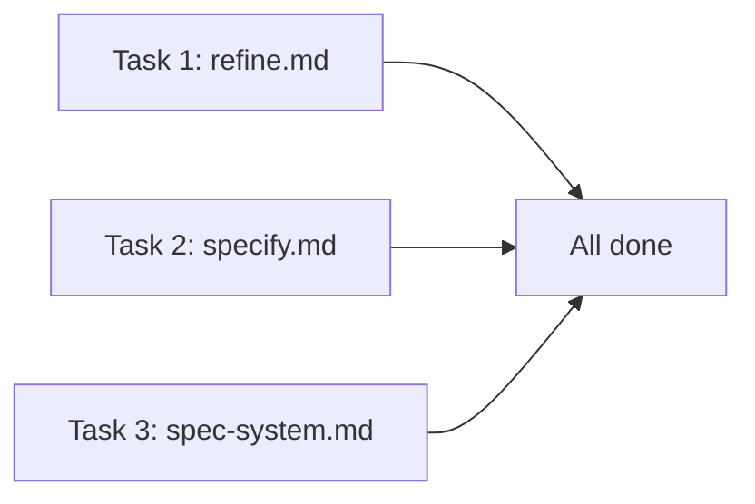

# Roadmap Lifecycle — Implementation Plan

> **For agentic workers:** REQUIRED SUB-SKILL: Use superpowers:subagent-driven-development (recommended) or superpowers:executing-plans to implement this plan task-by-task. Steps use checkbox (`- [ ]`) syntax for tracking.

**Goal:** Make the roadmap a living artifact — re-evaluated after project changes, enriched by emerging dependencies during specify, and directly manageable by the user.

**Architecture:** Two commands modified (refine.md, specify.md) + spec-system.md update rules. No new files.

**Tech Stack:** Markdown (command definitions), no code changes.

**Spec:** [`docs/superpowers/specs/2026-03-26-roadmap-lifecycle-design.md`](../specs/2026-03-26-roadmap-lifecycle-design.md)

---

## File Structure

| Action | File | Responsibility |
|--------|------|---------------|
| Modify | `commands/refine.md` | Add Step 5.5 (re-evaluation), add roadmap as 4th menu target, update DoD |
| Modify | `commands/specify.md` | Add Step 5.5 (emerging deps + absorption), renumber 5.5→5.6, update DoD |
| Modify | `system/spec-system.md` | Add roadmap lifecycle rules to README update rules |

All 3 files are independent — tasks can be parallelized.

---

## Task 1: Modify `commands/refine.md`

**Files:**
- Modify: `commands/refine.md`

- [ ] **Step 1: Update the Project flow menu (Step 2)**

In the Flow: Project section, Step 2 — Present Summary (around line 126-141), update the menu. The current option 4 ("Describe your change freely") becomes option 5. Add option 4 ("Roadmap"):

```
What would you like to refine?
1. Users, roles, or constraints (project.md)
2. Architecture principles (constitution.md)
3. Testing strategy (testing/strategy.md)
4. Roadmap (roadmap.md)
5. Describe your change freely
```

- [ ] **Step 2: Add Step 5.5 — Roadmap Re-evaluation**

Insert a new section in the Flow: Project, between Step 5 (Apply and Record, around line 186-192) and the end of the Project flow (before `## Flow: Feature Spec`).

Content from design spec Section 1. Key elements:
- Trigger: runs after project-level changes (project.md, constitution.md, testing/strategy.md). Skipped if roadmap.md doesn't exist. NOT triggered when option 4 (direct roadmap edit) is selected.
- Logic: read updated project.md → re-run inference matrix (reference init.md Step 3.9, don't duplicate) → compare against existing roadmap → compute delta
- Present delta as diff with `+` (add), `~` (modify), `?` (stale) legend
- Confirmation gate (unless --auto)
- Checked items are never marked stale

Full step content:

```markdown
### Step 5.5 — Roadmap Re-evaluation

After applying project-level changes, re-evaluate the roadmap. Skipped if `.specs/roadmap.md` does not exist. Not triggered when option 4 (direct roadmap refinement) is selected.

1. Read the updated `project.md` (post-change)
2. Re-run the inference matrix from `/spec.init` Step 3.9 on the updated profile
3. Compare inferred items against existing roadmap items (all tiers + Deferred)
4. Compute the delta:
   - **New items** (`+`): inferred but not in roadmap → propose adding
   - **Stale items** (`?`): in roadmap (unchecked) but no longer inferred → mark `[STALE?]` and propose removal
   - **Modified items** (`~`): scope or dependencies changed → propose update
   - **Checked items** are never marked stale — they exist as specs regardless of profile changes

5. If no delta detected → display "Roadmap is up to date" and skip

6. Present the delta:

\`\`\`
📋 Roadmap re-evaluation after project change:

  + **Reviewer dashboard** — new role needs management tools · Scope: M · Tier: Post-MVP
  ~ **Admin dashboard** — scope updated: now includes Reviewer moderation · Scope: M → L
  ? **Mobile-optimized views** [STALE?] — "mobile" no longer mentioned in vision

  Apply these changes to roadmap.md? (y/n/modify)
\`\`\`

7. If confirmed: apply changes to `roadmap.md`
8. If "modify": let user adjust individual items before applying
9. If declined: no changes

**Flag interactions:**
- `--auto`: apply delta without confirmation
- `--dry-run`: show delta but don't apply
```

- [ ] **Step 3: Add Roadmap Refinement Flow (option 4)**

After Step 5.5, add the full roadmap refinement flow. This is a new sub-flow within the Project flow, triggered when the user selects option 4 from the menu.

Content from design spec Section 2 — the "When option 4 is selected" block. Key elements:
- Note about Step 5.5 being skipped for this option
- Read and present current roadmap state (checked/unchecked items per tier + deferred)
- 5 action options: remove, move between tiers, add, modify, describe change
- Before/after diff with confirmation
- Changelog entry: `[Project] Roadmap refined: [description]`

- [ ] **Step 4: Update Definition of Done**

Add to the existing DoD checklist (around line 442-455):

```markdown
- [ ] If `roadmap.md` exists and project-level changes applied: roadmap re-evaluation executed
- [ ] If roadmap option selected: changes applied with before/after diff
```

- [ ] **Step 5: Verify flow structure**

Read the final file. Confirm the Project flow order: Step 1 (Read) → Step 2 (Menu, now with 5 options) → Step 3 (Conversation) → Step 4 (Diff) → Step 4.5 (Stack redirect) → Step 5 (Apply) → Step 5.5 (Roadmap re-evaluation) → Roadmap refinement flow (option 4) → Flow: Feature Spec starts after.

---

## Task 2: Modify `commands/specify.md`

**Files:**
- Modify: `commands/specify.md`

- [ ] **Step 1: Renumber existing Step 5.5 to Step 5.6**

Find the header `### Step 5.5 — Generate Mockups` and rename it to `### Step 5.6 — Generate Mockups`. Only the header needs renaming — no other references use "Step 5.5" by number.

- [ ] **Step 2: Add new Step 5.5 — Emerging Dependencies & Absorption Detection**

Insert before the newly renamed Step 5.6. Content from design spec Section 3:

```markdown
### Step 5.5 — Emerging Dependencies & Absorption Detection

After generating spec.md, analyze it for roadmap interactions. Skip silently if `.specs/roadmap.md` does not exist.

#### Detection A — Emerging Dependencies

1. Extract all referenced entities, services, and capabilities from the just-generated spec:
   - Key Entities section
   - Functional Requirements (references to external systems)
   - User stories (mentions of features the user expects to exist)
   - Infrastructure Requirements (if present)
2. Read `.specs/features/*/spec.md` headers — build list of existing feature names and key entities
3. Read `.specs/roadmap.md` — build list of roadmap items (all tiers + Deferred)
4. For each referenced entity/capability NOT found in existing features OR roadmap → it's an **emerging dependency**

5. If emerging dependencies found:

\`\`\`
📋 Emerging dependencies detected in this spec:

| Dependency | Found in | Suggested tier | Source in spec |
|-----------|----------|---------------|----------------|
| Push notifications | — (nowhere) | Post-MVP | FR-003: message alerts |
| Organization entity | — (nowhere) | MVP | Key Entities: multi-tenant |

→ Add to roadmap? (y/n)
\`\`\`

6. If confirmed: add items to appropriate tier in `roadmap.md`

#### Detection B — Absorption

7. For each existing unchecked roadmap item, check if the current spec **covers it** — the spec's key entities or FR descriptions contain the roadmap item's bold name or primary domain keyword (case-insensitive)

8. If absorption detected:

\`\`\`
📋 This spec appears to cover existing roadmap items:

| Roadmap item | Tier | Overlap |
|-------------|------|---------|
| Push notifications | Post-MVP | Covered by FR-003 + Story 3 |

→ Check these items as covered? (y/n)
\`\`\`

9. If confirmed: check the item in roadmap (`- [ ]` → `- [x]`) and link to this spec

**Flag interaction:** `--auto` → add emerging deps and check absorbed items without confirmation.
```

- [ ] **Step 3: Update Definition of Done**

Add to the existing DoD checklist:

```markdown
- [ ] If `.specs/roadmap.md` exists: emerging dependencies detected and proposed (or none found)
- [ ] If `.specs/roadmap.md` exists: absorption detection run (or no overlap found)
```

- [ ] **Step 4: Verify step flow**

Read the final file. Confirm: ... → Step 5 (Generate spec) → Step 5.5 (Emerging deps + absorption) → Step 5.6 (Generate Mockups) → Step 6 (Quality Validation) → ...

---

## Task 3: Modify `system/spec-system.md`

**Files:**
- Modify: `system/spec-system.md`

- [ ] **Step 1: Add roadmap lifecycle rules**

In the README.md update rules section (around lines 219-221, where the first design already added init/specify/propose rules), add:

```markdown
- `/spec.refine project` re-evaluates roadmap after project profile changes + supports direct roadmap refinement
- `/spec.specify` detects emerging dependencies and roadmap item absorption
```

Note: the existing `/spec.specify` rule says "checks matching roadmap items + adds deferred splits". The new rule is an **additional** bullet, not a replacement — it covers a different mechanism (emerging deps vs. deferred splits).

---

## Dependency Graph



All 3 tasks are independent. Maximum parallelism: 3 concurrent agents.
