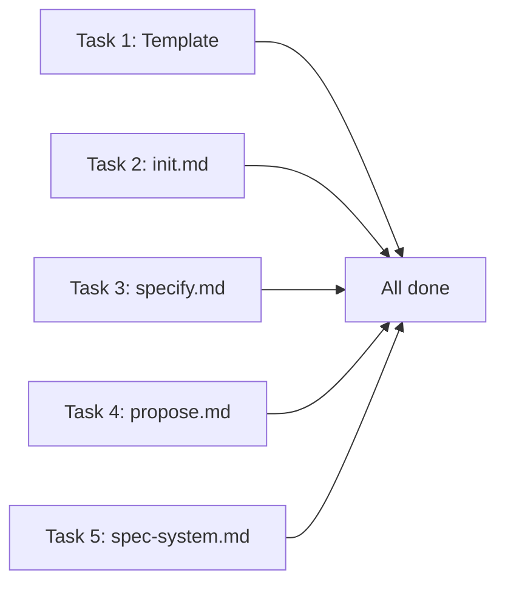

# Spec Roadmap & Split Detection — Implementation Plan

> **For agentic workers:** REQUIRED SUB-SKILL: Use superpowers:subagent-driven-development (recommended) or superpowers:executing-plans to implement this plan task-by-task. Steps use checkbox (`- [ ]`) syntax for tracking.

**Goal:** Add a persistent spec backlog (`.specs/roadmap.md`) generated at init and enriched by split detection during specify.

**Architecture:** The roadmap is a Markdown file with HTML section markers (consistent with README.md patterns). Three tiers (MVP/Post-MVP/Future) hold checkbox items; a Deferred table captures splits. Three existing commands are modified: init (generates), specify (syncs + splits), propose (reads Deferred).

**Tech Stack:** Markdown (command definitions), no code changes.

**Spec:** [`docs/superpowers/specs/2026-03-26-spec-roadmap-design.md`](../specs/2026-03-26-spec-roadmap-design.md)

---

## File Structure

| Action | File | Responsibility |
|--------|------|---------------|
| Create | `system/templates/roadmap-template.md` | Template for `.specs/roadmap.md` with section markers |
| Modify | `commands/init.md` | Add Step 3.9 (roadmap generation), update directory tree, output, DoD, Generated Files |
| Modify | `commands/specify.md` | Rewrite Step 1.5 (split detection), add Step 7.7 (roadmap sync), update DoD |
| Modify | `commands/propose.md` | Enhance Step 3 (Deferred awareness), update Step 5 (ranking boost) |
| Modify | `system/spec-system.md` | Add roadmap.md to Project Layout tree and README update rules |

All 5 files are independent — no file depends on another being modified first. Tasks can be parallelized.

---

## Task 1: Create roadmap template

**Files:**
- Create: `system/templates/roadmap-template.md`

- [ ] **Step 1: Create the template file**

Write `system/templates/roadmap-template.md` with the exact content from the design spec Section 1 — the template block with:
- Header with `Last updated: YYYY-MM-DD`
- Three tier sections (MVP, Post-MVP, Future) with `<!-- roadmap:<tier>:start/end -->` markers
- `> No items yet.` hints inside markers
- Deferred section with table header inside `<!-- roadmap:deferred:start/end -->` markers
- Footer: `*Maintained automatically by LiveSpec commands. Do not remove section markers.*`

- [ ] **Step 2: Verify template consistency**

Check that section marker naming follows the same pattern as README.md markers (`<!-- readme:features:start -->`). Verify markers are: `roadmap:mvp`, `roadmap:postmvp`, `roadmap:future`, `roadmap:deferred`.

---

## Task 2: Modify `commands/init.md`

**Files:**
- Modify: `commands/init.md`

Reference: Read the design spec Section 2 (Init Phase C), Section 7 (README integration), Section 8 (installation output), Section 9 (DoD).

- [ ] **Step 1: Add `roadmap.md` to Phase C directory tree**

In the Phase C directory tree (around line 328-353), add `roadmap.md` after `project.md`:

```
├── roadmap.md              ← Feature backlog (MVP / Post-MVP / Future)
```

- [ ] **Step 2: Add Step 3.9 — Generate Roadmap**

Insert a new section **before** Step 3.10 (Create README.md). Content:

```markdown
### Step 3.9 — Generate Roadmap

Generate `.specs/roadmap.md` as the feature backlog for the project.

**Template:** `system/templates/roadmap-template.md`

**Logic:**

1. Read `project.md` — extract roles, vision, real-time needs, scale
2. Read `constitution.md` + `_default.md` — understand stack capabilities
3. Infer expected feature domains using this matrix:

| Signal from project profile | Expected domain |
|---|---|
| Any project with users | Authentication (signup, login, password reset) |
| Multiple roles with different access | Role management / RBAC |
| Role has "post", "create", "manage" actions | CRUD for that entity |
| Real-time messaging mentioned | Messaging system |
| Real-time notifications mentioned | Notification system |
| "Search", "browse", "discover" in vision | Search & discovery |
| "Pay", "invoice", "billing", "monetize" | Payments / billing |
| Admin role exists | Admin dashboard |
| "Mobile" or "responsive" mentioned | Mobile-optimized views |
| "Analytics", "reports", "metrics" | Reporting & analytics |
| "Settings", "preferences", "profile" | User settings / profiles |

4. Classify each inferred feature into tiers:
   - **MVP**: Features required for core value proposition + auth + primary entity CRUD
   - **Post-MVP**: Enhancement features (search, notifications, analytics, admin tools)
   - **Future**: Nice-to-have (advanced analytics, integrations, i18n)

5. Estimate scope per item:
   - **S**: single entity, few stories (settings, preferences)
   - **M**: 1-2 entities, standard CRUD + some logic (auth, messaging)
   - **L**: multiple entities, complex workflows (payments, bidding system)

6. Infer dependencies:
   - Everything depends on auth (if present)
   - Messaging depends on user profiles
   - Payments depend on core entity CRUD
   - Admin dashboard depends on the features it moderates

7. Generate `.specs/roadmap.md` from template, filling tier sections with inferred items
8. Remove `> No items yet.` hints from tiers that have items

**Item format:**

\`\`\`markdown
- [ ] **Feature name** — short description · Roles: X, Y · Scope: S/M/L · Deps: feature-a, feature-b
\`\`\`
```

- [ ] **Step 3: Add roadmap row to README.md template**

In Step 3.10 (Create README.md), add a row to the System Files table:

```markdown
| [roadmap.md](roadmap.md) | Feature backlog (MVP / Post-MVP / Future) |
```

Insert after the `[changelog.md](changelog.md)` row.

- [ ] **Step 4: Add roadmap to installation output**

In the Phase C installation output message (around line 472-493), add:

```
> - `.specs/roadmap.md` — feature roadmap (N items across MVP/Post-MVP/Future)
```

Insert after the `.specs/changelog.md` line (line 485) and before the `.specs/preflight.md` line (line 486).

- [ ] **Step 5: Add roadmap row to Generated Files Reference table**

In the Generated Files Reference table (around line 509-519), add:

```markdown
| `.specs/roadmap.md` | `system/templates/roadmap-template.md` | Filled from Phase A project profile inference |
```

- [ ] **Step 6: Update Definition of Done**

Add to the Exit Criteria section in `commands/init.md` (around line 548-562):

```markdown
- [ ] `roadmap.md` exists with at least 1 item in at least 1 tier (empty tiers are acceptable)
```

- [ ] **Step 7: Add `--auto` and `--dry-run` handling**

In Step 3.9, add a note at the end:

```markdown
**Flag interactions:**
- `--auto`: Roadmap is generated using AI inference with no user review of items.
- `--dry-run`: Roadmap is listed in the dry-run output but not created.
```

- [ ] **Step 8: Verify step numbering**

Read the final file. Confirm Step 3.9 appears before Step 3.10 and the numbering flows correctly: ... → 3.5 (Design Gate) → 3.9 (Roadmap) → 3.10 (README) → 3.11 (CLAUDE.md). Note: Steps 3.6-3.8 are intentionally absent; 3.9 is the next available number.

---

## Task 3: Modify `commands/specify.md`

**Files:**
- Modify: `commands/specify.md`

Reference: Read the design spec Section 3 (Split Detection), Section 4 (Roadmap Sync), Section 9 (DoD).

- [ ] **Step 1: Rewrite Step 1.5 — Scope Analysis & Split Detection**

Replace the current Step 1.5 content (lines 36-43) with the full split detection protocol from the design spec Section 3. The new Step 1.5 has 7 sub-points:

1. Extract functional domains
2. Test independence
3. Evaluate complexity
4. If split detected — show proposal table
5. User accepts split — proceed with #1, add rest to roadmap Deferred
6. User declines split — proceed with full request
7. Max 2 clarification questions (unchanged)

Keep the existing bullets 2 (bugfix routing), 3 (implementation details only) as sub-points under the new Step 1.5, renumbered appropriately.

- [ ] **Step 2: Add Step 7.7 — Roadmap Sync**

Insert after Step 7.6 (Update Changelog). Content from design spec Section 4:

```markdown
### Step 7.7 — Update Roadmap

1. Read `.specs/roadmap.md` (if it exists; if not, skip silently)
2. **Tier match:** Search all tier sections (MVP, Post-MVP, Future) for an unchecked item matching the new feature. Match criteria: case-insensitive substring match on the item's bold name OR shared primary entity/domain keyword (e.g., "auth" matches "**User authentication**")
3. If tier match found: check the checkbox (`- [ ]` → `- [x]`) + append spec link (`→ [NNN-name](features/NNN-name/spec.md)`)
4. **Deferred match:** Search the Deferred table for a row matching the new feature (same matching criteria). If found:
   a. Remove the row from the Deferred table
   b. Add a checked+linked item to the appropriate tier (MVP if no tier preference is obvious, otherwise infer from scope/dependencies)
5. If split was performed in Step 1.5: add deferred items to Deferred table
6. Update the `Last updated` date
7. Remove `> No items yet.` hint from the tier if it now has checked or unchecked items
```

- [ ] **Step 3: Update Definition of Done**

Add to the existing DoD checklist (around line 338-351):

```markdown
- [ ] If `.specs/roadmap.md` exists: matching item checked OR no match (skip)
- [ ] If split performed: deferred items added to roadmap.md Deferred section
```

- [ ] **Step 4: Verify step flow**

Read the final file. Confirm step numbering: ... → 7.5 (README) → 7.6 (Changelog) → 7.7 (Roadmap) → 8 (Git Branch) → 9 (Preflight).

---

## Task 4: Modify `commands/propose.md`

**Files:**
- Modify: `commands/propose.md`

Reference: Read the design spec Section 5 (Propose — Deferred Awareness).

- [ ] **Step 1: Enhance Step 3 — Read Roadmap**

In Step 3 (around lines 57-65), add after the existing bullets:

```markdown
- Parse the Deferred section table
- For each deferred item, extract: source request, item name, context, date added
- Deferred items are **high-context candidates** — they carry the user's original intent
```

- [ ] **Step 2: Enhance Step 5 — Ranking**

In Step 5 (around lines 117-124), add a 6th ranking criterion after "Roadmap alignment":

```markdown
6. **Deferred intent** — Was this item explicitly deferred from a prior `/spec.specify` request? Deferred items get a +1 priority boost because the user already expressed intent to build them.
```

- [ ] **Step 3: Update proposal presentation**

In Step 6 (around lines 126-166), add a note for deferred items:

```markdown
When presenting a proposal that originated from the Deferred section, include the origin context:

> *Originally split from: "auth + audit" — "Track all admin actions with timestamps, exportable logs"*
```

- [ ] **Step 4: Add edge case for Deferred**

In the Edge Cases section (around lines 194-230), add:

```markdown
### Deferred items exist

When the Deferred section has entries:

- Mention deferred items prominently (they represent explicit user intent)
- Cross-reference with tier items to avoid suggesting duplicates
- If a deferred item matches a tier item, note the overlap

> **Note:** 2 deferred items from previous `/spec.specify` splits are available.
> Consider specifying them next:
> - Audit trail (from "auth + audit")
> - Role management (from "auth + roles + audit")
```

---

## Task 5: Modify `system/spec-system.md`

**Files:**
- Modify: `system/spec-system.md`

Reference: Read the design spec Section 6 (spec-system.md Updates).

- [ ] **Step 1: Add roadmap.md to Project Layout tree**

In the Project Layout tree (around lines 38-83), add `roadmap.md` after `project.md` (line 43):

```
├── roadmap.md              ← Feature backlog (MVP / Post-MVP / Future)
```

- [ ] **Step 2: Add roadmap.md artifact description**

After the existing artifact descriptions (after the `logs/` section around line 183), add:

```markdown
### roadmap.md — Feature Backlog

Persistent backlog of specs to build, organized in tiers (MVP / Post-MVP / Future) with a Deferred section for items split from `/spec.specify` requests. Generated by `/spec.init`, maintained by `/spec.specify`.

**Section markers:** `<!-- roadmap:mvp:start/end -->`, `<!-- roadmap:postmvp:start/end -->`, `<!-- roadmap:future:start/end -->`, `<!-- roadmap:deferred:start/end -->`.

**Item format in tiers:**
```
- [ ] **Feature name** — description · Roles: X · Scope: S/M/L · Deps: Y
```

**When checked (spec created):**
```
- [x] **Feature name** — description · Roles: X · Scope: M · Deps: Y → [NNN-name](features/NNN-name/spec.md)
```
```

- [ ] **Step 3: Add roadmap to README.md update rules**

In the README.md update rules section (around lines 191-200), add:

```markdown
- `/spec.init` creates roadmap.md with inferred feature backlog
- `/spec.specify` checks matching roadmap items + adds deferred splits
- `/spec.propose` reads roadmap.md including Deferred section (read-only)
```

---

## Dependency Graph



All 5 tasks are independent. No task blocks another. Maximum parallelism: 5 concurrent agents.
