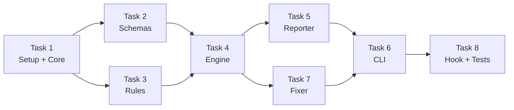

# Plan: Layer 1 — Structural Validation

> Implementation plan for the LiveSpec structural validator.
> Date: 2026-04-02
> Spec: docs/superpowers/specs/2026-04-02-layer1-structural-validation-design.md
> Original: docs/future/layer1-structural-validation.md

---

## Task Overview

Build a standalone Python package (`validator/`) that validates `.specs/` Markdown files. 8 tasks, parallelizable in groups.

**Scope note:** Pass 2 (Claude SDK auto-fix with `--smart`) is deliberately deferred — fully specified in `docs/future/layer1-structural-validation.md` §9 but requires external SDK dependency. The `--smart` flag is defined in the CLI but raises NotImplementedError.

## Task 1: Project Setup + Core Infrastructure

**Files to create:**
- `validator/__init__.py` — package init, exports `__version__`
- `validator/parser.py` — `parse_file(path)` → `(metadata: dict, content: str, headings: list[str], code_blocks: list[dict])`. Uses `python-frontmatter` for YAML + `mistune.create_markdown(renderer="ast")` for headings/code blocks extraction. NOTE: mistune 3.x API changed — must use `renderer="ast"` not `renderer=mistune.AstRenderer()`.
- `validator/config.py` — `load_config(specs_root)` → `ValidatorConfig`. Parses `validator.yml` if present, else returns defaults. Fields: `block_on` (error|warning), `validate_types` (list of file types to validate, default: all), `exclude` (glob patterns). Default exclusions: README.md, preflight-report.md, stacks/decisions/*, features/*/logs/*, features/*/checks/*, features/*/baselines/*, archive/*, design/*, testing/*, hooks/*. `resolve_file_type(path, specs_root) -> str` also lives here.
- `pyproject.toml` — at project root, pip-installable package config

**Dependencies:** None (foundational)

**Verification:** `python -c "from validator.parser import parse_file; from validator.config import load_config, resolve_file_type"`

## Task 2: Pydantic Schemas

**Files to create:**
- `validator/schemas/__init__.py` — exports `get_schema(file_type) -> type[BaseModel] | None`
- `validator/schemas/base.py` — `BaseFrontmatter(BaseModel)` with `title: str` + `title_not_empty` validator. `model_config = {"extra": "allow"}`
- `validator/schemas/spec.py` — `SpecFrontmatter(BaseFrontmatter)`: status (Literal), priority (Literal), created (date), updated (date), `updated_gte_created` validator
- `validator/schemas/plan.py` — `PlanFrontmatter(BaseFrontmatter)`: spec_ref (str), created (date)
- `validator/schemas/implementation.py` — `ImplementationFrontmatter(BaseFrontmatter)`: feature (str)
- `validator/schemas/stack.py` — `StackFrontmatter(BaseFrontmatter)`: updated (date)
- `validator/schemas/roadmap.py` — No frontmatter schema (returns None)
- `validator/schemas/changelog.py` — No frontmatter schema (returns None)
- `validator/schemas/progress.py` — No frontmatter schema (returns None)
- `validator/schemas/preflight.py` — No frontmatter schema (returns None)
- `validator/schemas/generic.py` — No frontmatter schema (returns None)

**Dependencies:** Task 1 (base.py uses nothing from parser, but package must exist)

**Verification:** `python -c "from validator.schemas import get_schema; s = get_schema('spec'); s(title='Test', status='Draft', priority='P1', created='2026-01-01', updated='2026-01-01')"`

## Task 3: Validation Rules

**Files to create:**
- `validator/rules/__init__.py` — exports `validate_sections(headings, file_type)`, `validate_by_type(content, file_type, code_blocks)`
- `validator/rules/sections.py` — `SECTION_RULES` dict (keyword-based matching, case-insensitive). `validate_sections(headings, file_type) -> (errors, warnings)`. For plan: also check >=1 mermaid code block. For implementation: check >=1 `@spec` anchor in content.
- `validator/rules/roadmap_markers.py` — Check 4 HTML marker pairs (mvp, postmvp, future, deferred). Each pair must have start+end marker.
- `validator/rules/changelog_entries.py` — Regex: `^## \d{4}-\d{2}-\d{2} — \[.+\]:`. At least one match required.
- Add to `sections.py`: progress table validation (check for `| Step` or `|Step` in content). Generic validation: content >100 chars, no `[TBD]`, `[PLACEHOLDER]`, `[TODO]` patterns.

**Dependencies:** Task 1

**Verification:** Unit tests

## Task 4: Engine (Orchestrator)

**Files to create:**
- `validator/engine.py` — `FileResult` dataclass (path, errors, warnings, score). `validate_file(path, specs_root, config) -> FileResult`. `validate_all(specs_root, config, paths=None, staged_only=False) -> list[FileResult]`. Orchestrates: resolve type → parse → schema validate → section validate → rule validate → compute score.

**Dependencies:** Tasks 1, 2, 3

**Verification:** `python -c "from validator.engine import validate_file"`

## Task 5: Reporter

**Files to create:**
- `validator/reporter.py` — `report(results: list[FileResult], format: str, excluded: list[str])`. Three formats:
  - `compact`: `ERREUR file.md (3 errors, 1 warning) Score: 35/100` per file
  - `full`: grouped by file, category tags `[frontmatter]`, `[section]`, `[rule]`, score
  - `json`: `{"files": [...], "excluded": [...], "summary": {"total_errors": N, ...}}`
  Uses `rich` for colored terminal output in compact/full modes.

**Dependencies:** Task 4 (FileResult type)

**Verification:** Visual inspection of output formats

## Task 6: CLI (typer)

**Files to create:**
- `validator/cli.py` — typer app with:
  - `validate` command: PATH arg (optional), `--staged`, `--format`, `--warn-only`, `--score-only`, `--fix`, `--smart` (raises NotImplementedError), `--auto`, `--dry-run`, `--list-excluded`
  - `install-hook` command: `--target-dir` (default cwd)
  - Mutual exclusion: `--staged` vs positional PATH
  - Exit code: 0 if no errors (or `--warn-only`), 1 if errors, respect `block_on` config

**Dependencies:** Tasks 4, 5

**Verification:** `python -m validator.cli validate --help`

## Task 7: Auto-fix Pass 1

**Files to create:**
- `validator/fixer.py` — `fix_file(path, file_result, specs_root) -> list[FixAction]`. Deterministic fixes:
  - Invalid status → Draft
  - updated < created → today
  - Missing created → file mtime
  - Missing updated → today
  - Empty title → folder name
  - Missing priority → P2
  - Missing section → skeleton injection at canonical position (or end of file)
  - Missing roadmap markers → empty marker pairs
  - [TBD]/[PLACEHOLDER]/[TODO] → WARNING only, NOT fixed
  - `.bak` backup before modification
  - Re-validate after fix, rollback if new errors
  - `--dry-run` mode: report what would change without modifying

**Dependencies:** Tasks 1, 2, 3, 4 (config from Task 1 for backup paths and dry-run)

**Verification:** Create a broken fixture, run fix, verify output

## Note: install.sh

The existing `scripts/install.sh` is NOT modified. Hook installation is handled by the new `livespec install-hook` CLI subcommand (Task 6). This is more consistent with the CLI surface and avoids conflating LiveSpec repo installation with target project hook setup.

## Task 8: Pre-commit Hook + Tests

**Files to create:**
- `validator/hooks/pre-commit-hook` — bash script (from spec section 6 verbatim)
- `tests/conftest.py` — shared fixtures, tmp_path setup
- `tests/fixtures/` — valid and invalid .md files for each type (spec, plan, implementation, roadmap, changelog, stack, preflight, progress, constitution, project)
- `tests/test_parser.py` — frontmatter extraction, heading extraction, code block extraction
- `tests/test_schemas.py` — valid/invalid for each Pydantic model
- `tests/test_rules.py` — section validation, roadmap markers, changelog entries, progress table, generic validation
- `tests/test_engine.py` — full pipeline integration
- `tests/test_cli.py` — CLI invocation via typer testing
- `tests/test_fixer.py` — Pass 1 fixes, dry-run, rollback
- `tests/test_config.py` — config loading with/without validator.yml, exclusion patterns

**Dependencies:** All tasks

**Verification:** `pytest tests/ -v`

## Parallelization

**Wave 1:** Task 1 (setup)
**Wave 2:** Tasks 2, 3 (parallel — schemas and rules are independent)
**Wave 3:** Task 4 (engine, depends on 2+3)
**Wave 4:** Tasks 5, 7 (parallel — reporter and fixer are independent)
**Wave 5:** Task 6 (CLI, depends on 5+7)
**Wave 6:** Task 8 (tests, depends on all)

---

*Generated by auto-brainstorm — LiveSpec Layer 1*
