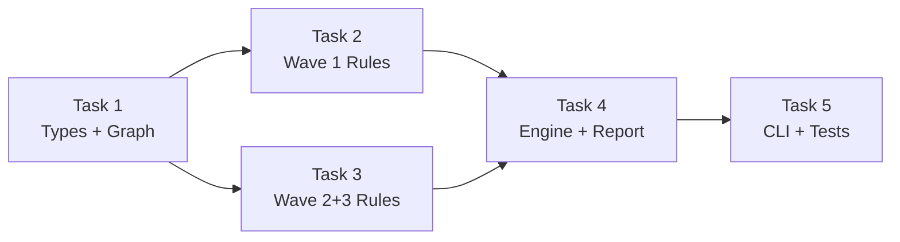

# Plan: Layer 2 — Coherence Validation

> Date: 2026-04-02
> Spec: docs/superpowers/specs/2026-04-02-layer2-coherence-validation-design.md

---

## Task 1: Core Types + GraphBuilder

**Files to create:**
- `validator/coherence/__init__.py` — package init
- `validator/coherence/violation.py` — `Severity` enum (ERROR, WARNING, INFO), `Violation` dataclass, `CoherenceRule` Protocol
- `validator/coherence/graph_builder.py` — `SpecGraph` dataclass + `build_graph(specs_root: Path) -> SpecGraph`. Reads roadmap.md (parse checklist items + HTML markers), features/ dirs (list files, read spec.md frontmatter for status, read implementation.md for @spec anchors), README.md (extract feature refs), stacks/_default.md (extract technologies), preflight.md (extract checks), changelog.md (extract feature refs).

**Dependencies:** None

## Task 2: Rules Wave 1 (R1 + R2 + R4)

**Files to create:**
- `validator/coherence/rules/__init__.py` — `ALL_RULES` list, `get_rules(wave=None, rule_ids=None, ignore=None) -> list[CoherenceRule]`
- `validator/coherence/rules/r1_roadmap_features.py` — 4 rules: R1.1 (roadmap ref missing dir), R1.2 (orphan dir), R1.3 (status vs roadmap marker), R1.4 (checked item without link)
- `validator/coherence/rules/r2_status_files.py` — 3 rules: R2.1 (required file absent for status), R2.2 (advanced file for low status), R2.3 (invalid status value)
- `validator/coherence/rules/r4_readme_sync.py` — 3 rules: R4.1 (README feature missing on disk), R4.2 (disk feature missing from README), R4.3 (README status mismatch)

**Dependencies:** Task 1

## Task 3: Rules Wave 2+3 (R3 + R5 + R6)

**Files to create:**
- `validator/coherence/rules/r3_spec_anchors.py` — R3.1 (source file path not found), R3.2 (grep @spec anchor in source)
- `validator/coherence/rules/r5_stack_preflight.py` — R5.1 (technology without preflight check)
- `validator/coherence/rules/r6_changelog_refs.py` — R6.1 (changelog references non-existent feature)

**Dependencies:** Task 1

## Task 4: RuleEngine + Report

**Files to create:**
- `validator/coherence/rule_engine.py` — `run_coherence(specs_root, config) -> CoherenceResult`. Builds graph, filters rules by wave/ids/ignore, runs in wave order, applies suppress_if_creating, collects violations.
- `validator/coherence/report.py` — `report_coherence(result, format, specs_root)`. Console (grouped by rule group, severity colors) + JSON output.

**Dependencies:** Tasks 1, 2, 3

## Task 5: CLI Extension + Tests

**Files to modify:**
- `validator/cli.py` — add --coherence, --coherence-only, --rules, --wave, --ignore, --strict, --no-suppress flags to validate command

**Files to create:**
- `tests/test_graph_builder.py` — build graph from mocked .specs/, verify all fields
- `tests/test_coherence_rules.py` — test each of 14 rules with valid/invalid graphs
- `tests/test_rule_engine.py` — wave ordering, suppress_if_creating, rule filtering
- `tests/test_coherence_cli.py` — CLI flags, --coherence output

**Dependencies:** Task 4

## Parallelization

**Wave 1:** Task 1
**Wave 2:** Tasks 2, 3 (parallel)
**Wave 3:** Task 4
**Wave 4:** Task 5

---

*Generated by auto-brainstorm — LiveSpec Layer 2*
