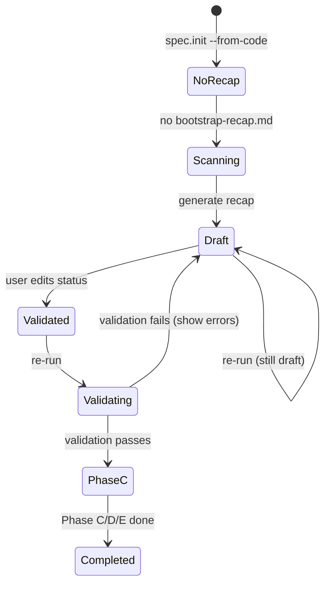
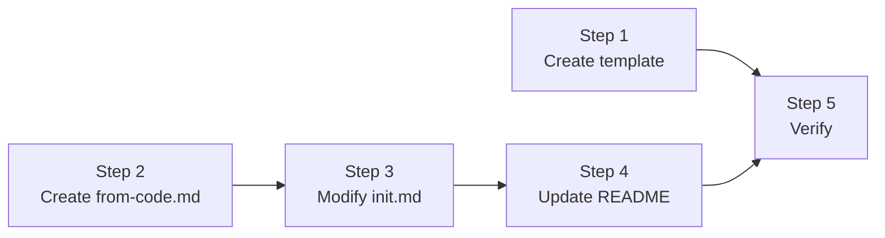

# Implementation Plan: spec.init --from-code

> Based on design spec: `docs/superpowers/specs/2026-04-02-spec-init-from-code-design.md`
> Generated: 2026-04-02 | Refined after Codex + spec review

---

## Overview

Add `--from-code` flag to the existing `spec.init` command. This replaces Phase A (brainstorm) and Phase B (stack decisions) with automated code analysis. Phase C/D unchanged. Phase E has one minor addition: convention guard (skip if `.conventions/` exists).

**Files to create/modify:**
- `system/from-code.md` — main --from-code flow spec, referenced from init.md (create)
- `system/templates/bootstrap-recap-template.md` — template for the recap file (create)
- `commands/spec-init.md` — add routing + flags, ~50 lines (modify)
- `README.md` — add one-liner (modify)

**Total: 4 files (2 create, 2 modify)**

---

## Step 1: Create bootstrap-recap-template.md

**File:** `system/templates/bootstrap-recap-template.md`
**Action:** Create new file

Template for `bootstrap-recap.md` with:
- YAML frontmatter (generated, status, project_name, from_code, deep, analysis_tokens)
- Tag legend in preamble
- All 9 H2 sections with placeholder instructions
- `## Analysis Coverage` table (informational, not parsed by Phase C)

**Acceptance criteria:**
- [ ] Valid YAML frontmatter with all required fields
- [ ] All 9 H2 section headings present
- [ ] Tag legend documented
- [ ] Placeholder instructions per section
- [ ] Analysis Coverage table

---

## Step 2: Create system/from-code.md

**File:** `system/from-code.md`
**Action:** Create new file

This is the main spec for the --from-code flow, extracted as a partial to keep init.md under 850 lines.

### Interface (top of file)

Document the contract:
- **Inputs:** flags received (--from-code, --deep, --force, --auto), project root path, .specs/ existence state, bootstrap-recap.md existence/status
- **Outputs:** bootstrap-recap.md in project root (status: draft), or Phase C entry (status: validated)

### 2a. Scan Quality Gate

After Phase A' scan, before generating recap:
- Count sections with OBSERVED or INFERRED content
- **Hard requirement:** Project Vision AND Detected Stack must both have at least INFERRED content
- < 3 populated: abort with "Insufficient signal"
- 3-5 populated: warn "Low coverage", proceed with [FILL] gaps
- 6+: proceed normally

### 2b. Phase A' — Tiered Code Scan

1. **Tier 1 — Manifests**: Detection patterns table (package.json, go.mod, etc.). Read in full. Cap: 12K tokens.
2. **Tier 2 — Structure**: README (100 lines), entrypoint detection table, directory tree (depth 3, ignoring node_modules/dist/.git). Cap: 12K tokens.
3. **Tier 3 — Deep**: Targeted grep patterns (routes, schemas, auth, payments, real-time, tests). Gets remaining budget.
4. **Tier 4 — History** (--deep only): git log -50, CI configs, .env.example. ALL signals tagged [SPECULATIVE]. Extra 30K budget.

**Token budget:** 30K default, 60K with --deep. Waterfall — Tier 1 reads what it needs, remaining cascades.

**Overflow:** If tier exceeds cap, truncate by file recency. Partial results kept. Skipped files in `## Analysis Coverage`. User warned: "Tier N truncated: X/Y files skipped."

### 2c. Auto-Answer 6 Questions

Signal source table + confidence mapping per question. Format rule:
- OBSERVED/INFERRED → affirmation
- SPECULATIVE → question with [FILL] if no answer possible

### 2d. Phase B' — Auto Stack Detection

1. Manifest → dependency → stack layer mapping
2. Conflict handling: [OBSERVED-CONFLICT] for mixed signals (e.g., Jest + Vitest)
3. ADR generation as "Observed" (not "Accepted")
4. Polyglot: neutral stack presentation ("Stack 1: Node.js — Express, Prisma"), domain roles as [INFERRED]

### 2e. Bootstrap-recap.md Generation

1. Generate using template
2. Fill sections from scan with tags
3. Display summary: tag stats, action-required count
4. Print continuation instructions

### 2f. Continuation Mechanism (idempotent)



States:
- No recap → scan and generate
- `status: draft` → print "Edit recap, set status: validated, re-run"
- `status: validated` → run validation gate, proceed to Phase C if pass
- Malformed recap (unparseable YAML, missing sections) → warn, re-scan
- Invalid status value → error: "Invalid status '[value]'. Set to 'validated'."

### 2g. Validation Rules

Before Phase C:
- [ ] YAML frontmatter parseable, `status: validated`
- [ ] All 9 H2 sections present
- [ ] Project Vision not empty
- [ ] Users & Roles has at least 1 role
- [ ] Detected Stack has at least 1 row
- [ ] No `[FILL]` markers remain
- [ ] No `[OBSERVED-CONFLICT]` tags remain

Fail → show specific errors, user re-edits.

### 2h. Constitution Generation

Document how `constitution.md` is synthesized from:
- Project Vision (architecture style inference)
- Detected Stack (technology constraints)
- Codebase structure patterns (monolith vs microservices, API-first, etc.)

### 2i. Edge Cases

Full table from design spec (empty repo, monorepo, no README, corrupted recap, .specs/ + recap coexistence, YAML typos, polyglot, etc.).

**Acceptance criteria:**
- [ ] Interface section at top of file
- [ ] Scan quality gate with hard requirements
- [ ] Phase A' with 4 tiers, waterfall budget, overflow handling
- [ ] Phase B' with detection, conflicts, ADRs, polyglot
- [ ] Continuation state diagram
- [ ] Validation rules complete
- [ ] Constitution generation specified
- [ ] Edge cases table complete
- [ ] Mermaid diagrams for flow and state machine

---

## Step 3: Modify commands/spec-init.md

**File:** `commands/spec-init.md`
**Action:** Modify (~50 lines added)

### 3a. Add flags to Flags table

| Flag | Short | Behavior |
|---|---|---|
| `--from-code` | `-f` | Enable reverse engineering mode |
| `--deep` | _(none)_ | Include Tier 4 scan (--from-code only) |
| `--force` | `-F` | Backup .specs/ + overwrite recap (--from-code only) |

**Note:** `--deep` has no short alias to avoid collision with existing `-d` (--dry-run).

### 3b. Add Flag Interactions table

Document all combinations including `--from-code --stack` (warning: ignored).

### 3c. Add --from-code routing gate

Before Phase A, add:

```
If --from-code:
  → Read system/from-code.md and follow it
  (passes: flags, project root, .specs/ state, recap state)
Else:
  → Normal Phase A flow (unchanged)
```

### 3d. Add Phase E convention guard

In Phase E section, add before hook execution:
- If `.conventions/` exists AND contains `conventions.md` → skip conventions.init
- Else → run conventions.init (standard behavior)

### 3e. Add recap cleanup to Phase C output

After Phase E:
- Move `bootstrap-recap.md` → `.specs/bootstrap-recap.md`
- Update frontmatter: `status: completed`, `completed: YYYY-MM-DD`

### 3f. Update exit criteria

Add:
- [ ] If `--from-code`: `.specs/bootstrap-recap.md` with `status: completed`
- [ ] If `--from-code`: no `bootstrap-recap.md` in project root

### 3g. Update overview Mermaid flowchart

Add --from-code branch to existing flowchart.

**Acceptance criteria:**
- [ ] Flags added with correct short aliases (no -d collision)
- [ ] Flag interactions documented
- [ ] Routing gate added, references system/from-code.md
- [ ] Phase E convention guard added
- [ ] Recap cleanup documented
- [ ] Exit criteria updated
- [ ] Flowchart updated
- [ ] Existing behavior NOT broken

---

## Step 4: Update README.md

**File:** `README.md`
**Action:** Modify

Add `--from-code` to spec.init description:
> `--from-code` — Reverse-engineer an existing codebase into LiveSpec specs

**Acceptance criteria:**
- [ ] --from-code mentioned in spec.init section

---

## Step 5: Verify

After implementation:
1. Run livespec-verifier against modified files
2. Check no broken internal references in init.md
3. Verify template has valid YAML + all 9 sections
4. Check from-code.md references match init.md anchors

---

## Execution Order



Steps 1 and 2 are **parallelizable** (no dependency).
Step 3 depends on Step 2 (references from-code.md).
Step 4 depends on Step 3 (needs final flag names).
Step 5 depends on all previous steps.

---

## Risk Assessment

| Risk | Mitigation |
|---|---|
| init.md growing too large | Extracted main flow to system/from-code.md — init.md adds only ~50 lines |
| Flag interactions non-obvious | Explicit interactions table in init.md |
| Template/parsing drift | Validation rules catch structural issues before Phase C |
| Scan produces insufficient signal | Quality gate aborts with clear message if < 3 sections or missing Vision/Stack |
| User edits break recap format | Parse check on re-run, clear error messages for malformed YAML/status |

---

*Implementation plan for spec.init --from-code — LiveSpec v1.1*
