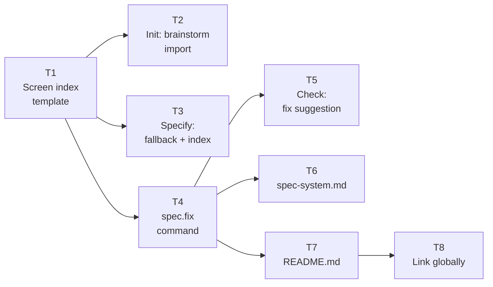

# Implementation Plan: spec.fix + Brainstorm Design Import

> **Date:** 2026-04-06
> **Design Spec:** [2026-04-06-spec-fix-brainstorm-import-design.md](../specs/2026-04-06-spec-fix-brainstorm-import-design.md)
> **Depends on:** Design Integration (2026-03-23), Visual Changelog (2026-03-29)

---

## Summary

Create the `spec.fix` command for targeted gap correction with visual analysis, add brainstorm design import to `spec.init`, create the screen index template, and update existing commands for integration.

---

## Tasks

### T1 — Create `screen-index-template.md`

**File:** `system/templates/screen-index-template.md` (CREATE)

Create the template from Design Spec Section 4 (Screen Index):
- Header with description and link to changelog
- Empty table with columns: Screen, Latest, Source, First Added, Last Modified
- Commented example row

**Acceptance:** Template file exists with correct format.

---

### T2 — Add brainstorm design import to `spec.init`

**File:** `commands/spec-init.md` (MODIFY)

**2a. Add Step 3.6 after Step 3.5** (around line 371, after the design tool check):

Insert the full Step 3.6 — Brainstorm Design Import as specified in Design Spec Section 5:
- Detection logic (check `.brainstorm/mockups/` then `.brainstorm/ui.*`)
- Import summary format
- Import procedure (copy source file, export/copy PNGs, generate screen index, initialize changelog, export PDF)
- Flag interaction (`--auto`, `--force`)
- Artifact hierarchy note (PNGs canonical, source file optional)
- Post-import rule (.brainstorm/ never referenced again)

**2b. Update Phase C directory tree** (around line 413):

Add `screens/index.md` to the design directory:

```
├── design/
│   ├── screens/
│   │   └── index.md        ← screen inventory (empty or from brainstorm import)
│   └── changelog.md
```

**2c. Update Phase C file creation** to always create an empty `screens/index.md` from template (even without brainstorm import).

**Acceptance:** Step 3.6 is complete, Phase C tree shows index.md, empty index created during install.

---

### T3 — Add brainstorm fallback to `spec.specify`

**File:** `commands/spec-specify.md` (MODIFY)

**3a. Add brainstorm fallback detection** before Step 5.5 sub-step 3 (Identify screens, around line 270):

Insert a pre-check:
1. If `.specs/design/screens/` is empty (no PNGs) AND brainstorm design artifacts exist
2. Display import offer
3. On confirmation → run import procedure (same as init Step 3.6)
4. `--auto` → auto-import

**3b. Add screen index maintenance** after Step 5.5 sub-step 5 (Export assets, around line 279):

After exporting PNGs, update `screens/index.md`:
- Add new screens with Source = `spec.specify (NNN-name)`
- Update Last Modified for modified screens

**Acceptance:** Brainstorm fallback triggers when screens/ is empty, index is maintained on export.

---

### T4 — Create `spec.fix` command

**File:** `commands/spec-fix.md` (CREATE)

This is the main deliverable. Create the full command following the Design Spec Section 7:

**Structure:**
```
---
description: "Fix implementation gaps from spec.check — functional and visual corrections"
argument-hint: "<feature-name>"
---

# Command: /spec.fix
> (one-line description)

## Overview
(usage examples + mermaid flowchart from Design Spec 6.4)

> Hooks (before-fix / after-fix, 3-level resolution)

## Preflight
(from Design Spec 6.6)

## Steps

### Step 1 — Resolve Feature
### Step 2 — Load or Generate Gap Report
(with staleness check from Design Spec 6.7)
### Step 3 — Load Full Context
(13-file context table from Design Spec 6.7)
### Step 4 — Filter Gaps
(conflict detection guard + flag filters from Design Spec 6.7)
### Step 5 — Generate Fix Plan
(functional + visual analysis pipeline from Design Spec 6.7)
### Step 6 — Execute Fixes
(functional first, visual second, @spec anchors, conventions)
### Step 7 — Verify Fixes
(tests + baselines + comparison + early-exit logic)
### Step 8 — Update Artifacts
(implementation.md, baselines, index, changelogs, gap report, README)

## Multi-Feature Mode (--all)
(from Design Spec 6.9)

## Edge Cases
(from Design Spec 6.10)

## Flags
(full flags table from Design Spec 6.8)

## Definition of Done
(checklist from Design Spec 6.11)

## Error Reporting
(template from Design Spec 6.12)
```

**Acceptance:** Command file exists, follows LiveSpec command conventions (frontmatter, hooks, flowchart, steps, flags, DoD), all Design Spec sections are covered.

---

### T5 — Add spec.fix suggestion to `spec.check`

**File:** `commands/spec-check.md` (MODIFY)

In Step 10 (Suggest Fixes), after the existing suggestion blocks (around line 429), add:

```markdown
---

→ To auto-fix these gaps: `/spec.fix [feature-name]`
→ To fix visual only: `/spec.fix [feature-name] --visual`
→ To fix a specific FR: `/spec.fix [feature-name] --fr FR-NNN`
```

**Acceptance:** spec.check output mentions spec.fix as recovery command.

---

### T6 — Update `spec-system.md`

**File:** `system/spec-system.md` (MODIFY)

**6a. Add spec.fix to the command registry table** (around line 25-35):

Add row:
```
| `/spec.fix` | Fix implementation gaps from spec.check — functional and visual corrections |
```

**6b. Update design directory layout** (around line 73-78):

Add `index.md` to the screens directory:
```
│   ├── screens/            ← Per-screen PNG exports
│   │   ├── *.png           ← Latest version of each screen
│   │   ├── index.md        ← Screen inventory (auto-maintained)
│   │   └── NNN-feature-name/  ← Versioned PNGs per feature
```

**Acceptance:** spec.fix appears in registry, index.md appears in layout tree.

---

### T7 — Update `README.md`

**File:** `README.md` (MODIFY)

Add spec.fix to the command list table (alongside other commands):

```
| `/spec.fix` | Fix implementation gaps — functional and visual corrections with retry loop |
```

**Acceptance:** README lists spec.fix with description.

---

### T8 — Link command globally

Run `/link` to make `spec.fix` discoverable from any Claude Code session.

**Acceptance:** `cc-hub command list | grep spec.fix` returns the command.

---

## Execution Order



**Parallelizable:** T2, T3, T4 can run in parallel after T1. T5, T6, T7 can run in parallel after T4.

---

*LiveSpec Implementation Plan v1.0*
