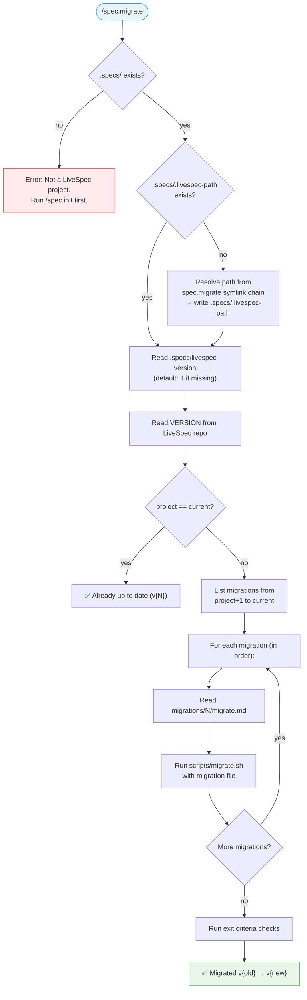

# LiveSpec Migration System Implementation Plan

> **For agentic workers:** REQUIRED SUB-SKILL: Use superpowers:subagent-driven-development (recommended) or superpowers:executing-plans to implement this plan task-by-task. Steps use checkbox (`- [ ]`) syntax for tracking.

**Goal:** Add versioning, local command distribution, and a migration framework to LiveSpec so commands are only available in projects where LiveSpec is initialized.

**Architecture:** Shell scripts (`link-local.sh`, `migrate.sh`) handle deterministic symlink creation and DSL execution. A `VERSION` file at repo root tracks the current version. Each project stores its version in `.specs/livespec-version`. The `spec.migrate` command bridges the gap for existing projects.

**Tech Stack:** Shell scripts (bash), Markdown command specs

**Design spec:** `docs/superpowers/specs/2026-04-08-migration-system-design.md`

---

## File Structure

### New Files
| File | Responsibility |
|------|---------------|
| `VERSION` | Single integer — current LiveSpec version (starts at 2) |
| `scripts/link-local.sh` | Create all command/agent symlinks in a target project's `.claude/` |
| `scripts/migrate.sh` | Parse and execute migration DSL files |
| `migrations/2/migrate.md` | First migration: global → local distribution |
| `commands/migrate.md` | `spec.migrate` command specification |

### Modified Files
| File | Change |
|------|--------|
| `commands/init.md` | Add Step 3.12 (local symlinks) + exit criteria + CLAUDE.md template update |
| `system/spec-system.md` | Version check preamble + command roster update |
| `README.md` | Reflect new distribution model, add spec.migrate |

### Deleted Files
| File | Reason |
|------|--------|
| `.claude/skills/link/SKILL.md` | Replaced by `scripts/link-local.sh` |
| `.claude/rules/commands-agents-must-be-linked.md` | No longer applicable |

### External Changes (not in repo)
| Target | Change |
|--------|--------|
| `~/.claude/commands/spec.*.md` (17 symlinks) | Remove global symlinks |
| `~/.claude/agents/livespec-*.md` (4 symlinks) | Remove global symlinks |
| `~/.claude/commands/spec.migrate.md` | Create new global symlink |

---

## Task 1: VERSION file and migrations directory

**Files:**
- Create: `VERSION`
- Create: `migrations/2/migrate.md`

- [ ] **Step 1: Create VERSION file**

```
2
```

Write single integer `2` to `VERSION` at repo root. No trailing newline beyond what the editor adds.

- [ ] **Step 2: Create migrations directory and first migration**

Create `migrations/2/migrate.md`:

```markdown
---
version: 2
description: "Transition from global to local command distribution"
date: 2026-04-08
---

# Migration v2: Local Command Distribution

Moves all spec.* commands and livespec-* agents from global ~/.claude/
to project-local .claude/ directories via symlinks.

## Actions

MKDIR .claude/commands
MKDIR .claude/agents
RUN link-local.sh
GITIGNORE .claude/commands/spec.*.md
GITIGNORE .claude/agents/livespec-*.md
GITIGNORE .specs/.livespec-path
SET_VERSION 2
```

- [ ] **Step 3: Verify files exist**

Run: `cat VERSION && echo "---" && cat migrations/2/migrate.md`
Expected: VERSION contains `2`, migration file has frontmatter + DSL actions.

- [ ] **Step 4: Commit**

```bash
git add VERSION migrations/2/migrate.md
git commit -m "feat: add VERSION file and first migration (v2)"
```

---

## Task 2: `scripts/link-local.sh`

**Files:**
- Create: `scripts/link-local.sh`

- [ ] **Step 1: Write the script**

```bash
#!/usr/bin/env bash
set -euo pipefail
shopt -s nullglob

# link-local.sh — Create LiveSpec command/agent symlinks in a project's .claude/ directory
#
# Usage: link-local.sh <project-dir> <livespec-dir>
#
# Creates symlinks:
#   .claude/commands/spec.<name>.md → <livespec-dir>/commands/<name>.md
#   .claude/agents/<name>.md        → <livespec-dir>/agents/<name>.md
#
# Excludes: init.md and migrate.md (these stay global only)

PROJECT_DIR="${1:?Usage: link-local.sh <project-dir> <livespec-dir>}"
LIVESPEC_DIR="${2:?Usage: link-local.sh <project-dir> <livespec-dir>}"

# Resolve to absolute paths
PROJECT_DIR="$(cd "$PROJECT_DIR" && pwd)"
LIVESPEC_DIR="$(cd "$LIVESPEC_DIR" && pwd)"

# Verify directories exist
if [[ ! -d "$LIVESPEC_DIR/commands" ]]; then
  echo "ERROR: $LIVESPEC_DIR/commands does not exist" >&2
  exit 1
fi

# Create target directories
mkdir -p "$PROJECT_DIR/.claude/commands"
mkdir -p "$PROJECT_DIR/.claude/agents"

# Counters
cmd_count=0
agent_count=0
errors=0

# Link commands (exclude init.md and migrate.md)
for src in "$LIVESPEC_DIR"/commands/*.md; do
  name="$(basename "$src" .md)"
  # Skip init and migrate — they stay global
  if [[ "$name" == "init" || "$name" == "migrate" ]]; then
    continue
  fi
  dest="$PROJECT_DIR/.claude/commands/spec.${name}.md"
  ln -sf "$src" "$dest"
  cmd_count=$((cmd_count + 1))
done

# Link agents
for src in "$LIVESPEC_DIR"/agents/*.md; do
  name="$(basename "$src")"
  dest="$PROJECT_DIR/.claude/agents/${name}"
  ln -sf "$src" "$dest"
  agent_count=$((agent_count + 1))
done

# Validate all symlinks resolve
for link in "$PROJECT_DIR"/.claude/commands/spec.*.md; do
  if [[ ! -e "$link" ]]; then
    echo "ERROR: broken symlink: $link → $(readlink "$link")" >&2
    errors=$((errors + 1))
  fi
done
for link in "$PROJECT_DIR"/.claude/agents/livespec-*.md; do
  if [[ ! -e "$link" ]]; then
    echo "ERROR: broken symlink: $link → $(readlink "$link")" >&2
    errors=$((errors + 1))
  fi
done

if [[ $errors -gt 0 ]]; then
  echo "FAILED: $errors broken symlink(s)" >&2
  exit 1
fi

echo "Linked $cmd_count commands and $agent_count agents"
exit 0
```

- [ ] **Step 2: Make executable**

Run: `chmod +x scripts/link-local.sh`

- [ ] **Step 3: Test in a temp directory**

Run:
```bash
tmpdir=$(mktemp -d)
mkdir -p "$tmpdir/.specs"
bash scripts/link-local.sh "$tmpdir" "$(pwd)"
echo "Commands:" && ls -la "$tmpdir/.claude/commands/" | grep spec
echo "Agents:" && ls -la "$tmpdir/.claude/agents/" | grep livespec
rm -rf "$tmpdir"
```

Expected: 17 command symlinks (no spec.init.md, no spec.migrate.md), 4 agent symlinks, all resolving to real files.

- [ ] **Step 4: Commit**

```bash
git add scripts/link-local.sh
git commit -m "feat: add link-local.sh for project-local symlinks"
```

---

## Task 3: `scripts/migrate.sh`

**Files:**
- Create: `scripts/migrate.sh`

- [ ] **Step 1: Write the DSL interpreter**

```bash
#!/usr/bin/env bash
set -euo pipefail

# migrate.sh — Parse and execute LiveSpec migration DSL
#
# Usage: migrate.sh <migration-file> <project-dir> <livespec-dir>
#
# DSL verbs: MKDIR, SYMLINK, COPY, DELETE, RUN, GITIGNORE, SET_VERSION
# Lines starting with # are comments. Empty lines are ignored.
# Frontmatter (--- blocks) is skipped.

MIGRATION_FILE="${1:?Usage: migrate.sh <migration-file> <project-dir> <livespec-dir>}"
PROJECT_DIR="${2:?Usage: migrate.sh <migration-file> <project-dir> <livespec-dir>}"
LIVESPEC_DIR="${3:?Usage: migrate.sh <migration-file> <project-dir> <livespec-dir>}"

# Resolve to absolute paths
PROJECT_DIR="$(cd "$PROJECT_DIR" && pwd)"
LIVESPEC_DIR="$(cd "$LIVESPEC_DIR" && pwd)"

if [[ ! -f "$MIGRATION_FILE" ]]; then
  echo "ERROR: Migration file not found: $MIGRATION_FILE" >&2
  exit 1
fi

in_frontmatter=false
frontmatter_count=0
line_num=0

while IFS= read -r line || [[ -n "$line" ]]; do
  line_num=$((line_num + 1))

  # Handle frontmatter
  if [[ "$line" == "---" ]]; then
    frontmatter_count=$((frontmatter_count + 1))
    if [[ $frontmatter_count -eq 1 ]]; then
      in_frontmatter=true
      continue
    elif [[ $frontmatter_count -eq 2 ]]; then
      in_frontmatter=false
      continue
    fi
  fi
  if [[ "$in_frontmatter" == true ]]; then
    continue
  fi

  # Skip empty lines and comments
  [[ -z "$line" ]] && continue
  [[ "$line" =~ ^[[:space:]]*# ]] && continue
  # Skip markdown headers and prose (non-DSL lines)
  [[ "$line" =~ ^[[:space:]]*[a-z] ]] && continue

  # Parse verb and arguments
  verb="${line%% *}"
  args="${line#* }"

  case "$verb" in
    MKDIR)
      mkdir -p "$PROJECT_DIR/$args"
      echo "  ✓ MKDIR $args"
      ;;
    SYMLINK)
      src="${args%% *}"
      dest="${args#* }"
      mkdir -p "$(dirname "$PROJECT_DIR/$dest")"
      ln -sf "$LIVESPEC_DIR/$src" "$PROJECT_DIR/$dest"
      echo "  ✓ SYMLINK $src → $dest"
      ;;
    COPY)
      src="${args%% *}"
      dest="${args#* }"
      mkdir -p "$(dirname "$PROJECT_DIR/$dest")"
      cp -f "$LIVESPEC_DIR/$src" "$PROJECT_DIR/$dest"
      echo "  ✓ COPY $src → $dest"
      ;;
    DELETE)
      if [[ -e "$PROJECT_DIR/$args" ]]; then
        rm -rf "$PROJECT_DIR/$args"
        echo "  ✓ DELETE $args"
      else
        echo "  ✓ DELETE $args (already absent)"
      fi
      ;;
    RUN)
      script="${args%% *}"
      script_args="${args#* }"
      if [[ "$script_args" == "$script" ]]; then
        script_args=""
      fi
      echo "  ▸ RUN $script $script_args"
      "$LIVESPEC_DIR/scripts/$script" "$PROJECT_DIR" "$LIVESPEC_DIR" $script_args
      echo "  ✓ RUN $script complete"
      ;;
    GITIGNORE)
      pattern="$args"
      gitignore="$PROJECT_DIR/.gitignore"
      if [[ ! -f "$gitignore" ]]; then
        echo "$pattern" > "$gitignore"
        echo "  ✓ GITIGNORE $pattern (created .gitignore)"
      elif ! grep -qxF "$pattern" "$gitignore"; then
        echo "$pattern" >> "$gitignore"
        echo "  ✓ GITIGNORE $pattern"
      else
        echo "  ✓ GITIGNORE $pattern (already present)"
      fi
      ;;
    SET_VERSION)
      echo "$args" > "$PROJECT_DIR/.specs/livespec-version"
      echo "  ✓ SET_VERSION $args"
      ;;
    *)
      echo "ERROR: Unknown verb '$verb' at line $line_num: $line" >&2
      exit 1
      ;;
  esac
done < "$MIGRATION_FILE"

echo "Migration complete."
exit 0
```

- [ ] **Step 2: Make executable**

Run: `chmod +x scripts/migrate.sh`

- [ ] **Step 3: Test with the v2 migration in a temp directory**

Run:
```bash
tmpdir=$(mktemp -d)
mkdir -p "$tmpdir/.specs"
touch "$tmpdir/.gitignore"
bash scripts/migrate.sh migrations/2/migrate.md "$tmpdir" "$(pwd)"
echo "--- Validation ---"
echo "Version: $(cat "$tmpdir/.specs/livespec-version")"
echo "Commands: $(ls "$tmpdir/.claude/commands/" | wc -l | tr -d ' ')"
echo "Agents: $(ls "$tmpdir/.claude/agents/" | wc -l | tr -d ' ')"
echo "Gitignore entries:"
grep -c "spec\|livespec\|livespec-path" "$tmpdir/.gitignore"
rm -rf "$tmpdir"
```

Expected: Version = 2, 17 commands, 4 agents, 3 gitignore entries.

- [ ] **Step 4: Commit**

```bash
git add scripts/migrate.sh
git commit -m "feat: add migrate.sh DSL interpreter"
```

---

## Task 4: `commands/migrate.md`

**Files:**
- Create: `commands/migrate.md`

- [ ] **Step 1: Write the spec.migrate command**

```markdown
---
description: "Upgrade a LiveSpec project to the latest version by running pending migrations"
---

# Command: /spec.migrate

> Upgrade a LiveSpec project to the latest version by applying pending migrations sequentially.

---

## Overview

`/spec.migrate` compares the project's LiveSpec version against the current repo version and applies all pending migrations in order.



---

## Prerequisite

- `.specs/` directory must exist (project must have been initialized with `/spec.init`)

---

## Execution Flow

### Step 1 — Resolve LiveSpec repo path

1. Read `.specs/.livespec-path`
2. If missing: resolve from this command's own symlink chain:
   - `readlink ~/.claude/commands/spec.migrate.md` → `/path/to/livespec/commands/migrate.md`
   - Strip `commands/migrate.md` → `/path/to/livespec`
   - Write to `.specs/.livespec-path`
3. Verify the resolved path contains a `VERSION` file

### Step 2 — Compare versions

1. Read `.specs/livespec-version` — if missing, assume `1`
2. Read `VERSION` from the LiveSpec repo
3. If equal → display `✅ Already up to date (v{N})` and exit
4. If project > repo → display error: "Project version (v{P}) is newer than repo (v{R}). This should not happen."

### Step 3 — Apply migrations

For each version N from `project_version + 1` to `repo_version`:
1. Check `migrations/N/migrate.md` exists
2. Display: `Applying migration vN: {description from frontmatter}`
3. Execute: `bash scripts/migrate.sh migrations/N/migrate.md <project-dir> <livespec-dir>`
4. If script exits non-zero → stop and report error

### Step 4 — Validate

After all migrations complete:
- [ ] All command symlinks in `.claude/commands/` exist and resolve
- [ ] All agent symlinks in `.claude/agents/` exist and resolve
- [ ] `.specs/livespec-version` matches `VERSION` from repo
- [ ] No orphaned symlinks (from commands removed in newer versions)

### Step 5 — Report

Display migration summary:

```
🔄 LiveSpec migration: v{old} → v{new}

Applying migration v{N}: {description}
  ✓ MKDIR ...
  ✓ RUN ...
  ...

Validation:
  ✓ {N} command symlinks valid
  ✓ {N} agent symlinks valid
  ✓ .specs/livespec-version = {new}

✅ Migration complete: v{old} → v{new}
```

---

## Flags

| Flag | Behavior |
|------|----------|
| `--dry-run` | Show what migrations would run and which DSL actions they contain, without executing |
| `--force` | Re-run all migrations from v1 regardless of current project version. Useful when LiveSpec repo path changed (symlinks broken). |

---

## Edge Cases

### LiveSpec repo moved
If `.specs/.livespec-path` points to a non-existent directory:
1. Resolve the new path from the symlink chain (Step 1)
2. Update `.specs/.livespec-path`
3. Run `--force` to recreate all symlinks

### Missing migration file
If `migrations/N/migrate.md` does not exist for a version in the range:
- Display warning: `⚠️ No migration file for vN — skipping`
- Continue to next version

### Partial migration
If a previous migration failed mid-execution:
- Re-running `spec.migrate` is safe (all DSL verbs are idempotent)
- `SET_VERSION` is always the last action — version only bumps on full success

---

*LiveSpec Command v1.0*
```

- [ ] **Step 2: Verify file exists and is valid markdown**

Run: `head -5 commands/migrate.md && echo "..." && wc -l commands/migrate.md`

- [ ] **Step 3: Commit**

```bash
git add commands/migrate.md
git commit -m "feat: add spec.migrate command"
```

---

## Task 5: Modify `commands/init.md`

**Files:**
- Modify: `commands/init.md:735-752` (Step 3.11 CLAUDE.md template)
- Modify: `commands/init.md:924-946` (Exit Criteria)
- Add: New Step 3.12 after Step 3.11

- [ ] **Step 1: Add `/spec.migrate` to CLAUDE.md command list template**

In `commands/init.md`, find the command list at line 751 and add `/spec.migrate`:

```
Commands: `/spec.init` · `/spec.migrate` · `/spec.propose` · `/spec.specify` · `/spec.plan` · `/spec.implement` · `/spec.test` · `/spec.check` · `/spec.fix` · `/spec.explain` · `/spec.stack` · `/spec.feature` · `/spec.ship` · `/spec.refine` · `/spec.preflight` · `/spec.hooks` · `/spec.play-coverage` · `/spec.status` · `/spec.refresh-conventions`
```

- [ ] **Step 2: Add Step 3.12 — Install Local Commands and Agents**

Insert after the end of Step 3.11 section (after "This keeps the CLAUDE.md lean..." at line 755), before Phase D:

```markdown
### Step 3.12 — Install Local Commands and Agents

After installing the CLAUDE.md section, create local symlinks for all LiveSpec commands and agents in the project's `.claude/` directory:

1. **Resolve LiveSpec repo path:** Follow the symlink chain of the currently executing `spec.init` command (`readlink` on `~/.claude/commands/spec.init.md`) → extract the repo root by stripping `commands/init.md`
2. **Write path discovery file:** Write the resolved path to `.specs/.livespec-path`
3. **Create directories:** `mkdir -p .claude/commands .claude/agents`
4. **Run link script:** Execute `bash <livespec-dir>/scripts/link-local.sh <project-dir> <livespec-dir>`
5. **Write version:** Read `VERSION` from the LiveSpec repo, write to `.specs/livespec-version`
6. **Update .gitignore:** Add the following patterns (if not already present):
   - `.claude/commands/spec.*.md`
   - `.claude/agents/livespec-*.md`
   - `.specs/.livespec-path`

**Output:**
> Installed 17 spec commands and 4 agents as local symlinks in `.claude/`
```

- [ ] **Step 3: Add exit criteria for symlinks**

Append to the Exit Criteria section (after line 944), before the "If any check fails" line:

```markdown
- [ ] `.claude/commands/` exists with symlinks for all spec.* commands (except init/migrate)
- [ ] `.claude/agents/` exists with symlinks for all livespec-* agents
- [ ] All symlinks resolve to existing files (no broken links)
- [ ] `.specs/livespec-version` exists and matches `VERSION` from LiveSpec repo
- [ ] `.specs/.livespec-path` exists and points to a valid LiveSpec repo directory
- [ ] `.gitignore` contains `.claude/commands/spec.*.md`, `.claude/agents/livespec-*.md`, `.specs/.livespec-path`
```

- [ ] **Step 4: Update installation output**

In the success message block (around line 829), add after the `.conventions/conventions.md` line:

```markdown
> - `.claude/commands/` — 17 spec commands (local symlinks)
> - `.claude/agents/` — 4 LiveSpec agents (local symlinks)
> - `.specs/livespec-version` — version tracking (v{N})
```

- [ ] **Step 5: Verify init.md is valid**

Run: `grep -n "Step 3.12\|livespec-version\|link-local\|spec.migrate" commands/init.md`
Expected: Step 3.12 section present, livespec-version in exit criteria, link-local.sh referenced, spec.migrate in CLAUDE.md template.

- [ ] **Step 6: Commit**

```bash
git add commands/init.md
git commit -m "feat(init): add Step 3.12 local symlinks + exit criteria + migrate in CLAUDE.md"
```

---

## Task 6: Modify `system/spec-system.md`

**Files:**
- Modify: `system/spec-system.md:299-301` (Command discovery)
- Add: Version check preamble before line 299

- [ ] **Step 1: Add version check preamble**

Insert before the "### Command discovery" section (before line 299):

```markdown
### Version Check (ADVISORY)

Before executing any `/spec.*` command (except `/spec.init` and `/spec.migrate`):

1. Read `.specs/livespec-version` — if missing, assume v1
2. Resolve the LiveSpec repo path from `.specs/.livespec-path` (if missing, resolve from command symlink chain)
3. Read `VERSION` from the LiveSpec repo
4. If project version < repo version, display:

> ⚠️ This project uses LiveSpec v{project}. Current version is v{repo}.
> Run `/spec.migrate` to update.

This check is **non-blocking** — the command continues normally after the warning.

```

- [ ] **Step 2: Update command discovery paragraph**

Replace the existing line 301:

```
Detailed step-by-step instructions for each `/spec.*` command are installed globally via `bash scripts/install.sh` (symlinked to `~/.claude/commands/spec.*.md`). The 18 available commands are: `/spec.init`, `/spec.propose`, `/spec.specify`, `/spec.plan`, `/spec.implement`, `/spec.test`, `/spec.check`, `/spec.fix`, `/spec.explain`, `/spec.stack`, `/spec.feature`, `/spec.ship`, `/spec.preflight`, `/spec.hooks`, `/spec.play-coverage`, `/spec.refine`, `/spec.status`, `/spec.refresh-conventions`.
```

With:

```
Detailed step-by-step instructions for each `/spec.*` command are symlinked into `.claude/commands/` of each project via `scripts/link-local.sh`. Only `/spec.init` and `/spec.migrate` remain global (`~/.claude/commands/`). The 19 available commands are: `/spec.init`, `/spec.migrate`, `/spec.propose`, `/spec.specify`, `/spec.plan`, `/spec.implement`, `/spec.test`, `/spec.check`, `/spec.fix`, `/spec.explain`, `/spec.stack`, `/spec.feature`, `/spec.ship`, `/spec.preflight`, `/spec.hooks`, `/spec.play-coverage`, `/spec.refine`, `/spec.status`, `/spec.refresh-conventions`.
```

- [ ] **Step 3: Verify changes**

Run: `grep -n "Version Check\|spec.migrate\|link-local\|19 available" system/spec-system.md`
Expected: Version Check section, spec.migrate in command list, link-local.sh reference, "19 available commands".

- [ ] **Step 4: Commit**

```bash
git add system/spec-system.md
git commit -m "feat(spec-system): add version check preamble + update command roster to 19"
```

---

## Task 7: Delete obsolete files from LiveSpec repo

**Files:**
- Delete: `.claude/skills/link/SKILL.md`
- Delete: `.claude/rules/commands-agents-must-be-linked.md`

- [ ] **Step 1: Delete the /link skill**

Run: `rm -rf .claude/skills/link/`

Verify: `ls .claude/skills/` — should be empty or not contain `link/`.

- [ ] **Step 2: Delete the rule**

Run: `rm .claude/rules/commands-agents-must-be-linked.md`

Verify: `ls .claude/rules/` — should not contain `commands-agents-must-be-linked.md`.

- [ ] **Step 3: Add deprecation header to `scripts/install.sh`**

Prepend this comment block at the top of `scripts/install.sh` (after the shebang line):

```bash
# ⚠️ DEPRECATED — Replaced by scripts/link-local.sh for local installs.
# This script installed commands globally to ~/.claude/. LiveSpec v2+ uses
# project-local symlinks in .claude/ instead. Use /spec.init (new projects)
# or /spec.migrate (existing projects).
# Kept for reference only.
```

- [ ] **Step 4: Commit**

```bash
git add -u .claude/
git add scripts/install.sh
git commit -m "chore: remove /link skill and rule, deprecate install.sh"
```

---

## Task 8: Remove global symlinks and create spec.migrate global symlink

> **Note:** These are external changes (not in the repo). No git commit needed.

**Files:**
- Delete: `~/.claude/commands/spec.check.md` (and 16 others)
- Delete: `~/.claude/agents/livespec-*.md` (4 files)
- Create: `~/.claude/commands/spec.migrate.md` (symlink)

- [ ] **Step 1: Remove global command symlinks (17 — all except init)**

```bash
rm -f ~/.claude/commands/spec.check.md
rm -f ~/.claude/commands/spec.explain.md
rm -f ~/.claude/commands/spec.feature.md
rm -f ~/.claude/commands/spec.fix.md
rm -f ~/.claude/commands/spec.hooks.md
rm -f ~/.claude/commands/spec.implement.md
rm -f ~/.claude/commands/spec.plan.md
rm -f ~/.claude/commands/spec.play-coverage.md
rm -f ~/.claude/commands/spec.preflight.md
rm -f ~/.claude/commands/spec.propose.md
rm -f ~/.claude/commands/spec.refine.md
rm -f ~/.claude/commands/spec.refresh-conventions.md
rm -f ~/.claude/commands/spec.ship.md
rm -f ~/.claude/commands/spec.specify.md
rm -f ~/.claude/commands/spec.stack.md
rm -f ~/.claude/commands/spec.status.md
rm -f ~/.claude/commands/spec.test.md
```

- [ ] **Step 2: Remove global agent symlinks (4)**

```bash
rm -f ~/.claude/agents/livespec-documenter.md
rm -f ~/.claude/agents/livespec-implementer.md
rm -f ~/.claude/agents/livespec-supervisor.md
rm -f ~/.claude/agents/livespec-verifier.md
```

- [ ] **Step 3: Create spec.migrate global symlink**

```bash
ln -sf ~/projects/livespec/commands/migrate.md ~/.claude/commands/spec.migrate.md
```

- [ ] **Step 4: Verify global state**

Run:
```bash
echo "Global spec commands:"
ls ~/.claude/commands/spec.*.md 2>/dev/null
echo "Global agents:"
ls ~/.claude/agents/livespec-*.md 2>/dev/null
```

Expected: Only `spec.init.md` and `spec.migrate.md` in commands. No livespec agents.

---

## Task 9: Update README.md

**Files:**
- Modify: `README.md:62` (command table — add spec.migrate)
- Modify: `README.md:364-374` (Installation section)
- Modify: `README.md:397-408` (Portability section)

- [ ] **Step 1: Add spec.migrate to the command table**

After the `/spec.init` row (line 66), add:

```markdown
| `/spec.migrate` | Upgrade project to latest LiveSpec version — applies pending migrations, updates local symlinks |
```

Update the section header from "## The 18 Commands" to "## The 19 Commands".

- [ ] **Step 2: Update the Installation section**

Replace lines 364-374:

```markdown
## Installation

### Global (required once)

```bash
# Create global symlinks for spec.init and spec.migrate
ln -sf ~/projects/livespec/commands/init.md ~/.claude/commands/spec.init.md
ln -sf ~/projects/livespec/commands/migrate.md ~/.claude/commands/spec.migrate.md
```

### Per-project (automatic)

When you run `/spec.init` in a project, LiveSpec automatically creates local symlinks in `.claude/commands/` and `.claude/agents/`. No manual installation needed.

For existing projects initialized before v2, run `/spec.migrate` to add local symlinks.
```

- [ ] **Step 3: Update Portability table**

Replace the Commands row in the Portability table:

```markdown
| **Commands** (`/spec.*`) | ⚠️ Claude Code | Symlinked to `.claude/commands/` per project via `link-local.sh` — Claude Code specific |
```

- [ ] **Step 4: Verify README changes**

Run: `grep -n "19 Commands\|spec.migrate\|link-local\|Per-project" README.md`
Expected: "19 Commands" header, spec.migrate in table, link-local reference, per-project section.

- [ ] **Step 5: Commit**

```bash
git add README.md
git commit -m "docs: update README for local distribution model and spec.migrate"
```

---

## Task 10: End-to-end validation

- [ ] **Step 1: Verify LiveSpec repo state**

Run:
```bash
echo "=== VERSION ==="
cat VERSION
echo "=== Migration files ==="
ls migrations/*/migrate.md
echo "=== Scripts ==="
ls -la scripts/link-local.sh scripts/migrate.sh
echo "=== New command ==="
ls commands/migrate.md
echo "=== Deleted files ==="
test -f .claude/skills/link/SKILL.md && echo "FAIL: link skill still exists" || echo "OK: link skill removed"
test -f .claude/rules/commands-agents-must-be-linked.md && echo "FAIL: rule still exists" || echo "OK: rule removed"
```

- [ ] **Step 2: Verify global symlinks**

Run:
```bash
echo "=== Global commands (should be init + migrate only) ==="
ls ~/.claude/commands/spec.*.md
echo "=== Global agents (should be empty) ==="
ls ~/.claude/agents/livespec-*.md 2>/dev/null || echo "OK: no global agents"
echo "=== Symlink targets ==="
readlink ~/.claude/commands/spec.init.md
readlink ~/.claude/commands/spec.migrate.md
```

- [ ] **Step 3: Test full migration flow in temp directory**

Run:
```bash
tmpdir=$(mktemp -d)
mkdir -p "$tmpdir/.specs"
touch "$tmpdir/.gitignore"
# Simulate a v1 project (no livespec-version file)
echo "=== Running migrate.sh ==="
bash scripts/migrate.sh migrations/2/migrate.md "$tmpdir" "$(pwd)"
echo "=== Result ==="
echo "Version: $(cat "$tmpdir/.specs/livespec-version")"
echo "Command count: $(ls "$tmpdir/.claude/commands/spec.*.md" | wc -l | tr -d ' ')"
echo "Agent count: $(ls "$tmpdir/.claude/agents/livespec-*.md" | wc -l | tr -d ' ')"
echo "Gitignore entries:"
cat "$tmpdir/.gitignore"
rm -rf "$tmpdir"
```

Expected: Version 2, 17 commands, 4 agents, 3 gitignore patterns.

- [ ] **Step 4: Verify idempotency — run migration twice**

Run:
```bash
tmpdir=$(mktemp -d)
mkdir -p "$tmpdir/.specs"
touch "$tmpdir/.gitignore"
bash scripts/migrate.sh migrations/2/migrate.md "$tmpdir" "$(pwd)"
echo "=== Second run (should be idempotent) ==="
bash scripts/migrate.sh migrations/2/migrate.md "$tmpdir" "$(pwd)"
echo "Version: $(cat "$tmpdir/.specs/livespec-version")"
echo "Gitignore lines: $(wc -l < "$tmpdir/.gitignore" | tr -d ' ')"
rm -rf "$tmpdir"
```

Expected: Second run succeeds, version still 2, gitignore has exactly 3 lines (no duplicates).
