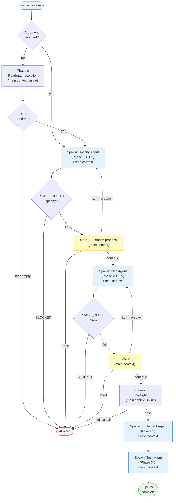

# Supervisor Pattern for spec.feature — Implementation Plan

> **For agentic workers:** REQUIRED SUB-SKILL: Use superpowers:subagent-driven-development (recommended) or superpowers:executing-plans to implement this plan task-by-task. Steps use checkbox (`- [ ]`) syntax for tracking.

**Goal:** Rewrite `commands/spec-feature.md` so each pipeline phase (specify, plan, implement, test) runs as an isolated subagent, reducing main context from ~167k to ~5-15k tokens per feature.

**Architecture:** The main context becomes a pure supervisor: it spawns phase agents, receives compact PHASE_RESULT blocks, handles user gates, and orchestrates the pipeline state. Phase agents get a fresh context window per phase. This mirrors the pattern already used by `spec.ship` for feature-level isolation.

**Tech Stack:** Markdown instruction file only — no code files, no tests, no build step. Verification is done by reading the modified file and cross-checking against the spec.

**Branch:** `feature/supervisor-pattern` (already created)

**Design spec:** `docs/superpowers/specs/2026-04-10-supervisor-pattern-spec-feature-design.md`

---

## Blocker resolutions (addressed in plan below)

**A — Schema ordering:** PHASE_RESULT schemas are defined in Task 2, before any phase section references them (Tasks 5–11).

**B — Feature-name propagation:** Every phase agent prompt explicitly receives `feature_name: NNN-feature-name` as a named field. This is mandated in the Agent Contract (Task 3) and repeated in each phase task.

**C — Resume state envelope:** Task 12 defines exactly what state travels to the resumed phase agent (feature_name, feature_description, active_flags). The `pipeline.md` template (State Tracking section) is extended with a `Feature Description` field so resume can recover it without re-asking the user.

**D — SCOPE-absent fallback:** Task 8 (Branch Proposal) defines explicit behavior when `SCOPE` is missing from PHASE_RESULT: default to "propose branch" (safe default — user can say no).

---

## File Map

| File | Action | What changes |
|---|---|---|
| `commands/spec-feature.md` | **Modify** | Flags table; Agent Architecture + Agent Contract; PHASE_RESULT schemas; Phase 1–3.5 rewritten; Branch Proposal moved to main context; State Tracking extended; Resume updated |
| `docs/superpowers/specs/2026-04-10-supervisor-pattern-spec-feature-design.md` | **Commit** (already written) | Design doc |

---

## Task 1: Commit the design doc

**Files:**
- Commit: `docs/superpowers/specs/2026-04-10-supervisor-pattern-spec-feature-design.md`

- [ ] **Step 1: Stage and commit the design doc**

```bash
git -C /Users/julienm/projects/livespec add docs/superpowers/specs/2026-04-10-supervisor-pattern-spec-feature-design.md
git -C /Users/julienm/projects/livespec commit -m "docs: add supervisor pattern design spec for spec.feature context isolation"
```

Expected: commit succeeds on branch `feature/supervisor-pattern`

---

## Task 2: Add PHASE_RESULT Schemas section (FIRST — schemas before any phase section)

**Files:**
- Modify: `commands/spec-feature.md` — insert new section immediately after the frontmatter + overview block, before the Flags section

**Why first:** Phases 1–3.5 reference schema field names (SCOPE, FINDINGS_DETAIL, etc.). Schemas must be defined before those sections are written.

- [ ] **Step 1: Insert PHASE_RESULT Schemas section**

Insert after the overview mermaid block, before `## Flags`:

```markdown
## PHASE_RESULT Schemas

Each phase agent **must** output a PHASE_RESULT block as its **last output**. The main context parses these fields to drive gates, branch proposals, and pipeline state updates. Field names are exact — no deviation.

### Universal Agent Contract

Every phase agent prompt receives these named fields:

```
feature_name: NNN-feature-name          ← exact slug, e.g. 004-notifications
feature_dir:  .specs/features/NNN-feature-name/
feature_description: <original feature description text>
active_flags: --auto --mono (etc.)
conventions: <full content of .conventions/conventions.md, or NONE if file absent>
```

The agent uses `feature_name` for all `livespec pipeline update` CLI calls.
The agent uses `conventions` content directly — it does NOT read the file itself.

### Specify agent schema

```
PHASE_RESULT: OK | BLOCKED
PHASE: specify
FEATURE: NNN-feature-name
SPEC_PATH: .specs/features/NNN-feature-name/spec.md
SCOPE: S | M | L
FR_COUNT: N
REVIEW: PASS | FINDINGS
FINDINGS_COUNT: N BLOCKING, N WARNING, N INFO
FINDINGS_DETAIL:
  [verbatim verifier findings table — omit entire field if REVIEW: PASS]
SUMMARY: 2-3 sentences describing what the spec covers
```

### Plan agent schema

```
PHASE_RESULT: OK | BLOCKED
PHASE: plan
FEATURE: NNN-feature-name
PLAN_PATH: .specs/features/NNN-feature-name/plan.md
STEPS_COUNT: N
REVIEW: PASS | FINDINGS
FINDINGS_COUNT: N BLOCKING, N WARNING, N INFO
FINDINGS_DETAIL:
  [verbatim verifier findings table — omit entire field if REVIEW: PASS]
SUMMARY: 2-3 sentences describing the implementation approach
```

### Implement agent schema

```
PHASE_RESULT: OK | BLOCKED
PHASE: implement
FEATURE: NNN-feature-name
FILES_CHANGED: N
STEPS_DONE: N/total
TESTS: N passed, N failed
BLOCKED_REASON: one line (only if BLOCKED)
SUMMARY: 2-3 sentences of what was implemented
```

### Test agent schema

```
PHASE_RESULT: OK | BLOCKED
PHASE: test
FEATURE: NNN-feature-name
AC_COVERAGE: N/total ACs covered
TESTS: N passed, N failed
BLOCKED_REASON: one line (only if BLOCKED)
SUMMARY: 2-3 sentences of test results
```

### PHASE_RESULT vs SHIP_RESULT

These are two distinct protocols at different scopes:
- **PHASE_RESULT** — internal inter-phase communication within a single `/spec.feature` run. Only the `spec.feature` main context reads it.
- **SHIP_RESULT** — output of the entire `/spec.feature` pipeline when called by `/spec.ship`. The ship orchestrator reads it. PHASE_RESULT blocks from phase agents are never visible to the ship orchestrator — they are consumed and discarded by the `spec.feature` main context. The SHIP_RESULT block is emitted at the very end by the main context after all phases complete.

**Phase 3.5 (Test) preservation rule:** Phase 3.5 emits a PHASE_RESULT for the main context AND preserves the existing `SHIP_RESULT: BLOCKED` output when AC failures are detected and the pipeline is called from `/spec.ship`. These are not mutually exclusive — PHASE_RESULT is consumed internally; SHIP_RESULT is the final external signal. Task 14 must explicitly preserve this dual output.

### FINDINGS_DETAIL injection mechanism (--auto retry)

When the main context re-spawns a phase agent in `--auto` mode due to review findings, `FINDINGS_DETAIL` is injected **directly into the agent prompt text**, appended after the base instructions:

```
[base agent prompt as defined in Phase 1 / Phase 2]

Additionally, address the following review findings in your regeneration:
<FINDINGS_DETAIL verbatim from prior PHASE_RESULT>
```

The agent receives this as part of its initial prompt — no file write, no parameter flag. The same mechanism applies in interactive mode when the user describes changes: the change description is appended the same way.
```

---

## Task 3: Add Agent Architecture + Agent Contract section

**Files:**
- Modify: `commands/spec-feature.md` — insert after the PHASE_RESULT Schemas section, before Flags

- [ ] **Step 1: Insert Agent Architecture section**

```markdown
## Agent Architecture (Supervisor Pattern)

`/spec.feature` is a **pure supervisor** — it does not execute phase logic itself. It spawns an isolated agent per phase, receives a compact `PHASE_RESULT` block, and handles gates and pipeline state.

```
spec.feature — Main Context (supervisor)
  │
  ├── [Phase 0]   Roadmap resolution (inline — user interaction)
  ├── [Phase 1]   Spawn → Specify Agent  (fresh context)
  │     └── Receives PHASE_RESULT (specify)
  ├── [Gate 1]    Display spec review findings + user decision (inline)
  ├── [Branch]    Propose/create branch (inline)
  ├── [Phase 2]   Spawn → Plan Agent  (fresh context)
  │     └── Receives PHASE_RESULT (plan)
  ├── [Gate 2]    Display plan review findings + user decision (inline)
  ├── [Phase 2.7] Preflight CLI call (inline — lightweight)
  ├── [Phase 3]   Spawn → Implement Agent  (fresh context)
  │     └── Receives PHASE_RESULT (implement)
  └── [Phase 3.5] Spawn → Test Agent  (fresh context)
        └── Receives PHASE_RESULT (test)
```

**What stays inline (main context):**
- Phase 0: roadmap read + user confirmation
- Gate 1 and Gate 2: display PHASE_RESULT findings, wait for user decision
- Branch proposal: `git checkout -b feature/NNN-name` call
- Phase 2.7: `livespec pipeline update` + `/spec.preflight --light` CLI calls
- All `livespec pipeline update --status in_progress` calls before spawning each agent
- Auto-commit sequence after Phase 3.5

**What runs in phase agents (isolated context):**
- All file reads (spec.md, plan.md, constitution.md, stack.md, conventions.md)
- All generation (spec, plan, implementation code)
- All tests and lint runs
- Verifier dispatches (spec review, plan review)
- Hook resolution (before/after at all 3 levels)
- `livespec pipeline update --status done` on success

**`--economy` disables this pattern:** all phases run inline in the main context (original behavior).

**Context budget:**
- Main context per phase cycle: ~200 tokens (PHASE_RESULT only)
- Total main context for full pipeline: ~5-15k
- Each phase agent: fresh context, 30-60k max
```

---

## Task 4: Update the Flags table

**Files:**
- Modify: `commands/spec-feature.md` — Flags section

- [ ] **Step 1: Replace the Flags table**

```markdown
| Flag | What it does |
|------|-------------|
| `--auto`, `-a` | Skip user gates. If spec or plan review returns findings → re-spawns the phase agent with `FINDINGS_DETAIL` injected into the prompt (max 2 retries each). Aborts if BLOCKING remain after 2 retries; proceeds if only WARNING/INFO remain. **Also commits automatically** at the end when audit + tests pass (see § Auto-Commit) |
| `--resume`, `-r` | Resume the pipeline where it stopped (reads `pipeline.md`, spawns the first non-Done phase agent with resume state envelope — see § Resume) |
| `--branch`, `-b` | Create a git branch `feature/NNN-name` immediately after spec review gate, no question asked |
| `--no-branch`, `-B` | Skip the branch proposal entirely |
| `--priority`, `-p` `P1\|P2\|P3` | Force all user stories in the spec to the given priority — passed to the Specify agent |
| `--mono`, `-m` | Single-agent mode for the **implement phase's internal orchestration** only (no Superpowers sub-dispatch within implement). Does **not** disable the feature-level supervisor pattern — Specify, Plan, Implement, and Test still run as separate agents. |
| `--economy`, `-e` | Disable **all** sub-agent dispatch: (1) feature-level supervisor — all phases run inline in the main context; (2) implement-level orchestration — no Superpowers sub-dispatch within implement. This preserves the exact pre-supervisor behavior end-to-end. Use for token-constrained environments. |
| `--step`, `-s` | Pause after each implementation step — passed to the Implement agent |
```

---

## Task 5: Extend the State Tracking section (add feature_description field)

**Files:**
- Modify: `commands/spec-feature.md` — State Tracking section, pipeline.md template

**Why:** Resume (blocker C) requires recovering `feature_description` without re-asking the user. It must be persisted in `pipeline.md`.

- [ ] **Step 1: Update the pipeline.md template**

Replace the existing template with:

```markdown
**Template:**

```markdown
# Pipeline — [Feature Name]

**Started:** YYYY-MM-DD HH:MM
**Flags:** `--auto --mono` (or `none`)
**Feature Description:** <original feature description text, verbatim>

| Phase | Status | Completed At |
|-------|--------|--------------|
| Specify | Pending | — |
| Spec Review | Pending | — |
| Plan | Pending | — |
| Plan Review | Pending | — |
| Preflight | Pending | — |
| Implement | Pending | — |
| Test | Pending | — |
```
```

> Note: The `Feature Description` field is written by Phase 0 (or taken from the CLI argument). It is used by `--resume` to reconstruct the agent prompt without re-asking the user.

---

## Task 6: Rewrite the Overview flowchart

**Files:**
- Modify: `commands/spec-feature.md` — overview mermaid diagram (lines 18–47)

- [ ] **Step 1: Replace the mermaid flowchart**



---

## Task 7: Rewrite Phase 0 — add pipeline.md init with feature_description

**Files:**
- Modify: `commands/spec-feature.md` — Phase 0 section

- [ ] **Step 1: Add pipeline.md init step to Phase 0**

After the existing Phase 0 logic (roadmap read + user confirmation), add:

```markdown
After confirming the feature:

4. Run: `livespec pipeline init --feature NNN-feature-name`
5. Write `Feature Description: <resolved description>` to the `pipeline.md` header field.
   This persists the description for `--resume` without re-asking the user.
```

---

## Task 8: Rewrite Phase 1 — Specify (supervisor dispatch)

**Files:**
- Modify: `commands/spec-feature.md` — Phase 1 section (currently lines 133–152)

- [ ] **Step 1: Replace Phase 1 section**

```markdown
## Phase 1 — Specify (Supervisor Dispatch)

> **Economy mode (`--economy`):** execute `commands/spec-specify.md` steps inline in the main context instead.

1. Run: `livespec pipeline update --feature NNN-feature-name --phase specify --status in_progress`

2. Assemble the **Universal Agent Context** (see § PHASE_RESULT Schemas — Universal Agent Contract):
   - `feature_name`: NNN-feature-name
   - `feature_dir`: .specs/features/NNN-feature-name/
   - `feature_description`: <from CLI argument or pipeline.md>
   - `active_flags`: --priority P1 (if provided), --auto (if provided)
   - `conventions`: read `.conventions/conventions.md` if it exists, else `NONE`

3. Spawn a **Specify agent** with the assembled context and these instructions:

   ```
   Execute the full specify pipeline from `commands/spec-specify.md`.

   [Universal Agent Context fields above]

   After generating the spec, execute Phase 1.5 (Spec Review) as defined in
   `commands/spec-feature.md § Phase 1.5`: dispatch the livespec-verifier agent in
   spec-review mode and collect its report.

   Output a PHASE_RESULT block as the LAST thing you output (Specify agent schema).
   Do not ask the user any questions — proceed autonomously.
   ```

4. Receive PHASE_RESULT. If `PHASE_RESULT: BLOCKED` → display error, set pipeline blocked, stop.

5. Run: `livespec pipeline update --feature NNN-feature-name --phase specify --status done --timestamp`
   (Only if PHASE_RESULT: OK)
```

---

## Task 9: Rewrite Phase 1.5 — Spec Review Gate (main context only)

**Files:**
- Modify: `commands/spec-feature.md` — Phase 1.5 section

- [ ] **Step 1: Replace Phase 1.5 section**

```markdown
## Phase 1.5 — Spec Review Gate (Main Context)

The Specify agent runs the spec review internally and returns findings in PHASE_RESULT.
The main context displays findings and handles the user decision.

**If `REVIEW: PASS`:** proceed to Branch Proposal (both modes).

In interactive mode, display:
> Phase 1 complete — Spec: `.specs/features/NNN-feature-name/spec.md`
> Spec review: **PASS** — no findings.
> Type **continue** or describe changes needed.

**If `REVIEW: FINDINGS`:**

Display gate with `FINDINGS_DETAIL` verbatim from PHASE_RESULT:
> Phase 1 complete — Spec: `.specs/features/NNN-feature-name/spec.md`
> ### Spec Review Findings
> [FINDINGS_DETAIL verbatim]
> N BLOCKING, N WARNING, N INFO finding(s).
> Type **continue**, describe changes, or **abort**.

**User options (interactive):**
1. **continue** → proceed to Branch Proposal
2. **describe changes** → re-spawn Specify agent with the change description and `FINDINGS_DETAIL` appended to the prompt
3. **abort** → stop pipeline

**`--auto` mode with FINDINGS:** re-spawn Specify agent with `FINDINGS_DETAIL` injected into the prompt (max 2 retries). If BLOCKING remain → abort. If only WARNING/INFO → proceed.

Run: `livespec pipeline update --feature NNN-feature-name --phase spec-review --status done --timestamp`
```

---

## Task 10: Add Branch Proposal section (after Gate 1, main context)

**Files:**
- Modify: `commands/spec-feature.md` — insert after Phase 1.5 gate section

- [ ] **Step 1: Add Branch Proposal section**

```markdown
## Branch Proposal (Main Context, after Gate 1)

After Gate 1 resolves (continue), determine whether a git branch is needed.
Use `SCOPE` and `FEATURE` from the Specify agent's PHASE_RESULT.

- **`--branch` provided:** Run `git checkout -b feature/NNN-name` immediately.
- **`--no-branch` provided:** Skip entirely.
- **Neither flag (default):**
  - `SCOPE: M` or `SCOPE: L` → propose branch
  - `SCOPE: S` → skip (no branch needed for small features)
  - **`SCOPE` field absent or malformed** → default to **propose** (safe default — user can decline)

> When proposing:
> [One sentence explaining why a branch is recommended for this feature.]
> Create branch `feature/NNN-name`? (yes / no)

Once branch is created or skipped, spawn the Plan agent.
```

---

## Task 11: Rewrite Phase 2 — Plan (supervisor dispatch)

**Files:**
- Modify: `commands/spec-feature.md` — Phase 2 section

- [ ] **Step 1: Replace Phase 2 section**

```markdown
## Phase 2 — Plan (Supervisor Dispatch)

> **Economy mode (`--economy`):** execute `commands/spec-plan.md` steps inline instead.

1. Run: `livespec pipeline update --feature NNN-feature-name --phase plan --status in_progress`

2. Assemble Universal Agent Context:
   - `feature_name`: NNN-feature-name
   - `feature_dir`: .specs/features/NNN-feature-name/
   - `feature_description`: <from pipeline.md>
   - `active_flags`: --auto (if provided)
   - `conventions`: content of `.conventions/conventions.md`, or `NONE`

3. Spawn a **Plan agent** with the assembled context and these instructions:

   ```
   Execute the full plan pipeline from `commands/spec-plan.md`.

   [Universal Agent Context fields above]

   After generating the plan, execute Phase 2.5 (Plan Review) as defined in
   `commands/spec-feature.md § Phase 2.5`: dispatch the livespec-verifier agent in
   plan-review mode and collect its report.

   Output a PHASE_RESULT block as the LAST thing you output (Plan agent schema).
   Do not ask the user any questions — proceed autonomously.
   ```

4. Receive PHASE_RESULT. If `PHASE_RESULT: BLOCKED` → display error, set pipeline blocked, stop.

5. Run: `livespec pipeline update --feature NNN-feature-name --phase plan --status done --timestamp`
   (Only if PHASE_RESULT: OK)
```

---

## Task 12: Rewrite Phase 2.5 — Plan Review Gate (main context)

**Files:**
- Modify: `commands/spec-feature.md` — Phase 2.5 section

- [ ] **Step 1: Replace Phase 2.5 section**

```markdown
## Phase 2.5 — Plan Review Gate (Main Context)

The Plan agent runs the plan review internally and returns findings in PHASE_RESULT.

**If `REVIEW: PASS`:** proceed to Phase 2.7 (both modes).

Interactive gate:
> Plan review passed — Plan: `.specs/features/NNN-feature-name/plan.md`
> Type **continue** or describe changes needed.

**If `REVIEW: FINDINGS`:**
> Plan review — `.specs/features/NNN-feature-name/plan.md`
> ### Plan Review Findings
> [FINDINGS_DETAIL verbatim]
> N BLOCKING, N WARNING, N INFO finding(s).
> Options: **continue** (override) / describe changes / **abort**

**`--auto` mode with FINDINGS:** re-spawn Plan agent with `FINDINGS_DETAIL` injected (max 2 retries). If BLOCKING remain → abort. If only WARNING/INFO → proceed.

Run: `livespec pipeline update --feature NNN-feature-name --phase plan-review --status done --timestamp`
```

---

## Task 13: Rewrite Phase 3 — Implement (supervisor dispatch)

**Files:**
- Modify: `commands/spec-feature.md` — Phase 3 section

- [ ] **Step 1: Replace Phase 3 section**

```markdown
## Phase 3 — Implement (Supervisor Dispatch)

> **Economy mode (`--economy`):** execute `commands/spec-implement.md` steps inline instead.

1. Run: `livespec pipeline update --feature NNN-feature-name --phase implement --status in_progress`

2. Assemble Universal Agent Context:
   - `feature_name`: NNN-feature-name
   - `feature_dir`: .specs/features/NNN-feature-name/
   - `feature_description`: <from pipeline.md>
   - `active_flags`: --mono (if provided), --step (if provided), --resume (if provided), --auto (if provided)
   - `conventions`: content of `.conventions/conventions.md`, or `NONE`

3. Spawn an **Implement agent** with the assembled context and these instructions:

   ```
   Execute the full implement pipeline from `commands/spec-implement.md`.

   [Universal Agent Context fields above]

   Output a PHASE_RESULT block as the LAST thing you output (Implement agent schema).
   Do not ask the user any questions — proceed autonomously.
   ```

4. Receive PHASE_RESULT. If `PHASE_RESULT: BLOCKED` → display error with `BLOCKED_REASON`, set pipeline blocked, stop.

5. Run: `livespec pipeline update --feature NNN-feature-name --phase implement --status done --timestamp`
   (Only if PHASE_RESULT: OK)
```

---

## Task 14: Rewrite Phase 3.5 — Test (supervisor dispatch)

**Files:**
- Modify: `commands/spec-feature.md` — Phase 3.5 section

- [ ] **Step 1: Replace Phase 3.5 section**

```markdown
## Phase 3.5 — Test (Supervisor Dispatch)

> **Economy mode (`--economy`):** execute `/spec.test <feature-name> --auto --update` inline instead.

1. Run: `livespec pipeline update --feature NNN-feature-name --phase test --status in_progress`

2. Spawn a **Test agent** with `feature_name` and these instructions:

   ```
   Execute: /spec.test <NNN-feature-name> --auto --update

   feature_name: NNN-feature-name

   Output a PHASE_RESULT block as the LAST thing you output (Test agent schema).
   Do not ask the user any questions — proceed autonomously.
   ```

3. Receive PHASE_RESULT. If `PHASE_RESULT: BLOCKED` (❌ AC failures):
   - Interactive mode: report failures, no commit
   - Called from `/spec.ship`: output `SHIP_RESULT: BLOCKED` with test failure details
   Note: the Test agent emits PHASE_RESULT for the main context AND the legacy `SHIP_RESULT: BLOCKED` when called in a ship context. Both are preserved — they serve different consumers (main context vs ship orchestrator).

4. Run: `livespec pipeline update --feature NNN-feature-name --phase test --status done --timestamp`
   (Only if PHASE_RESULT: OK or partial/warning coverage)
```

---

## Task 15: Update the Resume section

**Files:**
- Modify: `commands/spec-feature.md` — Resume section

- [ ] **Step 1: Replace Resume section**

```markdown
## Resume (`--resume`)

When `--resume` is provided:

1. Run: `livespec pipeline read --feature NNN-feature-name`
2. Run: `livespec pipeline next --feature NNN-feature-name` → find first phase with status != `Done` and != `Skipped`
3. Read `Feature Description` field from `pipeline.md` header
4. Assemble the **resume state envelope** to pass to the spawned agent:
   - `feature_name`: NNN-feature-name
   - `feature_description`: <from pipeline.md `Feature Description` field>
   - `active_flags`: <original flags from pipeline.md `Flags` field> + `--resume`
   - `conventions`: content of `.conventions/conventions.md`, or `NONE`
5. Spawn the appropriate phase agent (Specify / Plan / Implement / Test) with the resume state envelope and `--resume` in the prompt.
   - For the **Implement agent**: the agent reads `progress.md` internally to resume at the first non-Done step.
6. If `pipeline.md` doesn't exist (exit 1) → start fresh from Phase 1 (spawn Specify agent with original description)

**Feature Description field absent (backward compatibility):** If `pipeline.md` exists but has no `Feature Description` field (created by an older version of the command), fall back to reading the `title` field from `spec.md` frontmatter as a proxy. If `spec.md` is also absent → prompt the user for the feature description before spawning the resume agent.

**Feature resolution for resume:** If no feature name is provided with `--resume`, run `livespec pipeline latest` to find the most recently modified `pipeline.md`.
```

---

## Task 16: Final verification pass

**Files:**
- Read: `commands/spec-feature.md` (entire file)

- [ ] **Step 1: Read the complete rewritten file and verify**

1. PHASE_RESULT schemas appear before any phase section
2. Every phase agent prompt explicitly includes `feature_name: NNN-feature-name`
3. No inline phase execution in Phases 1, 2, 3, 3.5 ("Execute the steps described in..." pattern gone)
4. `--economy` flag description disables supervisor at all levels
5. `--mono` flag description does NOT disable supervisor at feature level
6. Branch proposal is in its own section with SCOPE-absent fallback defined
7. pipeline.md template includes `Feature Description` field
8. Resume section passes full state envelope to spawned agent
9. Phase 0 and Phase 2.7 unchanged
10. SHIP_RESULT protocol unchanged (still emitted at end of pipeline)

- [ ] **Step 2: Commit**

```bash
git -C /Users/julienm/projects/livespec add commands/spec-feature.md
git -C /Users/julienm/projects/livespec commit -m "feat(feature): implement supervisor pattern — dispatch each pipeline phase as isolated agent"
```

---

## Self-Review Against Spec

| Requirement | Task | Blocker addressed |
|---|---|---|
| PHASE_RESULT schemas defined before phases | Task 2 | **A** |
| Universal Agent Contract with feature_name | Tasks 2, 3 | **B** |
| pipeline.md stores feature_description | Task 5 | **C** |
| Resume reads feature_description from pipeline.md | Task 15 | **C** |
| Branch proposal SCOPE-absent fallback | Task 10 | **D** |
| SHIP_RESULT vs PHASE_RESULT clarified | Task 2 | non-blocking |
| Phase 0 stays inline | Not modified | — |
| Phase 1 → Specify agent dispatch | Task 8 | — |
| Phase 1.5 gate (main context) | Task 9 | — |
| Branch proposal (main context) | Task 10 | — |
| Phase 2 → Plan agent dispatch | Task 11 | — |
| Phase 2.5 gate (main context) | Task 12 | — |
| Phase 2.7 stays inline | Not modified | — |
| Phase 3 → Implement agent dispatch | Task 13 | — |
| Phase 3.5 → Test agent dispatch | Task 14 | — |
| --mono unchanged | Task 4 | — |
| --economy disables supervisor | Task 4 | — |
| conventions.md in every agent prompt | Tasks 8, 11, 13 | — |
| Resume updated | Task 15 | — |
| Agent Architecture documented | Task 3 | — |
| Overview flowchart updated | Task 6 | — |
| Design doc committed | Task 1 | — |
