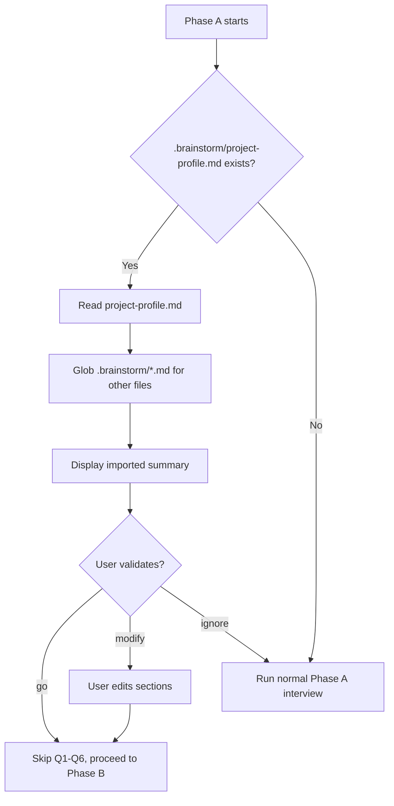

# Design: Brainstorm Detection in /spec.init Phase A

> Date: 2026-03-24
> Status: Approved (auto-brainstorm)

---

## Summary

Add an optional detection step at the very beginning of Phase A in `/spec.init` that checks for `.brainstorm/project-profile.md`. When found, pre-fill `project.md` from the brainstorm data and skip the 6-question interview. When absent, Phase A proceeds unchanged.

---

## Architecture

### Detection Flow



### Section Mapping (project-profile.md → project.md)

| project-profile.md section | project.md section | Action |
|---|---|---|
| Vision | Vision | Direct copy (3 sub-fields identical) |
| Users | Users | Direct copy (same table format) |
| Constraints | Constraints | Direct copy (same table format) |
| Real-Time Requirements | Real-Time Requirements | Direct copy (same table format) |
| Geographic Requirements | Geographic Requirements | Direct copy (same bullet format) |
| Stack Reference | _(not copied)_ | Mentioned as context for Phase B |
| Brainstorm Source | _(not copied)_ | Metadata, not part of project.md |

No transformation needed — formats are identical by design.

### Other Brainstorm Files

Detection globs `.brainstorm/*.md` and lists available files by matching known filenames:

| File pattern | Display name |
|---|---|
| `01-exploration.md` | Exploration |
| `02-market-research.md` | Market Research |
| `03-challenge.md` | Challenge |
| `04-definition.md` | Definition |
| `05-plan.md` | Plan |

These are listed as available context but NOT read automatically.

### Display Format

```
🔗 Brainstorm detected (.brainstorm/project-profile.md)

**Vision:** [First line of "What the project does"]
**Users:** [N] roles ([role1], [role2], ...)
**Scale:** [year 1 value] → [year 3 value]
**Region:** [primary region]
**Budget:** [budget value]
**Real-time:** [N] features requiring real-time

📂 Additional brainstorm files available:
   exploration · market-research · challenge · definition · plan
   (usable as context for stack decisions in Phase B)

→ Type **go** to use this profile and skip to Phase B
→ Type **modify** to adjust sections before continuing
→ Type **ignore** to run the full interview instead
```

### Validation Options

1. **go** — Write project.md from brainstorm data, skip Q1-Q6, proceed to Phase B. Stack Reference from brainstorm is passed as context to Phase B decision tree.
2. **modify** — Display the full imported content, let user edit, then proceed to Phase B.
3. **ignore** — Discard brainstorm data, run the normal 6-question interview.

---

## Scope

### What changes
- `commands/spec-init.md` — new section "Phase A — Brainstorm Detection" inserted before the current Phase A conversation flow

### What does NOT change
- Phase B (Stack Decisions) — unchanged, but receives Stack Reference as context hint
- Phase C (Installation) — unchanged
- Phase D (Preflight) — unchanged
- `project.md` template format — unchanged
- `project-profile.md` format — unchanged (owned by project-brainstorm)

---

## Edge Cases

| Scenario | Behavior |
|---|---|
| `.brainstorm/` exists but `project-profile.md` is missing | Skip detection, run normal Phase A |
| `.brainstorm/project-profile.md` exists but is empty/malformed | Skip detection, warn user, run normal Phase A |
| `.brainstorm/` is a broken symlink | Skip detection silently, run normal Phase A |
| User runs `--auto` flag with brainstorm present | Brainstorm takes priority over `--auto` defaults (brainstorm data is richer) |
| User runs `--stack` flag with brainstorm present | Brainstorm fills Phase A, `--stack` still overrides Phase B |

---

## Testing

Manual verification:
1. Project with `.brainstorm/project-profile.md` → detection triggers, summary displayed
2. Project without `.brainstorm/` → normal Phase A runs
3. Broken symlink → graceful fallback to normal Phase A

---

*Generated by auto-brainstorm — LiveSpec*
