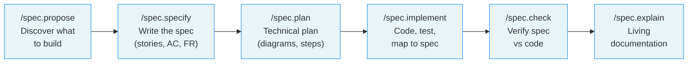
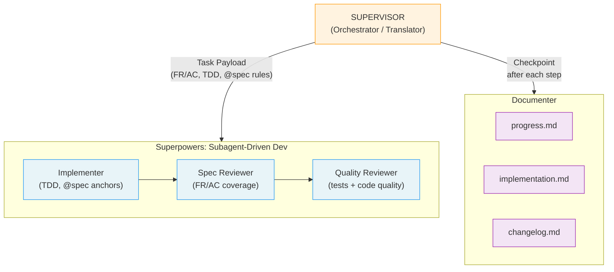

# Design: Mermaid Diagrams in README

> Add 2 Mermaid diagrams to the LiveSpec README for instant visual understanding of the framework's workflow and architecture.

**Date:** 2026-03-26
**Status:** Draft

---

## Context

The README is comprehensive (460 lines) but purely textual for process descriptions. The multi-agent architecture uses ASCII art that renders poorly. A newcomer needs to read several paragraphs before understanding how LiveSpec works.

## Goal

Add 2 Mermaid diagrams to give readers instant visual understanding:
1. **Feature Lifecycle** — how the 6 core commands chain together
2. **Multi-agent orchestration** — how `/spec.implement` delegates work

## Design

### Diagram 1: Feature Lifecycle

**Type:** `flowchart LR` (left-to-right pipeline)
**Location:** New section "How It Works" inserted between "What LiveSpec Does Differently" and "The 14 Commands"
**Content:** The 6 main commands as a linear pipeline with brief labels.

**Design decisions:**
- No `init` in the pipeline — it's a one-time setup, not part of the feature lifecycle
- No gates/reviews shown — keeps it high-level; `/spec.feature` details are in command docs
- Multi-line labels with `\n` for readability
- Light blue fill for visual consistency

### Diagram 2: Multi-Agent Orchestration

**Type:** `flowchart TD` (top-down hierarchy)
**Location:** Replaces the ASCII art block in the existing "Multi-Agent Mode" section
**Content:** Supervisor → Superpowers (with sub-agents) + Documenter, showing the per-step cycle.

**Design decisions:**
- Edge label on Supervisor→Superpowers shows what the Task Payload contains
- Sequential flow inside Superpowers (Implementer → Spec Reviewer → Quality Reviewer)
- Documenter shows the 3 artifacts it produces
- Color coding: orange=orchestrator, blue=execution, purple=documentation

## Changes to README.md

### Addition 1: "How It Works" section (after line 33)

Insert new section with Diagram 1 + one-liner intro + mention of `/spec.feature` shortcut.

### Modification 1: Multi-Agent Mode section (lines 367-391)

Replace the ASCII art code block with Diagram 2 in a `mermaid` fenced block.

## Out of Scope

- Diagrams in individual `commands/*.md` files
- `/spec.init` phases diagram
- `/spec.feature` pipeline with gates
- Styling changes to other README sections
