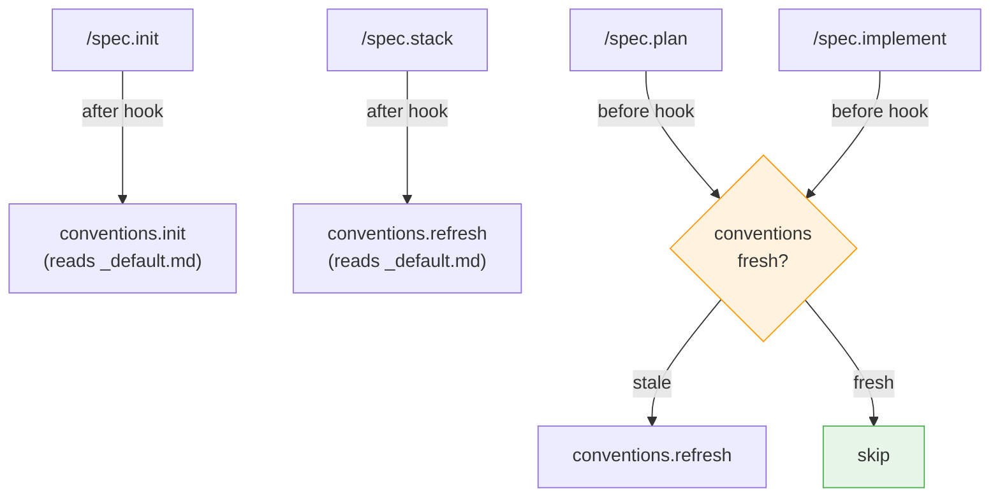
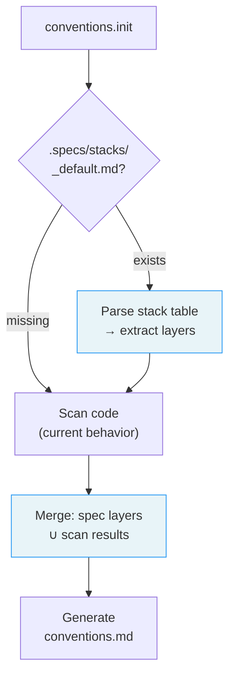

# Design: Conventions ↔ Specs Sync

> Automatically generate and refresh `.conventions/conventions.md` based on the stack declared in `.specs/stacks/_default.md`, so conventions are ready before the first line of code.

---

## Problem

On a greenfield project, `/conventions.init` has nothing to scan — no `package.json`, no `.ts` files, no config files. But `/spec.init` has already captured the full stack (framework, runtime, database, ORM, auth, testing, deployment) in `.specs/stacks/_default.md`.

Today, the two systems are completely independent. Conventions don't know about specs, and specs don't trigger convention generation. This means:

- On greenfield: conventions are empty or wrong until code exists
- On stack change via `/spec.stack`: conventions become stale until a manual `/conventions.refresh`
- Agents running `/spec.plan` and `/spec.implement` may work without conventions or with outdated ones

---

## Solution

Connect the two systems through **LiveSpec hooks** and a **spec-aware mode** in `conventions.init`/`conventions.refresh`.



---

## Design

### 1. Enrich `_default.md` with Dev Tooling section

Add an optional **Dev Tooling** section to `_default.md`, at the same level as existing stack layers.

**Before (current):**

| Layer | Choice | Reason |
|---|---|---|
| Language | TypeScript | Team expertise |
| Framework | Next.js 14 | App Router, SSR |
| Database | Supabase PostgreSQL | Managed, real-time |

**After (proposed):**

| Layer | Choice | Reason |
|---|---|---|
| Language | TypeScript | Team expertise |
| Framework | Next.js 14 | App Router, SSR |
| Database | Supabase PostgreSQL | Managed, real-time |
| Package Manager | bun | Fast, native TS |
| Linter | Biome | Fast, unified lint+format |
| Formatter | Biome | Same tool as linter |
| Test Runner | Vitest | Fast, Vite-native |

The Dev Tooling rows are **optional**. If omitted, `conventions.init` falls back to code scanning for tooling detection. The existing presets already include some of these (Linter, Testing) — this formalizes the pattern.

**Impact on `/spec.init` Phase B:** The AI already asks about testing. Extend the conversation to include package manager and linter/formatter if the user hasn't specified them. These are low-friction questions with sensible defaults.

**Impact on `/spec.stack`:** Dev tooling changes ("switch from npm to bun") follow the same ADR flow as architectural changes.

### 2. Add `updated` field to `_default.md` frontmatter

Add a YAML frontmatter block to `_default.md` with an `updated` timestamp:

```yaml
---
updated: 2026-03-29
---
# Default Stack — MyProject

## Stack
...
```

**Updated by:**
- `/spec.init` Phase C → set to creation date
- `/spec.stack` → bumped on every stack modification

**Used by:** The before-hook on `plan`/`implement` to compare against `conventions.generated`.

### 3. Spec-aware mode in `conventions.init`/`conventions.refresh`

When `.specs/stacks/_default.md` exists, `conventions.init` and `conventions.refresh` read it as a **complementary source** alongside code scanning.

#### Detection flow (updated)



#### Parsing `_default.md`

The stack table in `_default.md` uses `| Layer | Choice | ... |` format. The parser:

1. Finds the first Markdown table with a "Layer" column (or "Technology" column in extended format)
2. Extracts each row's layer name and choice value
3. Maps them to convention categories using a **mapping table**

#### Mapping: stack layers → convention domains

| Layer value (case-insensitive) | Convention channel | Convention files |
|---|---|---|
| TypeScript, JavaScript | Channel 1 (extensions) | `general + architecture + logging + testing + javascript` |
| Go | Channel 1 | `general + architecture + logging + testing + go` |
| Rust | Channel 1 | `general + architecture + logging + testing + rust` |
| Swift, Kotlin | Channel 1 | `general + architecture + logging + testing + swift-kotlin` |
| Delphi, Pascal | Channel 1 | `general + architecture + logging + testing + delphi` |
| Next.js | Channel 1b (frameworks) | `nextjs` |
| React | Channel 1b | `react` |
| Tailwind | Channel 1b | `tailwind` |
| shadcn | Channel 1b | `shadcn` |
| Cloudflare, Hono, Workers | Channel 1b | `cloudflare` |
| TanStack | Channel 1b | `tanstack` |
| Drizzle | Channel 1b | `drizzle` |
| Prisma | Channel 1b | `prisma` |
| Remotion | Channel 1b | `remotion` |
| PostgreSQL, SQLite, MySQL | Channel 1 | `database` |
| Supabase | Channel 2 (stack-ref) | Package mapping lookup |
| Stripe | Channel 2 | Package mapping lookup |
| Vitest, Jest, Playwright | Already covered by `testing` | — |
| bun, pnpm, npm | Informational | Affects runtime-configs audit |
| Biome, ESLint | Informational | Affects linter conventions |

This mapping reuses the existing `package-mapping.md` and `architecture-signals.md` references from `conventions.init`. No new mapping file needed — the stack layer values map directly to the same keywords the scan would detect.

#### Merge strategy

**Union with spec priority.** If code scanning detects React but specs don't mention it, include it. If specs declare Drizzle but no code exists yet, include it. The result is the superset of both sources.

### 4. LiveSpec hooks

Four hooks, installed as **global hooks** in `~/.claude/livespec/hooks/`:

#### `after-init.md` — Generate conventions after project init

```
Trigger: after /spec.init completes
Action: Run /conventions.init (reads newly created _default.md)
Condition: Always (spec.init always creates _default.md)
```

**Behavior:**
- Reads `.specs/stacks/_default.md` (just created by Phase C)
- Runs full `conventions.init` workflow (Phase 1-6)
- Spec-aware mode kicks in automatically (file exists)
- If `.conventions/` already exists, skips (idempotent)

#### `after-stack.md` — Refresh conventions after stack change

```
Trigger: after /spec.stack completes
Action: Run /conventions.refresh --full
Condition: .conventions/ exists
```

**Behavior:**
- Stack just changed → full refresh needed (new categories may appear/disappear)
- Uses `--full` because a stack change may add/remove entire convention categories
- If `.conventions/` doesn't exist, runs `conventions.init` instead

#### `before-plan.md` — Ensure fresh conventions before planning

```
Trigger: before /spec.plan starts
Action: Check freshness, refresh if stale
Condition: .specs/stacks/_default.md exists
```

**Freshness check logic:**

```
read conventions.generated from .conventions/conventions.md frontmatter
read stacks.updated from .specs/stacks/_default.md frontmatter
read ai_res_updated from ~/projects/ai-ressources/.last-updated

if .conventions/conventions.md does not exist:
  → run conventions.init
elif conventions.generated < stacks.updated:
  → run conventions.refresh --full (stack changed)
elif conventions.generated < ai_res_updated:
  → run conventions.refresh (rules changed, same categories)
else:
  → skip (conventions are fresh)
```

#### `before-implement.md` — Same check before implementation

```
Trigger: before /spec.implement starts
Action: Same freshness check as before-plan
Condition: .specs/stacks/_default.md exists
```

Identical logic to `before-plan.md`. Could be a shared instruction file, but hooks don't support includes — duplicate the logic (it's ~10 lines of natural language instructions).

### 5. Date comparison mechanism

Three timestamps involved:

| Timestamp | Location | Format | Updated by |
|---|---|---|---|
| `conventions.generated` | `.conventions/conventions.md` frontmatter | `YYYY-MM-DD` | `conventions.init` / `conventions.refresh` |
| `stacks.updated` | `.specs/stacks/_default.md` frontmatter | `YYYY-MM-DD` | `spec.init` / `spec.stack` |
| `ai_res_updated` | `~/projects/ai-ressources/.last-updated` | `YYYY-MM-DD` | Manual (when ai-ressources is updated) |

**Comparison matrix:**

| conventions.generated vs stacks.updated | conventions.generated vs ai_res_updated | Action |
|---|---|---|
| ≥ | ≥ | Skip (fresh) |
| < | any | `conventions.refresh --full` (stack changed) |
| ≥ | < | `conventions.refresh` (rules changed, same categories) |
| file missing | — | `conventions.init` |

---

## Scope of changes

### Project: livespec

| File | Change |
|---|---|
| `commands/init.md` | Phase B: add Dev Tooling questions. Phase C: add `updated` frontmatter to `_default.md` template |
| `commands/stack.md` | Bump `updated` field in `_default.md` after every stack change |
| `stacks/presets/*.md` | Add Dev Tooling rows to preset stack tables (optional section) |

### Project: ai-ressources

| File | Change |
|---|---|
| `claude/skills/conventions.init/SKILL.md` | Phase 1: add spec-aware detection (read `_default.md` if exists, parse stack table, merge with scan results) |
| `claude/skills/conventions.refresh/SKILL.md` | Add spec-aware freshness check (compare against `stacks.updated`) |

### Global hooks (source in livespec, linked globally)

| Source file (livespec) | Linked to |
|---|---|
| `hooks/after-init.md` | `~/.claude/livespec/hooks/after-init.md` |
| `hooks/after-stack.md` | `~/.claude/livespec/hooks/after-stack.md` |
| `hooks/before-plan.md` | `~/.claude/livespec/hooks/before-plan.md` |
| `hooks/before-implement.md` | `~/.claude/livespec/hooks/before-implement.md` |

These hooks live in the livespec repository and are symlinked globally via the install script or `/link`.

---

## Edge cases

1. **No `.specs/` directory** — conventions.init falls back to pure code scanning (current behavior). No regression.
2. **No `.conventions/` directory** — before-plan/implement hooks run `conventions.init` instead of refresh.
3. **`_default.md` without frontmatter** — existing files won't have `updated`. Hooks treat missing `updated` as "always stale" → triggers refresh. First refresh adds the field.
4. **Stack table format varies** — parser looks for a table with Layer/Technology column. Both TaskFlow format (`| Layer | Choice | Reason |`) and Artifact Lab format (`| Layer | Technology | Version | Why |`) are supported.
5. **`conventions.init` already ran manually** — hooks are idempotent. If conventions are fresh, the before-hook skips.
6. **Multiple stack files** — Only `_default.md` is read. ADR files contain decisions, not the current state.

---

## What this does NOT change

- Convention content generation logic (synthesis from ai-ressources) — unchanged
- Convention file format (`.conventions/conventions.md`) — unchanged, just reads an additional source
- Spec file format — only adds optional `updated` frontmatter to `_default.md`
- Hook resolution protocol — uses existing 3-level system as-is
- `/conventions.refresh` without specs — still works via code scanning (rétrocompatible)
