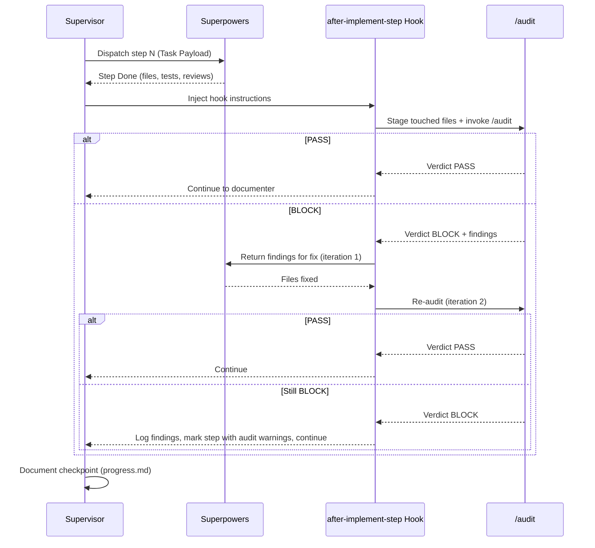

# Design: Hook global `after-implement-step` avec `/audit`

**Date:** 2026-03-30
**Scope:** Global LiveSpec hook — `~/.claude/livespec/hooks/after-implement-step.md`
**Status:** Draft

---

## Problème

Le Code Quality Reviewer de Superpowers vérifie la qualité technique de base (tests, lint, God files, sécu basique), mais **ne vérifie pas la conformité aux conventions projet** (`.conventions/conventions.md`) ni aux checks custom (`.claude/checks/`). Le skill `/audit` fait exactement ça, mais il n'est pas intégré dans le pipeline d'implémentation.

## Solution

Créer un hook global `after-implement-step.md` qui invoque `/audit` en mode normal (Opus) après chaque step d'implémentation. Le hook s'insère dans le pipeline existant sans modifier Superpowers ni le supervisor.

## Architecture



## Comportement détaillé

### Pré-condition

Le hook ne s'exécute que si le step est **Done** (tests passés, reviewers PASS). Si le step est Blocked, l'audit est inutile.

### Étape 1 — Stage les fichiers du step

Les fichiers touchés par le step sont identifiés via le retour de Superpowers (liste de fichiers créés/modifiés). Ils sont stagés pour que `/audit` puisse les analyser via `git diff --staged`.

### Étape 2 — Invocation de `/audit`

Lancer `/audit` (mode normal, pas `--fast`). L'audit :
- Charge `.conventions/conventions.md` et extrait les sections par domaine
- Charge les rules projet (`.claude/rules/`, `CLAUDE.md`)
- Charge les checks custom (`~/.claude/checks/`, `.claude/checks/`)
- Dispatche des auditeurs parallèles par domaine
- Produit un rapport dans `~/.claude/audits/`

### Étape 3 — Traitement du verdict

**PASS** → Continuer silencieusement. Le step checkpoint dans `progress.md` mentionne "Audit: PASS".

**BLOCK** → Boucle de correction :
1. Lire le rapport d'audit et extraire les findings
2. Retourner les findings à l'Implementer (via Superpowers) pour correction
3. Re-lancer `/audit --incremental {N}` (vérifie seulement les findings précédents)
4. Si PASS → continuer
5. Si encore BLOCK après 2 itérations → logger les findings restants dans `progress.md` comme warnings, continuer au step suivant (ne pas bloquer indéfiniment)

### Étape 4 — Documentation

Le résultat de l'audit est loggé dans le checkpoint `progress.md` du step :
- Verdict (PASS / BLOCK → PASS après fix / BLOCK avec warnings)
- Numéro de run audit (pour traçabilité)
- Nombre d'issues trouvées et résolues (si applicable)

## Décisions

| Décision | Choix | Justification |
|----------|-------|---------------|
| Mode audit | Normal (Opus) | Review approfondie voulue par l'utilisateur |
| Scope fichiers | Fichiers du step uniquement | Performance + pertinence |
| Boucle max | 2 itérations | Éviter boucle infinie sur faux positifs |
| Après 2 BLOCK | Logger + continuer | Ne pas bloquer le pipeline entier |
| Hook mode | `extend` | Permet aux projets d'ajouter des hooks enfants |
| Emplacement | Global (`~/.claude/livespec/hooks/`) | Appliqué à tous les projets LiveSpec |

## Fichier à créer

```
~/.claude/livespec/hooks/after-implement-step.md
```

## Non-scope

- Pas de modification de Superpowers ni du supervisor
- Pas de modification du Code Quality Reviewer existant
- Pas de hook `after-implement` (audit final) — déjà couvert par la Final Validation du supervisor
