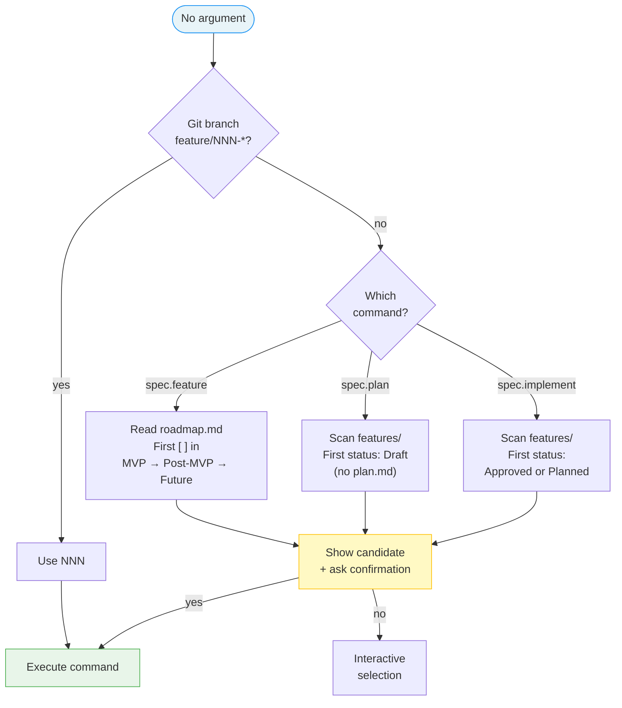
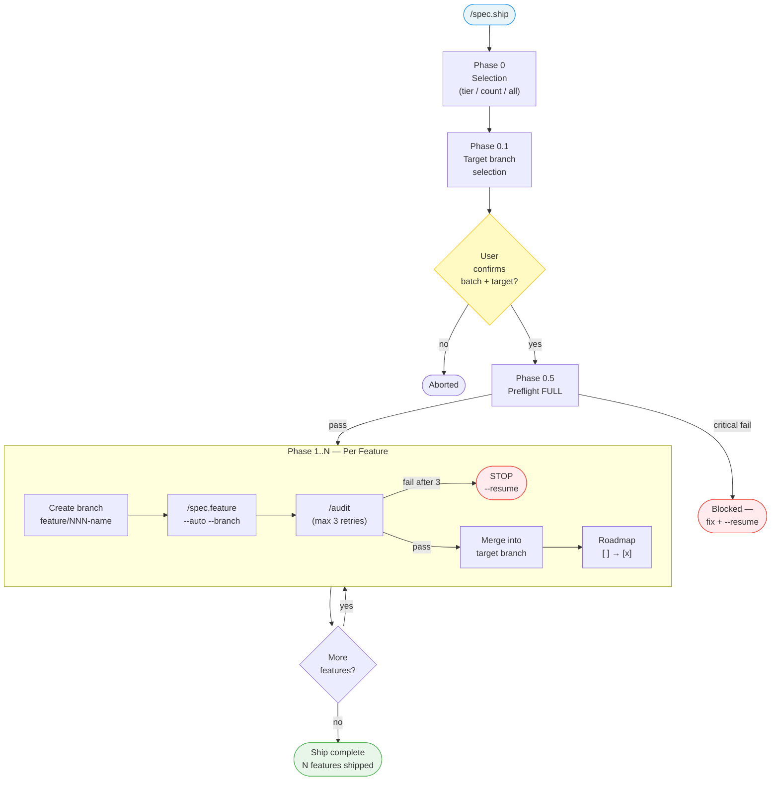

# Design: Auto-Resolution Roadmap + spec.ship

**Date:** 2026-03-30
**Status:** Approved
**Scope:** 2 sub-projects — modify 3 existing commands + create 1 new command

---

## Sub-Project A: Auto-Resolution from Roadmap

### Problem

`/spec.feature` requires a description argument. `/spec.plan` and `/spec.implement` fall back to git branch but have no further fallback. Users must always specify what to work on.

### Solution

Add a shared resolution algorithm with roadmap/status fallback:



### Resolution per command

| Command | Fallback after git branch | What it looks for |
|---------|--------------------------|-------------------|
| `spec.feature` | Roadmap `[ ]` items | First unchecked item (MVP → Post-MVP → Future) |
| `spec.plan` | Feature status | First feature with status `Draft` and no `plan.md` |
| `spec.implement` | Feature status | First feature with status `Approved` or `Planned` |

### Confirmation format

```
Next up: **003-notifications** (MVP, Scope: M)
→ Proceed? (yes / no / list all)
```

"list all" shows all eligible candidates for manual selection.

### Changes

- `commands/feature.md` — add resolution section after overview
- `commands/plan.md` — extend Step 1
- `commands/implement.md` — add explicit feature resolution step

---

## Sub-Project B: spec.ship Command

### Problem

No way to batch-process multiple features from the roadmap automatically.

### Solution

New `/spec.ship` command — batch autopilot that chains `/spec.feature --auto --branch` for each roadmap item.



### Phase 0 — Selection

Interactive menu:

```
What do you want to ship?

  1. MVP          (3 features remaining)
  2. Post-MVP     (2 features remaining)
  3. Future       (4 features remaining)
  4. Next N       (specify count)
  5. Everything   (9 features total)

→ Choose (1-5):
```

### Phase 0.5 — Preflight

Run `/spec.preflight` (full mode, not light) once before the batch. If critical fail → stop, user fixes, then `/spec.ship --resume`.

### Architecture — Agent per Feature

Each feature runs in a **spawned agent** with a fresh context to prevent context window exhaustion:

- **Main context (ship):** orchestrator — branches, merges, tracks. ~10k tokens per cycle.
- **Spawned agent:** executes `/spec.feature --auto --branch` end-to-end (specify → implement → audit → commit). Returns `SHIP_RESULT: OK` or `SHIP_RESULT: BLOCKED`.

### Phase 1..N — Per Feature

For each feature in order:
1. Create branch `feature/NNN-name`
2. Spawn agent → `/spec.feature "<description>" --auto --branch`
3. Agent does everything: specify, review, plan, implement, audit, commit
4. Agent returns `SHIP_RESULT: OK` or `BLOCKED`
5. If OK → merge into target branch (selected in Phase 0.1)
6. Update roadmap: `[ ]` → `[x]` with link
7. Log progress to `.specs/ship.md`
8. Spawn next agent (fresh context)

### Tracking — ship.md

```markdown
# Ship Session

**Started:** YYYY-MM-DD HH:MM
**Scope:** MVP (3 features)
**Flags:** `--tier mvp`

| # | Feature | Status | Branch | Started | Completed |
|---|---------|--------|--------|---------|-----------|
| 1 | 003-notifications | Done | feature/003-notifications | HH:MM | HH:MM |
| 2 | 004-billing | In Progress | feature/004-billing | HH:MM | — |
| 3 | 005-export | Pending | — | — | — |
```

### Flags

| Flag | Behavior |
|------|----------|
| `--tier mvp\|postmvp\|future` | Ship only features from this tier |
| `--count N` | Ship the next N features (across tiers) |
| `--resume` | Resume from last incomplete feature in ship.md |
| `--mono` | Pass `--mono` to each `/spec.feature` call |
| `--economy` | Pass `--economy` to each `/spec.feature` call |

### Error handling

- On failure: stop immediately, update ship.md status to `Blocked`
- Display: "Blocked on **004-billing** (audit fail). Fix, then `/spec.ship --resume`"
- `--resume` reads ship.md, skips Done features, resumes at first non-Done

### Hooks

- No command-level hooks for `ship` — each spawned agent resolves its own `before-feature` / `after-feature` hooks via `/spec.feature`

### Branch strategy

- Target branch selected interactively in Phase 0.1 (recommends `dev` > `main`)
- Warning if only `main` exists (direct merge to production)
- After merge: delete feature branch, return to target branch

---

## Files to Create/Modify

| File | Action |
|------|--------|
| `commands/feature.md` | Modify — add roadmap fallback |
| `commands/plan.md` | Modify — extend Step 1 |
| `commands/implement.md` | Modify — add feature resolution step |
| `commands/ship.md` | Create — new command |
| `system/templates/ship-template.md` | Create — tracking template |
| `system/hooks.md` | No change — `ship` has no command-level hooks |
